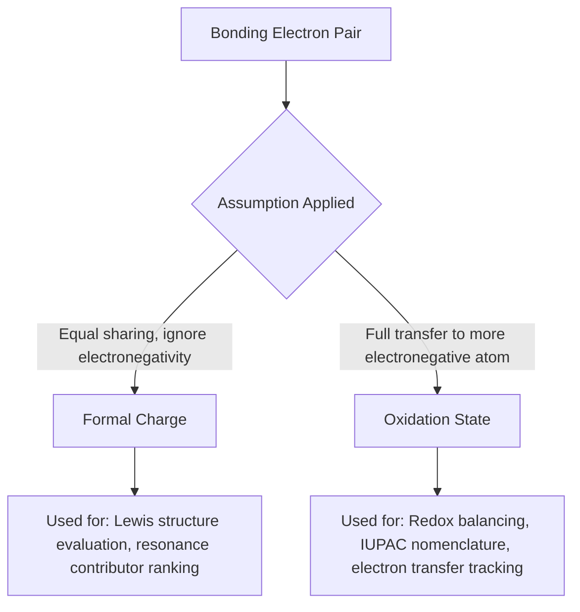

## Formal Charge and Oxidation States

### Overview

Formal charge and oxidation state are two distinct bookkeeping systems used to track electron "ownership" in molecules. Both assign a number to each atom, but they use opposite assumptions about how bonding electrons are divided, and they serve different purposes: formal charge helps evaluate the plausibility of a Lewis structure, while oxidation state tracks electron transfer for redox reactions and nomenclature.

### Formal Charge

**Definition**

Formal charge is the hypothetical charge an atom would have if all bonding electrons were shared **equally** between bonded atoms, regardless of actual electronegativity differences.

$$FC = V - N - \frac{B}{2}$$

Where:

- $V$ = number of valence electrons in the free (unbonded) atom
- $N$ = number of nonbonding (lone pair) electrons on that atom in the structure
- $B$ = total number of bonding electrons (shared electrons) around that atom

**Key Points**

- Formal charge assumes **equal (homolytic) electron sharing** — electronegativity is ignored entirely
- The sum of all formal charges in a structure must equal the overall charge of the species (0 for neutral molecules, ±n for ions)
- Used primarily to compare the plausibility of alternative Lewis structures and resonance contributors
- Does NOT necessarily reflect real charge distribution — it is a formalism, not a measured quantity

**Example: Formal charge in the nitrate ion (NO₃⁻)**

For the nitrogen atom (5 valence electrons) with 4 bonds (1 double, 2 single) and no lone pairs:

$$FC_N=5-0-\frac{8}{2}=5-4=+1$$

For a singly-bonded oxygen (6 valence electrons, 3 lone pairs = 6 nonbonding electrons, 1 bond = 2 bonding electrons):

$$FC_O=6-6-\frac{2}{2}=6-6-1=-1$$

For the double-bonded oxygen (6 valence electrons, 2 lone pairs = 4 nonbonding electrons, 1 double bond = 4 bonding electrons):

$$FC_O=6-4-\frac{4}{2}=6-4-2=0$$

Sum check: $(+1) + (-1) + (-1) + (0) = -1$, matching the ion's overall charge. ✓

**Rules for Selecting the Best Lewis Structure Using Formal Charge**

1. Prefer structures where formal charges are minimized (closest to zero on all atoms)
2. When nonzero formal charges are unavoidable, negative formal charge should reside on the more electronegative atom
3. Avoid structures with like charges (e.g., two adjacent negative formal charges) — these are high-energy and disfavored
4. Adjacent atoms bearing opposite formal charges can indicate favorable charge-separation stabilization, but this is a secondary consideration after criteria 1–3

### Oxidation State (Oxidation Number)

**Definition**

Oxidation state is the hypothetical charge an atom would have if all bonding electrons were assigned **entirely** to the more electronegative atom in each bond (i.e., assuming fully ionic/heterolytic bond character).

**Key Points**

- Assumes complete (heterolytic) electron transfer to the more electronegative atom in every bond, regardless of actual bond polarity
- Used to track electron transfer in redox reactions, balance redox equations, and assign systematic (IUPAC) names (e.g., iron(III) chloride, manganese(VII))
- Unlike formal charge, oxidation state DOES depend on relative electronegativity of bonded atoms

**Rules for Assigning Oxidation States**

1. Free elements (uncombined) have oxidation state 0 (e.g., Fe(s), O₂, N₂)
2. Monatomic ions have oxidation state equal to their charge (e.g., Na⁺ = +1, Cl⁻ = −1)
3. In compounds, fluorine is always −1
4. Oxygen is normally −2 (exceptions: peroxides = −1, superoxides = −1/2, OF₂ = +2)
5. Hydrogen is +1 when bonded to nonmetals, −1 when bonded to metals (metal hydrides)
6. Group 1 metals are always +1; Group 2 metals are always +2 in compounds
7. The sum of oxidation states in a neutral molecule = 0; in a polyatomic ion = the ion's overall charge
8. For a bond between two atoms of the same element, the bonding electrons are split evenly (contributes 0 net to oxidation state change for that bond)

**Example: Oxidation state calculation for sulfur in H₂SO₄**

$$2(+1) + S + 4(-2) = 0$$

$$S = 0 - 2 + 8 = +6$$

Sulfur in sulfuric acid has an oxidation state of +6.

### Direct Comparison: Formal Charge vs. Oxidation State

| Aspect | Formal Charge | Oxidation State |
| --- | --- | --- |
| Electron-sharing assumption | Equal sharing (covalent, ignores electronegativity) | Complete transfer to more electronegative atom (fully ionic) |
| Primary use | Evaluating/comparing Lewis structures | Tracking redox electron transfer, nomenclature |
| Depends on electronegativity? | No | Yes |
| Reflects real charge? | Approximate, often closer to reality for main-group atoms in typical structures | Often an extreme formalism, frequently unrealistic for covalent bonds |
| Sum equals overall molecular/ionic charge? | Yes | Yes |

**Worked comparison — CO₂:**

For carbon in CO₂ (2 C=O double bonds, no lone pairs):

- **Formal charge**: $FC_C = 4 - 0 - \frac{8}{2} = 0$
- **Oxidation state**: Oxygen is more electronegative, so both C=O bonds' electrons are assigned fully to oxygen. Carbon "loses" all 4 bonding electrons: oxidation state = $+4$

This stark difference illustrates why the two systems answer different questions — formal charge (0) suggests carbon is "electronically neutral" in the equal-sharing sense, while oxidation state (+4) reflects carbon's substantial electron deficiency relative to the highly electronegative oxygens, which is the relevant framework for redox chemistry (e.g., carbon is reduced from +4 in CO₂ to more negative states in hydrocarbons).

### Common Pitfalls

- Confusing the two systems and using oxidation state rules to justify Lewis structure preference (formal charge should be used instead)
- Forgetting that both formal charge and oxidation state must sum to the overall species charge — a valuable error-check
- Assuming formal charge indicates real electron density — it is a simplified bookkeeping tool, not an experimental charge measurement (real charge distribution is better approximated by computed partial charges, e.g., via Mulliken or NBO analysis) [Inference: relative accuracy of formal charge vs. computed partial charges can vary by method and system]
- Misassigning oxidation states in compounds with unusual bonding (e.g., peroxides, metal-metal bonds, organometallics) by defaulting to standard rules without checking exceptions

### Related Topics

- Resonance structures and formal charge minimization criteria
- Electronegativity trends and bond polarity
- Balancing redox reactions using oxidation state changes
- IUPAC nomenclature of coordination and inorganic compounds
- Lewis structures and octet rule exceptions
- Partial atomic charges (Mulliken, NBO, ESP-derived) vs. formal charge