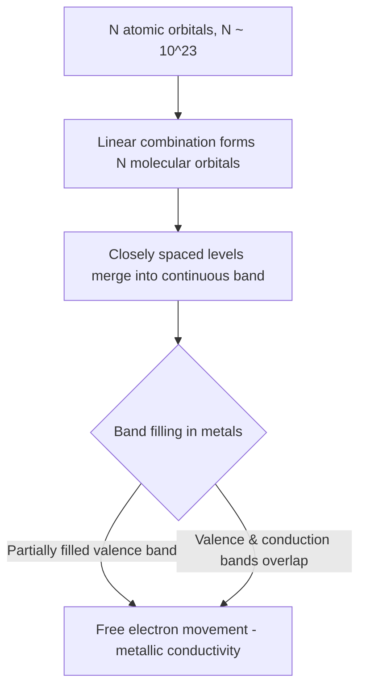

## Metallic Bonding

### Definition

Metallic bonding is the electrostatic attraction between positively charged metal cations (arranged in a lattice) and a surrounding "sea" of delocalized valence electrons that are not associated with any single atom or bond. This nondirectional, collective bonding model explains the characteristic physical properties of metals.

**Key Points**

- Valence electrons detach from individual atoms and become delocalized across the entire metallic lattice
- The resulting structure is often described as an array of metal cations immersed in a mobile "electron sea" or "electron gas"
- Bonding is nondirectional (unlike covalent bonds), allowing metal atoms to slide past one another without breaking bonds
- Bond strength generally increases with the number of delocalized valence electrons and decreases with atomic/ionic radius

### The Electron Sea Model

In the simplest qualitative model, each metal atom contributes its valence electron(s) to a shared, delocalized pool. The metal cations occupy fixed lattice positions (commonly close-packed arrangements), while the electrons move freely throughout the structure, not bound to any particular nucleus.

<svg xmlns="http://www.w3.org/2000/svg" viewBox="0 0 500 260" font-family="sans-serif">
<text x="20" y="25" font-size="15" font-weight="bold">Electron Sea Model of Metallic Bonding (svg_diagram)</text>
<rect x="20" y="40" width="460" height="190" fill="#f0f4f8" stroke="#333" stroke-width="1" />
<g fill="#4a6fa5">
<circle cx="80" cy="90" r="18" />
<circle cx="180" cy="90" r="18" />
<circle cx="280" cy="90" r="18" />
<circle cx="380" cy="90" r="18" />
<circle cx="130" cy="150" r="18" />
<circle cx="230" cy="150" r="18" />
<circle cx="330" cy="150" r="18" />
<circle cx="430" cy="150" r="18" />
<circle cx="80" cy="210" r="18" />
<circle cx="180" cy="210" r="18" />
<circle cx="280" cy="210" r="18" />
<circle cx="380" cy="210" r="18" />
</g>
<g fill="#333" font-size="12">
<text x="72" y="95">M⁺</text>
<text x="172" y="95">M⁺</text>
<text x="272" y="95">M⁺</text>
<text x="372" y="95">M⁺</text>
<text x="122" y="155">M⁺</text>
<text x="222" y="155">M⁺</text>
<text x="322" y="155">M⁺</text>
<text x="422" y="155">M⁺</text>
<text x="72" y="215">M⁺</text>
<text x="172" y="215">M⁺</text>
<text x="272" y="215">M⁺</text>
<text x="372" y="215">M⁺</text>
</g>
<g fill="#ffcc00" opacity="0.85">
<circle cx="105" cy="115" r="4" />
<circle cx="155" cy="70" r="4" />
<circle cx="230" cy="180" r="4" />
<circle cx="305" cy="120" r="4" />
<circle cx="355" cy="60" r="4" />
<circle cx="405" cy="175" r="4" />
<circle cx="60" cy="170" r="4" />
<circle cx="255" cy="65" r="4" />
</g>
<text x="20" y="250" font-size="11" fill="#555">M⁺ = metal cations (fixed lattice positions); yellow dots = delocalized valence electrons ("electron sea")</text>
</svg>

### Band Theory Description (Molecular Orbital Approach)

A more rigorous quantum-mechanical treatment models metallic bonding through **band theory**, an extension of molecular orbital (MO) theory to extended (macroscopic) systems.

**Key Points**

- As N atomic orbitals combine (where N is very large, on the order of Avogadro's number), they form N molecular orbitals so closely spaced in energy that they merge into a continuous **energy band**
- The **valence band** is the band containing the valence electrons; the **conduction band** is the next higher-energy band (empty or partially filled)
- In metals, the valence band and conduction band either overlap or the valence band is only partially filled, allowing electrons to move freely into unoccupied energy levels with minimal energy input
- The highest filled energy level at absolute zero is called the **Fermi level** ($E_F$)

**Band Theory Distinguishes Conductors, Semiconductors, and Insulators**

| Material Type | Band Gap | Electrical Behavior |
| --- | --- | --- |
| Conductor (metal) | No gap; overlapping or partially filled bands | High conductivity at all temperatures |
| Semiconductor | Small gap (~0.1–3 eV) | Conductivity increases with temperature; doping tunable |
| Insulator | Large gap (>3 eV, [Unverified: exact threshold varies by source convention]) | Negligible conductivity under normal conditions |

### Physical Properties Explained by Metallic Bonding

**Key Points**

- **Electrical conductivity**: delocalized electrons move freely in response to an applied electric field, carrying charge through the lattice
- **Thermal conductivity**: mobile electrons rapidly transfer kinetic energy throughout the lattice, efficiently conducting heat
- **Malleability and ductility**: because bonding is nondirectional, metal cation layers can slide past each other under stress without breaking the overall electron-cation attraction, allowing metals to be hammered into sheets (malleable) or drawn into wires (ductile) without fracturing
- **Metallic luster**: delocalized electrons readily absorb and re-emit photons across a broad range of visible wavelengths, producing the characteristic reflective sheen
- **High melting/boiling points (generally)**: strength of metallic bonding (and thus melting point) generally correlates with the number of delocalized electrons per atom and the charge density of the cation; transition metals (with d-electrons available for delocalization) tend to have higher melting points than alkali metals

**Example: Malleability comparison**

Sodium (1 valence electron delocalized per atom) is soft and can be cut with a knife, while tungsten (up to 6 valence electrons involved in bonding, including d-electrons) is one of the hardest, highest-melting metals ($mp \approx 3422°C$). This trend reflects increasing metallic bond strength with more delocalized electrons and smaller atomic radius across a period.

### Factors Affecting Metallic Bond Strength

1. **Number of valence electrons delocalized**: more delocalized electrons per atom generally strengthens the metallic bond
2. **Ionic radius of the metal cation**: smaller cations allow electrons to be held more tightly, increasing bond strength
3. **Nuclear charge**: higher effective nuclear charge increases cation-electron attraction

These factors explain periodic trends: melting points generally increase from Group 1 to the middle of the transition metal series (e.g., Na mp ≈ 98°C vs. W mp ≈ 3422°C), then decrease again toward Group 12 as d-orbitals become fully occupied and less available for delocalized bonding.

### Metallic Bonding vs. Ionic and Covalent Bonding

| Property | Metallic | Ionic | Covalent (network) |
| --- | --- | --- | --- |
| Electron behavior | Delocalized across lattice | Transferred, localized on ions | Shared, localized between specific atoms |
| Directionality | Nondirectional | Nondirectional (electrostatic) | Directional |
| Conductivity (solid) | High | Low (ions immobile in solid state) | Typically low (except graphite) |
| Malleability | Malleable, ductile | Brittle (shatters under stress) | Brittle/rigid (e.g., diamond) |
| Conductivity (molten/dissolved) | High (still metallic) | High (mobile ions) | Low (network solids typically don't melt into ionic species) |

### Alloys as an Extension of Metallic Bonding

Metallic bonding's nondirectional nature allows different metal atoms to substitute for one another in the lattice (substitutional alloys, e.g., brass = Cu/Zn) or occupy interstitial spaces between larger metal atoms (interstitial alloys, e.g., steel = Fe with interstitial C). This flexibility is a direct consequence of the electron sea model, since bonding does not depend on specific atom-to-atom orbital overlap geometry.

### Related Topics

- Band theory and semiconductor doping (n-type, p-type)
- Periodic trends in melting point and atomic radius
- Alloys: substitutional vs. interstitial types
- Crystal lattice structures (BCC, FCC, HCP) in metals
- Free electron model and electrical conductivity equations
- Comparison of bonding types: ionic, covalent, metallic, and intermolecular forces