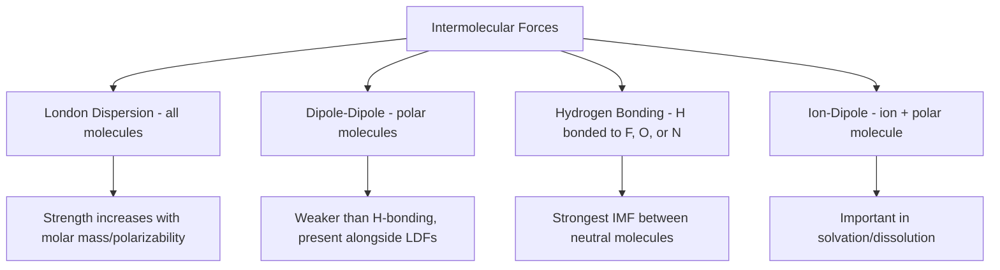

## Intermolecular versus Intramolecular Forces

### Definition

Intramolecular forces are the attractive forces that hold atoms together **within** a single molecule or ionic compound (i.e., chemical bonds: ionic, covalent, metallic). Intermolecular forces are the attractive (or repulsive) forces that act **between** separate molecules or ions, governing bulk physical properties like boiling point, melting point, viscosity, and solubility.

**Key Points**

- Intramolecular forces are chemical bonds — they determine molecular identity and are broken/formed during chemical reactions
- Intermolecular forces (IMFs) are physical, non-bonding interactions — they determine phase behavior and physical properties without altering molecular identity
- Intramolecular forces are substantially stronger than intermolecular forces, typically by one to two orders of magnitude
- The prefix "intra-" means "within"; "inter-" means "between" — a common mnemonic distinguishes them by this root

### Magnitude Comparison

| Force Type | Typical Bond/Interaction Energy | Category |
| --- | --- | --- |
| Covalent bond (e.g., C–C, C–H) | 150–450 kJ/mol | Intramolecular |
| Ionic bond (lattice energy) | 600–4000 kJ/mol | Intramolecular |
| Metallic bond | 75–1000 kJ/mol [Unverified: wide range depending on metal] | Intramolecular |
| Hydrogen bonding | 10–40 kJ/mol | Intermolecular |
| Dipole-dipole interaction | 3–4 kJ/mol | Intermolecular |
| London dispersion forces | 0.05–40 kJ/mol (scales with molar mass/polarizability) | Intermolecular |
| Ion-dipole interaction | 40–600 kJ/mol (concentration/charge dependent) | Intermolecular |

This large energy gap explains why boiling a liquid (overcoming intermolecular forces) requires far less energy than decomposing the molecules themselves (breaking intramolecular/covalent bonds).

**Example**

Boiling water (H₂O, liquid → gas) requires overcoming hydrogen bonds between H₂O molecules, consuming about 40.7 kJ/mol (enthalpy of vaporization). In contrast, breaking the O–H covalent bonds within a single water molecule requires approximately 463 kJ/mol per O–H bond — over 11 times more energy. This is why boiling water does not decompose it into hydrogen and oxygen gas.

### Types of Intramolecular Forces (Chemical Bonds)

**Key Points**

- **Ionic bonding**: electrostatic attraction between oppositely charged ions, typically formed via electron transfer between a metal and nonmetal
- **Covalent bonding**: sharing of electron pairs between atoms (nonpolar covalent = equal sharing; polar covalent = unequal sharing due to electronegativity difference)
- **Metallic bonding**: delocalized valence electrons shared collectively across a lattice of metal cations

### Types of Intermolecular Forces (Van der Waals Forces and Beyond)

**London Dispersion Forces (LDFs)**

- Present in ALL molecules and atoms, including nonpolar species
- Arise from instantaneous, temporary dipoles caused by momentary uneven electron distribution, inducing a corresponding dipole in a neighboring molecule
- Strength increases with molecular size, surface area, and polarizability (more electrons = more polarizable electron cloud)

**Dipole-Dipole Interactions**

- Occur between polar molecules with permanent dipole moments
- Positive end of one polar molecule attracts the negative end of an adjacent polar molecule
- Present in addition to LDFs (which are always present)

**Hydrogen Bonding**

- A particularly strong subtype of dipole-dipole interaction
- Requires a hydrogen atom covalently bonded to a highly electronegative atom (N, O, or F) and a lone pair on a nearby electronegative atom (N, O, or F) on another molecule
- Common mnemonic: "F, O, N" — the three elements that enable hydrogen bonding when bonded directly to H

**Ion-Dipole Forces**

- Occur between an ion and a polar molecule
- Particularly important in solvation, e.g., hydration of Na⁺ and Cl⁻ ions by water molecules in aqueous solution

### Effect on Physical Properties

**Key Points**

- **Boiling/melting point**: stronger IMFs require more energy to separate molecules, raising boiling and melting points
- **Viscosity**: stronger IMFs increase resistance to flow
- **Surface tension**: stronger IMFs increase a liquid's resistance to increasing surface area
- **Vapor pressure**: stronger IMFs lower vapor pressure (fewer molecules have sufficient energy to escape into gas phase)
- **Solubility**: governed by "like dissolves like" — polar solutes dissolve well in polar solvents (via dipole-dipole/H-bonding), nonpolar solutes dissolve well in nonpolar solvents (via LDFs)

**Example: Boiling point anomaly of water**

Water (H₂O, MW = 18 g/mol, bp = 100°C) boils at a much higher temperature than expected based on molar mass alone when compared to other Group 16 hydrides (H₂S bp = −60°C, H₂Se bp = −41°C, H₂Te bp = −2°C). This anomaly is explained by water's extensive hydrogen bonding network, which the heavier analogs cannot form because S, Se, and Te are insufficiently electronegative and lack the small atomic radius needed for effective hydrogen bonding.

### Relative Strength Comparison Chart

$$\text{Ionic/Covalent bonds} \gg \text{Ion-dipole} > \text{Hydrogen bonding} > \text{Dipole-dipole} > \text{London dispersion}$$

[Inference: this ordering represents typical/average relative magnitudes; strong LDFs in large, highly polarizable molecules (e.g., large hydrocarbons or iodine) can exceed weak dipole-dipole or even weak hydrogen bonding interactions in smaller polar molecules, so exceptions exist depending on the specific molecules being compared.]

### Common Pitfalls

- Confusing bond energy (intramolecular, chemical) with phase-change enthalpy (intermolecular, physical) — boiling/melting never breaks covalent bonds under normal conditions
- Assuming only polar/H-bonding molecules experience intermolecular forces — London dispersion forces exist in every substance, including noble gases and nonpolar molecules like CH₄ and O₂
- Forgetting that all types of IMFs present in a molecule act **simultaneously** (e.g., a polar molecule capable of hydrogen bonding also experiences dipole-dipole forces and London dispersion forces at the same time)
- Assuming hydrogen bonding requires only hydrogen and any electronegative atom — it specifically requires H directly bonded to N, O, or F

### Related Topics

- Hydrogen bonding and its role in biological macromolecules (DNA, proteins)
- Polarity and molecular geometry (VSEPR) as predictors of IMF type
- Phase diagrams and the role of IMF strength in phase transitions
- Solubility and "like dissolves like" principle
- Vapor pressure, Clausius-Clapeyron equation, and IMF strength
- Surface tension and capillary action