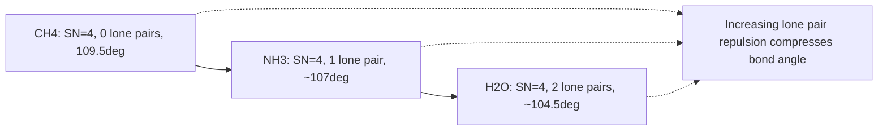

## VSEPR Theory and Molecular Shapes

### Definition

Valence Shell Electron Pair Repulsion (VSEPR) theory predicts the three-dimensional geometry of molecules based on the principle that electron pairs (both bonding and lone pairs) surrounding a central atom arrange themselves to minimize electrostatic repulsion, adopting positions as far apart from each other as possible.

**Key Points**

- The central premise: electron pairs (bonding pairs and lone pairs) repel one another and orient to maximize the angular distance between them
- Molecular geometry describes the arrangement of atoms only; electron-domain (electron-pair) geometry describes the arrangement of all electron domains, including lone pairs
- Lone pairs occupy more space than bonding pairs because they are attracted to only one nucleus (the central atom) rather than shared between two, causing greater repulsion
- Repulsion strength ranking: **lone pair–lone pair > lone pair–bonding pair > bonding pair–bonding pair**

### Steric Number and Electron Domain Geometry

The **steric number (SN)** equals the total number of electron domains (bonding groups + lone pairs) around the central atom. Each domain — whether a single, double, or triple bond, or a lone pair — counts as ONE domain for VSEPR purposes.

$$SN = (\text{number of atoms bonded to central atom}) + (\text{number of lone pairs on central atom})$$

| Steric Number | Electron Domain Geometry | Bond Angle(s) |
| --- | --- | --- |
| 2 | Linear | 180° |
| 3 | Trigonal planar | 120° |
| 4 | Tetrahedral | 109.5° |
| 5 | Trigonal bipyramidal | 90°, 120°, 180° |
| 6 | Octahedral | 90°, 180° |

### Molecular Geometries by Steric Number

**Steric Number 2**

| Lone Pairs | Molecular Geometry | Example |
| --- | --- | --- |
| 0 | Linear | BeCl₂, CO₂ |

**Steric Number 3**

| Lone Pairs | Molecular Geometry | Example |
| --- | --- | --- |
| 0 | Trigonal planar | BF₃, SO₃ |
| 1 | Bent (angular) | SO₂ (~119°) |

**Steric Number 4**

| Lone Pairs | Molecular Geometry | Example |
| --- | --- | --- |
| 0 | Tetrahedral | CH₄ |
| 1 | Trigonal pyramidal | NH₃ (~107°) |
| 2 | Bent (angular) | H₂O (~104.5°) |

**Steric Number 5**

| Lone Pairs | Molecular Geometry | Example |
| --- | --- | --- |
| 0 | Trigonal bipyramidal | PCl₅ |
| 1 | Seesaw (disphenoidal) | SF₄ |
| 2 | T-shaped | ClF₃ |
| 3 | Linear | XeF₂ |

**Steric Number 6**

| Lone Pairs | Molecular Geometry | Example |
| --- | --- | --- |
| 0 | Octahedral | SF₆ |
| 1 | Square pyramidal | BrF₅ |
| 2 | Square planar | XeF₄ |

### Why Bond Angles Deviate from Ideal Values

**Key Points**

- Lone pairs compress bonding-pair angles because they exert stronger repulsion than bonding pairs, occupying a larger effective angular "footprint" near the central atom
- Each lone pair added typically compresses bond angles by a few degrees relative to the ideal electron-domain geometry angle
- Multiple bonds (double, triple) also exert slightly greater repulsion than single bonds, though this effect is generally smaller than lone pair repulsion

**Example: Bond angle trend across steric number 4**

$$\text{CH}_4 \text{ (109.5°)} > \text{NH}_3 \text{ (≈107°)} > \text{H}_2\text{O} \text{ (≈104.5°)}$$

As lone pairs increase from 0 (CH₄) to 1 (NH₃) to 2 (H₂O), the H–X–H bond angle progressively decreases due to increasing lone-pair repulsion, even though all three species share the same tetrahedral electron-domain geometry.

### Special Placement Rules for Trigonal Bipyramidal Geometries (SN = 5)

In trigonal bipyramidal arrangements, there are two distinct positions: **axial** (2 positions, 180° apart) and **equatorial** (3 positions, 120° apart in a plane). Lone pairs always occupy equatorial positions preferentially, because equatorial positions experience less overall repulsion (only two 90° interactions vs. three 90° interactions for axial positions).

**Example**

In SF₄ (seesaw geometry), the single lone pair occupies an equatorial position rather than axial, minimizing the number of high-repulsion 90° lone-pair/bonding-pair interactions.

### Illustrative Structures

<svg xmlns="http://www.w3.org/2000/svg" viewBox="0 0 560 200" font-family="sans-serif">
<text x="20" y="20" font-size="14" font-weight="bold">Common VSEPR Geometries (svg_diagram)</text>
<g transform="translate(50,60)">
<line x1="0" y1="0" x2="-35" y2="0" stroke="#333" stroke-width="2" />
<line x1="0" y1="0" x2="35" y2="0" stroke="#333" stroke-width="2" />
<circle cx="0" cy="0" r="10" fill="#4a6fa5" />
<circle cx="-35" cy="0" r="8" fill="#ffcc00" />
<circle cx="35" cy="0" r="8" fill="#ffcc00" />
<text x="-15" y="35" font-size="11">Linear</text>
</g>
<g transform="translate(180,60)">
<line x1="0" y1="0" x2="0" y2="-35" stroke="#333" stroke-width="2" />
<line x1="0" y1="0" x2="30" y2="20" stroke="#333" stroke-width="2" />
<line x1="0" y1="0" x2="-30" y2="20" stroke="#333" stroke-width="2" />
<circle cx="0" cy="0" r="10" fill="#4a6fa5" />
<circle cx="0" cy="-35" r="8" fill="#ffcc00" />
<circle cx="30" cy="20" r="8" fill="#ffcc00" />
<circle cx="-30" cy="20" r="8" fill="#ffcc00" />
<text x="-25" y="55" font-size="11">Trigonal Planar</text>
</g>
<g transform="translate(320,60)">
<line x1="0" y1="0" x2="0" y2="-30" stroke="#333" stroke-width="2" />
<line x1="0" y1="0" x2="28" y2="15" stroke="#333" stroke-width="2" />
<line x1="0" y1="0" x2="-28" y2="15" stroke="#333" stroke-width="2" />
<line x1="0" y1="0" x2="0" y2="30" stroke="#333" stroke-width="2" stroke-dasharray="4,3" />
<circle cx="0" cy="0" r="10" fill="#4a6fa5" />
<circle cx="0" cy="-30" r="8" fill="#ffcc00" />
<circle cx="28" cy="15" r="8" fill="#ffcc00" />
<circle cx="-28" cy="15" r="8" fill="#ffcc00" />
<circle cx="0" cy="30" r="8" fill="#ffcc00" />
<text x="-20" y="55" font-size="11">Tetrahedral</text>
</g>
<g transform="translate(460,60)">
<line x1="0" y1="0" x2="0" y2="-35" stroke="#333" stroke-width="2" />
<line x1="0" y1="0" x2="0" y2="35" stroke="#333" stroke-width="2" />
<line x1="0" y1="0" x2="35" y2="0" stroke="#333" stroke-width="2" />
<line x1="0" y1="0" x2="-35" y2="0" stroke="#333" stroke-width="2" />
<circle cx="0" cy="0" r="10" fill="#4a6fa5" />
<circle cx="0" cy="-35" r="8" fill="#ffcc00" />
<circle cx="0" cy="35" r="8" fill="#ffcc00" />
<circle cx="35" cy="0" r="8" fill="#ffcc00" />
<circle cx="-35" cy="0" r="8" fill="#ffcc00" />
<text x="-25" y="55" font-size="11">Square Planar</text>
</g>

<text x="20" y="170" font-size="11" fill="#555">Blue = central atom; Yellow = bonded atoms/substituent positions; dashed = wedge (toward viewer)</text>

</svg>

### Step-by-Step Procedure for Applying VSEPR

1. Draw the correct Lewis structure of the molecule, including all lone pairs on the central atom
2. Count the steric number (bonded atoms + lone pairs) on the central atom
3. Determine the electron-domain geometry from the steric number
4. Identify the molecular geometry by considering only atom positions (ignoring lone pairs visually, but accounting for their repulsive effect on angles)
5. Adjust expected bond angles downward from the ideal for each lone pair present

### Relationship to Hybridization

VSEPR electron-domain geometry directly correlates with the hybridization state of the central atom:

| Steric Number | Hybridization |
| --- | --- |
| 2 | sp |
| 3 | sp² |
| 4 | sp³ |
| 5 | sp³d |
| 6 | sp³d² |

[Inference: the sp³d/sp³d² hybridization model for steric numbers 5 and 6 is a traditional pedagogical simplification; modern molecular orbital treatments of hypervalent main-group compounds often describe bonding without invoking d-orbital participation, though the VSEPR geometric predictions themselves remain accurate and widely used.]

### Common Pitfalls

- Forgetting to count lone pairs on the central atom when determining steric number
- Treating multiple bonds (double/triple) as multiple electron domains — a double or triple bond still counts as only ONE domain in VSEPR
- Confusing electron-domain geometry with molecular geometry when lone pairs are present (they are identical only when there are zero lone pairs)
- Placing lone pairs in axial rather than equatorial positions in trigonal bipyramidal structures (SN=5)
- Assuming VSEPR predicts exact bond angles — it predicts general trends and approximate/idealized angles, not precise experimental values

### Related Topics

- Hybridization (sp, sp², sp³, sp³d, sp³d²) and orbital theory
- Molecular polarity and dipole moment prediction from geometry
- Lewis structures and formal charge
- Valence bond theory vs. molecular orbital theory
- Resonance structures and their effect on geometry
- Isomerism and 3D molecular representation (wedge-dash notation)