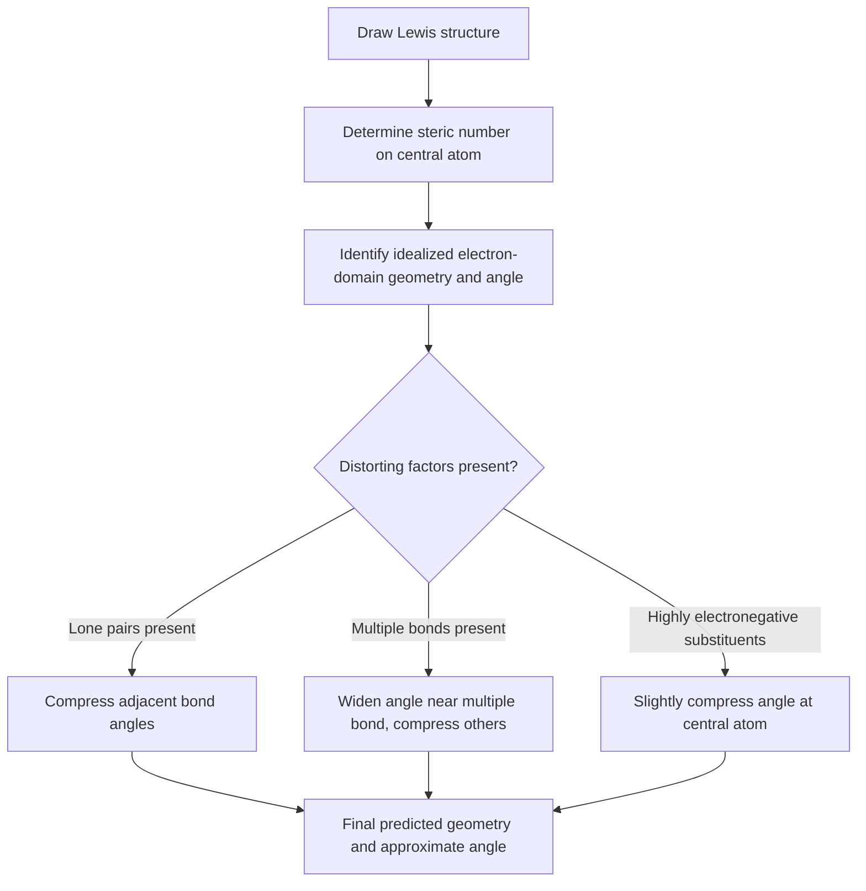

## Predicting Bond Angles and Geometry

### Overview

Predicting bond angles and molecular geometry builds directly on VSEPR theory by applying a systematic procedure to determine both the idealized geometric framework and the deviations caused by lone pairs, multiple bonds, and electronegativity differences. This topic focuses on the practical, step-by-step application of geometric prediction and the refinement of idealized angles toward realistic values.

**Key Points**

- Bond angle prediction proceeds in two stages: (1) determine the idealized angle from steric number/electron-domain geometry, then (2) adjust for distorting factors
- The three primary distorting factors are: lone pair repulsion, multiple bond repulsion, and substituent electronegativity
- Predictions are most reliable for main-group central atoms with well-defined Lewis structures

### Stage 1: Determining Idealized Bond Angles

The idealized bond angle is set entirely by the steric number (SN) of the central atom, following standard VSEPR electron-domain geometries.

| Steric Number | Electron Domain Geometry | Idealized Angle(s) |
| --- | --- | --- |
| 2 | Linear | 180° |
| 3 | Trigonal planar | 120° |
| 4 | Tetrahedral | 109.5° |
| 5 | Trigonal bipyramidal | 90° (axial-equatorial), 120° (equatorial-equatorial), 180° (axial-axial) |
| 6 | Octahedral | 90°, 180° |

### Stage 2: Adjustment Factors

**Factor 1 — Lone Pair Repulsion**

Lone pairs are held closer to the central nucleus (attracted to only one nucleus) and occupy a larger effective angular volume than bonding pairs, compressing adjacent bond angles.

**Repulsion strength hierarchy:**

$$\text{lone pair–lone pair} > \text{lone pair–bonding pair} > \text{bonding pair–bonding pair}$$

**Example — Steric number 4 series:**

$$\text{CH}_4\ (0\text{ LP}) = 109.5° \quad\rightarrow\quad \text{NH}_3\ (1\text{ LP}) \approx 107° \quad\rightarrow\quad \text{H}_2\text{O}\ (2\text{ LP}) \approx 104.5°$$

Each additional lone pair compresses the bond angle further due to increasing lone-pair repulsion pushing bonding pairs closer together.

**Factor 2 — Multiple Bond Repulsion**

Double and triple bonds contain more electron density than single bonds and exert slightly greater repulsion on adjacent bonding domains, widening the angle nearest the multiple bond while compressing others.

**Example**

In formaldehyde (H₂C=O), the H–C–H angle is compressed to approximately 116° (rather than the idealized 120° for trigonal planar), while the H–C=O angles widen to approximately 122°, because the C=O double bond's greater electron density pushes the two C–H single bonds closer together.

**Factor 3 — Electronegativity of Substituents**

More electronegative substituent atoms pull shared bonding electron density away from the central atom, reducing bonding-pair repulsion near the central atom and allowing bond angles to compress slightly relative to less electronegative substituents.

**Example**

$$\angle\text{FPF (PF}_3\text{)} < \angle\text{HPH (PH}_3\text{)}$$

Because fluorine is more electronegative than hydrogen, the P–F bonding pairs in PF₃ are drawn further from phosphorus, reducing repulsion between them and allowing the F–P–F angle to compress relative to the H–P–H angle in PH₃. [Inference: exact angle values vary by source and measurement method; the qualitative trend is well established]

### Worked Prediction Examples

**Example 1: SO₂ (sulfur dioxide)**

1. Lewis structure: S is central, bonded to 2 O atoms (one resonance structure has one S=O double bond and one S–O single bond with formal charges; both O atoms are equivalent via resonance), with 1 lone pair on S
2. Steric number = 2 (bonded atoms) + 1 (lone pair) = 3
3. Electron-domain geometry: trigonal planar (idealized 120°)
4. Molecular geometry: bent (one position occupied by lone pair)
5. Adjustment: 1 lone pair compresses the O–S–O angle to approximately 119° (close to but slightly less than 120°, since only one lone pair is present) [Unverified: precise experimental value depends on source]

**Example 2: ClF₃ (chlorine trifluoride)**

1. Lewis structure: Cl is central, bonded to 3 F atoms, with 2 lone pairs on Cl
2. Steric number = 3 + 2 = 5
3. Electron-domain geometry: trigonal bipyramidal
4. Both lone pairs occupy equatorial positions (to minimize 90° lone pair–bonding pair interactions)
5. Molecular geometry: T-shaped
6. Resulting F–Cl–F bond angles are compressed to approximately 87.5° (less than the ideal 90°) due to strong lone pair repulsion from the two equatorial lone pairs

### Quantitative Angle Trends Summary Table

| Molecule | Steric Number | Lone Pairs | Idealized Angle | Approximate Actual Angle |
| --- | --- | --- | --- | --- |
| BF₃ | 3 | 0 | 120° | 120° |
| SO₂ | 3 | 1 | 120° | ≈119° |
| CH₄ | 4 | 0 | 109.5° | 109.5° |
| NH₃ | 4 | 1 | 109.5° | ≈107° |
| H₂O | 4 | 2 | 109.5° | ≈104.5° |
| PCl₅ | 5 | 0 | 90°/120°/180° | ≈90°/120°/180° |
| SF₄ | 5 | 1 | 90°/120°/180° | axial-eq ≈173°, eq-eq ≈101° [Unverified: precise values vary by source] |
| SF₆ | 6 | 0 | 90°/180° | 90°/180° |
| BrF₅ | 6 | 1 | 90°/180° | F(axial)-Br-F(basal) ≈84.8° [Unverified] |

### Special Considerations for Central Atoms with Multiple Attached Groups of Different Types

When a central atom is bonded to different types of substituents (mixed substitution), each substituent's individual electronegativity and steric bulk must be considered separately, since VSEPR angle compression is not uniform across all bonds in an asymmetric molecule.

**Example**

In CH₂Cl₂ (dichloromethane), the H–C–H angle (≈112°) is slightly larger than the ideal tetrahedral 109.5°, while the Cl–C–Cl angle (≈112°) is also affected — both angles adjust because Cl atoms are bulkier and their bonding pairs, while drawn away from carbon due to Cl's electronegativity, still exert differential steric and electronic effects compared to the smaller H atoms. [Inference: the precise magnitude and direction of such asymmetric distortions can require experimental or computational confirmation rather than qualitative VSEPR reasoning alone]

### Common Pitfalls

- Applying a single universal compression value per lone pair rather than recognizing that compression magnitude depends on the specific geometry and total number of lone pairs
- Forgetting that in trigonal bipyramidal and octahedral geometries, multiple distinct angle types exist (not just one bond angle to predict)
- Ignoring multiple-bond repulsion effects when a structure contains both single and double/triple bonds around the same central atom
- Over-relying on idealized angles as if they were exact experimental values rather than starting approximations

### Related Topics

- VSEPR theory and molecular shapes
- Hybridization and orbital geometry
- Molecular polarity and dipole moment calculation
- Valence bond theory vs. molecular orbital theory
- Isomerism and stereochemistry (cis/trans, chirality)
- Spectroscopic methods for experimental bond angle determination (microwave, X-ray crystallography)