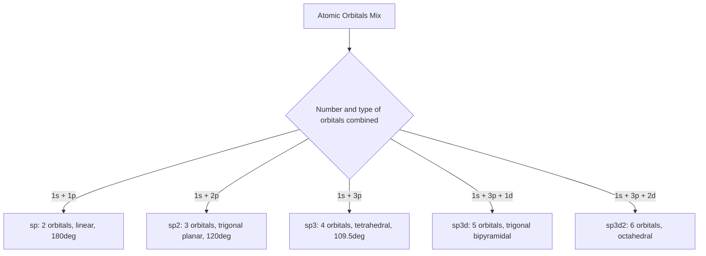

## Orbital Hybridization

### Definition

Orbital hybridization is a model in valence bond theory in which atomic orbitals on a single atom mix (combine mathematically) to form a new set of equivalent hybrid orbitals, oriented to match the observed molecular geometry and enable optimal orbital overlap for bonding.

**Key Points**

- Hybridization is a theoretical construct, not a physically observed phenomenon — it is invoked to reconcile valence bond theory with experimentally observed molecular geometries
- The number of hybrid orbitals produced always equals the number of atomic orbitals mixed (conservation of orbitals)
- Hybrid orbitals are used for σ (sigma) bonding and for holding lone pairs; unhybridized p-orbitals (when present) are used for π (pi) bonding
- Hybridization type correlates directly with steric number (SN) from VSEPR theory

### Types of Hybridization

**sp Hybridization**

- Formed from 1 s-orbital + 1 p-orbital → 2 sp hybrid orbitals
- Geometry: linear, 180° angle between hybrid orbitals
- 2 unhybridized p-orbitals remain, available for π bonding
- Example: BeCl₂, and the central carbons in HC≡CH (acetylene) and CO₂

**sp² Hybridization**

- Formed from 1 s-orbital + 2 p-orbitals → 3 sp² hybrid orbitals
- Geometry: trigonal planar, 120° angles
- 1 unhybridized p-orbital remains, available for π bonding
- Example: BF₃, and the carbons in H₂C=CH₂ (ethylene), and each carbon in benzene

**sp³ Hybridization**

- Formed from 1 s-orbital + 3 p-orbitals → 4 sp³ hybrid orbitals
- Geometry: tetrahedral, 109.5° angles
- No unhybridized p-orbitals remain (all four orbitals hybridized) — sp³ centers form only σ bonds, no π bonds
- Example: CH₄, NH₃, H₂O

**sp³d Hybridization**

- Formed from 1 s-orbital + 3 p-orbitals + 1 d-orbital → 5 sp³d hybrid orbitals
- Geometry: trigonal bipyramidal
- Example: PCl₅, SF₄
- [Inference: as noted under VSEPR theory, modern computational treatments of hypervalent bonding often question literal d-orbital participation in main-group elements; sp³d remains the standard introductory pedagogical model and correctly predicts geometry]

**sp³d² Hybridization**

- Formed from 1 s-orbital + 3 p-orbitals + 2 d-orbitals → 6 sp³d² hybrid orbitals
- Geometry: octahedral
- Example: SF₆, XeF₄

### Relationship to Steric Number (VSEPR Correlation)

| Steric Number | Hybridization | Unhybridized p-Orbitals Remaining |
| --- | --- | --- |
| 2 | sp | 2 |
| 3 | sp² | 1 |
| 4 | sp³ | 0 |
| 5 | sp³d | 0 |
| 6 | sp³d² | 0 |

The steric number (bonded groups + lone pairs, counting each multiple bond as one domain) directly determines hybridization type — this is the same steric number used in VSEPR analysis, making hybridization prediction a direct extension of VSEPR geometry determination.

### Sigma (σ) and Pi (π) Bonds in Hybridization

**Key Points**

- A **σ bond** forms from direct, head-on overlap of orbitals (hybrid-hybrid or hybrid-s) along the internuclear axis; every single bond is one σ bond
- A **π bond** forms from side-by-side (lateral) overlap of unhybridized, parallel p-orbitals above and below the internuclear axis
- A double bond = 1 σ bond + 1 π bond; a triple bond = 1 σ bond + 2 π bonds
- π bonds restrict rotation around the bond axis (responsible for cis/trans isomerism in alkenes), while σ bonds allow free rotation

**Example: Ethylene (H₂C=CH₂)**

Each carbon is sp² hybridized (SN=3: 2 C–H σ bonds + 1 C–C σ bond, using the 3 sp² orbitals), with one unhybridized p-orbital per carbon remaining perpendicular to the sp² plane. These two unhybridized p-orbitals overlap laterally to form the π bond, completing the C=C double bond (1 σ + 1 π). The planar geometry and restricted rotation of ethylene directly result from this π bond.

**Example: Acetylene (HC≡CH)**

Each carbon is sp hybridized (SN=2: 1 C–H σ bond + 1 C–C σ bond, using the 2 sp orbitals), leaving 2 unhybridized p-orbitals per carbon, oriented perpendicular to each other. These form two separate π bonds, giving the C≡C triple bond (1 σ + 2 π) and the molecule's linear geometry.

<svg xmlns="http://www.w3.org/2000/svg" viewBox="0 0 520 220" font-family="sans-serif">
<text x="20" y="20" font-size="14" font-weight="bold">Sigma and Pi Bonding in a C=C Double Bond (svg_diagram)</text>
<line x1="150" y1="120" x2="350" y2="120" stroke="#333" stroke-width="3" />
<text x="240" y="115" font-size="11" fill="#333">sigma bond (sp2-sp2 overlap)</text>
<ellipse cx="250" cy="80" rx="110" ry="25" fill="none" stroke="#4a6fa5" stroke-width="2" />
<ellipse cx="250" cy="160" rx="110" ry="25" fill="none" stroke="#4a6fa5" stroke-width="2" />
<text x="230" y="45" font-size="11" fill="#4a6fa5">pi bond (p-orbital lateral overlap, above plane)</text>
<text x="230" y="205" font-size="11" fill="#4a6fa5">pi bond lobe (below plane)</text>
<circle cx="150" cy="120" r="14" fill="#333" />
<circle cx="350" cy="120" r="14" fill="#333" />
<text x="144" y="125" font-size="11" fill="white">C</text>
<text x="344" y="125" font-size="11" fill="white">C</text>
</svg>

### Hybridization Involving Lone Pairs

Lone pairs occupy hybrid orbitals just as bonding pairs do, and count toward the steric number in the same way. In water (H₂O), oxygen is sp³ hybridized: 2 of the 4 sp³ orbitals form σ bonds to hydrogen, and the remaining 2 sp³ orbitals each hold a lone pair.

### Hybridization in Extended/Aromatic Systems

In benzene (C₆H₆), each carbon is sp² hybridized, forming 3 σ bonds (2 to adjacent carbons, 1 to hydrogen) using the sp² orbitals. Each carbon's single unhybridized p-orbital is oriented perpendicular to the ring plane, and all six p-orbitals overlap continuously around the ring, creating a delocalized π electron system rather than three isolated, localized π bonds. This delocalization is the structural basis for resonance in benzene and its associated aromatic stability.

### Common Pitfalls

- Confusing steric number with total number of bonds — steric number counts electron *domains* (each multiple bond = one domain, each lone pair = one domain), not the total number of bonds
- Assuming hybridization is a real, physically measurable phenomenon rather than a useful bonding model — modern computational chemistry treats it as one of several valid descriptive frameworks, alongside molecular orbital theory
- Forgetting that sp³ centers cannot form π bonds (no unhybridized p-orbitals remain), so double/triple bonds cannot occur at sp³-hybridized atoms
- Misassigning hybridization on atoms with expanded octets by defaulting to sp³d/sp³d² without verifying steric number correctly
- Overlooking that in resonance/aromatic systems, the unhybridized p-orbitals contribute to a single delocalized π system rather than multiple discrete π bonds

### Related Topics

- VSEPR theory and molecular shapes
- Molecular orbital theory (bonding vs. antibonding orbitals, MO diagrams)
- Resonance and aromaticity (Hückel's rule)
- Isomerism: cis/trans (geometric) isomerism from restricted π-bond rotation
- Valence bond theory vs. molecular orbital theory
- Conjugated systems and UV-Vis spectroscopy