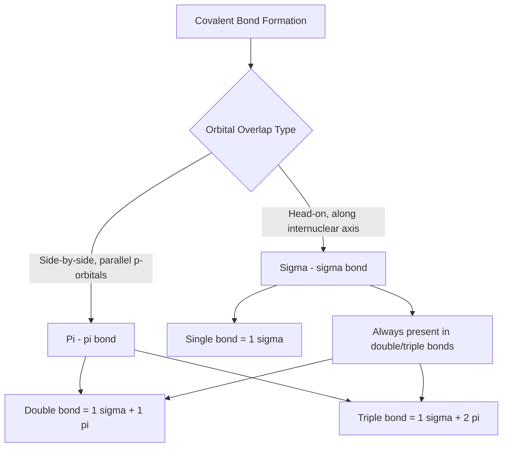

## Sigma and Pi Bonds

### Definition

Sigma (σ) and pi (π) bonds are the two fundamental types of covalent bonds classified by the geometry of orbital overlap. A σ bond arises from direct, head-on (end-to-end) overlap of orbitals along the internuclear axis, while a π bond arises from side-by-side (lateral) overlap of parallel, unhybridized p-orbitals above and below the internuclear axis.

**Key Points**

- Every single covalent bond consists of exactly one σ bond
- A double bond consists of one σ bond plus one π bond; a triple bond consists of one σ bond plus two π bonds
- σ bonds permit free rotation around the bond axis; π bonds restrict rotation, since rotation would break the lateral p-orbital overlap
- σ bonds are generally stronger than π bonds due to greater orbital overlap efficiency in the head-on geometry

### Sigma (σ) Bonds

**Key Points**

- Formed by end-to-end overlap of any combination of s-orbitals, p-orbitals (along their axis), or hybrid orbitals
- Electron density is concentrated directly along and symmetric about the internuclear axis
- Can form from: s-s overlap (e.g., H₂), s-p overlap (e.g., H–Cl), p-p overlap (head-on, e.g., Cl₂), or hybrid orbital overlap (e.g., sp³-sp³ in ethane)
- Every bond — single, double, or triple — contains exactly one σ bond as its foundational component

**Example**

In H₂, the σ bond forms from direct overlap of the two 1s orbitals of each hydrogen atom, with electron density concentrated symmetrically along the H–H internuclear axis.

### Pi (π) Bonds

**Key Points**

- Formed by lateral (side-by-side) overlap of unhybridized p-orbitals that are oriented parallel to each other, perpendicular to the internuclear axis
- Electron density is concentrated in two lobes, one above and one below (or in front of/behind) the internuclear axis, with a node (zero electron density) along the axis itself
- π bonds only form after a σ bond framework is already established between the same two atoms (π bonding never occurs in isolation between two atoms)
- Requires the participating atoms to retain unhybridized p-orbitals, which occurs only when steric number ≤ 3 (sp or sp² hybridization) — sp³-hybridized atoms cannot form π bonds

**Example**

In ethylene (H₂C=CH₂), each carbon is sp² hybridized, leaving one unhybridized p-orbital per carbon oriented perpendicular to the molecular plane. These two p-orbitals overlap laterally above and below the C–C axis to form the π bond, which combines with the underlying sp²-sp² σ bond to create the overall C=C double bond.

### Visual Comparison of Overlap Geometry

<svg xmlns="http://www.w3.org/2000/svg" viewBox="0 0 560 260" font-family="sans-serif">
<text x="20" y="20" font-size="14" font-weight="bold">Sigma vs. Pi Bond Orbital Overlap (svg_diagram)</text>

<text x="60" y="50" font-size="12" font-weight="bold">Sigma Bond (head-on overlap)</text>

<line x1="60" y1="100" x2="260" y2="100" stroke="#ccc" stroke-width="1" stroke-dasharray="3,3" />

<ellipse cx="130" cy="100" rx="40" ry="18" fill="`#4a6fa5`" opacity="0.7" />

<ellipse cx="190" cy="100" rx="40" ry="18" fill="`#ffcc00`" opacity="0.7" />

<circle cx="100" cy="100" r="5" fill="#333" />

<circle cx="220" cy="100" r="5" fill="#333" />

<text x="60" y="140" font-size="10" fill="#555">Electron density concentrated directly on the axis</text>

<text x="320" y="50" font-size="12" font-weight="bold">Pi Bond (lateral overlap)</text>

<line x1="320" y1="140" x2="520" y2="140" stroke="#ccc" stroke-width="1" stroke-dasharray="3,3" />

<ellipse cx="420" cy="90" rx="90" ry="20" fill="`#4a6fa5`" opacity="0.6" />

<ellipse cx="420" cy="190" rx="90" ry="20" fill="`#4a6fa5`" opacity="0.6" />

<circle cx="370" cy="140" r="5" fill="#333" />

<circle cx="470" cy="140" r="5" fill="#333" />

<text x="320" y="230" font-size="10" fill="#555">Two lobes above/below axis; node along the axis itself</text>

</svg>

### Bond Strength and Reactivity Implications

**Key Points**

- σ bonds have greater orbital overlap along a single axis, generally making them stronger and lower in energy than π bonds of the same bond pair
- π electrons are held less tightly (more diffuse, less overlap efficiency) and are therefore generally more reactive/accessible, making π bonds common sites for addition reactions (e.g., electrophilic addition to alkenes)
- Because π bonds prevent rotation, molecules with double bonds can exhibit cis/trans (E/Z) geometric isomerism; molecules with only σ bonds (single bonds) rotate freely and do not show this type of isomerism

**Example: Restricted rotation in alkenes**

In 2-butene (CH₃–CH=CH–CH�3), the C=C π bond locks the molecule into either the cis (Z) or trans (E) configuration, because rotating around the double bond would require breaking the lateral p-orbital overlap that constitutes the π bond. In contrast, butane (CH₃–CH₂–CH₂–CH₃), containing only σ bonds, rotates freely around each C–C bond and shows no such fixed geometric isomers.

### Bond Order and Bond Length Relationship

$$\text{Bond Order} = \frac{\text{number of σ bonds} + \text{number of π bonds}}{1}$$

| Bond Type | σ Bonds | π Bonds | Bond Order | Relative Bond Length | Relative Bond Strength |
| --- | --- | --- | --- | --- | --- |
| Single (C–C) | 1 | 0 | 1 | Longest (~154 pm) | Weakest |
| Double (C=C) | 1 | 1 | 2 | Intermediate (~134 pm) | Stronger |
| Triple (C≡C) | 1 | 2 | 3 | Shortest (~120 pm) | Strongest |

As π bonds are added between the same two atoms, bond order increases, bond length decreases, and overall bond strength (total bond dissociation energy) increases — though each additional π bond individually contributes somewhat less energy than the initial σ bond, since π overlap is less efficient than σ overlap. [Inference: exact incremental strength values vary depending on the specific atoms and reference source]

### Delocalized π Systems

When multiple adjacent atoms each retain unhybridized p-orbitals aligned in parallel, their π systems can merge into a single delocalized π system spanning more than two atoms, rather than forming isolated, localized π bonds. This is the structural basis of resonance (e.g., benzene, carbonate ion) and is treated more fully under resonance structures and aromaticity.

### Common Pitfalls

- Assuming a double bond is simply "twice as strong" as a single bond — the π bond contribution is generally weaker than the σ bond contribution, so bond strength does not scale perfectly linearly with bond order
- Believing π bonds can exist independently without an accompanying σ bond between the same two atoms — π bonding always supplements an existing σ framework
- Forgetting that only unhybridized p-orbitals (present in sp or sp² hybridized atoms) can participate in π bonding — sp³ atoms have no unhybridized p-orbitals available
- Confusing bond rotation restriction (a consequence of π bonding) with steric hindrance (a separate, unrelated concept)

### Related Topics

- Orbital hybridization (sp, sp², sp³, sp³d, sp³d²)
- Resonance structures and delocalized π systems
- Cis/trans (geometric) isomerism in alkenes
- Molecular orbital theory and bonding/antibonding orbitals
- Bond length, bond order, and bond dissociation energy
- Aromaticity and Hückel's rule