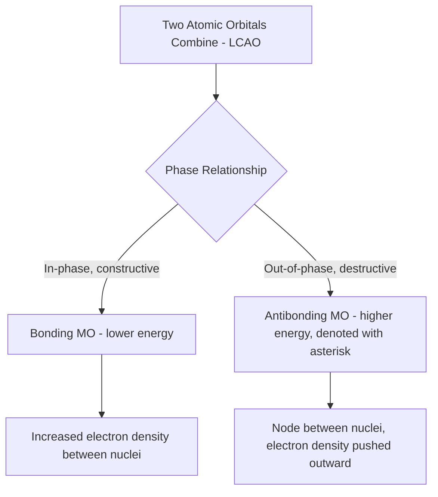

## Introduction to Molecular Orbital Theory

### Definition

Molecular orbital (MO) theory is a model of chemical bonding in which atomic orbitals from all atoms in a molecule combine to form new, delocalized molecular orbitals that extend over the entire molecule, rather than being localized between two specific atoms as in valence bond theory. Electrons occupy these molecular orbitals according to the same principles (Aufbau, Pauli exclusion, Hund's rule) used for atomic orbitals.

**Key Points**

- MO theory treats bonding electrons as belonging to the molecule as a whole, not to a specific bond between two atoms
- Atomic orbitals combine via **linear combination of atomic orbitals (LCAO)**: the number of molecular orbitals formed always equals the number of atomic orbitals combined (conservation of orbitals)
- MO theory successfully explains phenomena that valence bond/Lewis theory cannot, such as the paramagnetism of O₂ and the existence of odd-electron species
- MO theory is generally considered more rigorous and predictive than valence bond theory, though more mathematically complex

### Formation of Bonding and Antibonding Orbitals

When two atomic orbitals combine, they can interact in two ways depending on the phase (sign) of the wavefunctions:

**Bonding Molecular Orbital**

- Forms from constructive interference (in-phase combination) of atomic orbitals
- Results in increased electron density between the nuclei
- Lower in energy than the original atomic orbitals — stabilizing
- Denoted with no asterisk (e.g., σ, π)

**Antibonding Molecular Orbital**

- Forms from destructive interference (out-of-phase combination) of atomic orbitals
- Results in a node (region of zero electron density) between the nuclei, with electron density pushed to the outer regions
- Higher in energy than the original atomic orbitals — destabilizing
- Denoted with an asterisk (e.g., σ*, π*)

### Sigma and Pi Molecular Orbitals

Just as in valence bond theory, molecular orbitals are classified as σ or π based on their symmetry relative to the internuclear axis:

- **σ and σ*** orbitals form from head-on overlap of s-orbitals or p-orbitals oriented along the internuclear axis
- **π and π*** orbitals form from side-by-side overlap of p-orbitals oriented perpendicular to the internuclear axis

### MO Diagram Construction — General Procedure

1. Identify the atomic orbitals available for combination on each atom (typically valence orbitals only)
2. Combine atomic orbitals pairwise to generate an equal number of molecular orbitals (bonding + antibonding pairs)
3. Arrange the resulting molecular orbitals in order of increasing energy
4. Fill molecular orbitals with the total number of valence electrons from all combining atoms, following the Aufbau principle, Pauli exclusion principle, and Hund's rule

### MO Diagram for Homonuclear Diatomic Molecules (Period 2 Example)

For second-period diatomics (Li₂ through Ne₂), 2s and 2p atomic orbitals combine. The general (simplified) energy ordering for O₂, F₂, and Ne₂ is:

$$\sigma_{2s} < \sigma^*_{2s} < \sigma_{2p_z} < \pi_{2p_x}=\pi_{2p_y} < \pi^*_{2p_x}=\pi^*_{2p_y} < \sigma^*_{2p_z}$$

For Li₂ through N₂, the σ2p and π2p orbitals swap order due to s-p orbital mixing effects at lower nuclear charges:

$$\sigma_{2s} < \sigma^*_{2s} < \pi_{2p_x}=\pi_{2p_y} < \sigma_{2p_z} < \pi^*_{2p_x}=\pi^*_{2p_y} < \sigma^*_{2p_z}$$

[Unverified: the precise crossover point (N₂ vs O₂) and exact energy ordering can vary slightly depending on the computational method and textbook convention used]

### Bond Order in MO Theory

$$\text{Bond Order} = \frac{(\text{electrons in bonding MOs}) - (\text{electrons in antibonding MOs})}{2}$$

**Key Points**

- A bond order of 0 indicates no stable bond forms (the molecule/ion is not expected to exist)
- Higher bond order generally correlates with shorter bond length and greater bond dissociation energy
- Fractional bond orders are possible and often correspond to experimentally observed intermediate bond strengths

**Example: O₂ bond order calculation**

O₂ has 12 valence electrons total (6 from each oxygen). Filling the MO diagram in the O₂-F₂-Ne₂ ordering:

$$\sigma_{2s}^2\ \sigma^{*2}_{2s}\ \sigma^2_{2p_z}\ \pi^4_{2p_{x,y}}\ \pi^{*2}_{2p_{x,y}}$$

Bonding electrons = 2 (σ2s) + 2 (σ2pz) + 4 (π2p) = 8; Antibonding electrons = 2 (σ*2s) + 2 (π*2p) = 4

$$BO = \frac{8-4}{2} = 2$$

This matches the double-bond character predicted by Lewis structures, confirming consistency between the two models for this case.

### The Landmark Success of MO Theory: Paramagnetism of O₂

**Key Points**

- The standard Lewis structure of O₂ (O=O with two lone pairs on each oxygen) predicts all electrons are paired, implying O₂ should be **diamagnetic**
- Experimentally, liquid O₂ is strongly attracted to a magnetic field, demonstrating it is **paramagnetic** (contains unpaired electrons)
- MO theory correctly predicts this: filling the π*2p degenerate pair (π*2px and π*2py) with 2 electrons follows Hund's rule, placing one unpaired electron in each of the two degenerate π* orbitals
- This is frequently cited as one of the most compelling pieces of evidence supporting MO theory over simple Lewis/valence bond structures

<svg xmlns="http://www.w3.org/2000/svg" viewBox="0 0 480 260" font-family="sans-serif">
<text x="20" y="20" font-size="14" font-weight="bold">O2 Molecular Orbital Diagram - pi* Region (svg_diagram)</text>
<text x="20" y="45" font-size="11" fill="#555">Showing the two degenerate pi*2p orbitals with unpaired electrons</text>
<line x1="100" y1="120" x2="180" y2="120" stroke="#333" stroke-width="2" />
<line x1="220" y1="120" x2="300" y2="120" stroke="#333" stroke-width="2" />
<text x="105" y="110" font-size="11">pi*2px</text>
<text x="225" y="110" font-size="11">pi*2py</text>
<line x1="130" y1="125" x2="130" y2="150" stroke="#333" stroke-width="1.5" />
<polygon points="130,125 126,133 134,133" fill="#333" />
<line x1="250" y1="125" x2="250" y2="150" stroke="#333" stroke-width="1.5" />
<polygon points="250,125 246,133 254,133" fill="#333" />
<text x="30" y="200" font-size="11" fill="#555">Single up-arrow in each orbital = unpaired electrons (Hund's rule) → paramagnetic O2</text>
</svg>

### Heteronuclear Diatomic Molecules

When combining atomic orbitals from different elements (e.g., CO, NO), the atomic orbital energies are not identical, so the resulting molecular orbitals are weighted unevenly toward the more electronegative atom's orbitals (the bonding MO has greater atomic-orbital character from the more electronegative atom, and the antibonding MO has greater character from the less electronegative atom). This reflects the polarization of electron density toward the more electronegative element even within a fully delocalized MO framework.

### MO Theory vs. Valence Bond Theory Comparison

| Aspect | Valence Bond Theory | Molecular Orbital Theory |
| --- | --- | --- |
| Electron localization | Localized between two bonded atoms | Delocalized over the whole molecule |
| Explains paramagnetism (e.g., O₂)? | No (predicts diamagnetic) | Yes (correctly predicts paramagnetic) |
| Conceptual simplicity | High — intuitive, widely used pedagogically | Lower — requires understanding of orbital combination/energy diagrams |
| Predicts bond order/length trends well? | Adequate for many simple cases | Generally more accurate, especially for resonance/delocalized systems |
| Basis for hybridization | Yes — core concept | Not typically invoked in pure MO treatment |

### Common Pitfalls

- Assuming MO theory and valence bond theory always give contradictory results — for many simple molecules (e.g., O₂ bond order), both models agree on key quantities like bond order, even though the underlying electron distribution picture differs
- Forgetting that antibonding electrons subtract from bond order — simply counting bonding electrons without subtracting antibonding electrons gives an incorrect bond order
- Misapplying the σ2p/π2p energy ordering by using the O₂/F₂/Ne₂ ordering for lighter diatomics (Li₂–N₂) or vice versa
- Treating molecular orbital theory as replacing hybridization entirely — many introductory courses use hybridization (valence bond) for σ-framework/geometry and invoke MO concepts primarily for delocalized π systems and diatomic paramagnetism

### Related Topics

- MO diagrams for heteronuclear diatomics (CO, NO)
- Bond order, bond length, and bond energy relationships
- Paramagnetism and diamagnetism in chemical species
- Resonance and delocalized π systems as a bridge between VB and MO pictures
- Hybridization and valence bond theory
- Band theory in metallic bonding (MO theory extended to solids)