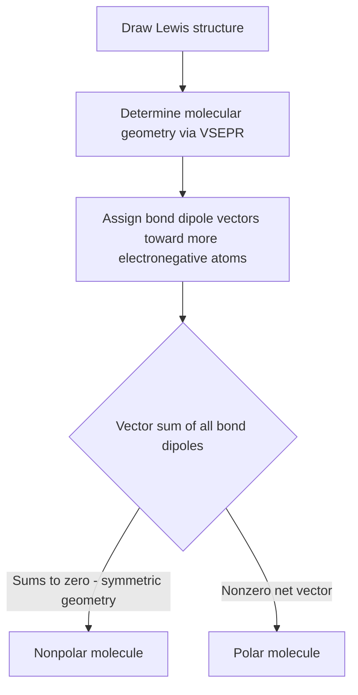

## Molecular Polarity

### Definition

Molecular polarity describes whether a molecule has a net separation of positive and negative charge (a net dipole moment), determined by the combination of individual bond dipoles and the overall molecular geometry. A molecule is **polar** if it has a nonzero net dipole moment, and **nonpolar** if bond dipoles cancel due to symmetry or if no significant bond dipoles exist.

**Key Points**

- Molecular polarity depends on both bond polarity (from electronegativity differences) AND molecular geometry (from VSEPR)
- A molecule can contain polar bonds yet be nonpolar overall if the bond dipoles are arranged symmetrically and cancel vectorially
- Dipole moment ($\mu$) is a vector quantity, measured in debye (D), pointing from the region of partial positive charge toward the region of partial negative charge
- Lone pairs on the central atom contribute their own dipole contribution and often prevent symmetric cancellation

### Bond Dipoles and Electronegativity

A bond dipole arises when two bonded atoms have different electronegativities, causing unequal sharing of bonding electrons. The bond dipole moment is calculated as:

$$\mu = Q \times r$$

Where $Q$ is the magnitude of partial charge and $r$ is the distance between the charge centers (bond length).

**Key Points**

- The dipole arrow points from the less electronegative (partial positive, $\delta^+$) atom toward the more electronegative (partial positive, $\delta^-$) atom
- Larger electronegativity differences produce larger bond dipole moments
- A bond is considered essentially nonpolar covalent when the electronegativity difference is very small (roughly <0.4), polar covalent for intermediate differences (roughly 0.4–1.7), and ionic for large differences (roughly >1.7) [Unverified: these numerical thresholds are approximate conventions and vary somewhat between textbooks]

### Determining Overall Molecular Polarity — Procedure

1. Draw the correct Lewis structure and determine the molecular geometry using VSEPR
2. Identify each bond dipole based on electronegativity differences between the central atom and each substituent
3. Assign a vector to each bond dipole, pointing toward the more electronegative atom
4. Sum the bond dipole vectors according to the molecular geometry
5. If the vector sum is zero (symmetric cancellation), the molecule is nonpolar; if nonzero, the molecule is polar

### Key Examples: Symmetry-Driven Cancellation

**Example 1: CO₂ (nonpolar despite polar bonds)**

CO₂ has a linear geometry (SN=2, no lone pairs on carbon). Each C=O bond is polar (O is more electronegative than C), but the two bond dipoles point in exactly opposite directions (180° apart) and are of equal magnitude, so they cancel vectorially. Net dipole moment = 0 D. CO₂ is nonpolar.

**Example 2: H₂O (polar, bent geometry)**

H₂O has a bent geometry (SN=4, 2 lone pairs on oxygen). The two O–H bond dipoles do NOT point in opposite directions (bond angle ≈104.5°, not 180°), so they do not cancel. Additionally, the two lone pairs on oxygen contribute additional electron density asymmetrically. The result is a significant net dipole moment (experimental $\mu \approx 1.85$ D), making water strongly polar.

**Example 3: CCl₄ (nonpolar, symmetric tetrahedral)**

CCl₄ has a tetrahedral geometry (SN=4, no lone pairs). All four C–Cl bond dipoles are equal in magnitude and symmetrically arranged around the central carbon; their vector sum is exactly zero due to tetrahedral symmetry. CCl₄ is nonpolar despite having four significantly polar C–Cl bonds.

**Example 4: CHCl₃ (polar, asymmetric tetrahedral)**

Chloroform (CHCl₃) is also tetrahedral (SN=4), but with one C–H bond and three C–Cl bonds instead of four identical substituents. This asymmetry prevents complete cancellation of the bond dipoles, since the C–H bond dipole (small, pointing slightly toward C) does not offset the three C–Cl dipoles (larger, pointing toward Cl) symmetrically. Net result: CHCl₃ has a measurable dipole moment ($\mu \approx 1.04$ D) and is polar.

<svg xmlns="http://www.w3.org/2000/svg" viewBox="0 0 560 240" font-family="sans-serif">
<text x="20" y="20" font-size="14" font-weight="bold">Bond Dipole Cancellation: CO2 vs H2O (svg_diagram)</text>

<text x="60" y="55" font-size="12" font-weight="bold">CO2 - Nonpolar (dipoles cancel)</text>

<circle cx="170" cy="100" r="14" fill="#333" />

<circle cx="90" cy="100" r="12" fill="`#ff6666`" />

<circle cx="250" cy="100" r="12" fill="`#ff6666`" />

<line x1="150" y1="100" x2="105" y2="100" stroke="`#4a6fa5`" stroke-width="2" marker-end="url(#arrow1)" />

<line x1="190" y1="100" x2="235" y2="100" stroke="`#4a6fa5`" stroke-width="2" marker-end="url(#arrow2)" />

<text x="60" y="140" font-size="10" fill="#555">Equal, opposite dipoles cancel: net = 0</text>

<text x="330" y="55" font-size="12" font-weight="bold">H2O - Polar (dipoles add)</text>

<circle cx="420" cy="110" r="13" fill="`#ff6666`" />

<circle cx="370" cy="150" r="10" fill="#eee" stroke="#333" />

<circle cx="470" cy="150" r="10" fill="#eee" stroke="#333" />

<line x1="405" y1="120" x2="378" y2="145" stroke="`#4a6fa5`" stroke-width="2" />

<line x1="435" y1="120" x2="462" y2="145" stroke="`#4a6fa5`" stroke-width="2" />

<line x1="420" y1="110" x2="420" y2="60" stroke="`#8b0000`" stroke-width="2" marker-end="url(#arrow3)" />

<text x="330" y="200" font-size="10" fill="#555">Bent geometry: dipoles do not cancel, net vector points upward (toward O)</text>

</svg>

### Quick-Reference Table: Geometry and Polarity Outcomes

| Molecular Geometry | Symmetric Substituents | Polarity Outcome |
| --- | --- | --- |
| Linear (no lone pairs, symmetric) | Identical (e.g., CO₂) | Nonpolar |
| Linear (no lone pairs, asymmetric) | Different (e.g., HCN) | Polar |
| Trigonal planar (no LP, symmetric) | Identical (e.g., BF₃) | Nonpolar |
| Bent (from trigonal planar, 1 LP) | — | Polar (e.g., SO₂) |
| Tetrahedral (no LP, symmetric) | Identical (e.g., CH₄, CCl₄) | Nonpolar |
| Tetrahedral (no LP, asymmetric) | Different (e.g., CHCl₃, CH₃Cl) | Polar |
| Trigonal pyramidal (1 LP) | — | Polar (e.g., NH₃) |
| Bent (from tetrahedral, 2 LP) | — | Polar (e.g., H₂O) |
| Square planar (2 LP, symmetric) | Identical (e.g., XeF₄) | Nonpolar |
| Octahedral (no LP, symmetric) | Identical (e.g., SF₆) | Nonpolar |

### The Role of Lone Pairs in Polarity

**Key Points**

- Lone pairs represent a region of concentrated electron density without a corresponding nucleus to "balance" it, so they generally contribute a dipole moment component pointing away from the central atom, into the lone pair region
- This is a major reason why molecules with lone pairs on the central atom (e.g., NH₃, H₂O) tend to be polar even when their bonded substituents alone might otherwise suggest partial symmetry
- Symmetric placement of multiple lone pairs (e.g., XeF₄'s two lone pairs positioned 180° apart in square planar geometry) can restore overall molecular symmetry and result in a nonpolar molecule despite lone pair presence

### Polarity's Effect on Physical Properties

**Key Points**

- Polar molecules experience dipole-dipole intermolecular forces (in addition to London dispersion), generally raising boiling/melting points relative to comparably sized nonpolar molecules
- "Like dissolves like": polar solutes dissolve preferentially in polar solvents; nonpolar solutes dissolve preferentially in nonpolar solvents
- Polarity affects reactivity, since regions of partial charge ($\delta^+$/$\delta^-$) serve as sites for electrophilic or nucleophilic attack

### Common Pitfalls

- Assuming a molecule is polar simply because it contains polar bonds, without checking whether the geometry causes those bond dipoles to cancel (e.g., mistakenly calling CO₂ or CCl₄ polar)
- Forgetting to account for lone pair contributions to the overall dipole, particularly in bent and pyramidal geometries
- Confusing "bond polarity" (a property of an individual bond) with "molecular polarity" (a property of the whole molecule, dependent on geometry)
- Assuming symmetric molecular formulas (e.g., AB₄ or AB₆) always guarantee nonpolarity — this only holds true when the geometry is fully symmetric AND all substituents are identical

### Related Topics

- VSEPR theory and molecular shapes
- Electronegativity trends and bond polarity
- Intermolecular forces (dipole-dipole, hydrogen bonding)
- Solubility and "like dissolves like" principle
- Dipole moment measurement and applications (microwave spectroscopy)
- Hybridization and lone pair geometry