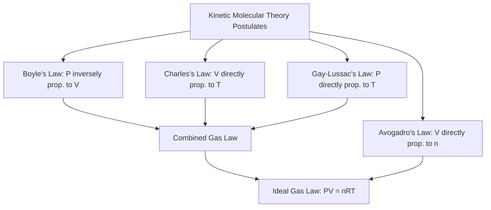

## Gas Laws and Kinetic Molecular Theory

### Kinetic Molecular Theory (KMT) — Foundational Postulates

Kinetic molecular theory provides the microscopic, particle-level model that explains and justifies the macroscopic gas laws. It describes an idealized "ideal gas" through a set of core postulates.

**Key Points**

- Gas particles are in constant, random, straight-line motion until they collide with each other or the container walls
- Gas particles are treated as having negligible volume compared to the total volume of the container (point masses)
- No attractive or repulsive forces exist between gas particles (collisions are perfectly elastic — no net loss of kinetic energy)
- The average kinetic energy of gas particles is directly proportional to the absolute (Kelvin) temperature, and is identical for all gases at the same temperature regardless of molar mass
- Pressure results from the frequency and force of particle collisions with the container walls

$$KE_{avg} = \frac{3}{2}RT$$

Where $R$ is the gas constant and $T$ is absolute temperature in Kelvin.

### The Individual Gas Laws

**Boyle's Law (constant T, n)**

$$P_1V_1 = P_2V_2$$

Pressure and volume are inversely proportional at constant temperature and amount of gas. As container volume decreases, particles collide with walls more frequently, increasing pressure.

**Charles's Law (constant P, n)**

$$\frac{V_1}{T_1} = \frac{V_2}{T_2}$$

Volume and absolute temperature are directly proportional at constant pressure. As temperature increases, average kinetic energy increases, causing particles to move faster and requiring greater volume to maintain constant pressure.

**Gay-Lussac's Law (constant V, n)**

$$\frac{P_1}{T_1} = \frac{P_2}{T_2}$$

Pressure and absolute temperature are directly proportional at constant volume. Increased temperature increases particle speed and collision force, raising pressure.

**Avogadro's Law (constant P, T)**

$$\frac{V_1}{n_1} = \frac{V_2}{n_2}$$

Volume is directly proportional to the number of moles of gas at constant temperature and pressure. Equal volumes of gas at the same temperature and pressure contain equal numbers of particles, regardless of gas identity.

**Combined Gas Law**

$$\frac{P_1V_1}{T_1} = \frac{P_2V_2}{T_2}$$

Combines Boyle's, Charles's, and Gay-Lussac's laws into a single relationship for a fixed amount of gas undergoing a change of state.

### The Ideal Gas Law

$$PV = nRT$$

Where:

- $P$ = pressure (atm, kPa, or mmHg depending on R value used)
- $V$ = volume (L)
- $n$ = moles of gas
- $R$ = universal gas constant ($0.0821\ \text{L·atm/(mol·K)}$ or $8.314\ \text{J/(mol·K)}$)
- $T$ = absolute temperature (K)

**Key Points**

- Unifies all individual gas laws into one comprehensive equation applicable when P, V, n, or T are all allowed to vary
- Requires temperature in Kelvin (absolute scale) — using Celsius directly produces incorrect results
- Assumes ideal gas behavior (validity discussed below)

**Example**

Calculate the volume of 2.00 mol of an ideal gas at 1.50 atm and 300 K.

$$V = \frac{nRT}{P} = \frac{(2.00)(0.0821)(300)}{1.50} = 32.8\ \text{L}$$

### Derived Applications of the Ideal Gas Law

**Molar Mass Determination**

$$M = \frac{mRT}{PV}$$

Where $m$ is the mass of gas sample in grams; useful for identifying an unknown gas from experimental mass, pressure, volume, and temperature data.

**Gas Density**

$$d = \frac{PM}{RT}$$

Gas density increases with pressure and molar mass, and decreases with temperature.

### Dalton's Law of Partial Pressures

$$P_{total} = P_1 + P_2 + P_3 + \ldots$$

In a mixture of non-reacting gases, the total pressure equals the sum of the partial pressures each gas would exert if it alone occupied the container volume.

$$P_i = X_i \times P_{total}$$

Where $X_i$ is the mole fraction of component $i$.

**Example**

A container holds N₂ (0.60 mol) and O₂ (0.40 mol) at a total pressure of 2.0 atm. The partial pressure of N₂: $P_{N_2} = (0.60)(2.0\ \text{atm}) = 1.2\ \text{atm}$.

### Graham's Law of Effusion/Diffusion

$$\frac{\text{Rate}_1}{\text{Rate}_2} = \sqrt{\frac{M_2}{M_1}}$$

Lighter gas molecules effuse (escape through a small opening) and diffuse (spread through space) faster than heavier gas molecules, because at a given temperature all gases share the same average kinetic energy, requiring lighter particles to move faster to compensate for their smaller mass.

**Example**

Helium (M = 4 g/mol) effuses $\sqrt{28/4} \approx 2.65$ times faster than N₂ (M = 28 g/mol) at the same temperature.

### Real Gas Behavior — Deviations from Ideality

**Key Points**

- Real gases deviate from ideal behavior most significantly at **high pressure** (particle volume becomes non-negligible relative to container volume) and **low temperature** (intermolecular attractive forces become significant relative to kinetic energy)
- The van der Waals equation corrects the ideal gas law for these two factors:

$$\left(P + \frac{an^2}{V^2}\right)(V - nb) = nRT$$

Where $a$ accounts for intermolecular attractive forces and $b$ accounts for the finite volume of gas particles; both are empirically determined, gas-specific constants.

- Gases with stronger intermolecular forces (e.g., polar molecules, larger/more polarizable molecules) deviate more strongly from ideal behavior than small, nonpolar gases like He or H₂
- Real gas behavior approaches ideal gas behavior in the limit of low pressure and high temperature, where particle volume and intermolecular forces become negligible relative to the total system

### Distribution of Molecular Speeds (Maxwell-Boltzmann Distribution)

**Key Points**

- At any given temperature, gas particles do not all move at the same speed — they exhibit a statistical distribution of speeds described by the Maxwell-Boltzmann distribution
- As temperature increases, the distribution broadens and shifts toward higher average speeds
- Lighter gas particles have a broader, faster-shifted speed distribution than heavier particles at the same temperature (consistent with Graham's law)

$$u_{rms} = \sqrt{\frac{3RT}{M}}$$

Where $u_{rms}$ is the root-mean-square speed, providing a representative measure of average particle speed at a given temperature.

<svg xmlns="http://www.w3.org/2000/svg" viewBox="0 0 500 260" font-family="sans-serif">
<text x="20" y="20" font-size="14" font-weight="bold">Maxwell-Boltzmann Speed Distribution (svg_diagram)</text>
<line x1="50" y1="220" x2="470" y2="220" stroke="#333" stroke-width="2" />
<line x1="50" y1="220" x2="50" y2="40" stroke="#333" stroke-width="2" />
<text x="240" y="245" font-size="11">Molecular Speed</text>
<text x="15" y="130" font-size="11" transform="rotate(-90,15,130)">Fraction of Molecules</text>
<path d="M50,215 Q120,210 160,100 Q200,50 240,90 Q300,170 470,218" fill="none" stroke="#4a6fa5" stroke-width="2.5" />
<path d="M50,218 Q140,215 200,140 Q260,70 320,110 Q400,180 470,219" fill="none" stroke="#ff6666" stroke-width="2.5" />
<text x="130" y="70" font-size="10" fill="#4a6fa5">Lower T (or heavier gas)</text>
<text x="330" y="60" font-size="10" fill="#ff6666">Higher T (or lighter gas)</text>
</svg>

### Common Pitfalls

- Forgetting to convert temperature to Kelvin before applying any gas law equation
- Using inconsistent units for R (e.g., mixing atm and kPa without converting) — always match the R constant's units to the units used for P and V
- Assuming ideal gas behavior applies equally well under all conditions — real gases deviate substantially at high pressure and low temperature, particularly near their condensation point
- Confusing effusion/diffusion rate (inversely related to the square root of molar mass) with average kinetic energy (which is identical for all gases at a given temperature)
- Forgetting that Dalton's Law applies to the sum of partial pressures, not partial volumes or partial moles directly (though mole fraction and pressure fraction are equivalent for ideal gases)

### Related Topics

- Van der Waals equation and real gas corrections
- Stoichiometry involving gaseous reactants and products
- Intermolecular forces and their effect on gas behavior
- Phase diagrams and critical point behavior
- Effusion and diffusion applications (e.g., isotope separation)
- Partial pressure and gas mixture calculations