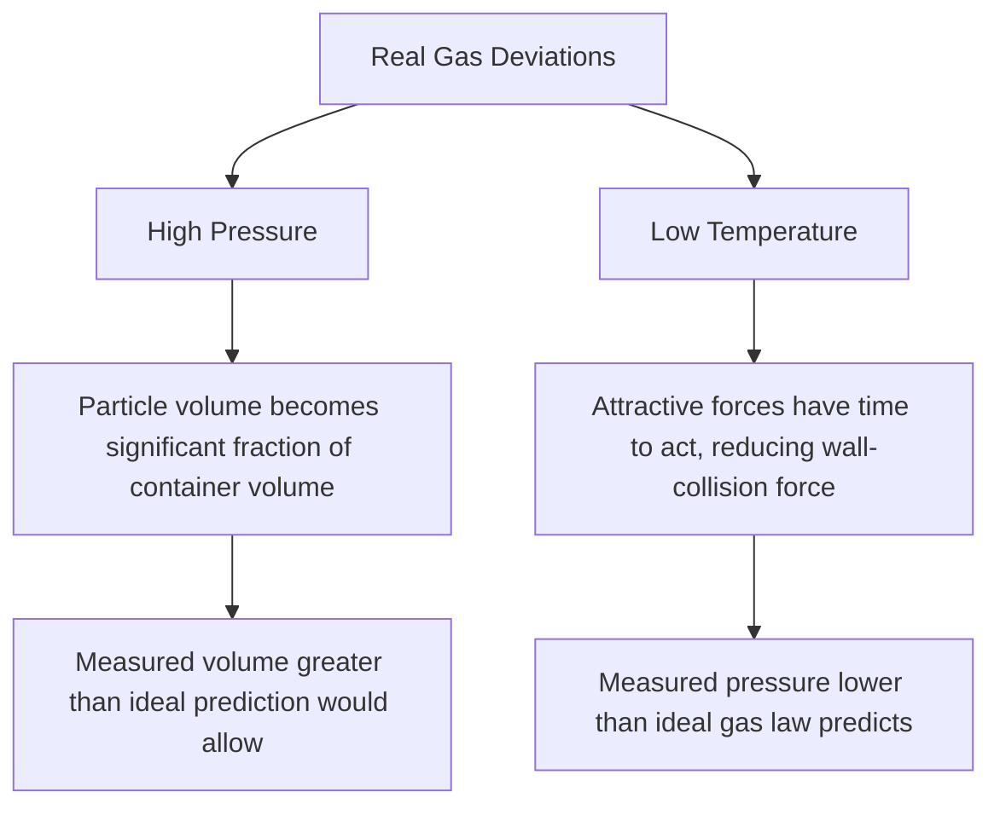

## Real Gases and Deviations from Ideal Behavior

### Overview

Real gases deviate from the predictions of the ideal gas law because actual gas particles occupy finite volume and experience intermolecular attractive/repulsive forces — two factors the ideal gas model explicitly ignores. Understanding these deviations requires examining the specific conditions that amplify them and the quantitative corrections developed to account for real gas behavior.

**Key Points**

- The ideal gas law assumes zero particle volume and zero intermolecular forces — assumptions that break down under certain conditions
- Deviations from ideality are most pronounced at **high pressure** and **low temperature**
- The van der Waals equation is the most common correction, introducing two empirical, gas-specific constants
- No real gas is perfectly ideal, but many gases (especially small, nonpolar molecules at moderate conditions) approximate ideal behavior closely enough for practical calculations

### Why Real Gases Deviate: Two Root Causes

**Cause 1 — Finite Molecular Volume**

At high pressure, gas particles are forced close together, and the actual volume occupied by the particles themselves becomes a significant fraction of the total container volume — no longer negligible as the ideal gas model assumes. This causes the *actual* available volume for particle movement to be less than the *measured* container volume, resulting in the observed pressure/volume behavior deviating from ideal predictions.

**Cause 2 — Intermolecular Attractive Forces**

At low temperature, particles move more slowly (lower average kinetic energy), allowing intermolecular attractive forces (London dispersion, dipole-dipole, hydrogen bonding) sufficient time to influence particle trajectories during near-collisions. These attractive forces pull particles slightly toward each other just before collision with the container wall, softening the force of impact and causing measured pressure to be *lower* than the ideal gas law would predict.

### The Compressibility Factor (Z)

The compressibility factor quantifies the degree of deviation from ideal behavior:

$$Z = \frac{PV}{nRT}$$

**Key Points**

- For an ideal gas, $Z = 1$ under all conditions
- $Z < 1$ indicates that attractive intermolecular forces dominate, causing the gas to be more compressible than ideal behavior predicts (common at moderate pressure)
- $Z > 1$ indicates that finite molecular volume (repulsive/excluded-volume effects) dominates, causing the gas to be less compressible than ideal (common at very high pressure)
- Real gases typically show $Z < 1$ at moderate pressures (attraction dominates) transitioning to $Z > 1$ at very high pressures (volume exclusion dominates)

### The Van der Waals Equation

$$\left(P + \frac{an^2}{V^2}\right)(V - nb) = nRT$$

**Key Points**

- The term $\frac{an^2}{V^2}$ is added to the measured pressure to correct for the pressure-reducing effect of intermolecular attractions (the constant $a$ reflects the strength of these attractions for a given gas)
- The term $nb$ is subtracted from the measured volume to correct for the volume excluded by the finite size of gas particles (the constant $b$ reflects the effective molecular volume)
- Both $a$ and $b$ are empirically determined, gas-specific constants, typically tabulated in reference sources
- Larger $a$ values correspond to gases with stronger intermolecular attractive forces (e.g., polar molecules, larger/more polarizable molecules); larger $b$ values correspond to physically larger molecules

**Example — Comparing van der Waals constants**

| Gas | $a$ (L²·atm/mol²) | $b$ (L/mol) | Notes |
| --- | --- | --- | --- |
| He | 0.034 | 0.0237 | Very small, weakly attractive — near-ideal behavior |
| H₂ | 0.244 | 0.0266 | Small, weakly attractive |
| N₂ | 1.39 | 0.0391 | Moderate |
| CO₂ | 3.59 | 0.0427 | Larger, more polarizable, stronger LDFs |
| H₂O (vapor) | 5.46 | 0.0305 | Strong hydrogen bonding drives high $a$ |

[Unverified: exact tabulated values vary slightly depending on the reference source and measurement conditions]

Gases with larger $a$ values (like H₂O vapor and CO₂) show more pronounced deviation from ideal behavior at a given set of conditions compared to gases with small $a$ values (like He and H₂), because their stronger intermolecular attractions cause more significant pressure reduction relative to ideal predictions.

### Conditions Favoring Ideal Behavior

**Key Points**

- **High temperature**: particles move fast enough that intermolecular attractive forces have negligible time to act during near-collisions
- **Low pressure**: particles are spread far apart, making both particle volume and intermolecular forces negligible relative to the large intermolecular distances
- Small, nonpolar molecules (e.g., He, H₂, Ne) approximate ideal behavior more closely than large or polar molecules under the same conditions, due to weaker intermolecular attractions and smaller molecular volume

### Compressibility Factor vs. Pressure — General Behavior Pattern

At a fixed temperature, as pressure increases from very low values:

1. $Z$ starts near 1 (ideal-like behavior at low pressure)
2. $Z$ decreases below 1 as pressure increases moderately (attractive forces begin to dominate, gas is more compressible than ideal)
3. $Z$ reaches a minimum, then increases back above 1 at very high pressure (excluded volume effects begin to dominate, gas is less compressible than ideal)

<svg xmlns="http://www.w3.org/2000/svg" viewBox="0 0 500 240" font-family="sans-serif">
<text x="20" y="20" font-size="14" font-weight="bold">Compressibility Factor (Z) vs Pressure (svg_diagram)</text>
<line x1="50" y1="200" x2="470" y2="200" stroke="#333" stroke-width="2" />
<line x1="50" y1="200" x2="50" y2="30" stroke="#333" stroke-width="2" />
<text x="240" y="225" font-size="11">Pressure</text>
<text x="15" y="115" font-size="11" transform="rotate(-90,15,115)">Z = PV/nRT</text>
<line x1="50" y1="110" x2="470" y2="110" stroke="#aaa" stroke-width="1" stroke-dasharray="4,3" />
<text x="420" y="105" font-size="10" fill="#888">Z = 1 (ideal)</text>
<path d="M50,110 Q150,150 220,160 Q320,130 470,60" fill="none" stroke="#4a6fa5" stroke-width="2.5" />
<text x="150" y="180" font-size="10" fill="#4a6fa5">Z &lt; 1: attraction dominates</text>
<text x="330" y="55" font-size="10" fill="#4a6fa5">Z &gt; 1: excluded volume dominates</text>
</svg>

### Critical Temperature and Liquefaction

**Key Points**

- The **critical temperature** ($T_c$) is the temperature above which a gas cannot be liquefied regardless of applied pressure, because above this temperature, molecular kinetic energy always exceeds the intermolecular attractive forces needed to condense into a liquid phase
- Gases with stronger intermolecular forces (larger van der Waals $a$ constant) tend to have higher critical temperatures, since more thermal energy is required to overcome the stronger attractions
- This connects real gas behavior directly to phase transition and intermolecular force concepts

**Example**

CO₂ has a relatively accessible critical temperature ($T_c \approx 31°C$), which is why CO₂ can be liquefied at room-temperature-accessible pressures — relevant to applications like supercritical CO₂ extraction. In contrast, He has an extremely low critical temperature ($T_c \approx -268°C$), reflecting its very weak intermolecular attractions and requiring extreme cooling for liquefaction.

### Common Pitfalls

- Assuming all gases deviate from ideality to the same degree — deviation magnitude depends strongly on molecular size, polarity, and polarizability (van der Waals $a$ and $b$ values)
- Forgetting that both high pressure AND low temperature are needed to produce the most significant deviations — a gas at low pressure but very low temperature, or high pressure but very high temperature, may still behave close to ideally in certain regimes
- Misinterpreting $Z < 1$ or $Z > 1$ without connecting it to the underlying physical cause (attractive forces vs. excluded volume)
- Applying the ideal gas law uncritically near a gas's condensation point or critical point, where deviations are most severe

### Related Topics

- Gas laws and kinetic molecular theory
- Van der Waals constants and their physical interpretation
- Phase diagrams, critical point, and supercritical fluids
- Intermolecular forces (London dispersion, dipole-dipole, hydrogen bonding)
- Liquefaction of gases and industrial applications
- Compressibility factor charts and generalized correlations