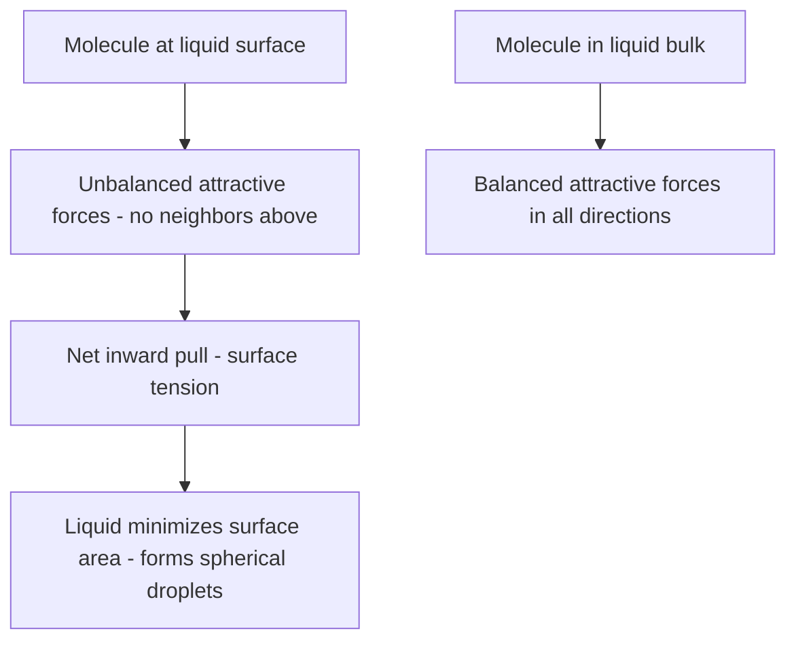

## Properties of Liquids

### Overview

Liquids represent an intermediate state of matter between gases and solids: particles are held close together by intermolecular forces (unlike gases) but retain enough kinetic energy to move past one another (unlike solids). This combination of cohesive attraction and particle mobility gives rise to the characteristic macroscopic properties of liquids.

**Key Points**

- Liquid particles are in close contact but not fixed in position, allowing liquids to flow and take the shape of their container
- Liquids have a definite volume but no definite shape, distinguishing them from both gases (neither definite volume nor shape) and solids (both definite volume and shape)
- Nearly all liquid properties trace back to the strength and type of intermolecular forces (IMFs) present: London dispersion, dipole-dipole, hydrogen bonding, and ion-dipole interactions
- Liquids are significantly less compressible than gases because particles are already in close contact, with minimal empty space to compress further

### Viscosity

**Definition**

Viscosity is a liquid's resistance to flow, arising from internal friction between molecules as they slide past one another.

**Key Points**

- Stronger intermolecular forces increase viscosity, since molecules resist sliding past each other when strongly attracted
- Larger, more complex molecular shapes (especially long chains capable of entanglement) generally increase viscosity
- Viscosity decreases with increasing temperature, since higher kinetic energy allows molecules to overcome intermolecular attractions more easily and move past each other with less resistance

**Example**

Glycerol (which has three –OH groups capable of extensive hydrogen bonding) is significantly more viscous than water (which has fewer hydrogen-bonding sites per molecule), and both are far more viscous than nonpolar hexane, which relies only on weaker London dispersion forces.

### Surface Tension

**Definition**

Surface tension is the energy required to increase the surface area of a liquid, arising because molecules at the surface experience a net inward pull (since they lack neighboring molecules on the outward side to balance attractive forces), unlike molecules in the bulk liquid that experience balanced attraction in all directions.

**Key Points**

- Stronger intermolecular forces produce higher surface tension
- Surface tension causes liquids to minimize their surface area, producing spherical droplets (a sphere has the minimum surface area for a given volume)
- Surface tension decreases with increasing temperature, as greater molecular kinetic energy partially overcomes the cohesive forces responsible for the inward pull

**Example**

Water has unusually high surface tension (≈72 mN/m at 20°C) relative to its small molecular size, attributable to its extensive hydrogen bonding network. This high surface tension allows small insects (e.g., water striders) to walk on water's surface, and causes water to form beaded droplets on non-wetting surfaces.

### Capillary Action

**Definition**

Capillary action is the ability of a liquid to flow within narrow spaces (such as thin tubes or porous materials) without the assistance of external forces like gravity, resulting from the balance between two competing forces:

- **Cohesion**: attractive forces between like liquid molecules (responsible for surface tension)
- **Adhesion**: attractive forces between liquid molecules and the surface of the container/tube

**Key Points**

- When adhesive forces exceed cohesive forces (e.g., water in a glass tube), the liquid "wets" the surface, rises in the tube, and forms a concave meniscus
- When cohesive forces exceed adhesive forces (e.g., mercury in a glass tube), the liquid does not wet the surface, is depressed in the tube, and forms a convex meniscus
- Capillary rise height increases with higher surface tension and narrower tube diameter, and decreases with higher liquid density

**Example**

Water rises visibly in a thin glass capillary tube due to strong adhesive forces between polar water molecules and the polar –OH groups on the glass surface, combined with water's high cohesive surface tension. This same principle drives water transport upward through narrow xylem vessels in plants.

### Vapor Pressure

**Definition**

Vapor pressure is the pressure exerted by a gas in dynamic equilibrium with its liquid phase in a closed container, arising from the continuous evaporation of the most energetic surface molecules and simultaneous condensation of gas-phase molecules back into the liquid.

**Key Points**

- Vapor pressure increases with temperature, since higher temperature increases the fraction of molecules with sufficient kinetic energy to escape the liquid surface (overcome intermolecular attractions)
- Liquids with weaker intermolecular forces have higher vapor pressure at a given temperature ("more volatile") because less energy is needed for molecules to escape into the gas phase
- The **normal boiling point** is defined as the temperature at which a liquid's vapor pressure equals standard atmospheric pressure (1 atm)
- The relationship between vapor pressure and temperature is described quantitatively by the Clausius-Clapeyron equation

$$\ln\left(\frac{P_2}{P_1}\right) = -\frac{\Delta H_{vap}}{R}\left(\frac{1}{T_2}-\frac{1}{T_1}\right)$$

**Example**

Diethyl ether (weak dipole-dipole and LDF interactions only) has a high vapor pressure and low boiling point (~34.6°C), evaporating rapidly at room temperature. Water (extensive hydrogen bonding) has a much lower vapor pressure at the same temperature and a correspondingly higher boiling point (100°C), since significantly more energy is needed to overcome its stronger intermolecular forces.

### Boiling Point and Its Dependence on Intermolecular Forces

**Key Points**

- Boiling occurs when a liquid's vapor pressure equals the external (usually atmospheric) pressure, allowing vaporization to occur throughout the bulk liquid, not just at the surface
- Boiling point increases with stronger intermolecular forces (higher $\Delta H_{vap}$ required)
- Boiling point decreases at reduced external pressure (e.g., water boils below 100°C at high altitude, where atmospheric pressure is lower)

### Heat of Vaporization ($\Delta H_{vap}$)

**Definition**

The energy required to convert one mole of liquid into vapor at constant temperature and pressure, directly reflecting the total strength of intermolecular forces that must be overcome.

**Key Points**

- Larger $\Delta H_{vap}$ values correspond to stronger intermolecular forces
- $\Delta H_{vap}$ is always positive (endothermic process); the reverse process (condensation) releases an equal amount of energy ($\Delta H_{cond} = -\Delta H_{vap}$)

**Example**

Water's heat of vaporization (≈40.7 kJ/mol) is substantially higher than that of comparably sized nonpolar molecules, reflecting the extensive hydrogen bonding network that must be disrupted for water molecules to enter the gas phase.

### Summary Table: How Intermolecular Force Strength Affects Liquid Properties

| Property | Effect of Stronger IMFs |
| --- | --- |
| Viscosity | Increases |
| Surface tension | Increases |
| Vapor pressure (at given T) | Decreases |
| Boiling point | Increases |
| Heat of vaporization | Increases |
| Volatility | Decreases |

### Common Pitfalls

- Confusing surface tension (a bulk liquid surface property) with viscosity (a resistance-to-flow property) — both are increased by stronger IMFs but describe different physical phenomena
- Assuming vapor pressure and boiling point are unrelated — they are directly connected: boiling point is the specific temperature at which vapor pressure reaches the external pressure
- Forgetting that boiling point depends on external (atmospheric) pressure, not just the liquid's inherent properties — this explains altitude-dependent boiling point changes
- Misinterpreting capillary action's meniscus shape — assuming all liquids form a concave meniscus, when the shape actually depends on the relative strength of cohesive vs. adhesive forces for that specific liquid-surface pairing

### Related Topics

- Intermolecular forces (London dispersion, dipole-dipole, hydrogen bonding)
- Phase diagrams and phase transitions
- Clausius-Clapeyron equation and vapor pressure calculations
- Gas laws and kinetic molecular theory
- Solutions and solubility ("like dissolves like")
- Properties of solids and crystal structures