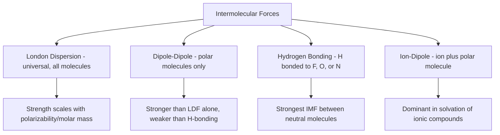

## Intermolecular Forces

### Definition

Intermolecular forces (IMFs) are the attractive (and occasionally repulsive) forces that act **between** separate molecules or ions, as opposed to the intramolecular forces (covalent, ionic, metallic bonds) that hold atoms together within a single molecule. IMFs govern bulk physical properties such as boiling point, melting point, viscosity, surface tension, and solubility.

**Key Points**

- IMFs are collectively referred to as **van der Waals forces** in a broad sense (London dispersion, dipole-dipole), though hydrogen bonding and ion-dipole forces are often treated as distinct, stronger categories
- IMFs are substantially weaker than intramolecular (covalent/ionic) bonds, typically by one to two orders of magnitude
- All types of IMFs present in a substance act simultaneously; a polar, hydrogen-bonding molecule still experiences London dispersion and dipole-dipole forces in addition to hydrogen bonding
- The relative strength of different IMF types generally follows: ion-dipole > hydrogen bonding > dipole-dipole > London dispersion [Inference: this is a typical/average ordering; strong London dispersion forces in large, highly polarizable molecules can exceed weak dipole-dipole forces in smaller polar molecules]

### London Dispersion Forces (LDFs)

**Key Points**

- Present in **all** atoms and molecules, including nonpolar species and noble gases — the only IMF universally present
- Arise from instantaneous, temporary dipoles caused by momentary uneven electron distribution around a nucleus, which induces a corresponding temporary dipole in a neighboring particle
- Strength increases with molecular size, surface area, and **polarizability** (the ease with which an electron cloud can be distorted) — larger, more electron-rich molecules have stronger LDFs
- Molecular shape matters: elongated/linear molecules with greater surface contact area generally exhibit stronger LDFs than compact, spherical isomers of the same molar mass

**Example**

The boiling points of the halogens increase down the group (F₂: −188°C, Cl₂: −34°C, Br₂: 59°C, I₂: 184°C) despite all being nonpolar diatomic molecules with identical bonding patterns, because increasing molecular size and electron count down the group increases polarizability and thus LDF strength.

### Dipole-Dipole Interactions

**Key Points**

- Occur between molecules possessing a permanent dipole moment (polar molecules)
- The partial positive end ($\delta^+$) of one polar molecule is attracted to the partial negative end ($\delta^-$) of a neighboring polar molecule
- Present in addition to London dispersion forces, which are always simultaneously active
- Generally weaker than hydrogen bonding but stronger than LDFs alone for molecules of comparable size

**Example**

Acetone (a polar molecule due to its C=O bond) has a higher boiling point (56°C) than nonpolar butane of similar molar mass (−1°C), because acetone experiences dipole-dipole attractions in addition to LDFs, while butane relies on LDFs alone.

### Hydrogen Bonding

**Definition**

A particularly strong subtype of dipole-dipole interaction that occurs specifically when hydrogen is covalently bonded to a small, highly electronegative atom (nitrogen, oxygen, or fluorine — often remembered via the mnemonic "F, O, N") and is attracted to a lone pair on a nearby N, O, or F atom of another molecule.

**Key Points**

- Requires both: (1) a hydrogen atom directly bonded to N, O, or F, and (2) a nearby N, O, or F atom bearing a lone pair to accept the interaction
- Substantially stronger than typical dipole-dipole forces due to the combination of high electronegativity and the very small size of N/O/F, which allows very close approach and strong electrostatic attraction
- Responsible for numerous anomalous properties, including water's unusually high boiling point, ice's lower density than liquid water, and the structural stability of DNA's double helix and protein secondary structures

**Example**

Comparing Group 15–17 hydrides reveals hydrogen bonding's dramatic effect: NH₃ (bp −33°C), H₂O (bp 100°C), and HF (bp 19.5°C) all boil at significantly higher temperatures than their heavier group analogues (PH₃ bp −87°C, H₂S bp −60°C, HCl bp −85°C), despite having smaller molar masses, because only the first-row hydrides can form hydrogen bonds.

### Ion-Dipole Forces

**Key Points**

- Occur between a full ion (cation or anion) and a polar molecule with a permanent dipole
- Generally the strongest type of intermolecular force among common IMF categories, since it involves a full formal charge rather than partial charges alone
- Central to the process of solvation/hydration, where solvent dipoles surround and stabilize dissolved ions

**Example**

When NaCl dissolves in water, water's partially negative oxygen atoms orient toward Na⁺ cations, while water's partially positive hydrogen atoms orient toward Cl⁻ anions — this ion-dipole attraction is the primary driving force that overcomes the ionic lattice energy holding NaCl together in its solid form.

### Comparative Strength Table

| IMF Type | Approximate Energy Range | Requires |
| --- | --- | --- |
| Ion-dipole | 40–600 kJ/mol (concentration/charge dependent) | Ion + polar molecule |
| Hydrogen bonding | 10–40 kJ/mol | H bonded to N/O/F + nearby N/O/F |
| Dipole-dipole | 3–4 kJ/mol | Two polar molecules |
| London dispersion | 0.05–40 kJ/mol (scales with polarizability) | Any atoms/molecules (universal) |

[Unverified: exact energy ranges vary by source and specific molecular system; note that strong LDFs in large molecules can overlap with or exceed weak dipole-dipole/hydrogen-bonding energies in small molecules]

### Effect on Macroscopic Physical Properties

**Key Points**

- **Boiling/melting point**: increases with stronger overall IMFs, since more energy is needed to separate molecules into the gas phase or disrupt the ordered solid lattice
- **Viscosity**: increases with stronger IMFs due to greater internal resistance to molecular flow
- **Surface tension**: increases with stronger IMFs due to greater net inward attractive force at the liquid surface
- **Vapor pressure**: decreases with stronger IMFs, since fewer molecules have sufficient energy to escape into the gas phase at a given temperature
- **Solubility**: governed by "like dissolves like" — substances with similar, compatible IMF types dissolve well in each other (polar dissolves polar via dipole-dipole/H-bonding; nonpolar dissolves nonpolar via LDFs)

### Identifying IMF Types — Decision Procedure

1. Determine if the substance is ionic (contains a cation and anion) — if so, and dissolved in/mixed with a polar solvent, consider ion-dipole forces
2. Determine molecular polarity via Lewis structure and VSEPR geometry
3. Check specifically for H directly bonded to N, O, or F — if present, hydrogen bonding applies (in addition to dipole-dipole and LDFs)
4. If polar but no qualifying H-bonding arrangement, dipole-dipole forces apply (in addition to LDFs)
5. London dispersion forces are always present, regardless of the outcomes of steps 1–4

### Common Pitfalls

- Assuming nonpolar molecules experience no intermolecular forces at all — LDFs are always present, even in noble gases and nonpolar molecules like CH₄ or N₂
- Requiring only "N, O, or F present anywhere in the molecule" for hydrogen bonding, rather than correctly requiring H directly bonded to N, O, or F specifically
- Forgetting that all applicable IMF types act simultaneously in a given substance, rather than treating them as mutually exclusive categories
- Overgeneralizing the strength ordering (ion-dipole > H-bond > dipole-dipole > LDF) without recognizing that molecular size/polarizability can shift relative strengths in specific cases

### Related Topics

- Intermolecular versus intramolecular forces
- Properties of liquids (viscosity, surface tension, vapor pressure)
- Molecular polarity and dipole moment
- Solutions and solubility ("like dissolves like")
- Phase diagrams and phase transitions
- Real gases and deviations from ideal behavior