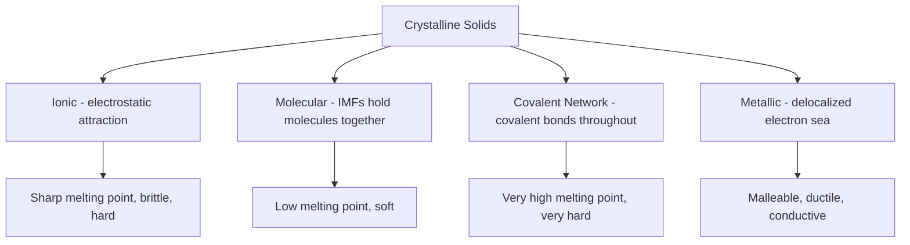

## Crystalline and Amorphous Solids

### Overview

Solids are classified into two broad structural categories based on the degree of long-range order in the arrangement of their constituent particles: **crystalline solids**, which possess a highly ordered, repeating three-dimensional structure, and **amorphous solids**, which lack long-range order and instead exhibit a more random, disordered particle arrangement.

**Key Points**

- Crystalline solids have particles (atoms, ions, or molecules) arranged in a repeating, geometrically regular pattern called a crystal lattice, extending throughout the entire solid
- Amorphous solids lack this long-range repeating order, though they may still exhibit short-range order between immediately neighboring particles
- The degree of structural order directly determines many macroscopic physical properties, including melting behavior, mechanical properties, and optical clarity

### Crystalline Solids

**Key Points**

- Characterized by a well-defined, repeating **unit cell** — the smallest repeating structural unit that, when translated in three dimensions, generates the entire crystal lattice
- Exhibit **sharp, well-defined melting points**: the solid transitions to liquid at a single, precise temperature, because the ordered lattice requires a specific amount of energy to fully disrupt
- Often display characteristic flat faces and well-defined geometric shapes at the macroscopic level, reflecting the underlying microscopic lattice symmetry
- Many crystalline solids exhibit **anisotropy**: physical properties (e.g., refractive index, electrical conductivity, cleavage) differ depending on the direction measured, due to the directional nature of the repeating lattice structure

### Classification of Crystalline Solids by Bonding Type

| Type | Lattice Particles | Bonding | Typical Properties | Examples |
| --- | --- | --- | --- | --- |
| Ionic | Cations and anions | Electrostatic (ionic) | Hard, brittle, high melting point, poor solid-state conductivity, good molten/dissolved conductivity | NaCl, CaF₂ |
| Molecular | Discrete molecules | IMFs (LDF, dipole-dipole, H-bonding) hold molecules in lattice; covalent bonds within molecules | Soft, low melting point, poor conductivity | Ice (H₂O), dry ice (CO₂), sucrose |
| Covalent Network | Atoms | Covalent bonds throughout entire lattice | Very hard, very high melting point, often poor conductivity (exceptions exist) | Diamond, quartz (SiO₂), graphite |
| Metallic | Metal cations + delocalized electrons | Metallic bonding | Malleable, ductile, good conductivity, variable hardness/melting point | Fe, Cu, Na |

**Example: Diamond vs. graphite (both covalent network, both pure carbon)**

Diamond features each carbon covalently bonded to four neighbors in a rigid three-dimensional tetrahedral network (sp³ hybridized), making it exceptionally hard with a very high melting point and poor electrical conductivity. Graphite features carbon atoms covalently bonded within two-dimensional sp² hybridized sheets, with only weak London dispersion forces holding the sheets together; this allows the sheets to slide past each other, making graphite soft and useful as a lubricant, while its delocalized π electron system (from unhybridized p-orbitals) makes it electrically conductive within the sheet plane — unlike diamond.

### Amorphous Solids

**Key Points**

- Lack long-range repeating order; particle arrangement resembles a "frozen" or randomly arranged structure, sometimes described as a supercooled liquid with greatly increased viscosity
- Do NOT exhibit a sharp melting point — instead, they soften gradually over a range of temperatures (a **glass transition temperature**, $T_g$, rather than a discrete melting point), because the disordered structure requires varying amounts of energy to mobilize different regions
- Generally **isotropic**: physical properties are typically uniform in all directions, since there is no consistent directional lattice structure
- When fractured, amorphous solids typically produce curved, irregular (conchoidal) fracture surfaces, rather than the flat cleavage planes typical of crystalline solids

**Example**

Ordinary glass (silicate glass) is a classic amorphous solid: rather than melting sharply at one temperature, it softens gradually over a range as temperature increases, transitioning smoothly from rigid solid to viscous liquid without a sharp phase-transition point. This is in direct contrast to crystalline quartz (also composed of SiO₂ but in an ordered lattice), which has a sharp, well-defined melting point (~1670°C). [Unverified: precise melting point value varies by source and quartz polymorph]

### Comparative Table: Crystalline vs. Amorphous Solids

| Property | Crystalline | Amorphous |
| --- | --- | --- |
| Particle arrangement | Long-range, repeating order | Disordered, no long-range order |
| Melting behavior | Sharp, well-defined melting point | Gradual softening over a temperature range (glass transition) |
| Anisotropy | Often anisotropic (direction-dependent properties) | Typically isotropic (uniform properties in all directions) |
| Fracture pattern | Flat cleavage planes along lattice directions | Curved, irregular (conchoidal) fracture |
| Macroscopic shape | Well-defined geometric faces/crystal habit | Irregular, no characteristic geometric faces |
| Examples | Table salt (NaCl), diamond, quartz, ice | Glass, rubber, most plastics, amorphous silicon |

### X-Ray Diffraction as a Distinguishing Technique

**Key Points**

- Crystalline solids produce sharp, discrete diffraction patterns when exposed to X-rays, because the regularly repeating lattice planes diffract X-rays constructively at specific, well-defined angles (governed by Bragg's Law)
- Amorphous solids produce broad, diffuse diffraction patterns (rather than sharp peaks), reflecting the absence of long-range periodic structure
- X-ray diffraction (XRD) is therefore a standard experimental method for distinguishing crystalline materials from amorphous ones and for determining crystal structure/unit cell parameters

$$n\lambda = 2d\sin\theta \quad \text{(Bragg's Law)}$$

Where $n$ is an integer, $\lambda$ is X-ray wavelength, $d$ is interplanar spacing, and $\theta$ is the angle of incidence.

### Polymorphism and Amorphous-Crystalline Transitions

**Key Points**

- A single chemical substance can sometimes exist in both crystalline and amorphous forms, depending on how it is processed (e.g., rate of cooling from the liquid/melt state)
- Rapid cooling often favors amorphous solid formation, since particles do not have sufficient time to organize into an ordered lattice before becoming immobilized
- Slow cooling generally favors crystalline solid formation, allowing particles time to settle into the lowest-energy, ordered lattice arrangement
- Some materials (e.g., certain polymers, silicon) can exist as either crystalline or amorphous solids depending on processing conditions, with different physical properties resulting from each form

**Example**

Rapidly cooled molten silica (SiO₂) forms amorphous glass, while slowly cooled or naturally formed SiO₂ under geological conditions forms crystalline quartz. Both share identical chemical composition and identical covalent Si–O bonding at the local level, but differ dramatically in bulk structural order and resulting physical properties.

### Common Pitfalls

- Assuming all solids are crystalline by default — many common materials (glass, most plastics, rubber) are amorphous
- Expecting amorphous solids to show a sharp melting point like crystalline solids — amorphous materials soften gradually across a temperature range instead
- Confusing "amorphous" with "liquid" — amorphous solids are still rigid solids at room temperature; they simply lack long-range particle order, unlike liquids which have short-range order only and flow freely
- Assuming anisotropy/isotropy always perfectly distinguishes crystalline from amorphous — while this is a useful general rule, some crystalline materials (e.g., cubic crystal systems) can be nearly isotropic for certain properties [Inference: exceptions depend on specific crystal symmetry class]

### Related Topics

- Unit cells and crystal lattice types (cubic, tetragonal, hexagonal, etc.)
- Metallic bonding and metallic crystal structures (BCC, FCC, HCP)
- Ionic bonding and lattice energy
- Covalent network solids (diamond, graphite, quartz)
- X-ray crystallography and Bragg's Law
- Phase transitions and glass transition temperature