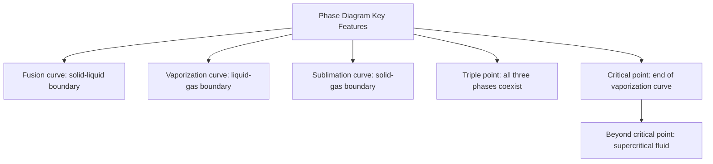
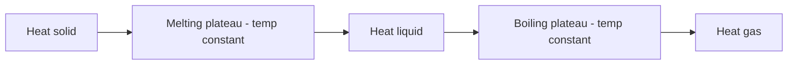

## Phase Diagrams and Phase Transitions

### Overview

A phase diagram is a graphical representation of the physical states (solid, liquid, gas) a substance adopts as a function of temperature and pressure, showing the boundary conditions under which phase transitions occur. Phase transitions are the physical processes by which a substance converts between these states, each associated with a characteristic energy change.

**Key Points**

- Phase diagrams plot pressure (typically y-axis) against temperature (typically x-axis), with distinct regions representing the solid, liquid, and gas phases
- The lines separating regions represent conditions of phase equilibrium, where two phases coexist simultaneously
- Every point on a phase diagram represents a unique combination of temperature and pressure, corresponding to one stable phase (or a boundary where two/three phases coexist)
- Phase diagrams are substance-specific — different compounds have distinctly shaped diagrams reflecting their unique intermolecular forces and molecular properties

### Regions and Boundary Lines of a Phase Diagram

**Key Points**

- **Solid region**: low temperature, generally high pressure
- **Liquid region**: intermediate temperature, generally moderate-to-high pressure
- **Gas (vapor) region**: high temperature, generally low pressure
- **Fusion (melting) curve**: boundary between solid and liquid regions, representing the melting/freezing point at each pressure
- **Vaporization curve**: boundary between liquid and gas regions, representing the boiling/condensation point at each pressure
- **Sublimation curve**: boundary between solid and gas regions, representing conditions under which a solid converts directly to gas (or vice versa, deposition) without passing through the liquid phase

### The Triple Point

**Definition**

The triple point is the unique combination of temperature and pressure at which all three phases (solid, liquid, and gas) coexist simultaneously in equilibrium.

**Key Points**

- Represented as a single specific point on the phase diagram where the fusion, vaporization, and sublimation curves all intersect
- Each substance has exactly one triple point, occurring at a unique, substance-specific temperature and pressure
- The triple point of water occurs at 0.01°C and 611.657 Pa (≈0.006 atm), and is used as a precise reference point in defining the Kelvin temperature scale [Unverified: precise defining values have been subject to periodic SI redefinition]

### The Critical Point

**Definition**

The critical point marks the end of the liquid-gas equilibrium (vaporization) curve, beyond which the distinction between liquid and gas phases disappears entirely.

**Key Points**

- Defined by a **critical temperature** ($T_c$) and **critical pressure** ($P_c$)
- Above the critical temperature, no amount of applied pressure can liquefy the gas — the substance exists as a **supercritical fluid**, exhibiting properties intermediate between a liquid and a gas
- Supercritical fluids have practical applications, such as supercritical CO₂ used as a solvent in decaffeination processes and other extraction applications

### General Phase Diagram Shape

<svg xmlns="http://www.w3.org/2000/svg" viewBox="0 0 520 320" font-family="sans-serif">
<text x="20" y="20" font-size="14" font-weight="bold">Generic Phase Diagram (svg_diagram)</text>
<line x1="70" y1="280" x2="470" y2="280" stroke="#333" stroke-width="2" />
<line x1="70" y1="280" x2="70" y2="40" stroke="#333" stroke-width="2" />
<text x="250" y="305" font-size="11">Temperature</text>
<text x="20" y="160" font-size="11" transform="rotate(-90,20,160)">Pressure</text>
<path d="M100,280 Q130,150 170,90" fill="none" stroke="#333" stroke-width="2" />
<text x="105" y="200" font-size="10">Sublimation</text>
<line x1="170" y1="90" x2="200" y2="55" stroke="#333" stroke-width="2" />
<text x="130" y="70" font-size="10">Fusion</text>
<path d="M170,90 Q280,150 380,240" fill="none" stroke="#333" stroke-width="2" />
<text x="280" y="170" font-size="10">Vaporization</text>
<circle cx="170" cy="90" r="4" fill="#8b0000" />
<text x="178" y="88" font-size="10" fill="#8b0000">Triple Point</text>
<circle cx="380" cy="240" r="4" fill="#4a6fa5" />
<text x="330" y="255" font-size="10" fill="#4a6fa5">Critical Point</text>
<text x="400" y="220" font-size="10" fill="#555">Supercritical Fluid</text>

<text x="100" y="100" font-size="11" font-weight="bold">Solid</text>

<text x="260" y="220" font-size="11" font-weight="bold">Liquid</text>

<text x="380" y="270" font-size="11" font-weight="bold">Gas</text>

</svg>

### The Anomalous Phase Diagram of Water

**Key Points**

- Unlike most substances, water's fusion (melting) curve has a **negative slope** (tilts left/backward), meaning increased pressure lowers the melting point of ice
- This anomaly arises because ice (solid water) is **less dense** than liquid water, due to the open hexagonal hydrogen-bonding lattice structure of ice — a highly unusual property, since most solids are denser than their corresponding liquids
- Practical consequence: applying pressure to ice at a temperature just below 0°C can melt it, since the denser liquid phase becomes favored under increased pressure

**Example**

Most substances (e.g., CO₂) have a fusion curve with a positive slope, since their solid phase is denser than the liquid phase, so increasing pressure favors the solid (higher-density) phase and thus raises the melting point. Water's negative-slope fusion curve is the exception, reflecting ice's lower density relative to liquid water.

### Phase Transitions — Definitions and Energy Changes

| Transition | Direction | Energy Change |
| --- | --- | --- |
| Melting (fusion) | Solid → Liquid | Endothermic |
| Freezing | Liquid → Solid | Exothermic |
| Vaporization (boiling/evaporation) | Liquid → Gas | Endothermic |
| Condensation | Gas → Liquid | Exothermic |
| Sublimation | Solid → Gas | Endothermic |
| Deposition | Gas → Solid | Exothermic |

**Key Points**

- Phase transitions occur at constant temperature for a pure substance — energy added or removed during a phase change alters the phase, not the temperature, until the transition is complete
- The energy absorbed or released during a phase transition is quantified by the corresponding enthalpy of transition ($\Delta H_{fus}$, $\Delta H_{vap}$, $\Delta H_{sub}$)
- $\Delta H_{sub} = \Delta H_{fus} + \Delta H_{vap}$ (Hess's Law application, since sublimation is thermodynamically equivalent to melting followed by vaporization)

### Heating Curves

A heating curve plots temperature vs. heat added at constant pressure, showing flat plateaus during phase transitions (where all added energy goes into overcoming intermolecular forces rather than increasing kinetic energy/temperature) and sloped regions during single-phase heating (where added energy increases temperature/kinetic energy within one phase).

### Common Pitfalls

- Confusing the fusion curve's slope direction — assuming all substances behave like water (negative slope) rather than recognizing water's negative slope is the unusual exception, not the rule
- Assuming temperature continues rising during a phase transition — temperature remains constant (plateaus on a heating curve) throughout a phase change at constant pressure
- Forgetting that the critical point represents the disappearance of the liquid-gas distinction, not simply "very high temperature and pressure liquid/gas"
- Misplacing the triple point as if it were the same as standard melting/boiling points — the triple point occurs at a specific, often non-atmospheric pressure unique to each substance

### Related Topics

- Properties of liquids (vapor pressure, boiling point)
- Real gases and critical temperature
- Intermolecular forces and their effect on phase behavior
- Clausius-Clapeyron equation
- Crystalline and amorphous solids
- Thermodynamics of phase transitions (enthalpy, entropy)