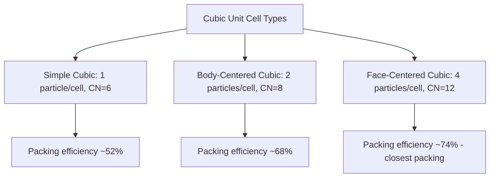

## Unit Cells and Crystal Lattices

### Definition

A crystal lattice is the ordered, repeating three-dimensional arrangement of particles (atoms, ions, or molecules) throughout a crystalline solid. A unit cell is the smallest repeating structural unit that, when translated (repeated) in all three spatial directions with no gaps or overlaps, generates the entire crystal lattice.

**Key Points**

- The unit cell is defined by its edge lengths ($a$, $b$, $c$) and the angles between edges ($\alpha$, $\beta$, $\gamma$)
- Lattice points represent the positions of particles (or repeating structural motifs) within the unit cell
- Seven fundamental crystal systems exist (cubic, tetragonal, orthorhombic, monoclinic, triclinic, hexagonal, rhombohedral), classified by unit cell edge length and angle relationships; cubic systems are the most commonly emphasized in introductory chemistry
- The entire macroscopic crystal is generated by repeating the unit cell indefinitely in three dimensions

### The Three Cubic Unit Cell Types

Cubic unit cells (equal edge lengths, all 90° angles) are the most commonly studied due to their relative geometric simplicity and relevance to many common metals and ionic compounds.

**Simple Cubic (SC)**

- Lattice points located only at the 8 corners of the cube
- Each corner particle is shared among 8 adjacent unit cells, contributing $\frac{1}{8}$ of a particle to each cell
- Particles per unit cell: $8 \times \frac{1}{8} = 1$
- Coordination number (nearest neighbors): 6
- Packing efficiency: ≈52% [Unverified: exact value depends on calculation method/rounding]

**Body-Centered Cubic (BCC)**

- Lattice points at the 8 corners plus 1 additional particle at the exact center of the cube
- Corner particles each contribute $\frac{1}{8}$; the body-center particle contributes fully (1) since it is not shared with any adjacent cell
- Particles per unit cell: $(8 \times \frac{1}{8}) + 1 = 2$
- Coordination number: 8
- Packing efficiency: ≈68%
- Examples: Fe (at room temperature), Cr, W, alkali metals

**Face-Centered Cubic (FCC)**

- Lattice points at the 8 corners plus 1 particle at the center of each of the 6 faces
- Corner particles each contribute $\frac{1}{8}$; face particles each contribute $\frac{1}{2}$ (shared between 2 adjacent unit cells)
- Particles per unit cell: $(8 \times \frac{1}{8}) + (6 \times \frac{1}{2}) = 1 + 3 = 4$
- Coordination number: 12
- Packing efficiency: ≈74% (equivalent to cubic closest packing)
- Examples: Cu, Al, Au, Ag, Ni

### Visualizing the Three Cubic Unit Cells

<svg xmlns="http://www.w3.org/2000/svg" viewBox="0 0 560 240" font-family="sans-serif">
<text x="20" y="20" font-size="14" font-weight="bold">Cubic Unit Cell Types (svg_diagram)</text>
<g transform="translate(60,50)">
<polygon points="0,80 80,80 100,50 20,50" fill="none" stroke="#333" stroke-width="1.5" />
<polygon points="0,80 0,20 20,-10 20,50" fill="none" stroke="#333" stroke-width="1.5" />
<polygon points="20,-10 100,-10 100,50 20,50" fill="none" stroke="#333" stroke-width="1.5" />
<line x1="0" y1="80" x2="20" y2="50" stroke="#333" stroke-width="1.5" />
<line x1="0" y1="20" x2="80" y2="20" stroke="#333" stroke-width="1" stroke-dasharray="3,2" />
<line x1="80" y1="20" x2="80" y2="80" stroke="#333" stroke-width="1" stroke-dasharray="3,2" />
<line x1="80" y1="20" x2="100" y2="-10" stroke="#333" stroke-width="1" stroke-dasharray="3,2" />
<circle cx="0" cy="80" r="6" fill="#4a6fa5" />
<circle cx="80" cy="80" r="6" fill="#4a6fa5" />
<circle cx="0" cy="20" r="6" fill="#4a6fa5" />
<circle cx="80" cy="20" r="6" fill="#4a6fa5" />
<circle cx="20" cy="50" r="6" fill="#4a6fa5" />
<circle cx="100" cy="50" r="6" fill="#4a6fa5" />
<circle cx="20" cy="-10" r="6" fill="#4a6fa5" />
<circle cx="100" cy="-10" r="6" fill="#4a6fa5" />
<text x="10" y="115" font-size="11">Simple Cubic</text>
</g>
<g transform="translate(230,50)">
<polygon points="0,80 80,80 100,50 20,50" fill="none" stroke="#333" stroke-width="1.5" />
<polygon points="0,80 0,20 20,-10 20,50" fill="none" stroke="#333" stroke-width="1.5" />
<polygon points="20,-10 100,-10 100,50 20,50" fill="none" stroke="#333" stroke-width="1.5" />
<line x1="0" y1="80" x2="20" y2="50" stroke="#333" stroke-width="1.5" />
<line x1="0" y1="20" x2="80" y2="20" stroke="#333" stroke-width="1" stroke-dasharray="3,2" />
<line x1="80" y1="20" x2="80" y2="80" stroke="#333" stroke-width="1" stroke-dasharray="3,2" />
<line x1="80" y1="20" x2="100" y2="-10" stroke="#333" stroke-width="1" stroke-dasharray="3,2" />
<circle cx="0" cy="80" r="6" fill="#4a6fa5" />
<circle cx="80" cy="80" r="6" fill="#4a6fa5" />
<circle cx="0" cy="20" r="6" fill="#4a6fa5" />
<circle cx="80" cy="20" r="6" fill="#4a6fa5" />
<circle cx="20" cy="50" r="6" fill="#4a6fa5" />
<circle cx="100" cy="50" r="6" fill="#4a6fa5" />
<circle cx="20" cy="-10" r="6" fill="#4a6fa5" />
<circle cx="100" cy="-10" r="6" fill="#4a6fa5" />
<circle cx="50" cy="35" r="7" fill="#ff6666" />
<text x="0" y="115" font-size="11">Body-Centered Cubic</text>
</g>
<g transform="translate(400,50)">
<polygon points="0,80 80,80 100,50 20,50" fill="none" stroke="#333" stroke-width="1.5" />
<polygon points="0,80 0,20 20,-10 20,50" fill="none" stroke="#333" stroke-width="1.5" />
<polygon points="20,-10 100,-10 100,50 20,50" fill="none" stroke="#333" stroke-width="1.5" />
<line x1="0" y1="80" x2="20" y2="50" stroke="#333" stroke-width="1.5" />
<line x1="0" y1="20" x2="80" y2="20" stroke="#333" stroke-width="1" stroke-dasharray="3,2" />
<line x1="80" y1="20" x2="80" y2="80" stroke="#333" stroke-width="1" stroke-dasharray="3,2" />
<line x1="80" y1="20" x2="100" y2="-10" stroke="#333" stroke-width="1" stroke-dasharray="3,2" />
<circle cx="0" cy="80" r="6" fill="#4a6fa5" />
<circle cx="80" cy="80" r="6" fill="#4a6fa5" />
<circle cx="0" cy="20" r="6" fill="#4a6fa5" />
<circle cx="80" cy="20" r="6" fill="#4a6fa5" />
<circle cx="20" cy="50" r="6" fill="#4a6fa5" />
<circle cx="100" cy="50" r="6" fill="#4a6fa5" />
<circle cx="20" cy="-10" r="6" fill="#4a6fa5" />
<circle cx="100" cy="-10" r="6" fill="#4a6fa5" />
<circle cx="40" cy="80" r="6" fill="#ff6666" />
<circle cx="60" cy="-10" r="6" fill="#ff6666" />
<circle cx="10" cy="50" r="6" fill="#ff6666" />
<circle cx="90" cy="20" r="6" fill="#ff6666" />
<circle cx="50" cy="65" r="6" fill="#ff6666" />
<circle cx="50" cy="5" r="6" fill="#ff6666" />
<text x="0" y="115" font-size="11">Face-Centered Cubic</text>
</g>
</svg>

### Calculating Particles per Unit Cell — General Rule

| Lattice Position | Fraction Contributed to This Unit Cell |
| --- | --- |
| Corner | $\frac{1}{8}$ (shared among 8 unit cells) |
| Edge | $\frac{1}{4}$ (shared among 4 unit cells) |
| Face | $\frac{1}{2}$ (shared between 2 unit cells) |
| Body (interior) | $1$ (not shared with any other cell) |

**Example: Verifying FCC particle count**

$$8\ \text{corners} \times \frac{1}{8} + 6\ \text{faces} \times \frac{1}{2} = 1 + 3 = 4\ \text{particles per unit cell}$$

### Relating Unit Cell Dimensions to Atomic Radius

Geometric relationships between the unit cell edge length ($a$) and atomic radius ($r$) depend on which lattice positions are in direct contact:

- **Simple cubic**: atoms touch along the cube edge → $a = 2r$
- **Body-centered cubic**: atoms touch along the body diagonal → $a = \frac{4r}{\sqrt{3}}$
- **Face-centered cubic**: atoms touch along the face diagonal → $a = 2r\sqrt{2}$

**Example: Density calculation using unit cell data**

$$\text{density} = \frac{(\text{particles per unit cell}) \times (\text{molar mass})}{(\text{unit cell volume}) \times N_A}$$

For a BCC metal with atomic radius $r$, unit cell edge $a = \frac{4r}{\sqrt{3}}$, and unit cell volume $V = a^3$. This relationship allows experimental X-ray diffraction data (which determines $a$) to be combined with known molar mass to calculate theoretical density, or conversely to determine atomic radius from measured density.

### Ionic Crystal Lattices

**Key Points**

- Ionic compounds form crystal lattices in which cations and anions occupy alternating, geometrically defined positions that maximize electrostatic attraction between oppositely charged ions while minimizing repulsion between like-charged ions
- Common ionic lattice structures include the rock salt (NaCl-type) structure, cesium chloride (CsCl-type) structure, and zinc blende/fluorite structures, each characterized by specific coordination numbers and cation-to-anion size ratios
- The overall stoichiometry of the compound (e.g., 1:1 for NaCl) must be reflected in the unit cell's particle count for each ion type

**Example**

In the NaCl (rock salt) structure, Cl⁻ ions form an FCC lattice, with Na⁺ ions occupying all the octahedral holes between them. Each unit cell contains 4 Na⁺ and 4 Cl⁻ ions, correctly reflecting the compound's 1:1 stoichiometry.

### Coordination Number and Packing Efficiency

**Key Points**

- **Coordination number** refers to the number of nearest-neighbor particles immediately surrounding a given lattice particle
- **Packing efficiency** is the percentage of unit cell volume actually occupied by particles (treated as hard spheres), with the remainder being empty space
- Higher coordination number generally correlates with higher packing efficiency, since more efficiently packed structures allow particles to have more nearest neighbors
- FCC and hexagonal closest packing (HCP) both achieve the theoretical maximum packing efficiency for identical spheres (~74%), representing the most space-efficient possible arrangement of uniform spheres

### Common Pitfalls

- Forgetting to account for shared lattice positions correctly when calculating particles per unit cell (e.g., treating a corner particle as contributing a full particle rather than $\frac{1}{8}$)
- Confusing coordination number with particles-per-unit-cell — these are related but distinct concepts
- Using the wrong geometric relationship between edge length and atomic radius for a given cubic lattice type (SC vs. BCC vs. FCC touch along different directions)
- Assuming all ionic compounds adopt the same lattice structure — actual structure depends on the cation-to-anion radius ratio and stoichiometry, and varies considerably between compounds

### Related Topics

- Crystalline and amorphous solids
- Metallic bonding and metallic crystal structures
- Ionic bonding and lattice energy
- X-ray diffraction and Bragg's Law
- Density calculations from crystallographic data
- Closest packing (cubic vs. hexagonal) of spheres