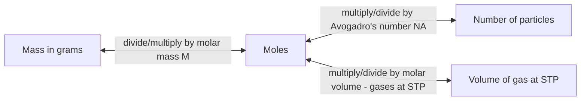

## The Mole Concept and Avogadro's Number

### Definition

The mole (mol) is the SI base unit for the amount of substance, defined as containing exactly $6.02214076 \times 10^{23}$ elementary entities (atoms, molecules, ions, or formula units). This defining number is known as **Avogadro's number** ($N_A$).

**Key Points**

- The mole serves as a "chemical counting unit," bridging the microscopic scale (individual atoms/molecules, far too numerous and small to count directly) with the macroscopic scale (measurable masses in grams)
- Since 2019, the mole has been defined by fixing the exact numerical value of Avogadro's number, rather than being tied to the mass of a physical reference sample (such as the earlier carbon-12 based definition)
- One mole of any substance contains exactly the same number of elementary entities, regardless of the substance's identity
- Avogadro's number is dimensionless as a pure count, but is conventionally expressed with units of $\text{mol}^{-1}$ when used in calculations (entities per mole)

### Why the Mole Is Necessary

**Key Points**

- Atoms and molecules are far too small and numerous to count individually or weigh with any practical laboratory instrument
- The mole allows chemists to relate a measurable macroscopic quantity (mass in grams) to a specific, exact number of particles, enabling stoichiometric calculations
- Just as "dozen" means exactly 12 items regardless of what is being counted, "mole" means exactly $6.022 \times 10^{23}$ entities regardless of what those entities are

**Example**

One mole of carbon atoms contains $6.022 \times 10^{23}$ carbon atoms and has a mass of 12.01 g (its molar mass). One mole of water molecules also contains $6.022 \times 10^{23}$ entities (in this case, H₂O molecules) but has a different mass (18.02 g), reflecting water's different molar mass — the particle *count* is identical, but the *mass* differs because individual water molecules are heavier than individual carbon atoms. [Note: this compares atoms to molecules for illustration; the key point is that the mole always represents the same count of whatever entity is specified]

### Molar Mass

**Definition**

Molar mass is the mass (in grams) of one mole of a substance, numerically equal to the substance's atomic mass (for elements) or the sum of atomic masses (for compounds), as found on the periodic table, expressed in g/mol.

**Key Points**

- For elements, molar mass equals the atomic mass listed on the periodic table (in atomic mass units, u, numerically equivalent to g/mol)
- For compounds, molar mass is calculated by summing the molar masses of all constituent atoms, accounting for the number of each atom type in the formula
- Molar mass serves as the essential conversion factor between mass (grams) and moles

**Example: Molar mass calculation for glucose (C₆H₁₂O₆)**

$$M = 6(12.01) + 12(1.008) + 6(16.00) = 72.06 + 12.10 + 96.00 = 180.16\ \text{g/mol}$$

### The Mole as a Conversion Hub

The mole concept functions as the central conversion point linking mass, particle count, and (for gases) volume:

**Key Conversion Formulas**

$$n = \frac{m}{M} \quad\quad n = \frac{N}{N_A} \quad\quad n = \frac{V}{22.4\ \text{L/mol}}\ (\text{at STP, ideal gas})$$

Where $n$ = moles, $m$ = mass (g), $M$ = molar mass (g/mol), $N$ = number of particles, $N_A$ = Avogadro's number, and $V$ = gas volume at STP (standard temperature and pressure).

### Worked Conversion Examples

**Example 1: Grams to moles**

How many moles are in 36.0 g of water (molar mass 18.02 g/mol)?

$$n = \frac{36.0\ \text{g}}{18.02\ \text{g/mol}} = 2.00\ \text{mol}$$

**Example 2: Moles to number of particles**

How many molecules are in 2.00 mol of water?

$$N = (2.00\ \text{mol}) \times (6.022 \times 10^{23}\ \text{mol}^{-1}) = 1.204 \times 10^{24}\ \text{molecules}$$

**Example 3: Mass to number of particles (combined conversion)**

How many atoms are in 5.00 g of iron (molar mass 55.85 g/mol)?

$$n = \frac{5.00\ \text{g}}{55.85\ \text{g/mol}} = 0.0895\ \text{mol}$$

$$N = (0.0895\ \text{mol}) \times (6.022 \times 10^{23}\ \text{mol}^{-1}) = 5.39 \times 10^{22}\ \text{atoms}$$

**Example 4: Particles to grams**

What is the mass of $3.01 \times 10^{23}$ molecules of CO₂ (molar mass 44.01 g/mol)?

$$n = \frac{3.01 \times 10^{23}}{6.022 \times 10^{23}\ \text{mol}^{-1}} = 0.500\ \text{mol}$$

$$m = (0.500\ \text{mol}) \times (44.01\ \text{g/mol}) = 22.0\ \text{g}$$

### Molar Volume of Gases at STP

**Key Points**

- At standard temperature and pressure (STP: 0°C/273.15 K and 1 atm, per the older, commonly taught convention — note IUPAC's current STP definition uses 0°C and 100 kPa), one mole of any ideal gas occupies **22.4 L**
- This relationship follows directly from Avogadro's Law (equal volumes of gas at the same temperature and pressure contain equal numbers of moles) combined with the ideal gas law
- [Unverified: the exact STP definition (1 atm vs. 100 kPa) varies between older textbooks and current IUPAC recommendations, which affects the precise molar volume value cited — 22.4 L/mol corresponds to the 1 atm convention]

### The Historical Significance of Avogadro's Number

**Key Points**

- Named after Amedeo Avogadro, whose early 19th-century hypothesis proposed that equal volumes of gases at the same temperature and pressure contain equal numbers of particles — though Avogadro himself did not determine the numerical value that now bears his name
- The specific numerical value was determined much later through various experimental methods (e.g., X-ray crystallography, electrochemistry, oil-drop experiments), refined over time to its current precisely defined value
- As of the 2019 SI redefinition, Avogadro's number is now an **exactly defined constant** ($6.02214076 \times 10^{23}\ \text{mol}^{-1}$, with no experimental uncertainty), rather than an experimentally measured value with associated error

### Common Pitfalls

- Forgetting that molar mass is always specific to the substance in question — using the wrong molar mass value is one of the most common calculation errors in mole-based stoichiometry
- Confusing "moles of molecules" with "moles of atoms" when a compound contains multiple atoms per molecule (e.g., 1 mol of H₂O contains 1 mol of H₂O molecules, but 2 mol of H atoms and 1 mol of O atoms)
- Misapplying the 22.4 L/mol molar volume constant to non-ideal gases or to conditions other than STP without adjustment
- Treating Avogadro's number as an approximate or rounded value in precise calculations, when it is now an exactly defined constant

### Related Topics

- Molar mass calculations and the periodic table
- Empirical and molecular formula determination
- Stoichiometric calculations and limiting reagents
- Gas laws and molar volume at STP
- Percent composition and mass percent calculations
- Dimensional analysis and unit conversion in chemistry