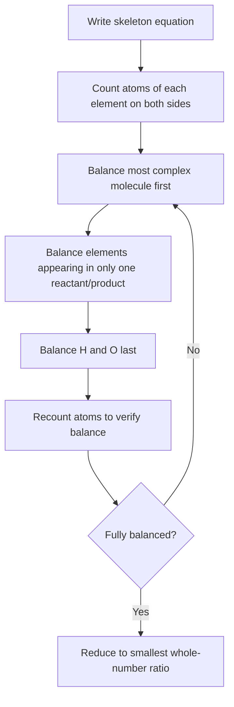

## Balancing Chemical Equations

### Definition

Balancing a chemical equation is the process of adjusting the coefficients in front of chemical formulas (never subscripts within formulas) so that the number of atoms of each element is equal on both the reactant and product sides, satisfying the Law of Conservation of Mass.

**Key Points**

- The Law of Conservation of Mass requires that matter is neither created nor destroyed in a chemical reaction — the same atoms present in reactants must all be accounted for in products
- Only **coefficients** (the numbers placed in front of chemical formulas) may be adjusted; **subscripts** (numbers within a formula, e.g., the "2" in H₂O) must never be changed, since altering a subscript changes the chemical identity of the substance entirely
- A balanced equation shows the correct relative mole ratios between reactants and products, forming the foundation for all stoichiometric calculations
- Coefficients should always be reduced to the smallest possible whole-number ratio

### Step-by-Step Balancing Procedure

1. Write the unbalanced (skeleton) equation with correct chemical formulas for all reactants and products
2. Count the number of atoms of each element on both sides of the equation
3. Balance elements one at a time, typically starting with the most complex molecule, then moving to elements that appear in only one reactant and one product, and saving hydrogen and oxygen for last (since they often appear in multiple compounds)
4. Adjust coefficients (never subscripts) to balance each element, working through the equation iteratively as needed
5. Recount all atoms on both sides to verify the equation is fully balanced
6. Reduce all coefficients to the smallest possible whole-number ratio if a common factor exists

### Worked Example 1: Combustion of Propane

**Skeleton equation:**

$$\text{C}_3\text{H}_8 + \text{O}_2 \rightarrow \text{CO}_2 + \text{H}_2\text{O}$$

**Step 1 — Balance carbon:** 3 C atoms on the left requires 3 CO₂ on the right:

$$\text{C}_3\text{H}_8 + \text{O}_2 \rightarrow 3\text{CO}_2 + \text{H}_2\text{O}$$

**Step 2 — Balance hydrogen:** 8 H atoms on the left requires 4 H₂O on the right (4 × 2 = 8):

$$\text{C}_3\text{H}_8 + \text{O}_2 \rightarrow 3\text{CO}_2 + 4\text{H}_2\text{O}$$

**Step 3 — Balance oxygen:** Right side now has $3(2) + 4(1) = 10$ O atoms, requiring 5 O₂ on the left (5 × 2 = 10):

$$\text{C}_3\text{H}_8 + 5\text{O}_2 \rightarrow 3\text{CO}_2 + 4\text{H}_2\text{O}$$

**Verification:** C: 3 = 3 ✓ | H: 8 = 8 ✓ | O: 10 = 10 ✓ — Fully balanced.

### Worked Example 2: Reaction Requiring Fractional-to-Whole Adjustment

**Skeleton equation:**

$$\text{Fe} + \text{O}_2 \rightarrow \text{Fe}_2\text{O}_3$$

**Step 1 — Balance iron:** 2 Fe on the right requires 2 Fe on the left:

$$2\text{Fe} + \text{O}_2 \rightarrow \text{Fe}_2\text{O}_3$$

**Step 2 — Balance oxygen:** 3 O atoms on the right is odd, while O₂ supplies atoms in pairs — using a temporary fractional coefficient:

$$2\text{Fe} + \frac{3}{2}\text{O}_2 \rightarrow \text{Fe}_2\text{O}_3$$

**Step 3 — Clear the fraction:** multiply every coefficient in the entire equation by 2:

$$4\text{Fe} + 3\text{O}_2 \rightarrow 2\text{Fe}_2\text{O}_3$$

**Verification:** Fe: 4 = 4 ✓ | O: 6 = 6 ✓ — Fully balanced with whole-number coefficients.

### Balancing Equations Containing Polyatomic Ions

**Key Points**

- When a polyatomic ion (e.g., SO₄²⁻, NO₃⁻, PO₄³⁻) appears unchanged on both sides of a reaction (as is common in double-displacement/precipitation and acid-base reactions), it can be balanced as a single intact unit rather than balancing its constituent atoms separately
- This significantly simplifies the balancing process for many common reaction types

**Example**

$$\text{Pb(NO}_3)_2 + 2\text{KI} \rightarrow \text{PbI}_2 + 2\text{KNO}_3$$

Here, the NO₃⁻ polyatomic ion is treated as a single unbalanced unit: 2 NO₃⁻ on the left requires 2 NO₃⁻ on the right (satisfied by the coefficient 2 on KNO₃), avoiding the need to separately balance N and O atoms.

### Balancing Combustion Reactions — General Pattern

Combustion of a hydrocarbon ($\text{C}_x\text{H}_y$) in oxygen follows a predictable pattern, useful as a template:

$$\text{C}_x\text{H}_y + \left(x + \frac{y}{4}\right)\text{O}_2 \rightarrow x\text{CO}_2 + \frac{y}{2}\text{H}_2\text{O}$$

Balance carbon first (coefficient on CO₂ = $x$), then hydrogen (coefficient on H₂O = $y/2$), then oxygen last (since O appears in two different products, making it dependent on the other two elements already being balanced), clearing any fractions by multiplying through by the appropriate whole number.

### Balancing Equations Involving Redox Reactions (Brief Introduction)

**Key Points**

- Simple balancing by inspection (the method described above) works well for most non-redox reactions but can be insufficient for complex redox reactions where atoms transfer electrons across multiple species
- Redox reactions often require a more systematic method (the half-reaction method, covered in detail under the "Balancing Redox Reactions" topic), which separately balances oxidation and reduction half-reactions before combining them, ensuring both mass and charge are balanced
- A key indicator that a reaction may need the half-reaction method rather than simple inspection: the presence of free elements changing oxidation state, or reactions occurring in acidic/basic aqueous solution requiring H⁺, OH⁻, or H₂O to balance charge and oxygen/hydrogen

### Types of Coefficients and Common Numerical Patterns

| Reaction Pattern | Typical Coefficient Behavior |
| --- | --- |
| Simple synthesis (A + B → AB) | Often already balanced or requires small whole-number adjustment |
| Simple decomposition (AB → A + B) | Often already balanced or requires small whole-number adjustment |
| Single displacement | Usually straightforward; balance the displaced/displacing element |
| Double displacement | Often simplified using intact polyatomic ions |
| Combustion of hydrocarbons | Follows predictable C, H, then O balancing order; may require fraction-clearing |

### Common Pitfalls

- Changing subscripts instead of coefficients to "balance" an equation — this is never valid, as it alters the chemical identity of the substance
- Forgetting to multiply through by a common factor to clear fractional coefficients, leaving a "balanced" equation with non-whole-number coefficients
- Balancing hydrogen or oxygen before other elements when multiple compounds on either side contain those elements — this often creates a cascading need for repeated readjustment; balancing H and O last (after other elements) is generally more efficient
- Forgetting to recount ALL atoms after each adjustment — changing one coefficient to balance one element can unbalance an element that was previously fine
- Not reducing coefficients to the smallest whole-number ratio (e.g., leaving 4, 6, 2 instead of reducing to 2, 3, 1 when a common factor of 2 exists)

### Related Topics

- The mole concept and Avogadro's number
- Stoichiometric calculations and limiting reagents
- Types of chemical reactions (synthesis, decomposition, displacement, combustion)
- Balancing redox reactions using the half-reaction method
- Percent yield and theoretical yield calculations
- Net ionic equations and spectator ions