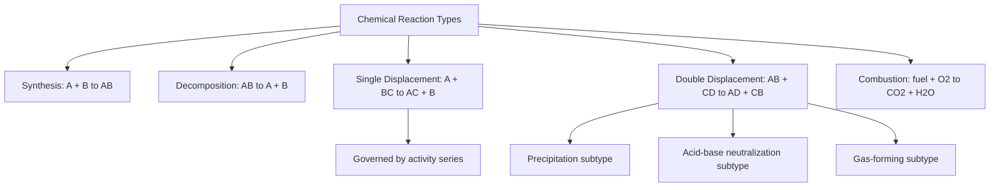

## Classifying Types of Chemical Reactions

### Overview

Chemical reactions can be sorted into several broad classification categories based on the pattern of how reactants transform into products. Recognizing a reaction's type allows chemists to predict products, understand underlying mechanisms, and select appropriate methods for balancing and analysis.

**Key Points**

- The five classical reaction categories are: synthesis (combination), decomposition, single displacement (replacement), double displacement (metathesis), and combustion
- Some reactions fit multiple categories simultaneously (e.g., combustion is also a type of redox reaction), and classification schemes can overlap or be viewed from different framings (e.g., redox vs. non-redox, or precipitation/acid-base as subtypes of double displacement)
- Recognizing the reaction type often predicts the products before balancing, streamlining the overall problem-solving process

### Synthesis (Combination) Reactions

**Definition**

Two or more simpler substances combine to form a single, more complex product.

$$A + B \rightarrow AB$$

**Key Points**

- Reactants are typically elements or simple compounds; the product is a single compound
- Common in the formation of oxides, hydroxides, and simple binary compounds

**Example**

$$2\text{Mg}(s) + \text{O}_2(g) \rightarrow 2\text{MgO}(s)$$

Magnesium metal combines directly with oxygen gas to form magnesium oxide, a classic synthesis reaction.

### Decomposition Reactions

**Definition**

A single compound breaks down into two or more simpler substances (elements or simpler compounds).

$$AB \rightarrow A + B$$

**Key Points**

- Essentially the reverse pattern of a synthesis reaction
- Often requires an external energy input (heat, electricity, or light) to initiate, since breaking bonds typically requires energy

**Example**

$$2\text{H}_2\text{O}_2(aq) \rightarrow 2\text{H}_2\text{O}(l) + \text{O}_2(g)$$

Hydrogen peroxide decomposes into water and oxygen gas, a reaction often catalyzed by enzymes (e.g., catalase) or other catalysts.

### Single Displacement (Single Replacement) Reactions

**Definition**

An element replaces another element within a compound, based on relative reactivity.

$$A + BC \rightarrow AC + B$$

**Key Points**

- Governed by the **activity series**: a more reactive element will displace a less reactive element from a compound, while a less reactive element cannot displace a more reactive one
- Metal displacement reactions and halogen displacement reactions are the most common subtypes taught at the introductory level
- Whether a single displacement reaction proceeds as written can be predicted directly by comparing relative positions on the activity series

**Example**

$$\text{Zn}(s) + \text{CuSO}_4(aq) \rightarrow \text{ZnSO}_4(aq) + \text{Cu}(s)$$

Zinc, being more reactive than copper (higher on the activity series), displaces copper from copper sulfate solution, depositing metallic copper and forming zinc sulfate in solution.

### Double Displacement (Double Replacement / Metathesis) Reactions

**Definition**

The cations (or anions) of two ionic compounds exchange partners, forming two new compounds.

$$AB + CD \rightarrow AD + CB$$

**Key Points**

- Commonly occurs in aqueous solution between two soluble ionic compounds
- Frequently classified into meaningful subtypes based on the driving force of the reaction: **precipitation reactions** (an insoluble solid product forms), **acid-base neutralization reactions** (an acid and base react to form water and a salt), and **gas-forming reactions** (a gas is released, often via an unstable intermediate that decomposes)
- Solubility rules are typically used to predict whether a precipitate will form in a double displacement reaction

**Example — Precipitation**

$$\text{AgNO}_3(aq) + \text{NaCl}(aq) \rightarrow \text{AgCl}(s) + \text{NaNO}_3(aq)$$

Silver nitrate and sodium chloride exchange partners; since AgCl is insoluble (per standard solubility rules), a white precipitate forms.

**Example — Acid-Base Neutralization**

$$\text{HCl}(aq) + \text{NaOH}(aq) \rightarrow \text{NaCl}(aq) + \text{H}_2\text{O}(l)$$

An acid and base exchange partners, producing a salt (NaCl) and water — the hallmark result of neutralization.

### Combustion Reactions

**Definition**

A substance (typically a hydrocarbon or other fuel) reacts rapidly with oxygen gas, releasing energy as heat and light.

$$\text{C}_x\text{H}_y + \text{O}_2 \rightarrow \text{CO}_2 + \text{H}_2\text{O} \quad (\text{complete combustion})$$

**Key Points**

- **Complete combustion** (sufficient O₂ available) produces carbon dioxide and water as products
- **Incomplete combustion** (insufficient O₂ available) produces carbon monoxide (CO) and/or elemental carbon (soot) in addition to or instead of CO₂, representing a significant safety and environmental concern
- Combustion reactions are always exothermic, releasing substantial energy, and are technically a subtype of redox reaction (the fuel is oxidized, O₂ is reduced)

**Example**

$$\text{CH}_4(g) + 2\text{O}_2(g) \rightarrow \text{CO}_2(g) + 2\text{H}_2\text{O}(g)$$

Complete combustion of methane (natural gas) produces carbon dioxide and water vapor, releasing substantial heat energy — the basis for natural gas heating and cooking applications.

### Summary Comparison Table

| Reaction Type | General Pattern | Key Recognition Clue |
| --- | --- | --- |
| Synthesis | A + B → AB | Multiple reactants combine into one product |
| Decomposition | AB → A + B | Single reactant breaks into multiple products |
| Single displacement | A + BC → AC + B | One element replaces another in a compound |
| Double displacement | AB + CD → AD + CB | Two ionic compounds exchange partners (often in aqueous solution) |
| Combustion | Fuel + O₂ → CO₂ + H₂O | Reaction with O₂, releases heat/light, often involves a hydrocarbon |

### Overlapping Classifications: Redox vs. Non-Redox Framing

**Key Points**

- An alternative (and often more fundamentally informative) classification distinguishes reactions by whether oxidation states change: **redox reactions** (electron transfer occurs, oxidation states change) vs. **non-redox reactions** (no electron transfer, oxidation states remain constant)
- Synthesis, decomposition, single displacement, and combustion reactions are typically (though not always) redox reactions
- Double displacement reactions (precipitation, acid-base) are typically non-redox reactions, since ions simply exchange partners without changing oxidation state
- This dual classification framework (structural pattern vs. electron-transfer behavior) provides complementary ways of analyzing the same reaction

### Common Pitfalls

- Assuming all double displacement reactions produce a precipitate — many combinations of soluble ionic compounds do not react at all (no precipitate, gas, or water forms), meaning no net reaction occurs
- Confusing single and double displacement reactions — single displacement involves one free element displacing another from a compound, while double displacement involves two compounds exchanging partners with no free elements involved
- Overlooking that combustion is simultaneously a distinct structural category AND a redox reaction — the classifications are not mutually exclusive
- Assuming reaction type alone determines whether a reaction is spontaneous or favorable — classification predicts likely products and reaction pattern, not thermodynamic favorability

### Related Topics

- Balancing chemical equations
- The activity series and predicting single displacement reactions
- Solubility rules and predicting precipitation reactions
- Acid-base neutralization reactions
- Oxidation-reduction (redox) reactions and balancing half-reactions
- Net ionic equations and spectator ions