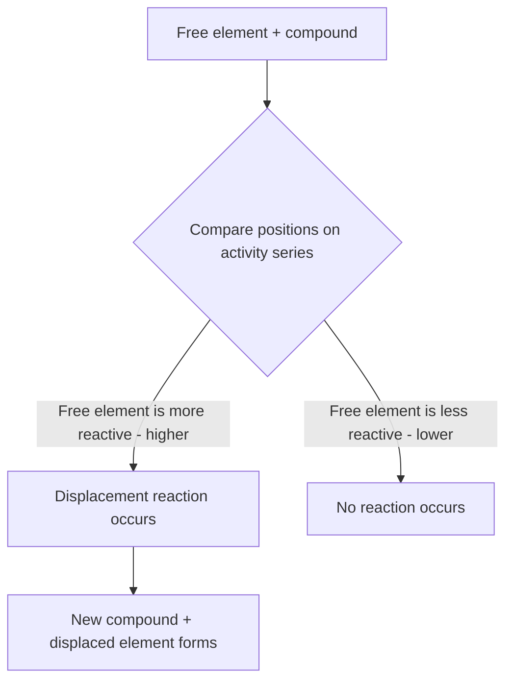

## The Activity Series and Predicting Reactions

### Definition

The activity series is a ranked list of elements (most commonly metals, and separately halogens) arranged in order of decreasing chemical reactivity, used to predict whether a single displacement reaction will occur and, if so, which products will form.

**Key Points**

- A more reactive element (higher on the series) will displace a less reactive element (lower on the series) from a compound
- A less reactive element cannot displace a more reactive element — if attempted, no reaction occurs
- The activity series for metals is typically determined experimentally by observing displacement reactions, standard reduction potentials, and reactivity with water/acids
- Separate activity series exist for metals and for halogens, since these categories undergo somewhat different displacement mechanisms

### General Order of the Metal Activity Series (Most to Least Reactive)

$$\text{Li} > \text{K} > \text{Ba} > \text{Ca} > \text{Na} > \text{Mg} > \text{Al} > \text{Zn} > \text{Fe} > \text{Ni} > \text{Sn} > \text{Pb} > \text{H}_2 > \text{Cu} > \text{Ag} > \text{Au}$$

[Unverified: exact ordering and included elements vary somewhat between textbook sources, particularly regarding the precise relative positions of closely-ranked metals; the general trend and relative groupings, however, are consistently taught]

**Key Points**

- Elements above hydrogen in the series can displace H₂ gas from acids (and, for the most reactive metals, even from water)
- Elements below hydrogen (e.g., Cu, Ag, Au) cannot displace hydrogen from acids under normal conditions, reflecting their lower reactivity ("noble" metals)
- Group 1 (alkali) and Group 2 (alkaline earth) metals generally occupy the most reactive positions, consistent with their low ionization energies and strong tendency to lose electrons

### Predicting Single Displacement Reactions Using the Activity Series

**Procedure**

1. Identify the free element (the potential displacing agent) and the compound it is reacting with
2. Locate both the free element and the element it would displace on the activity series
3. If the free element is HIGHER on the series (more reactive) than the element in the compound, the displacement reaction proceeds as written
4. If the free element is LOWER on the series (less reactive), no reaction occurs

**Example 1: Reaction proceeds**

$$\text{Zn}(s) + \text{CuSO}_4(aq) \rightarrow \text{ZnSO}_4(aq) + \text{Cu}(s)$$

Zinc is above copper on the activity series (more reactive), so zinc successfully displaces copper from copper sulfate solution.

**Example 2: No reaction occurs**

$$\text{Cu}(s) + \text{ZnSO}_4(aq) \rightarrow \text{No Reaction}$$

Copper is below zinc on the activity series (less reactive), so copper cannot displace zinc from zinc sulfate — the reaction simply does not proceed.

### Reactivity with Water and Acids

**Key Points**

- The most reactive metals (alkali metals, and to a lesser extent alkaline earth metals) react directly and often vigorously with cold water, producing metal hydroxide and hydrogen gas
- Moderately reactive metals (e.g., Mg, Zn, Fe) typically do not react appreciably with cold water but do react with acids (releasing H₂ gas) or with steam at elevated temperature
- Metals below hydrogen on the activity series (Cu, Ag, Au) do not react with typical dilute acids (e.g., HCl, dilute H₂SO₄) to release H₂ gas at all

**Example**

$$2\text{Na}(s) + 2\text{H}_2\text{O}(l) \rightarrow 2\text{NaOH}(aq) + \text{H}_2(g)$$

Sodium, being highly reactive, reacts vigorously (often violently) with water at room temperature, while a less reactive metal like iron requires acid or high-temperature steam to produce a comparable reaction, and copper does not react with water or dilute acid at all under normal conditions.

### The Halogen Activity Series

$$\text{F}_2 > \text{Cl}_2 > \text{Br}_2 > \text{I}_2$$

**Key Points**

- Halogen reactivity (as displacing agents in halide salt solutions) decreases down Group 17, correlating with decreasing electronegativity and increasing atomic size down the group
- A more reactive halogen (higher on the series, smaller atomic radius, higher electronegativity) will displace a less reactive halide ion from its salt

**Example**

$$\text{Cl}_2(aq) + 2\text{NaBr}(aq) \rightarrow 2\text{NaCl}(aq) + \text{Br}_2(aq)$$

Chlorine, being more reactive than bromine, displaces bromide ions from sodium bromide solution, forming sodium chloride and elemental bromine.

### Relationship to Standard Reduction Potentials

**Key Points**

- The activity series parallels the ranking of standard reduction potentials ($E°$): metals with more negative (or less positive) standard reduction potentials are more easily oxidized and thus rank higher (more reactive) on the activity series
- A metal higher on the activity series has a greater tendency to lose electrons (be oxidized) compared to a metal lower on the series
- This connects the qualitative activity series directly to the quantitative electrochemical framework used in redox and electrochemistry topics, where $E°_{cell}$ values allow more precise, calculated predictions of reaction spontaneity beyond the simpler activity series ranking

### Connection to Redox Reactions

**Key Points**

- Every single displacement reaction is inherently a redox reaction: the displacing (free) element is oxidized (loses electrons, increases in oxidation state from 0), while the displaced element is reduced (gains electrons, decreases in oxidation state to 0)
- The activity series essentially ranks elements by how readily they undergo oxidation — the most reactive metals are the most easily oxidized (strongest reducing agents)

**Example — Electron transfer in Zn/Cu displacement**

$$\text{Zn}(s) \rightarrow \text{Zn}^{2+}(aq) + 2e^- \quad (\text{oxidation, Zn is oxidized})$$

$$\text{Cu}^{2+}(aq) + 2e^- \rightarrow \text{Cu}(s) \quad (\text{reduction, Cu}^{2+}\text{ is reduced})$$

### Summary Table: Predicting Outcomes

| Scenario | Free Element Position | Result |
| --- | --- | --- |
| More reactive metal + salt of less reactive metal | Higher on series | Displacement occurs |
| Less reactive metal + salt of more reactive metal | Lower on series | No reaction |
| Metal above H₂ + dilute acid | Above hydrogen | H₂ gas released, reaction occurs |
| Metal below H₂ + dilute acid | Below hydrogen | No reaction with dilute acid |
| More reactive halogen + halide salt | Higher on halogen series | Displacement occurs |

### Common Pitfalls

- Assuming any metal can displace any other metal from solution — displacement only occurs when the free metal is genuinely higher (more reactive) on the series
- Forgetting that hydrogen's position on the metal activity series is a key reference point for predicting acid reactivity, even though hydrogen is not itself a metal
- Confusing the metal activity series (reactivity decreases down the list) with the halogen activity series (reactivity decreases down the group, matching decreasing electronegativity) — the underlying trend directions and reasoning differ between the two series
- Applying activity series predictions to reactions that are not actually single displacement reactions (e.g., attempting to use it for double displacement or acid-base reactions, where it does not apply)

### Related Topics

- Classifying types of chemical reactions
- Oxidation-reduction (redox) reactions and half-reactions
- Standard reduction potentials and electrochemistry
- Balancing chemical equations
- Periodic trends in reactivity, electronegativity, and ionization energy
- Galvanic (voltaic) cells and cell potential calculations