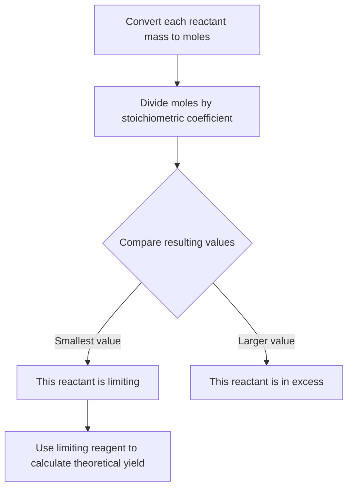

## Limiting Reagents and Percent Yield

### Overview

In most real chemical reactions, reactants are not combined in exactly the stoichiometric ratio required by the balanced equation. The **limiting reagent** concept identifies which reactant runs out first and therefore determines the maximum possible amount of product, while **percent yield** compares the actual experimental product obtained against this theoretical maximum.

**Key Points**

- The limiting reagent (limiting reactant) is the reactant that is completely consumed first, stopping the reaction and limiting the total amount of product that can form
- The **excess reagent** is the reactant that remains partially unreacted once the limiting reagent is fully consumed
- **Theoretical yield** is the maximum amount of product calculable from the limiting reagent, assuming 100% conversion with no losses
- **Percent yield** compares actual (experimentally obtained) yield to theoretical yield, reflecting real-world reaction efficiency

### Identifying the Limiting Reagent

**Procedure**

1. Convert the given mass (or volume/concentration) of each reactant to moles
2. Divide the moles of each reactant by its stoichiometric coefficient in the balanced equation
3. The reactant with the **smallest** resulting value is the limiting reagent, since it will be exhausted first relative to what the reaction requires
4. Alternatively, calculate the amount of product each reactant could theoretically produce if it were fully consumed — the reactant yielding the **smaller** amount of product is the limiting reagent

### Worked Example: Identifying the Limiting Reagent

**Reaction:**

$$\text{N}_2(g) + 3\text{H}_2(g) \rightarrow 2\text{NH}_3(g)$$

Given: 28.0 g N₂ (molar mass 28.02 g/mol) and 6.00 g H₂ (molar mass 2.02 g/mol)

**Step 1 — Convert to moles:**

$$n_{N_2} = \frac{28.0\ \text{g}}{28.02\ \text{g/mol}} = 0.999\ \text{mol}$$

$$n_{H_2} = \frac{6.00\ \text{g}}{2.02\ \text{g/mol}} = 2.97\ \text{mol}$$

**Step 2 — Divide by stoichiometric coefficients:**

$$\frac{0.999\ \text{mol}\ N_2}{1} = 0.999 \quad\quad \frac{2.97\ \text{mol}\ H_2}{3} = 0.990$$

**Step 3 — Compare:** Since $0.990 < 0.999$, H₂ has the smaller ratio and is the **limiting reagent**; N₂ is in excess.

### Calculating Theoretical Yield

Once the limiting reagent is identified, theoretical yield is calculated using standard stoichiometric mole-ratio conversion, based entirely on the limiting reagent's quantity.

**Continuing the example:**

$$n_{NH_3} = 2.97\ \text{mol}\ H_2 \times \frac{2\ \text{mol}\ NH_3}{3\ \text{mol}\ H_2} = 1.98\ \text{mol}\ NH_3$$

$$m_{NH_3} = 1.98\ \text{mol} \times 17.03\ \text{g/mol} = 33.7\ \text{g}\ NH_3\ (\text{theoretical yield})$$

**Key Points**

- Theoretical yield is always calculated from the limiting reagent, never the excess reagent — using the excess reagent's quantity would incorrectly overstate the achievable product amount
- Theoretical yield represents an idealized maximum, assuming the reaction goes to completion with perfect conversion efficiency and no side reactions or losses

### Calculating Leftover Excess Reagent

To determine how much of the excess reagent remains unreacted, calculate how much of it was actually consumed by the limiting reagent, then subtract from the original amount.

**Continuing the example:**

$$n_{N_2\ \text{consumed}} = 2.97\ \text{mol}\ H_2 \times \frac{1\ \text{mol}\ N_2}{3\ \text{mol}\ H_2} = 0.990\ \text{mol}\ N_2\ \text{consumed}$$

$$n_{N_2\ \text{remaining}} = 0.999\ \text{mol} - 0.990\ \text{mol} = 0.009\ \text{mol}\ N_2\ \text{remaining}$$

### Percent Yield

**Definition**

Percent yield expresses the efficiency of a reaction by comparing the actual (experimentally measured) yield to the theoretical (calculated maximum) yield.

$$\%\ \text{yield} = \frac{\text{actual yield}}{\text{theoretical yield}} \times 100\%$$

**Key Points**

- Percent yield is almost always less than 100% in real laboratory settings, due to factors such as incomplete reactions, competing side reactions, loss of product during transfer/purification/filtration, impure reactants, or reversible reactions that do not proceed fully to completion
- A percent yield greater than 100% is generally not physically valid for a single clean product and usually indicates a systematic experimental error, such as impure or wet product, or incomplete drying
- Percent yield calculations require both an experimentally measured actual yield and a stoichiometrically calculated theoretical yield

**Example**

If the reaction above (theoretical yield 33.7 g NH₃) is actually performed in the laboratory and only 29.5 g of NH₃ is recovered:

$$\%\ \text{yield} = \frac{29.5\ \text{g}}{33.7\ \text{g}} \times 100\% = 87.5\%$$

### Common Reasons for Yields Below 100%

| Cause | Explanation |
| --- | --- |
| Incomplete reaction | Reaction does not proceed fully to completion (especially relevant for reversible/equilibrium reactions) |
| Side reactions | Reactants form unintended byproducts, consuming starting material without forming the desired product |
| Purification losses | Product is lost during filtration, recrystallization, evaporation, or transfer between containers |
| Impure reactants | Starting materials contain impurities, reducing the effective amount of reactive material |
| Measurement/technique error | Imprecise laboratory technique introduces systematic loss |

### Common Pitfalls

- Using the excess reagent (rather than the limiting reagent) to calculate theoretical yield, which produces an artificially inflated (incorrect) theoretical yield value
- Forgetting to convert given quantities to moles before comparing reactant ratios — comparing raw grams directly, without accounting for molar mass, gives incorrect limiting reagent identification
- Dividing moles by the wrong stoichiometric coefficient (mixing up which coefficient belongs to which reactant)
- Calculating percent yield using the wrong theoretical yield basis, or reporting percent yield greater than 100% without recognizing this signals an experimental or calculation error
- Assuming the reactant present in smaller mass is automatically the limiting reagent — limiting reagent identification must always account for molar mass and stoichiometric coefficients, not raw mass alone

### Related Topics

- The mole concept and Avogadro's number
- Balancing chemical equations
- Stoichiometric mole-ratio calculations
- Percent composition and empirical formula determination
- Chemical equilibrium and reversible reactions
- Laboratory technique and sources of experimental error