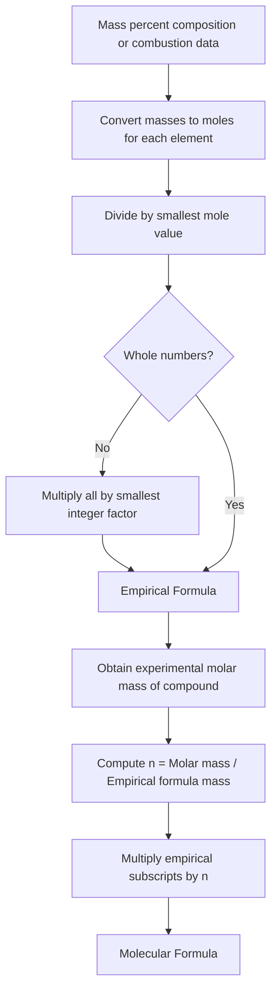

## Empirical and Molecular Formulas

### Definitions

**Empirical formula** is the simplest whole-number ratio of atoms of each element in a compound. It does not necessarily represent the actual number of atoms in a molecule — only their relative proportions.

**Molecular formula** is the actual number of atoms of each element present in one molecule of the compound. The molecular formula is always a whole-number multiple of the empirical formula:

$$\text{Molecular formula} = n \times (\text{Empirical formula})$$

where $n$ is a positive integer ($n = 1, 2, 3, \ldots$).

For example, glucose has the molecular formula $C_6H_{12}O_6$ and empirical formula $CH_2O$, with $n = 6$.

### Relationship Between the Two

| Compound | Molecular Formula | Empirical Formula | $n$ |
| --- | --- | --- | --- |
| Acetylene | $C_2H_2$ | $CH$ | 2 |
| Benzene | $C_6H_6$ | $CH$ | 6 |
| Water | $H_2O$ | $H_2O$ | 1 |
| Hydrogen peroxide | $H_2O_2$ | $HO$ | 2 |
| Glucose | $C_6H_{12}O_6$ | $CH_2O$ | 6 |
| Acetic acid | $C_2H_4O_2$ | $CH_2O$ | 2 |

Note that different molecules (acetic acid and glucose) can share the same empirical formula while having distinct molecular formulas and distinct chemical identities.

### Determining the Empirical Formula from Experimental Data

The empirical formula is typically derived from mass percent composition or combustion analysis data. The standard procedure:

**Step 1 — Assume a 100 g sample.**

If percent composition is given, treat each percentage directly as grams of that element in a 100 g sample.

**Step 2 — Convert mass to moles.**

Divide each element's mass by its molar mass:

$$n_i = \frac{m_i}{M_i}$$

**Step 3 — Find the mole ratio.**

Divide every mole value by the smallest mole value obtained in Step 2.

**Step 4 — Adjust to whole numbers.**

If the ratios are not close to whole numbers, multiply all ratios by the smallest integer that converts them to (near) whole numbers. Common conversion factors:

| Decimal remainder | Multiply by |
| --- | --- |
| 0.5 | 2 |
| 0.33 or 0.67 | 3 |
| 0.25 or 0.75 | 4 |
| 0.2, 0.4, 0.6, 0.8 | 5 |

**Step 5 — Write the empirical formula** using the resulting whole numbers as subscripts.

### Worked Example 1: From Percent Composition

A compound is found to contain 40.0% carbon, 6.7% hydrogen, and 53.3% oxygen by mass. Determine its empirical formula.

**Step 1:** Assume 100 g sample → 40.0 g C, 6.7 g H, 53.3 g O.

**Step 2:** Convert to moles.

$$n_C = \frac{40.0 \text{ g}}{12.01 \text{ g/mol}} = 3.33 \text{ mol}$$

$$n_H = \frac{6.7 \text{ g}}{1.008 \text{ g/mol}} = 6.65 \text{ mol}$$

$$n_O = \frac{53.3 \text{ g}}{16.00 \text{ g/mol}} = 3.33 \text{ mol}$$

**Step 3:** Divide by the smallest value (3.33):

$$C: \frac{3.33}{3.33} = 1.00 \qquad H: \frac{6.65}{3.33} = 2.00 \qquad O: \frac{3.33}{3.33} = 1.00$$

**Step 4:** Ratios are already whole numbers — no adjustment needed.

**Empirical formula:** $CH_2O$

### Worked Example 2: Requiring a Multiplier

A compound contains 26.6% potassium, 35.4% chromium, and 38.0% oxygen by mass.

**Step 1–2:**

$$n_K = \frac{26.6}{39.10} = 0.680 \text{ mol}$$

$$n_{Cr} = \frac{35.4}{52.00} = 0.681 \text{ mol}$$

$$n_O = \frac{38.0}{16.00} = 2.375 \text{ mol}$$

**Step 3:** Divide by smallest (0.680):

$$K: 1.00 \qquad Cr: 1.00 \qquad O: 3.49$$

**Step 4:** 3.49 is close to 3.5, so multiply all values by 2:

$$K: 2 \qquad Cr: 2 \qquad O: 7$$

**Empirical formula:** $K_2Cr_2O_7$ (potassium dichromate)

### Determining the Molecular Formula

Once the empirical formula is known, the molecular formula is found using the compound's experimentally determined molar mass (from mass spectrometry, freezing-point depression, or other methods).

**Step 1:** Calculate the empirical formula mass (sum of atomic masses in the empirical formula unit).

**Step 2:** Divide the molecular molar mass by the empirical formula mass:

$$n = \frac{\text{Molecular molar mass}}{\text{Empirical formula mass}}$$

**Step 3:** Multiply every subscript in the empirical formula by $n$.

### Worked Example 3: Full Empirical → Molecular Determination

A compound has the empirical formula $CH_2O$ and a molar mass of 180.16 g/mol. Find its molecular formula.

**Step 1:** Empirical formula mass:

$$M(CH_2O) = 12.01 + 2(1.008) + 16.00 = 30.03 \text{ g/mol}$$

**Step 2:**

$$n = \frac{180.16}{30.03} \approx 6$$

**Step 3:** Multiply subscripts by 6:

$$C_{(1\times6)}H_{(2\times6)}O_{(1\times6)} = C_6H_{12}O_6$$

**Molecular formula:** $C_6H_{12}O_6$ (glucose)

### Combustion Analysis (Common Source of Composition Data)

For organic compounds containing C, H, and (often) O, empirical formulas are frequently derived by burning a known mass of sample completely in excess oxygen and measuring the $CO_2$ and $H_2O$ produced.

$$C_xH_yO_z + O_2 \rightarrow CO_2 + H_2O$$

**Procedure:**

1. All carbon in the sample converts to $CO_2$; all hydrogen converts to $H_2O$.
2. Moles of C = moles of $CO_2$ produced.
3. Moles of H = 2 × moles of $H_2O$ produced.
4. If oxygen is present in the original compound, its mass is found by subtracting the mass of C and H from the total sample mass (mass of O cannot be measured directly since atmospheric $O_2$ also contributes to product formation).

$$m_O = m_{\text{sample}} - m_C - m_H$$

5. Convert all masses to moles and proceed as in Steps 3–5 above.

### Worked Example 4: Combustion Analysis

Combustion of 0.500 g of a hydrocarbon produces 1.466 g $CO_2$ and 0.600 g $H_2O$. Determine the empirical formula.

**Moles of C:**

$$n_C = \frac{1.466 \text{ g}}{44.01 \text{ g/mol}} = 0.0333 \text{ mol} \Rightarrow m_C = 0.0333 \times 12.01 = 0.400 \text{ g}$$

**Moles of H:**

$$n_{H_2O} = \frac{0.600}{18.02} = 0.0333 \text{ mol} \Rightarrow n_H = 2(0.0333) = 0.0666 \text{ mol}$$

$$m_H = 0.0666 \times 1.008 = 0.0672 \text{ g}$$

**Check for oxygen:**

$$m_O = 0.500 - 0.400 - 0.0672 = 0.0328 \text{ g} \approx 0$$

Since this is within experimental rounding of zero, the compound contains only C and H.

**Mole ratio:**

$$C: 0.0333 \qquad H: 0.0666$$

$$\frac{H}{C} = \frac{0.0666}{0.0333} = 2.00$$

**Empirical formula:** $CH_2$ (consistent with an alkene such as ethylene, $C_2H_4$, if molar mass data confirms $n = 2$)

### Conceptual Diagram

### Important Distinctions and Common Pitfalls

- **Empirical ≠ molecular for many compounds.** Only when $n = 1$ are they identical (e.g., $H_2O$, $NH_3$, $CO_2$).
- **Rounding errors compound quickly.** A mole ratio of 1.98 should be treated as 2, not rounded up carelessly to 2.0 and then multiplied unnecessarily — apply judgment based on expected experimental precision (typically ±0.05–0.1 tolerance from whole numbers is acceptable).
- **Never round a ratio like 1.5 to 2.** A ratio ending near .5, .33, .67, .25, or .75 signals the need for a multiplier (see the conversion table above), not simple rounding.
- Ionic compounds (e.g., $NaCl$, $MgCl_2$) are conventionally represented **only** by empirical (formula unit) ratios, since they do not exist as discrete molecules. The term "molecular formula" does not strictly apply to ionic lattices [Inference: terminology convention, though widely standard in general chemistry curricula].

### Percent Composition from a Formula (Reverse Calculation)

Given a formula, percent composition of each element is:

$$\%\text{element} = \frac{(\text{number of atoms}) \times (\text{atomic mass})}{\text{molar mass of compound}} \times 100\%$$

This is the inverse operation used to verify an empirical formula determination or to predict composition from a known formula.

**Example:** For $C_6H_{12}O_6$ (molar mass = 180.16 g/mol):

$$\%C = \frac{6(12.01)}{180.16} \times 100\% = 40.0\%$$

$$\%H = \frac{12(1.008)}{180.16} \times 100\% = 6.71\%$$

$$\%O = \frac{6(16.00)}{180.16} \times 100\% = 53.3\%$$

This matches the percentages used in Worked Example 1, confirming internal consistency.

### Simple Empirical/Molecular Relationship Diagram (svg_diagram)

<svg xmlns="http://www.w3.org/2000/svg" viewBox="0 0 640 220">
\<style\>
.box { fill: #f0f4f8; stroke: #2b6cb0; stroke-width: 2; }
.label { font-family: Arial, sans-serif; font-size: 14px; fill: #1a202c; }
.title { font-family: Arial, sans-serif; font-size: 13px; fill: #2b6cb0; font-weight: bold; }
.arrow { stroke: #2b6cb0; stroke-width: 2; marker-end: url(#arrowhead); }
\</style\>
<text x="320" y="20" text-anchor="middle" class="title">Empirical vs Molecular Formula (svg_diagram)</text>
<rect x="30" y="50" width="180" height="60" rx="8" class="box" />
<text x="120" y="75" text-anchor="middle" class="label">Empirical Formula</text>
<text x="120" y="95" text-anchor="middle" class="label">CH2O</text>
<line x1="210" y1="80" x2="290" y2="80" class="arrow" />
<text x="250" y="70" text-anchor="middle" class="label">× n</text>
<rect x="290" y="50" width="180" height="60" rx="8" class="box" />
<text x="380" y="75" text-anchor="middle" class="label">Molecular Formula</text>
<text x="380" y="95" text-anchor="middle" class="label">C6H12O6 (n=6)</text>
<line x1="470" y1="80" x2="550" y2="80" class="arrow" />
<text x="510" y="70" text-anchor="middle" class="label">e.g.</text>
<rect x="550" y="50" width="60" height="60" rx="8" class="box" />
<text x="580" y="85" text-anchor="middle" class="label">Glucose</text>
<rect x="120" y="150" width="400" height="50" rx="8" class="box" />
<text x="320" y="180" text-anchor="middle" class="label">n = Molar Mass (molecular) / Empirical Formula Mass</text>
</svg>

**Related Topics**

- Percent composition calculations
- Mole concept and Avogadro's number
- Combustion analysis and gravimetric methods
- Limiting reagent and theoretical yield
- Balancing chemical equations
- Molar mass determination techniques (mass spectrometry, colligative properties)
- Stoichiometric calculations from balanced equations
- Hydrates and determining water of crystallization