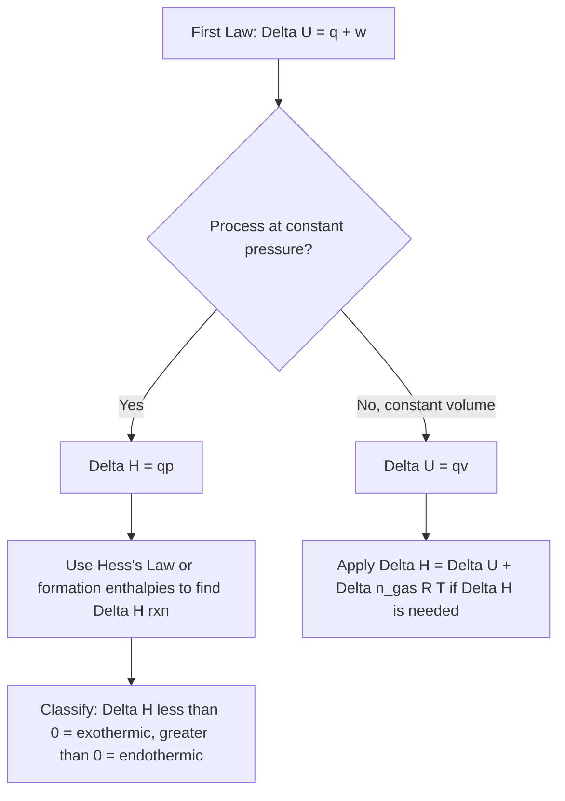

## The First Law of Thermodynamics and Enthalpy

### The First Law of Thermodynamics

The first law of thermodynamics is a statement of the **conservation of energy** applied to thermodynamic systems: energy cannot be created or destroyed, only transferred between a system and its surroundings as heat or work, or converted from one form to another.

$$\Delta U = q + w$$

where:

- $\Delta U$ = change in internal energy of the system
- $q$ = heat absorbed by the system (positive when heat flows *into* the system)
- $w$ = work done *on* the system (positive when work is done *on* the system by the surroundings)

**Sign convention note:** This is the IUPAC convention ($\Delta U = q + w$). An older convention, still used in some textbooks, defines $w$ as work done *by* the system, giving $\Delta U = q - w$. Both are mathematically equivalent as long as the sign convention is applied consistently throughout a problem. [The specific sign convention in use should always be verified against the source material, since inconsistent mixing of conventions is a common calculation error.]

### Internal Energy

**Internal energy** ($U$) is the total energy contained within a system — the sum of all kinetic and potential energies of the particles composing it (translational, rotational, vibrational motion, and intermolecular/intramolecular potential energy). Internal energy is a **state function**: its value depends only on the current state of the system, not on the path taken to reach that state.

$$\Delta U = U_{final} - U_{initial}$$

Because $\Delta U$ depends only on initial and final states, it is path-independent, whereas $q$ and $w$ individually **are** path-dependent — their values depend on how the process is carried out (e.g., reversibly vs. irreversibly), even though their sum ($\Delta U$) is not.

### Heat (q) and Work (w)

**Heat ($q$)** is energy transferred between system and surroundings due to a temperature difference.

- $q > 0$: heat flows into the system (endothermic process)
- $q < 0$: heat flows out of the system (exothermic process)

**Work ($w$)**, in the chemical thermodynamics context, most commonly refers to **pressure-volume (PV) work** — work done as a system expands or is compressed against external pressure:

$$w = -P_{ext} \Delta V$$

(using the IUPAC convention where $w$ is work done on the system). If a gas expands ($\Delta V > 0$) against constant external pressure, $w$ is negative (the system does work on the surroundings, losing energy). If a gas is compressed ($\Delta V < 0$), $w$ is positive (the surroundings do work on the system).

### Worked Example 1: First Law Application

A gas absorbs 350 J of heat from its surroundings and does 210 J of work by expanding against a constant external pressure. Calculate $\Delta U$.

Using $\Delta U = q + w$ (IUPAC convention, work done ON the system):

Since the gas does work ON the surroundings by expanding, $w = -210$ J (work done on the system is negative).

$$\Delta U = q + w = 350 \text{ J} + (-210 \text{ J}) = 140 \text{ J}$$

The internal energy of the system increases by 140 J.

### Enthalpy: Definition and Motivation

Most chemical reactions occur at **constant pressure** (e.g., open to the atmosphere) rather than constant volume, making $q$ at constant pressure a more directly useful and measurable quantity than $\Delta U$ alone. **Enthalpy ($H$)** is defined as a state function that accounts for this:

$$H = U + PV$$

At constant pressure, the change in enthalpy equals the heat absorbed or released by the system:

$$\Delta H = q_p$$

where $q_p$ denotes heat measured at constant pressure. This relationship is derived as follows:

$$\Delta H = \Delta U + P\Delta V$$

Substituting $\Delta U = q_p + w = q_p - P\Delta V$ (at constant external pressure):

$$\Delta H = (q_p - P\Delta V) + P\Delta V = q_p$$

This cancellation is the key reason enthalpy is the preferred quantity for reporting the heat effects of chemical reactions carried out under normal laboratory or atmospheric conditions.

### Enthalpy Sign Conventions

- $\Delta H < 0$: **exothermic** reaction — heat is released to the surroundings (system loses enthalpy).
- $\Delta H > 0$: **endothermic** reaction — heat is absorbed from the surroundings (system gains enthalpy).

### Relationship Between ΔH and ΔU

For reactions involving gases, $\Delta H$ and $\Delta U$ differ by the $\Delta(PV)$ term. For an ideal gas at constant temperature, $PV = nRT$, so:

$$\Delta H = \Delta U + \Delta n_{gas} RT$$

where $\Delta n_{gas}$ is the change in moles of gas (moles of gaseous products minus moles of gaseous reactants), $R$ is the gas constant, and $T$ is the absolute temperature.

**Worked Example 2:**

For the reaction $N_2(g) + 3H_2(g) \rightarrow 2NH_3(g)$ at 298 K, $\Delta U = -91.8$ kJ. Calculate $\Delta H$.

$$\Delta n_{gas} = 2 - (1 + 3) = -2 \text{ mol}$$

$$\Delta H = \Delta U + \Delta n_{gas}RT = -91.8 \text{ kJ} + (-2 \text{ mol})(8.314 \times 10^{-3} \text{ kJ/(mol·K)})(298 \text{ K})$$

$$\Delta H = -91.8 \text{ kJ} + (-4.96 \text{ kJ}) = -96.8 \text{ kJ}$$

### Standard Enthalpy of Reaction

The **standard enthalpy of reaction** ($\Delta H^\circ_{rxn}$) is the enthalpy change for a reaction carried out under standard conditions (typically 1 atm pressure and specified concentrations, most commonly reported at 298 K), with all reactants and products in their standard states.

It can be calculated from **standard enthalpies of formation** ($\Delta H^\circ_f$) — the enthalpy change when 1 mole of a compound forms from its elements in their standard states (by definition, $\Delta H^\circ_f = 0$ for any element in its standard state):

$$\Delta H^\circ_{rxn} = \sum n_p \Delta H^\circ_f(\text{products}) - \sum n_r \Delta H^\circ_f(\text{reactants})$$

where $n_p$ and $n_r$ are the stoichiometric coefficients of products and reactants respectively.

### Worked Example 3: Enthalpy of Reaction from Formation Values

Calculate $\Delta H^\circ_{rxn}$ for the combustion of methane:

$$CH_4(g) + 2O_2(g) \rightarrow CO_2(g) + 2H_2O(l)$$

Given: $\Delta H^\circ_f[CH_4(g)] = -74.8$ kJ/mol, $\Delta H^\circ_f[CO_2(g)] = -393.5$ kJ/mol, $\Delta H^\circ_f[H_2O(l)] = -285.8$ kJ/mol, $\Delta H^\circ_f[O_2(g)] = 0$ kJ/mol (element in standard state).

$$\Delta H^\circ_{rxn} = [(-393.5) + 2(-285.8)] - [(-74.8) + 2(0)]$$

$$\Delta H^\circ_{rxn} = [-393.5 - 571.6] - [-74.8]$$

$$\Delta H^\circ_{rxn} = -965.1 + 74.8 = -890.3 \text{ kJ}$$

The strongly negative value confirms this is a highly exothermic reaction, consistent with methane combustion releasing substantial heat.

### Hess's Law

**Hess's Law** states that the total enthalpy change for a reaction is the same regardless of the number of steps or the pathway taken, since $H$ is a state function. This allows $\Delta H$ for a reaction to be calculated by algebraically combining the $\Delta H$ values of other known reactions.

**Rules for manipulating equations under Hess's Law:**

- If an equation is reversed, the sign of $\Delta H$ is reversed.
- If an equation is multiplied by a factor, $\Delta H$ is multiplied by the same factor.
- When equations are added, their $\Delta H$ values are added; intermediate species that cancel out must appear on opposite sides with equal coefficients.

**Worked Example 4:**

Given:

$$C(s) + O_2(g) \rightarrow CO_2(g) \quad \Delta H_1 = -393.5 \text{ kJ}$$

$$CO(g) + \tfrac{1}{2}O_2(g) \rightarrow CO_2(g) \quad \Delta H_2 = -283.0 \text{ kJ}$$

Find $\Delta H$ for:

$$C(s) + \tfrac{1}{2}O_2(g) \rightarrow CO(g)$$

**Strategy:** Keep the first equation as is; reverse the second equation (since CO is a product in the target, not a reactant).

$$C(s) + O_2(g) \rightarrow CO_2(g) \quad \Delta H_1 = -393.5 \text{ kJ}$$

$$CO_2(g) \rightarrow CO(g) + \tfrac{1}{2}O_2(g) \quad -\Delta H_2 = +283.0 \text{ kJ}$$

**Add the equations** (canceling $CO_2(g)$ and $\tfrac{1}{2}O_2(g)$ on opposite sides):

$$C(s) + \tfrac{1}{2}O_2(g) \rightarrow CO(g)$$

$$\Delta H = \Delta H_1 + (-\Delta H_2) = -393.5 + 283.0 = -110.5 \text{ kJ}$$

### Calorimetry: Measuring Heat Experimentally

Calorimetry is the experimental technique used to measure the heat exchanged in a physical or chemical process. The fundamental relationship:

$$q = mc\Delta T$$

where $m$ = mass of the substance (usually the calorimeter contents, such as water), $c$ = specific heat capacity, and $\Delta T$ = temperature change.

- A **coffee-cup calorimeter** operates at (approximately) constant pressure, so $q_{measured} \approx \Delta H$.
- A **bomb calorimeter** operates at constant volume in a sealed, rigid container, so $q_{measured} \approx \Delta U$, and requires the $\Delta n_{gas}RT$ correction if $\Delta H$ is specifically needed.

### Worked Example 5: Calorimetry

50.0 g of water at 25.0°C is used in a coffee-cup calorimeter. After a reaction, the temperature rises to 32.5°C. Given the specific heat of water is 4.184 J/(g·°C), calculate the heat absorbed by the water.

$$\Delta T = 32.5 - 25.0 = 7.5°C$$

$$q = mc\Delta T = (50.0 \text{ g})(4.184 \text{ J/g·°C})(7.5°C) = 1569 \text{ J} \approx 1.57 \text{ kJ}$$

Since the reaction released this heat to the water, the reaction itself is exothermic, and $q_{rxn} = -1.57$ kJ (heat lost by the reacting system equals heat gained by the water, with opposite sign, assuming no heat loss to the surroundings).

### First Law and Enthalpy Relationship Diagram

### Common Pitfalls

- **Sign convention confusion** between $\Delta U = q + w$ (IUPAC, work on system) and $\Delta U = q - w$ (work by system) — always confirm which convention a textbook or problem is using.
- **Treating $q$ and $w$ as state functions** — only their sum, $\Delta U$, is path-independent; $q$ and $w$ individually depend on the path.
- **Confusing $\Delta H$ and $\Delta U$** for gas-phase reactions with significant $\Delta n_{gas}$ — the difference can be non-negligible at high temperatures or for reactions with large changes in gas moles.
- **Forgetting to reverse the sign of $\Delta H$** when reversing a chemical equation in Hess's Law problems.
- **Confusing bomb calorimetry (constant volume, measures $\Delta U$) with coffee-cup calorimetry (constant pressure, measures $\Delta H$)**.
- **Omitting the physical state** of reactants and products when using tabulated $\Delta H^\circ_f$ values — enthalpy of formation is state-specific (e.g., $H_2O(l)$ vs. $H_2O(g)$ give substantially different values).

**Related Topics**

- Hess's Law (extended multi-step problems)
- Standard enthalpies of formation and reaction
- Calorimetry techniques (bomb vs. coffee-cup)
- Entropy and the second law of thermodynamics
- Gibbs free energy and reaction spontaneity
- Heating curves and phase-change enthalpies (fusion, vaporization)
- Bond enthalpies and their use in estimating $\Delta H_{rxn}$
- Specific heat capacity and thermal equilibrium calculations