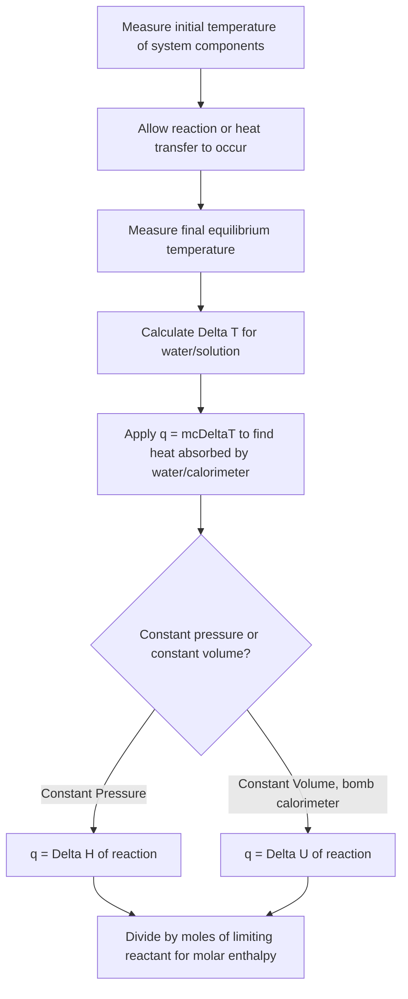

## Calorimetry and Heat Capacity

### Foundational Concept

Calorimetry is the experimental methodology for measuring the quantity of heat absorbed or released during a physical or chemical process. It relies on the principle of **conservation of energy**: heat lost by one part of an isolated system is gained by another part, allowing the heat of a reaction or process to be inferred by measuring the resulting temperature change in a substance of known heat capacity (commonly water).

### Heat Capacity and Specific Heat

**Heat capacity ($C$)** is the amount of heat required to raise the temperature of an object by 1°C (or 1 K), and is an extensive property (depends on the amount of substance):

$$C = \frac{q}{\Delta T} \quad \text{(units: J/°C or J/K)}$$

**Specific heat capacity ($c$)** is the amount of heat required to raise the temperature of 1 gram of a substance by 1°C, and is an intensive property (independent of sample size):

$$c = \frac{q}{m\Delta T} \quad \text{(units: J/(g·°C))}$$

**Molar heat capacity ($C_m$)** is defined analogously per mole rather than per gram:

$$C_m = \frac{q}{n\Delta T} \quad \text{(units: J/(mol·°C))}$$

### The Core Calorimetry Equation

$$q = mc\Delta T$$

where:

- $q$ = heat absorbed or released (J or kJ)
- $m$ = mass of the substance (g)
- $c$ = specific heat capacity (J/(g·°C))
- $\Delta T = T_{final} - T_{initial}$

**Sign interpretation:**

- $q > 0$: the substance absorbs heat (temperature increases)
- $q < 0$: the substance releases heat (temperature decreases)

### Specific Heat Capacity Reference Values

| Substance | Specific Heat, $c$ (J/(g·°C)) |
| --- | --- |
| Water (liquid) | 4.184 |
| Water (ice) | 2.09 |
| Water (steam) | 1.996 |
| Ethanol | 2.44 |
| Aluminum | 0.897 |
| Iron | 0.449 |
| Copper | 0.385 |
| Gold | 0.129 |
| Glass | 0.84 |

Water's unusually high specific heat is why it is the standard medium in most calorimetry setups — it resists temperature change relative to metals and allows more precise measurement of small heat transfers. [Values are standard reference constants at approximately 25°C and may vary slightly with temperature and source.]

### Worked Example 1: Basic Specific Heat Calculation

How much heat is required to raise the temperature of 250.0 g of water from 22.0°C to 95.0°C?

$$\Delta T = 95.0 - 22.0 = 73.0°C$$

$$q = mc\Delta T = (250.0 \text{ g})(4.184 \text{ J/g·°C})(73.0°C)$$

$$q = 76{,}358 \text{ J} = 76.4 \text{ kJ}$$

### Principle of Heat Exchange in Calorimetry

When two substances at different temperatures are brought into contact within an isolated system, heat flows from the hotter substance to the cooler one until thermal equilibrium is reached. By conservation of energy:

$$q_{lost} = -q_{gained}$$

or equivalently, the sum of all heat changes in an isolated system equals zero:

$$q_1 + q_2 = 0$$

### Worked Example 2: Mixing Two Substances (Final Temperature)

A 100.0 g piece of iron at 150.0°C is dropped into 200.0 g of water at 20.0°C. Assuming no heat loss to the surroundings, find the final equilibrium temperature.

**Setup:** Heat lost by iron = heat gained by water.

$$-q_{iron} = q_{water}$$

$$-m_{Fe}c_{Fe}(T_f - 150.0) = m_{H_2O}c_{H_2O}(T_f - 20.0)$$

$$-(100.0)(0.449)(T_f - 150.0) = (200.0)(4.184)(T_f - 20.0)$$

$$-44.9(T_f - 150.0) = 836.8(T_f - 20.0)$$

$$-44.9T_f + 6735 = 836.8T_f - 16736$$

$$6735 + 16736 = 836.8T_f + 44.9T_f$$

$$23471 = 881.7T_f$$

$$T_f = 26.6°C$$

The final temperature (26.6°C) is much closer to the initial water temperature than the iron temperature, consistent with water's much larger heat capacity dominating the thermal equilibrium.

### Types of Calorimeters

**Coffee-cup calorimeter (constant-pressure calorimeter):**

A simple, low-cost setup — typically nested polystyrene cups containing water, open to atmospheric pressure, with a thermometer and stirrer. Used to measure heat changes of reactions occurring in aqueous solution (e.g., neutralization, dissolution reactions). Because it operates at constant (atmospheric) pressure, the measured heat corresponds directly to enthalpy change:

$$q_p = \Delta H$$

**Bomb calorimeter (constant-volume calorimeter):**

A sealed, rigid steel vessel ("bomb") in which a sample is combusted in excess oxygen under high pressure. The bomb is submerged in a water bath, and the heat released raises the water's temperature. Because the vessel is sealed and rigid (constant volume, $\Delta V = 0$, so $w = 0$), the measured heat corresponds to the change in internal energy:

$$q_v = \Delta U$$

Bomb calorimeters are standard for determining the caloric/fuel value of combustible substances (e.g., food energy content, fuel heating values) since they require substantially more precise control (ignition wire, oxygen pressurization) than the simpler coffee-cup design.

### Calorimeter Constant (Heat Capacity of the Calorimeter Itself)

In more rigorous calorimetry, the calorimeter apparatus itself absorbs some heat and must be accounted for using its own heat capacity, known as the **calorimeter constant** ($C_{cal}$), typically determined via a calibration experiment with a known heat source.

$$q_{released\ by\ reaction} = -(q_{water} + q_{calorimeter})$$

$$q_{released} = -[mc\Delta T + C_{cal}\Delta T]$$

### Worked Example 3: Bomb Calorimetry with Calorimeter Constant

A 1.000 g sample of glucose is combusted in a bomb calorimeter containing 1200 g of water. The calorimeter constant is 850 J/°C. The temperature rises from 24.00°C to 28.55°C. Calculate the heat released per gram of glucose.

**Heat absorbed by water:**

$$q_{water} = mc\Delta T = (1200 \text{ g})(4.184 \text{ J/g·°C})(4.55°C) = 22{,}845 \text{ J}$$

**Heat absorbed by calorimeter:**

$$q_{cal} = C_{cal}\Delta T = (850 \text{ J/°C})(4.55°C) = 3868 \text{ J}$$

**Total heat released by combustion:**

$$q_{rxn} = -(q_{water} + q_{cal}) = -(22{,}845 + 3868) = -26{,}713 \text{ J} = -26.7 \text{ kJ}$$

Since the sample mass is 1.000 g, the heat of combustion is **−26.7 kJ/g** (exothermic, as expected for a combustion reaction).

### Worked Example 4: Coffee-Cup Calorimetry for a Neutralization Reaction

50.0 mL of 1.00 M HCl at 22.5°C is mixed with 50.0 mL of 1.00 M NaOH also at 22.5°C in a coffee-cup calorimeter. The temperature rises to 29.1°C. Assuming the density and specific heat of the resulting solution equal that of water (1.00 g/mL, 4.184 J/g·°C), calculate $\Delta H$ per mole of water formed.

**Total mass of solution:**

$$m = 50.0 + 50.0 = 100.0 \text{ g}$$

**Heat absorbed by the solution:**

$$q_{soln} = mc\Delta T = (100.0)(4.184)(29.1 - 22.5) = (100.0)(4.184)(6.6) = 2761 \text{ J}$$

**Heat released by the reaction:**

$$q_{rxn} = -2761 \text{ J} = -2.761 \text{ kJ}$$

**Moles of water formed** (limiting reagent basis — equal moles of HCl and NaOH, 1:1 ratio):

$$n_{HCl} = 1.00 \text{ mol/L} \times 0.0500 \text{ L} = 0.0500 \text{ mol}$$

**Enthalpy per mole:**

$$\Delta H = \frac{-2.761 \text{ kJ}}{0.0500 \text{ mol}} = -55.2 \text{ kJ/mol}$$

This result is reasonably consistent with the accepted standard enthalpy of neutralization for strong acid–strong base reactions (approximately −57.3 kJ/mol), with the discrepancy attributable to heat loss to the surroundings and the simplifying assumptions used. [Real experimental values commonly show deviation from literature constants due to imperfect insulation and calorimeter heat absorption not fully accounted for.]

### Calorimetry Process Flow Diagram

### Common Pitfalls

- **Sign errors** — forgetting that heat released by the reaction is negative, while the corresponding heat gained by the water/calorimeter is positive; these are equal in magnitude but opposite in sign.
- **Neglecting the calorimeter constant** in more precise experiments, leading to systematic underestimation of the heat released.
- **Confusing bomb calorimetry ($\Delta U$, constant volume) with coffee-cup calorimetry ($\Delta H$, constant pressure)** — using the wrong thermodynamic quantity for the type of calorimeter used.
- **Using the density and specific heat of pure water as an approximation** for dilute aqueous solutions — a reasonable simplification for dilute solutions, but introduces some error, especially for concentrated solutions.
- **Failing to convert volumes to consistent units** or overlooking that molarity-based mole calculations require volume in liters.
- **Ignoring heat loss to the surroundings** (non-ideal insulation) as a source of experimental error, which typically causes the measured $|\Delta H|$ to be smaller than the literature value.

**Related Topics**

- The first law of thermodynamics and enthalpy
- Hess's Law and enthalpy of formation
- Specific heat capacity of various substances
- Heating and cooling curves, phase-change enthalpies
- Thermochemical equations and stoichiometry of heat
- Entropy and spontaneity (second law of thermodynamics)
- Food and fuel caloric value determination
- Experimental error analysis in laboratory measurements