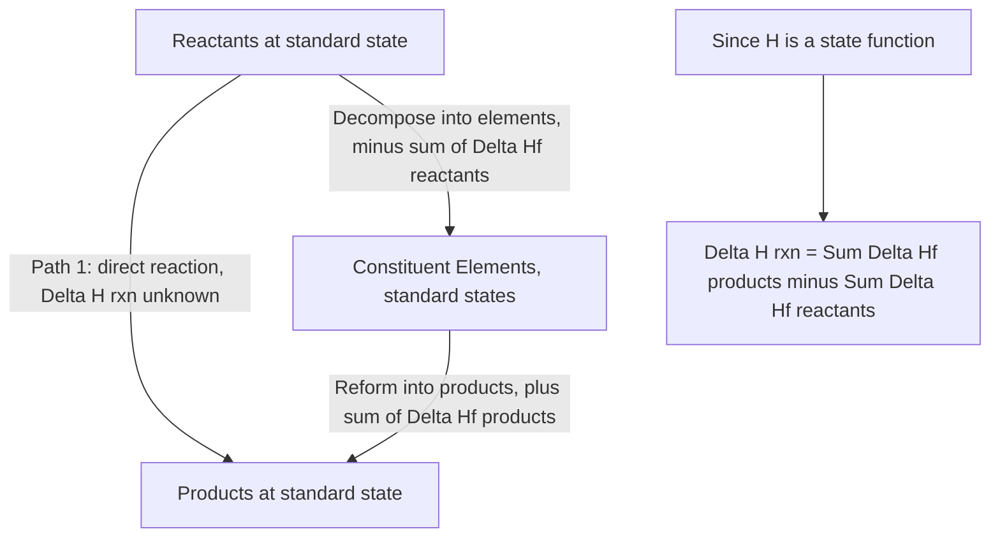

## Hess's Law and Enthalpy of Formation

### Foundational Concept

Hess's Law states that the total enthalpy change of a reaction is independent of the pathway or number of steps taken between initial reactants and final products — it depends only on the initial and final states of the system. This follows directly from the fact that enthalpy ($H$) is a **state function**. Hess's Law allows enthalpy changes for reactions that are difficult or impossible to measure directly to be calculated by combining the known enthalpy changes of related reactions.

### Why Hess's Law Works: State Functions

A **state function** is a property whose value depends only on the current state of a system (defined by variables such as temperature, pressure, and composition), not on the path taken to reach that state. Since $\Delta H$ for any overall transformation is fixed by the initial and final states alone, any set of intermediate reactions that sum to the same overall reaction must yield the same total $\Delta H$, regardless of how many steps are used or what those intermediate steps are.

### Rules for Manipulating Thermochemical Equations

When combining known reactions to construct a target reaction, three algebraic rules apply:

1. **Reversing an equation** reverses the sign of $\Delta H$ (endothermic becomes exothermic and vice versa, with the same magnitude).
2. **Multiplying an equation by a coefficient** multiplies $\Delta H$ by that same coefficient.
3. **Adding equations together** sums their $\Delta H$ values; any species that appears on both sides of the combined equations (in equal amounts) cancels out algebraically, just as in ordinary equation addition.

### General Procedure for Hess's Law Problems

**Step 1:** Write the target (overall) equation whose $\Delta H$ is to be determined.

**Step 2:** Identify the given equations and their $\Delta H$ values.

**Step 3:** Manipulate each given equation (reverse and/or scale) so that when added together, all intermediate species cancel and the result matches the target equation exactly (same reactants, products, and coefficients).

**Step 4:** Apply the same reversal/scaling operations to each corresponding $\Delta H$ value.

**Step 5:** Sum the adjusted $\Delta H$ values to obtain $\Delta H$ for the target reaction.

### Worked Example 1: Two-Step Hess's Law Problem

Given:

$$S(s) + O_2(g) \rightarrow SO_2(g) \quad \Delta H_1 = -296.8 \text{ kJ}$$

$$2SO_2(g) + O_2(g) \rightarrow 2SO_3(g) \quad \Delta H_2 = -198.2 \text{ kJ}$$

Find $\Delta H$ for:

$$S(s) + \tfrac{3}{2}O_2(g) \rightarrow SO_3(g)$$

**Analysis:** The target has 1 mole of $S$ (matches Equation 1 as written) and 1 mole of $SO_3$ as product (Equation 2 has 2 moles of $SO_3$, so it must be halved).

**Step 1 — Keep Equation 1 as is:**

$$S(s) + O_2(g) \rightarrow SO_2(g) \quad \Delta H_1 = -296.8 \text{ kJ}$$

**Step 2 — Halve Equation 2:**

$$SO_2(g) + \tfrac{1}{2}O_2(g) \rightarrow SO_3(g) \quad \tfrac{1}{2}\Delta H_2 = -99.1 \text{ kJ}$$

**Step 3 — Add the equations** (canceling $SO_2(g)$, which appears as a product in the first and a reactant in the second):

$$S(s) + O_2(g) + \tfrac{1}{2}O_2(g) \rightarrow SO_2(g) + SO_3(g) - SO_2(g)$$

$$S(s) + \tfrac{3}{2}O_2(g) \rightarrow SO_3(g)$$

This matches the target equation exactly.

**Step 4 — Sum the enthalpies:**

$$\Delta H = \Delta H_1 + \tfrac{1}{2}\Delta H_2 = -296.8 + (-99.1) = -395.9 \text{ kJ}$$

### Worked Example 2: Three-Equation Hess's Law Problem

Given:

$$C(s) + O_2(g) \rightarrow CO_2(g) \quad \Delta H_1 = -393.5 \text{ kJ}$$

$$H_2(g) + \tfrac{1}{2}O_2(g) \rightarrow H_2O(l) \quad \Delta H_2 = -285.8 \text{ kJ}$$

$$C_2H_4(g) + 3O_2(g) \rightarrow 2CO_2(g) + 2H_2O(l) \quad \Delta H_3 = -1411.0 \text{ kJ}$$

Find $\Delta H$ for the formation of ethylene from its elements:

$$2C(s) + 2H_2(g) \rightarrow C_2H_4(g)$$

**Analysis:** The target has $C_2H_4$ as a *product*, but Equation 3 has $C_2H_4$ as a *reactant* — Equation 3 must be reversed. The target needs 2 mol $C$ (Equation 1 doubled) and 2 mol $H_2$ (Equation 2 doubled).

**Step 1 — Double Equation 1:**

$$2C(s) + 2O_2(g) \rightarrow 2CO_2(g) \quad 2\Delta H_1 = -787.0 \text{ kJ}$$

**Step 2 — Double Equation 2:**

$$2H_2(g) + O_2(g) \rightarrow 2H_2O(l) \quad 2\Delta H_2 = -571.6 \text{ kJ}$$

**Step 3 — Reverse Equation 3:**

$$2CO_2(g) + 2H_2O(l) \rightarrow C_2H_4(g) + 3O_2(g) \quad -\Delta H_3 = +1411.0 \text{ kJ}$$

**Step 4 — Add all three equations** (canceling $2CO_2(g)$, $2H_2O(l)$, and combining $O_2$: $2 + 1 - 3 = 0$ net $O_2$):

$$2C(s) + 2H_2(g) \rightarrow C_2H_4(g)$$

Confirmed to match the target.

**Step 5 — Sum the enthalpies:**

$$\Delta H = 2\Delta H_1 + 2\Delta H_2 + (-\Delta H_3)$$

$$\Delta H = (-787.0) + (-571.6) + (1411.0) = 52.4 \text{ kJ}$$

The result is a positive (endothermic) enthalpy of formation, consistent with the reference value for ethylene ($\Delta H^\circ_f \approx +52.4$ kJ/mol).

### Standard Enthalpy of Formation

The **standard enthalpy of formation** ($\Delta H^\circ_f$) of a compound is defined as the enthalpy change when **1 mole** of the compound is formed from its constituent elements, with all substances in their **standard states** (most stable form at 1 atm and the specified temperature, typically 298 K / 25°C).

**Key convention:** By definition, $\Delta H^\circ_f = 0$ for any element in its standard state (e.g., $O_2(g)$, $N_2(g)$, $C(s, \text{graphite})$, $H_2(g)$, $Br_2(l)$). This establishes a common reference point (analogous to sea level in elevation measurements) against which all compound formation enthalpies are compared.

### Using Standard Enthalpies of Formation to Calculate ΔH°rxn

Because any reaction can conceptually be broken into two Hess's Law steps — decomposing all reactants into their elements, then reforming those elements into products — the standard enthalpy of any reaction can be calculated directly from tabulated formation values:

$$\Delta H^\circ_{rxn} = \sum n_p \Delta H^\circ_f(\text{products}) - \sum n_r \Delta H^\circ_f(\text{reactants})$$

where $n_p$ and $n_r$ are the stoichiometric coefficients from the balanced equation. This formula is itself a direct consequence of Hess's Law — it is the general, tabulated shortcut equivalent to solving a two-step Hess's Law cycle for any reaction.

### Worked Example 3: ΔH°rxn from Formation Values

Calculate $\Delta H^\circ_{rxn}$ for the combustion of ethanol:

$$C_2H_5OH(l) + 3O_2(g) \rightarrow 2CO_2(g) + 3H_2O(l)$$

Given: $\Delta H^\circ_f[C_2H_5OH(l)] = -277.6$ kJ/mol, $\Delta H^\circ_f[CO_2(g)] = -393.5$ kJ/mol, $\Delta H^\circ_f[H_2O(l)] = -285.8$ kJ/mol, $\Delta H^\circ_f[O_2(g)] = 0$.

$$\Delta H^\circ_{rxn} = [2(-393.5) + 3(-285.8)] - [(-277.6) + 3(0)]$$

$$\Delta H^\circ_{rxn} = [-787.0 - 857.4] - [-277.6]$$

$$\Delta H^\circ_{rxn} = -1644.4 + 277.6 = -1366.8 \text{ kJ}$$

### Formation Reaction Writing Convention

When writing a formation reaction, the product must be exactly **1 mole** of the compound, which sometimes requires fractional coefficients on the elemental reactants.

**Example — correct formation equation for water:**

$$H_2(g) + \tfrac{1}{2}O_2(g) \rightarrow H_2O(l) \quad \Delta H^\circ_f = -285.8 \text{ kJ/mol}$$

Writing $2H_2(g) + O_2(g) \rightarrow 2H_2O(l)$ instead would give $\Delta H = -571.6$ kJ for 2 moles, which is **not** the formation enthalpy value (that value corresponds to $\Delta H^\circ_f$ multiplied by 2, not the tabulated formation constant itself).

### Hess's Law Cycle Diagram (Formation as the Universal Pathway)

### Worked Example 4: Combined Hess's Law and Formation Enthalpy Verification

Verify Worked Example 1's dependency-based result using standard $\Delta H^\circ_f$ values directly. Given $\Delta H^\circ_f[SO_2(g)] = -296.8$ kJ/mol and $\Delta H^\circ_f[SO_3(g)] = -395.7$ kJ/mol, calculate $\Delta H^\circ_{rxn}$ for:

$$S(s) + \tfrac{3}{2}O_2(g) \rightarrow SO_3(g)$$

Since $S(s)$ and $O_2(g)$ are elements in their standard states, $\Delta H^\circ_f = 0$ for both.

$$\Delta H^\circ_{rxn} = \Delta H^\circ_f[SO_3(g)] - [\Delta H^\circ_f(S) + \tfrac{3}{2}\Delta H^\circ_f(O_2)]$$

$$\Delta H^\circ_{rxn} = -395.7 - [0 + 0] = -395.7 \text{ kJ}$$

This closely matches the −395.9 kJ obtained via the explicit Hess's Law combination in Worked Example 1 (the small discrepancy arising from rounding in the given $\Delta H_2$ value), confirming the internal consistency between direct Hess's Law manipulation and the formation-enthalpy shortcut formula.

### Common Pitfalls

- **Forgetting to flip the sign of $\Delta H$** when reversing an equation — this is the single most common Hess's Law error.
- **Scaling only the equation but not the corresponding $\Delta H$ value** (or vice versa) when multiplying by a coefficient.
- **Failing to fully cancel intermediate species** — if a species appears on both sides after addition but in different amounts, an arithmetic or equation-manipulation error has occurred and the target equation has not been correctly reconstructed.
- **Confusing $\Delta H_f$ of a compound with $\Delta H_{rxn}$ of an arbitrary reaction** — formation enthalpy specifically refers to formation from elements in standard states, forming exactly 1 mole of product.
- **Assuming $\Delta H^\circ_f = 0$ for compounds** — this convention applies **only** to elements in their standard states, never to compounds (even simple ones like $CO_2$ or $H_2O$).
- **Ignoring physical state labels** in tabulated formation data — $\Delta H^\circ_f[H_2O(l)]$ and $\Delta H^\circ_f[H_2O(g)]$ differ by the enthalpy of vaporization and must not be interchanged.
- **Using non-standard-state forms of an element** (e.g., using $O_3(g)$ ozone instead of $O_2(g)$ oxygen) and incorrectly assigning it $\Delta H^\circ_f = 0$ — only the most stable standard-state allotrope has $\Delta H^\circ_f = 0$ (e.g., graphite for carbon, not diamond).

**Related Topics**

- The first law of thermodynamics and enthalpy
- Calorimetry and heat capacity
- Bond enthalpies and estimating reaction enthalpies
- Standard states and thermodynamic reference conditions
- Entropy, Gibbs free energy, and reaction spontaneity
- Enthalpy of combustion and fuel value calculations
- Born–Haber cycles (application of Hess's Law to lattice energy)
- Thermochemical equation writing conventions