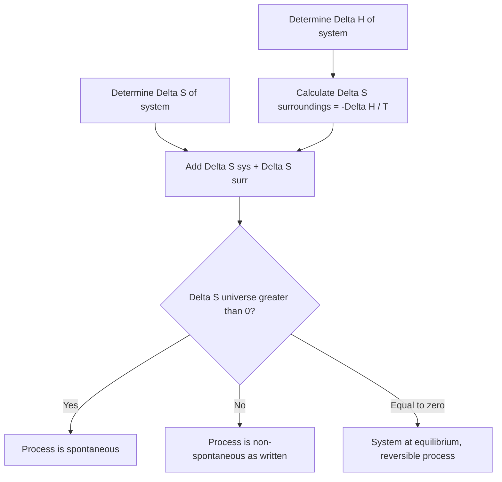

## Entropy and the Second Law of Thermodynamics

### Foundational Concept

Entropy ($S$) is a thermodynamic state function that quantifies the degree of energy dispersal or the number of microscopic arrangements (microstates) available to a system consistent with its macroscopic state. Colloquially, entropy is often described as a measure of "disorder" or "randomness," though the more rigorous statistical mechanical interpretation defines it in terms of the number of accessible microstates.

### Statistical Definition of Entropy (Boltzmann's Equation)

$$S = k_B \ln W$$

where $k_B$ is the Boltzmann constant ($1.381 \times 10^{-23}$ J/K) and $W$ is the number of microstates (distinct microscopic arrangements of atoms/molecules) corresponding to a given macrostate. A system with more possible microstates has higher entropy. This equation, engraved on Boltzmann's tombstone, provides the statistical-mechanical foundation underlying the macroscopic, thermodynamic treatment of entropy used in most general chemistry contexts.

### The Second Law of Thermodynamics

The second law of thermodynamics states that **the total entropy of the universe (system plus surroundings) increases for any spontaneous process**, and remains constant only for a purely reversible (idealized) process:

$$\Delta S_{universe} = \Delta S_{system} + \Delta S_{surroundings} > 0 \quad \text{(spontaneous process)}$$

$$\Delta S_{universe} = 0 \quad \text{(reversible process, idealized limiting case)}$$

$$\Delta S_{universe} < 0 \quad \text{(non-spontaneous in the forward direction)}$$

This is a directional statement: unlike the first law (energy conservation, which permits processes in either direction with no restriction), the second law identifies which direction a process will proceed spontaneously — it establishes the "arrow of time" for macroscopic thermodynamic processes.

### The Third Law of Thermodynamics (Reference Point)

The **third law of thermodynamics** states that the entropy of a perfect crystalline substance at absolute zero (0 K) is exactly zero:

$$S(0 \text{ K, perfect crystal}) = 0$$

This provides an absolute reference point, allowing **standard molar entropies** ($S^\circ$) to be tabulated as absolute values (unlike enthalpy, for which only *changes*, $\Delta H$, are typically meaningful, since there is no natural zero-point reference).

### Factors Affecting Entropy

Entropy generally increases with:

1. **Increasing temperature** — greater thermal motion increases the number of accessible microstates.
2. **Phase changes toward greater freedom of motion**: $S_{solid} < S_{liquid} < S_{gas}$, since gases have the least positional and orientational restriction.
3. **Increasing volume** (for gases) — more space allows more possible positions for particles, increasing the number of accessible microstates.
4. **Increasing number of gas moles** in a reaction — more independent particles generally means more accessible microstates.
5. **Increasing molecular complexity** — larger, more complex molecules generally have more vibrational and rotational modes.
6. **Dissolution of a solid or liquid into solution** — generally increases entropy relative to the pure separated substances, due to increased dispersal, though the specific magnitude depends on solute–solvent interactions.
7. **Mixing of substances** — mixing of different gases or miscible liquids increases entropy relative to the unmixed state, since the number of arrangements increases.

### Predicting the Sign of ΔS for a Reaction

A reliable heuristic: examine the **change in moles of gas** ($\Delta n_{gas}$) between products and reactants.

- $\Delta n_{gas} > 0$: entropy of the system generally increases ($\Delta S_{sys} > 0$)
- $\Delta n_{gas} < 0$: entropy of the system generally decreases ($\Delta S_{sys} < 0$)
- $\Delta n_{gas} = 0$: entropy change is typically small in magnitude and requires more detailed analysis (e.g., molecular complexity comparison) to predict the sign confidently.

**Worked Example 1: Predicting Sign of ΔS**

Predict the sign of $\Delta S$ for:

$$2SO_2(g) + O_2(g) \rightarrow 2SO_3(g)$$

$$\Delta n_{gas} = 2 - (2+1) = -1$$

Since gas moles decrease, $\Delta S_{sys} < 0$ (entropy decreases) — consistent with fewer independent gas particles existing after the reaction.

### Calculating ΔS°rxn from Standard Molar Entropies

Analogous to the enthalpy of formation approach, the standard entropy change of a reaction is calculated from tabulated standard molar entropy values ($S^\circ$, in J/(mol·K)):

$$\Delta S^\circ_{rxn} = \sum n_p S^\circ(\text{products}) - \sum n_r S^\circ(\text{reactants})$$

**Important distinction from enthalpy of formation:** unlike $\Delta H^\circ_f$, the standard molar entropy $S^\circ$ of an element in its standard state is **not** zero — it is a positive absolute value (a consequence of the third law reference point being 0 K, not the standard state of elements).

### Worked Example 2: ΔS°rxn Calculation

Calculate $\Delta S^\circ_{rxn}$ for:

$$N_2(g) + 3H_2(g) \rightarrow 2NH_3(g)$$

Given: $S^\circ[N_2(g)] = 191.6$ J/(mol·K), $S^\circ[H_2(g)] = 130.7$ J/(mol·K), $S^\circ[NH_3(g)] = 192.8$ J/(mol·K).

$$\Delta S^\circ_{rxn} = [2(192.8)] - [(191.6) + 3(130.7)]$$

$$\Delta S^\circ_{rxn} = 385.6 - [191.6 + 392.1]$$

$$\Delta S^\circ_{rxn} = 385.6 - 583.7 = -198.1 \text{ J/K}$$

The negative value is consistent with the prediction from $\Delta n_{gas} = 2 - 4 = -2$ (a decrease in gas moles, correctly predicting decreased entropy).

### Entropy Change of the Surroundings

The entropy change of the surroundings is related to the heat exchanged with the system at constant temperature and pressure:

$$\Delta S_{surroundings} = \frac{-\Delta H_{system}}{T}$$

The negative sign reflects that heat released by the system (negative $\Delta H_{sys}$ for exothermic reactions) is absorbed by the surroundings, increasing the surroundings' entropy — and vice versa for endothermic reactions.

### Worked Example 3: Total Entropy Change of the Universe

For the reaction in Worked Example 2 ($\Delta S^\circ_{sys} = -198.1$ J/K), given $\Delta H^\circ_{rxn} = -92.2$ kJ at $T = 298$ K, determine $\Delta S_{universe}$ and assess spontaneity.

$$\Delta S_{surr} = \frac{-\Delta H_{sys}}{T} = \frac{-(-92{,}200 \text{ J})}{298 \text{ K}} = 309.4 \text{ J/K}$$

$$\Delta S_{universe} = \Delta S_{sys} + \Delta S_{surr} = -198.1 + 309.4 = 111.3 \text{ J/K}$$

Since $\Delta S_{universe} > 0$, the reaction is spontaneous at 298 K, despite the system's own entropy decreasing — the large amount of heat released to the surroundings drives an even greater increase in the surroundings' entropy, resulting in a net positive total.

### The Interplay of Enthalpy, Entropy, and Spontaneity

This example illustrates a key conceptual point: **entropy of the system decreasing does not automatically make a process non-spontaneous.** Spontaneity depends on the **total** entropy change of the universe, which combines both system and surroundings contributions. This relationship is formalized through Gibbs free energy:

$$\Delta G = \Delta H - T\Delta S_{system}$$

which is mathematically derived by multiplying $\Delta S_{universe} = \Delta S_{sys} + \Delta S_{surr}$ by $-T$ (with $\Delta S_{surr} = -\Delta H_{sys}/T$), giving $-T\Delta S_{universe} = \Delta H_{sys} - T\Delta S_{sys} = \Delta G$. A process is spontaneous when $\Delta G < 0$, which is equivalent to $\Delta S_{universe} > 0$.

### Entropy Trends: A Comparative Table

| Process/Comparison | Entropy Change | Reasoning |
| --- | --- | --- |
| Ice → liquid water | $\Delta S > 0$ | Solid to liquid; increased molecular freedom |
| Liquid water → steam | $\Delta S > 0$ | Liquid to gas; large increase in volume/freedom |
| $CaCO_3(s) \rightarrow CaO(s) + CO_2(g)$ | $\Delta S > 0$ | Gas produced from solid reactant |
| Dissolving NaCl(s) in water | $\Delta S > 0$ | Ion dispersal into solution increases disorder |
| $N_2(g) + 3H_2(g) \rightarrow 2NH_3(g)$ | $\Delta S < 0$ | Gas moles decrease (4 mol → 2 mol) |
| Gas compressed to smaller volume | $\Delta S < 0$ | Fewer possible positions for gas particles |
| Cooling a substance | $\Delta S < 0$ | Reduced thermal motion, fewer accessible microstates |

### Entropy and Spontaneity Decision Diagram

### Common Pitfalls

- **Equating entropy with simple visual "messiness"** — the rigorous definition concerns the number of accessible microstates, which correlates with but is not identical to intuitive notions of disorder.
- **Assuming $S^\circ = 0$ for elements in standard states** — this convention applies to $\Delta H^\circ_f$, **not** to $S^\circ$; all substances, including elements, have positive absolute standard entropy values (except at exactly 0 K for a perfect crystal).
- **Concluding a reaction is non-spontaneous solely because $\Delta S_{system} < 0$** — spontaneity depends on $\Delta S_{universe}$ (or equivalently $\Delta G$), not $\Delta S_{system}$ alone.
- **Forgetting the negative sign** in $\Delta S_{surr} = -\Delta H_{sys}/T$, leading to sign errors when combining with $\Delta S_{sys}$.
- **Applying $\Delta S_{surr} = -\Delta H/T$ at non-constant temperature** — this simplified relationship assumes the surroundings act as a large thermal reservoir at constant $T$; more advanced treatments are required if this assumption is invalid.
- **Confusing the second law's statement about the universe with a claim about individual systems** — local entropy decreases (e.g., within a system, or within a refrigerator) are thermodynamically permitted as long as the total entropy of system plus surroundings increases.

**Related Topics**

- The first law of thermodynamics and enthalpy
- Hess's Law and enthalpy of formation
- Gibbs free energy and reaction spontaneity
- Standard molar entropy tables and reference data
- Phase transitions and entropy of fusion/vaporization
- Statistical mechanics and the Boltzmann distribution
- Free energy and equilibrium constants ($\Delta G^\circ = -RT\ln K$)
- Third law of thermodynamics and absolute zero