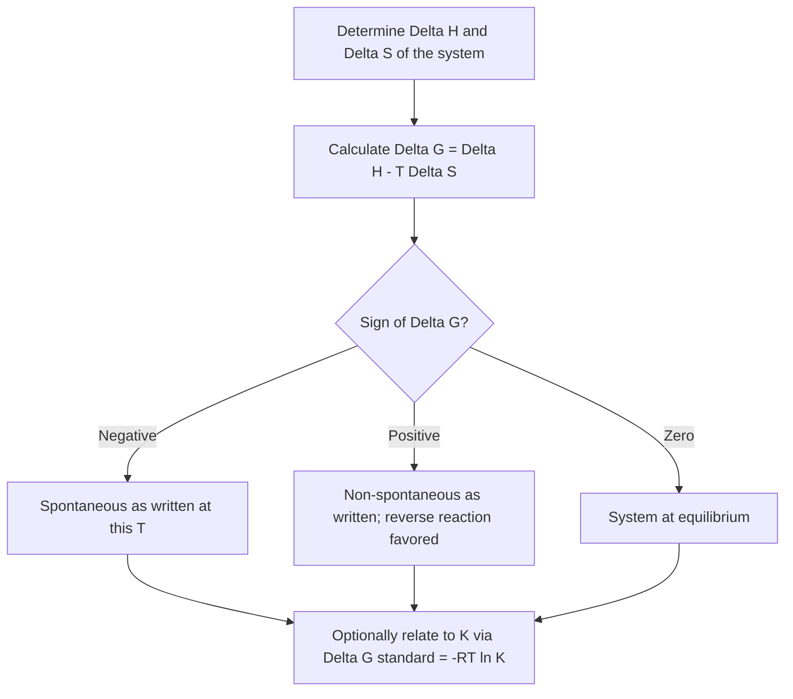

## Gibbs Free Energy

### Foundational Concept

Gibbs free energy ($G$) is a thermodynamic state function that combines enthalpy and entropy into a single quantity capable of predicting the spontaneity of a process at constant temperature and pressure — without requiring separate calculation of the surroundings' entropy change. It is defined as:

$$G = H - TS$$

For a process occurring at constant temperature, the change in Gibbs free energy is:

$$\Delta G = \Delta H - T\Delta S$$

where $\Delta H$ is the enthalpy change of the system, $T$ is the absolute temperature (kelvin), and $\Delta S$ is the entropy change of the system.

### Derivation from the Second Law

Gibbs free energy is derived directly from the second law of thermodynamics. Recall that for a spontaneous process at constant $T$ and $P$:

$$\Delta S_{universe} = \Delta S_{sys} + \Delta S_{surr} > 0$$

Since $\Delta S_{surr} = \dfrac{-\Delta H_{sys}}{T}$ at constant pressure:

$$\Delta S_{universe} = \Delta S_{sys} - \frac{\Delta H_{sys}}{T}$$

Multiplying both sides by $-T$ (which reverses the inequality since $T > 0$):

$$-T\Delta S_{universe} = \Delta H_{sys} - T\Delta S_{sys} = \Delta G$$

Since $\Delta S_{universe} > 0$ for a spontaneous process, $-T\Delta S_{universe} < 0$, meaning:

$$\Delta G < 0 \quad \text{(spontaneous process, constant T and P)}$$

This shows that $\Delta G$ is simply a restatement of the second law expressed entirely in terms of the system, eliminating the need to separately evaluate the surroundings.

### Spontaneity Criteria

| $\Delta G$ | Spontaneity |
| --- | --- |
| $\Delta G < 0$ | Spontaneous (favorable) in the forward direction as written |
| $\Delta G > 0$ | Non-spontaneous in the forward direction (spontaneous in reverse) |
| $\Delta G = 0$ | System is at equilibrium; no net driving force in either direction |

**Important clarification:** "Spontaneous" in the thermodynamic sense means a process is thermodynamically favorable and will occur without continuous external energy input — it says nothing about the **rate** at which the process occurs. A reaction can be thermodynamically spontaneous yet proceed so slowly (due to high activation energy) that it appears not to occur at all on observable timescales — this is a matter of kinetics, not thermodynamics.

### The Four Sign Combinations of ΔH and ΔS

Since $\Delta G = \Delta H - T\Delta S$, the spontaneity of a reaction can depend on temperature, depending on the signs of $\Delta H$ and $\Delta S$:

| $\Delta H$ | $\Delta S$ | $\Delta G = \Delta H - T\Delta S$ | Spontaneity |
| --- | --- | --- | --- |
| Negative (exothermic) | Positive | Always negative | Spontaneous at all temperatures |
| Positive (endothermic) | Negative | Always positive | Non-spontaneous at all temperatures |
| Negative (exothermic) | Negative | Depends on $T$ | Spontaneous at low $T$, non-spontaneous at high $T$ |
| Positive (endothermic) | Positive | Depends on $T$ | Non-spontaneous at low $T$, spontaneous at high $T$ |

### Worked Example 1: Classifying Spontaneity by Sign Combination

For the decomposition of calcium carbonate:

$$CaCO_3(s) \rightarrow CaO(s) + CO_2(g)$$

$\Delta H = +178.3$ kJ (endothermic — bond breaking dominates) and $\Delta S = +160.5$ J/K (entropy increases due to gas production). Which sign category applies, and what does this predict?

This falls into the "Positive $\Delta H$, Positive $\Delta S$" category — non-spontaneous at low temperature, spontaneous at high temperature. This matches the known behavior of limestone calcination, which requires high-temperature kiln conditions (industrially, roughly 1000°C) to proceed favorably.

### Calculating the Crossover Temperature

For reactions in the temperature-dependent categories, the temperature at which the reaction switches from non-spontaneous to spontaneous (or vice versa) — the point where $\Delta G = 0$ — can be estimated by:

$$T = \frac{\Delta H}{\Delta S}$$

(assuming $\Delta H$ and $\Delta S$ are approximately temperature-independent over the range considered, a common simplifying approximation for moderate temperature ranges).

**Worked Example 2:**

Using the values from Worked Example 1 ($\Delta H = +178.3$ kJ = 178,300 J, $\Delta S = +160.5$ J/K), calculate the minimum temperature at which decomposition becomes spontaneous.

$$T = \frac{\Delta H}{\Delta S} = \frac{178{,}300 \text{ J}}{160.5 \text{ J/K}} = 1111 \text{ K} \approx 838°C$$

Above approximately 1111 K, $\Delta G$ becomes negative and the decomposition proceeds spontaneously; below this temperature, the reverse reaction (formation of $CaCO_3$) is favored.

### Worked Example 3: Direct ΔG Calculation

Calculate $\Delta G$ at 298 K for a reaction with $\Delta H = -92.2$ kJ and $\Delta S = -198.1$ J/K.

**Unit consistency check:** $\Delta H$ is in kJ, while $\Delta S$ is in J/K — convert $\Delta S$ to kJ/K before combining, or convert $\Delta H$ to J.

$$\Delta S = -198.1 \text{ J/K} = -0.1981 \text{ kJ/K}$$

$$\Delta G = \Delta H - T\Delta S = -92.2 \text{ kJ} - (298 \text{ K})(-0.1981 \text{ kJ/K})$$

$$\Delta G = -92.2 \text{ kJ} + 59.05 \text{ kJ} = -33.2 \text{ kJ}$$

Since $\Delta G < 0$, the reaction is spontaneous at 298 K (this is the Haber process, $N_2 + 3H_2 \rightarrow 2NH_3$, which falls into the "negative $\Delta H$, negative $\Delta S$" category — spontaneous at low temperature but becomes less favorable as temperature increases).

### Standard Gibbs Free Energy of Formation

Analogous to standard enthalpy of formation, the **standard Gibbs free energy of formation** ($\Delta G^\circ_f$) is the free energy change when 1 mole of a compound forms from its elements in their standard states, with $\Delta G^\circ_f = 0$ by definition for elements in their standard states.

$$\Delta G^\circ_{rxn} = \sum n_p \Delta G^\circ_f(\text{products}) - \sum n_r \Delta G^\circ_f(\text{reactants})$$

This provides a second, independent method (alongside the $\Delta H - T\Delta S$ approach) for calculating $\Delta G^\circ_{rxn}$, valid specifically at the standard reference temperature (usually 298 K) for which the tabulated $\Delta G^\circ_f$ values apply.

### Worked Example 4: ΔG°rxn from Formation Values

Calculate $\Delta G^\circ_{rxn}$ for the combustion of methane at 298 K:

$$CH_4(g) + 2O_2(g) \rightarrow CO_2(g) + 2H_2O(l)$$

Given: $\Delta G^\circ_f[CH_4(g)] = -50.8$ kJ/mol, $\Delta G^\circ_f[CO_2(g)] = -394.4$ kJ/mol, $\Delta G^\circ_f[H_2O(l)] = -237.1$ kJ/mol.

$$\Delta G^\circ_{rxn} = [(-394.4) + 2(-237.1)] - [(-50.8) + 0]$$

$$\Delta G^\circ_{rxn} = [-394.4 - 474.2] + 50.8$$

$$\Delta G^\circ_{rxn} = -868.6 + 50.8 = -817.8 \text{ kJ}$$

The large negative value confirms methane combustion is strongly spontaneous under standard conditions — consistent with its use as a combustion fuel.

### Gibbs Free Energy and the Equilibrium Constant

$\Delta G^\circ$ is quantitatively related to the equilibrium constant $K$ of a reaction:

$$\Delta G^\circ = -RT\ln K$$

where $R = 8.314$ J/(mol·K) and $T$ is in kelvin. Rearranged to solve for $K$:

$$K = e^{-\Delta G^\circ / RT}$$

This relationship shows that:

- A very negative $\Delta G^\circ$ corresponds to $K \gg 1$ (reaction strongly favors products at equilibrium).
- A very positive $\Delta G^\circ$ corresponds to $K \ll 1$ (reaction strongly favors reactants at equilibrium).
- $\Delta G^\circ = 0$ corresponds to $K = 1$.

### Worked Example 5: Calculating K from ΔG°

Using $\Delta G^\circ_{rxn} = -817.8$ kJ = $-817{,}800$ J from Worked Example 4, estimate the equilibrium constant at 298 K.

$$K = e^{-\Delta G^\circ/RT} = e^{-(-817{,}800)/[(8.314)(298)]} = e^{330.1}$$

This yields an astronomically large value of $K$ (far exceeding standard calculator precision), consistent with methane combustion proceeding essentially to completion — the reaction is not meaningfully reversible under standard conditions. [This illustrates the sensitivity of $K$ to $\Delta G^\circ$ magnitude; the calculation is mathematically valid, though such extreme $K$ values have limited practical interpretive use beyond confirming near-total conversion to products.]

### Relating ΔG (Non-Standard Conditions) to ΔG° and Reaction Quotient Q

Under non-standard conditions (concentrations or pressures differing from 1 M / 1 atm), the actual free energy change is given by:

$$\Delta G = \Delta G^\circ + RT\ln Q$$

where $Q$ is the reaction quotient, calculated the same way as $K$ but using the actual (non-equilibrium) concentrations or pressures at a given moment. At equilibrium, $Q = K$ and $\Delta G = 0$, which is the condition from which $\Delta G^\circ = -RT\ln K$ is derived.

### Gibbs Free Energy Decision Flow

### Common Pitfalls

- **Unit mismatch between $\Delta H$ (kJ) and $\Delta S$ (J/K)** — a very common arithmetic error; always convert to consistent units before combining in $\Delta G = \Delta H - T\Delta S$.
- **Confusing thermodynamic spontaneity with reaction rate** — a spontaneous reaction ($\Delta G < 0$) is not necessarily a fast reaction; kinetics (activation energy, catalysts) determines rate, which is an entirely separate consideration from thermodynamic favorability.
- **Assuming $\Delta H$ and $\Delta S$ are strongly temperature-dependent** in typical general-chemistry-level problems — the widely used approximation treats them as roughly constant over moderate temperature ranges, which is standard practice but becomes less accurate over very large temperature ranges or across phase changes.
- **Misapplying $\Delta G^\circ_f = 0$** — this convention applies only to elements in their standard states, exactly as with $\Delta H^\circ_f$.
- **Forgetting that $\Delta G^\circ = -RT\ln K$ uses standard-state conditions** — for reaction conditions that deviate from standard state, the reaction quotient $Q$ and the non-standard equation $\Delta G = \Delta G^\circ + RT\ln Q$ must be used instead.
- **Misinterpreting $\Delta G = 0$** as "the reaction stops" — it indicates the system has reached **equilibrium**, where forward and reverse reaction rates are equal, not that all molecular activity ceases.

**Related Topics**

- Entropy and the second law of thermodynamics
- The first law of thermodynamics and enthalpy
- Hess's Law and enthalpy of formation
- Chemical equilibrium and the equilibrium constant K
- Reaction quotient Q and predicting reaction direction
- Le Chatelier's Principle
- Kinetics: activation energy and reaction rates
- Electrochemistry and the relationship between ΔG and cell potential (ΔG = -nFE°)