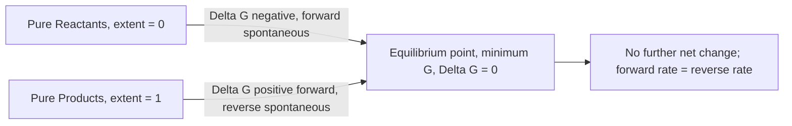

## Spontaneity and Its Relation to Equilibrium

### Foundational Concept

Spontaneity and equilibrium are two intimately connected concepts in thermodynamics: a spontaneous process is one that proceeds in a given direction without continuous external intervention, while equilibrium is the state a spontaneous process ultimately reaches — the point at which no further net change occurs because the driving force for change (the free energy difference between current and equilibrium states) has been exhausted. Every spontaneous process moves a system *toward* equilibrium, never away from it.

### Gibbs Free Energy as the Unifying Criterion

The Gibbs free energy change, $\Delta G$, provides the quantitative link between spontaneity and equilibrium at constant temperature and pressure:

$$\Delta G < 0 \quad \text{spontaneous (forward direction proceeds)}$$

$$\Delta G > 0 \quad \text{non-spontaneous (reverse direction proceeds)}$$

$$\Delta G = 0 \quad \text{system at equilibrium}$$

At equilibrium, the forward and reverse reactions occur at equal rates, and there is no net thermodynamic driving force pushing the system further toward products or reactants — this is precisely why $\Delta G = 0$ marks equilibrium.

### The Free Energy Curve: G vs. Extent of Reaction

A conceptually essential way to visualize the relationship is to plot Gibbs free energy of the reaction mixture against the **extent of reaction** (the degree to which reactants have converted to products, ranging from pure reactants to pure products). This curve is generally not a straight line — it curves due to the entropy of mixing between reactants and products — and it has a **minimum point**.

- To the **left** of the minimum (mixture is reactant-rich): the slope of the curve ($\Delta G$) is negative, so the forward reaction is spontaneous, driving the system rightward (toward more products).
- To the **right** of the minimum (mixture is product-rich): the slope is positive, so the *reverse* reaction is spontaneous, driving the system leftward (back toward more reactants).
- **At the minimum**: the slope is exactly zero — this is the equilibrium position, where $\Delta G = 0$ and neither direction is favored.

This is the essential geometric picture: **equilibrium is the point of minimum Gibbs free energy for the reaction system**, and any deviation from that point is met with a spontaneous "pull" back toward it.

### Distinguishing ΔG and ΔG°

A critical distinction underlies this topic: **$\Delta G^\circ$ is a fixed constant** for a given reaction at a given temperature (calculated from standard-state formation values or from $\Delta H^\circ - T\Delta S^\circ$), while **$\Delta G$ is a variable** that depends on the actual, instantaneous composition of the reaction mixture at any given moment. These are related through the reaction quotient $Q$:

$$\Delta G = \Delta G^\circ + RT\ln Q$$

- Far from equilibrium (mixture heavily skewed toward reactants or products relative to the equilibrium ratio), $\Delta G$ can be large in magnitude (strongly negative or strongly positive).
- As the reaction proceeds and $Q$ approaches $K$, $\Delta G$ approaches zero.
- At equilibrium exactly, $Q = K$ and $\Delta G = 0$.

Substituting $Q = K$ and $\Delta G = 0$ into the equation above yields the standard relationship between $\Delta G^\circ$ and the equilibrium constant:

$$0 = \Delta G^\circ + RT\ln K \quad \Rightarrow \quad \Delta G^\circ = -RT\ln K$$

### Interpreting the Magnitude and Sign of ΔG°

Because $\Delta G^\circ$ and $K$ are related exponentially ($K = e^{-\Delta G^\circ/RT}$), the sign and magnitude of $\Delta G^\circ$ indicate **where the equilibrium position lies** relative to a 1:1 (standard-state) reactant-to-product ratio — not whether the reaction "goes to completion" in an absolute sense.

| $\Delta G^\circ$ | $K$ | Equilibrium Position |
| --- | --- | --- |
| Large negative | $K \gg 1$ | Strongly favors products at equilibrium |
| Small negative | $K$ slightly $> 1$ | Slightly favors products |
| Zero | $K = 1$ | Equal mix of reactants and products at equilibrium (standard-state balance point) |
| Small positive | $K$ slightly $< 1$ | Slightly favors reactants |
| Large positive | $K \ll 1$ | Strongly favors reactants at equilibrium |

**Key conceptual point:** even a reaction with $\Delta G^\circ > 0$ (non-spontaneous under standard conditions) still reaches an equilibrium state — it is simply an equilibrium that lies far toward the reactant side. No real reaction proceeds to 100% completion or 0% conversion in a strict sense; $K$ is never exactly zero or infinite for a real, finite-energy chemical process.

### Worked Example 1: Using Q to Predict Reaction Direction

For a reaction with $K = 4.0 \times 10^{-3}$ at a given temperature, a reaction mixture currently has $Q = 1.2 \times 10^{-5}$. Predict the direction the reaction will proceed to reach equilibrium.

Since $Q < K$, the mixture has a lower proportion of products relative to reactants than at equilibrium — the reaction must proceed **forward** (toward products) to increase $Q$ until it equals $K$.

This can also be confirmed via $\Delta G$: since $Q < K$, $\ln Q < \ln K$, and because $\Delta G^\circ = -RT\ln K$:

$$\Delta G = \Delta G^\circ + RT\ln Q = -RT\ln K + RT\ln Q = RT\ln\left(\frac{Q}{K}\right)$$

Since $Q/K < 1$, $\ln(Q/K) < 0$, so $\Delta G < 0$ — confirming the forward reaction is spontaneous under these conditions.

### Worked Example 2: Quantitative ΔG Calculation Away From Equilibrium

A reaction has $\Delta G^\circ = -10.0$ kJ/mol at 298 K. At a particular moment, $Q = 50.0$. Calculate $\Delta G$ and determine the direction of spontaneous change.

$$\Delta G = \Delta G^\circ + RT\ln Q$$

$$\Delta G = -10{,}000 \text{ J/mol} + (8.314 \text{ J/(mol·K)})(298 \text{ K})\ln(50.0)$$

$$\Delta G = -10{,}000 + (2477.6)(3.912)$$

$$\Delta G = -10{,}000 + 9691 = -309 \text{ J/mol}$$

Since $\Delta G$ is still slightly negative, the forward reaction remains (weakly) spontaneous — the system has not yet reached equilibrium, though it is close (small $|\Delta G|$ indicates the mixture is near the equilibrium composition).

### The Relationship Summarized as a Single Continuum

Spontaneity and equilibrium should be understood as two views of the same underlying phenomenon rather than separate topics:

- **Spontaneity** describes the *direction* of net change at a given composition (governed by the sign of $\Delta G$ at that specific composition).
- **Equilibrium** describes the *endpoint* of that spontaneous change — the unique composition at which $\Delta G = 0$ and no further net direction is favored.
- **$K$** is simply the numerical "address" of that endpoint, expressed as a ratio of product to reactant activities/concentrations/pressures.

### Temperature Dependence of the Equilibrium Position

Because $\Delta G^\circ = \Delta H^\circ - T\Delta S^\circ$, and $\Delta G^\circ = -RT\ln K$, combining these gives the **van't Hoff-type relationship** showing how $K$ depends on temperature:

$$\ln K = \frac{-\Delta H^\circ}{RT} + \frac{\Delta S^\circ}{R}$$

This shows that for an exothermic reaction ($\Delta H^\circ < 0$), increasing temperature decreases $K$ (equilibrium shifts toward reactants), while for an endothermic reaction ($\Delta H^\circ > 0$), increasing temperature increases $K$ (equilibrium shifts toward products) — consistent with the qualitative predictions of Le Chatelier's Principle applied to temperature changes, now placed on a quantitative thermodynamic footing.

### Worked Example 3: Full Cycle — From ΔH, ΔS to K and Equilibrium Position

A reaction has $\Delta H^\circ = -50.0$ kJ and $\Delta S^\circ = -120.0$ J/K at 298 K. Determine $\Delta G^\circ$, calculate $K$, and interpret the equilibrium position.

**Step 1 — Calculate ΔG°:**

$$\Delta G^\circ = \Delta H^\circ - T\Delta S^\circ = -50{,}000 \text{ J} - (298)(-120.0 \text{ J/K})$$

$$\Delta G^\circ = -50{,}000 + 35{,}760 = -14{,}240 \text{ J} = -14.24 \text{ kJ}$$

**Step 2 — Calculate K:**

$$K = e^{-\Delta G^\circ/RT} = e^{-(-14{,}240)/[(8.314)(298)]} = e^{5.748} = 313.4$$

**Step 3 — Interpret:**

Since $K = 313.4 \gg 1$, the equilibrium position favors products substantially, consistent with the moderately negative $\Delta G^\circ$ value. The reaction is thermodynamically favorable in the forward direction under standard conditions.

### Common Pitfalls

- **Treating $\Delta G < 0$ as meaning the reaction "goes to completion"** — spontaneity indicates only the direction of net change from the current state; the reaction still proceeds only until equilibrium (where $\Delta G = 0$), not until reactants are fully consumed, unless $K$ happens to be extremely large.
- **Confusing $\Delta G^\circ$ (a fixed reference value at standard-state composition) with $\Delta G$ (the actual free energy change at the current, possibly non-standard, composition)** — these are numerically identical only in the special case where $Q = 1$ (i.e., $\ln Q = 0$).
- **Assuming a reaction with $\Delta G^\circ > 0$ cannot occur at all** — it can and does occur, forming some amount of product until reaching its (reactant-favored) equilibrium position; $\Delta G^\circ > 0$ does not mean zero reaction, only that $K < 1$.
- **Forgetting that at equilibrium, $Q = K$, not $Q = 0$ or $Q = \infty$** — both reactants and products are present at equilibrium (in general), with their ratio fixed by $K$.
- **Neglecting the sign relationship in $\Delta G = RT\ln(Q/K)$** — a common derived shortcut useful for confirming the direction of spontaneous change without recalculating from formation values each time.
- **Assuming $\Delta H^\circ$ and $\Delta S^\circ$ are temperature-independent over very large temperature ranges** when using the van't Hoff-type relationship — this is a standard simplifying approximation valid over moderate ranges, but accuracy degrades further from the reference temperature.

**Related Topics**

- Gibbs free energy
- Entropy and the second law of thermodynamics
- Chemical equilibrium and the equilibrium constant K
- Reaction quotient Q and predicting reaction direction
- Le Chatelier's Principle
- Van't Hoff equation and temperature dependence of K
- The first law of thermodynamics and enthalpy
- Electrochemistry: relating ΔG° to standard cell potential