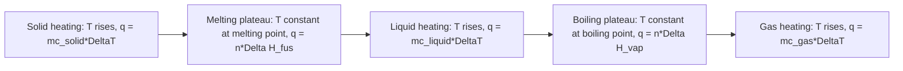

## Thermodynamics of Phase Changes

### Foundational Concept

A phase change (or phase transition) is a physical transformation between the solid, liquid, and gas states of a substance, occurring without a change in chemical composition. Phase changes are governed by the same thermodynamic principles as chemical reactions — enthalpy, entropy, and Gibbs free energy — but occur at a fixed temperature (at constant pressure) for a pure substance, since two phases coexist in equilibrium during the transition.

### Types of Phase Changes

| Transition | Name | Direction | Enthalpy Sign |
| --- | --- | --- | --- |
| Solid → Liquid | Fusion (melting) | Absorbs heat | $\Delta H_{fus} > 0$ |
| Liquid → Solid | Freezing (solidification) | Releases heat | $-\Delta H_{fus} < 0$ |
| Liquid → Gas | Vaporization | Absorbs heat | $\Delta H_{vap} > 0$ |
| Gas → Liquid | Condensation | Releases heat | $-\Delta H_{vap} < 0$ |
| Solid → Gas | Sublimation | Absorbs heat | $\Delta H_{sub} > 0$ |
| Gas → Solid | Deposition | Releases heat | $-\Delta H_{sub} < 0$ |

All phase changes from a more ordered to a less ordered state (fusion, vaporization, sublimation) are **endothermic**, since energy must be supplied to overcome intermolecular attractive forces holding the more condensed phase together. The reverse transitions are **exothermic**, releasing the same magnitude of energy as intermolecular attractions reform.

### Enthalpy of Phase Changes

The **molar enthalpy of fusion** ($\Delta H_{fus}$) is the heat required to convert 1 mole of a solid into a liquid at its melting point. The **molar enthalpy of vaporization** ($\Delta H_{vap}$) is the heat required to convert 1 mole of a liquid into a gas at its boiling point. Both are always positive values by convention (heat absorbed by the substance undergoing the transition).

**Approximate relationship:** $\Delta H_{sub} \approx \Delta H_{fus} + \Delta H_{vap}$ (Hess's Law applied to the two-step pathway solid → liquid → gas being thermodynamically equivalent to the single-step solid → gas pathway, since enthalpy is a state function).

### Sublimation as a Hess's Law Application

**Worked Example 1:**

Given $\Delta H_{fus}[H_2O] = 6.01$ kJ/mol and $\Delta H_{vap}[H_2O] = 40.7$ kJ/mol, estimate $\Delta H_{sub}$ for ice subliming directly to water vapor.

$$\Delta H_{sub} = \Delta H_{fus} + \Delta H_{vap} = 6.01 + 40.7 = 46.7 \text{ kJ/mol}$$

This is consistent with the accepted literature value for the sublimation enthalpy of water/ice (approximately 46–51 kJ/mol depending on temperature), confirming the Hess's Law relationship. [The relationship is exact in principle when all quantities are measured at the same temperature; small discrepancies commonly arise from tabulated values being referenced at slightly different temperatures.]

### Heating Curves

A **heating curve** plots temperature against heat added at constant pressure, illustrating both temperature changes within a single phase and the constant-temperature plateaus that occur during phase transitions.

**Key conceptual point:** during a phase-change plateau, all heat added goes into overcoming intermolecular forces (increasing potential energy between particles) rather than increasing average kinetic energy — this is precisely why temperature remains constant throughout the transition despite continued heat input.

### Worked Example 2: Multi-Step Heating Curve Calculation

Calculate the total heat required to convert 25.0 g of ice at −10.0°C into steam at 120.0°C. Given: $c_{ice} = 2.09$ J/(g·°C), $c_{water} = 4.184$ J/(g·°C), $c_{steam} = 1.996$ J/(g·°C), $\Delta H_{fus} = 6.01$ kJ/mol, $\Delta H_{vap} = 40.7$ kJ/mol, $M(H_2O) = 18.02$ g/mol.

**Step 1 — Heat ice from −10.0°C to 0.0°C:**

$$q_1 = mc_{ice}\Delta T = (25.0)(2.09)(10.0) = 522.5 \text{ J}$$

**Step 2 — Melt ice at 0.0°C:**

$$n = \frac{25.0 \text{ g}}{18.02 \text{ g/mol}} = 1.387 \text{ mol}$$

$$q_2 = n\Delta H_{fus} = (1.387)(6.01 \text{ kJ/mol}) = 8.336 \text{ kJ} = 8336 \text{ J}$$

**Step 3 — Heat liquid water from 0.0°C to 100.0°C:**

$$q_3 = mc_{water}\Delta T = (25.0)(4.184)(100.0) = 10{,}460 \text{ J}$$

**Step 4 — Vaporize water at 100.0°C:**

$$q_4 = n\Delta H_{vap} = (1.387)(40.7 \text{ kJ/mol}) = 56.45 \text{ kJ} = 56{,}450 \text{ J}$$

**Step 5 — Heat steam from 100.0°C to 120.0°C:**

$$q_5 = mc_{steam}\Delta T = (25.0)(1.996)(20.0) = 998.0 \text{ J}$$

**Total heat:**

$$q_{total} = q_1 + q_2 + q_3 + q_4 + q_5$$

$$q_{total} = 522.5 + 8336 + 10{,}460 + 56{,}450 + 998.0 = 76{,}767 \text{ J} \approx 76.8 \text{ kJ}$$

This calculation demonstrates that the phase-change steps (melting and especially vaporization) typically require far more energy than simply heating within a single phase, reflecting the substantial energy needed to overcome intermolecular attractive forces.

### Entropy of Phase Changes

At the temperature of a phase transition (where the two phases are in equilibrium and $\Delta G = 0$), the entropy change of the transition can be calculated directly:

$$\Delta G = \Delta H - T\Delta S = 0 \quad \Rightarrow \quad \Delta S_{transition} = \frac{\Delta H_{transition}}{T_{transition}}$$

This is a particularly clean application of the equilibrium condition $\Delta G = 0$, since a substance at its exact melting or boiling point (with both phases present) is, by definition, at a phase equilibrium.

### Worked Example 3: Entropy of Vaporization

Calculate $\Delta S_{vap}$ for water, given $\Delta H_{vap} = 40.7$ kJ/mol and a normal boiling point of 373.15 K.

$$\Delta S_{vap} = \frac{\Delta H_{vap}}{T_{bp}} = \frac{40{,}700 \text{ J/mol}}{373.15 \text{ K}} = 109.1 \text{ J/(mol·K)}$$

This positive value is consistent with the expected large entropy increase accompanying the liquid-to-gas transition, where molecular freedom of motion increases substantially.

### Trouton's Rule

An empirical generalization, **Trouton's Rule**, observes that many liquids (particularly nonpolar or weakly associating ones) have a molar entropy of vaporization of approximately 85–88 J/(mol·K) at their normal boiling point:

$$\Delta S_{vap} \approx 85\text{–}88 \text{ J/(mol·K)}$$

Substances that deviate substantially from this value — such as water (109 J/(mol·K), calculated above) — typically do so because of strong, structured intermolecular interactions (e.g., hydrogen bonding) in the liquid phase that are not fully captured by the simple entropy-of-mixing picture underlying the rule. [Trouton's Rule is an empirical approximation with known, well-documented exceptions for hydrogen-bonded and highly associated liquids; it should not be treated as a strict physical law.]

### Clausius–Clapeyron Equation

The **Clausius–Clapeyron equation** describes how vapor pressure varies with temperature for a liquid (or solid, for sublimation), based on the thermodynamics of the phase equilibrium:

$$\ln\left(\frac{P_2}{P_1}\right) = -\frac{\Delta H_{vap}}{R}\left(\frac{1}{T_2} - \frac{1}{T_1}\right)$$

This equation allows calculation of vapor pressure at one temperature given the vapor pressure at another temperature and the enthalpy of vaporization, and is derived from the temperature dependence of the equilibrium constant for the vaporization "reaction," using the same underlying thermodynamic framework ($\Delta G^\circ = -RT\ln K$) applied to phase equilibria.

**Worked Example 4:**

The vapor pressure of water is 1.00 atm at 373.15 K (100.0°C). Given $\Delta H_{vap} = 40.7$ kJ/mol, estimate the vapor pressure at 363.15 K (90.0°C).

$$\ln\left(\frac{P_2}{1.00}\right) = -\frac{40{,}700}{8.314}\left(\frac{1}{363.15} - \frac{1}{373.15}\right)$$

$$\frac{1}{363.15} = 0.0027537 \qquad \frac{1}{373.15} = 0.0026799$$

$$\frac{1}{363.15} - \frac{1}{373.15} = 0.0000738 \text{ K}^{-1}$$

$$\ln\left(\frac{P_2}{1.00}\right) = -4895.6 \times 0.0000738 = -0.3613$$

$$\frac{P_2}{1.00} = e^{-0.3613} = 0.6968$$

$$P_2 \approx 0.697 \text{ atm}$$

This is reasonably close to the experimentally tabulated vapor pressure of water at 90°C (approximately 0.692 atm), with the small discrepancy attributable to the assumption of constant $\Delta H_{vap}$ across the temperature range, which is an approximation. [The Clausius–Clapeyron equation assumes constant $\Delta H_{vap}$ and ideal-gas behavior of the vapor phase; deviations from these assumptions introduce increasing error at temperatures further from the reference point.]

### Phase Diagrams and the Gibbs Free Energy Perspective

A **phase diagram** maps the regions of pressure and temperature over which each phase is thermodynamically stable (i.e., has the lowest Gibbs free energy among the possible phases at that point). Phase boundary lines represent conditions where two phases have **equal** Gibbs free energy (coexistence/equilibrium), and the **triple point** is the unique pressure–temperature condition where all three phases (solid, liquid, gas) coexist in mutual equilibrium simultaneously.

### Common Pitfalls

- **Assuming temperature continues to rise during a phase change** — temperature remains constant during any pure-substance phase transition at constant pressure, since added heat is consumed entirely by the phase transition (overcoming intermolecular forces) rather than increasing kinetic energy.
- **Using the specific heat of the wrong phase** in heating curve calculations — solid, liquid, and gas phases of the same substance have different specific heat capacities, and each must be applied only within its corresponding temperature segment.
- **Forgetting to convert grams to moles** when applying molar enthalpies of fusion/vaporization, since these are defined per mole, not per gram.
- **Applying Trouton's Rule uncritically** to hydrogen-bonded or highly structured liquids (water, alcohols) — significant deviations are expected and well documented for these substances.
- **Assuming $\Delta H_{vap}$ is exactly temperature-independent** over wide temperature ranges when using the Clausius–Clapeyron equation — this is a standard, useful approximation, but accuracy decreases as the temperature range widens.
- **Confusing the triple point with the critical point** — the triple point is where solid, liquid, and gas coexist; the critical point is the pressure–temperature condition beyond which the distinction between liquid and gas phases disappears entirely.

**Related Topics**

- Calorimetry and heat capacity
- The first law of thermodynamics and enthalpy
- Entropy and the second law of thermodynamics
- Gibbs free energy
- Intermolecular forces and their effect on physical properties
- Vapor pressure and Raoult's Law
- Phase diagrams: triple point and critical point
- Colligative properties of solutions