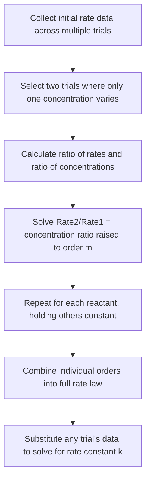

## Reaction Rates and Rate Laws

### Foundational Concept

Chemical kinetics is the study of the **rate** at which chemical reactions occur and the factors that influence that rate. Unlike thermodynamics, which addresses whether a reaction is favorable ($\Delta G < 0$) and where its equilibrium lies, kinetics addresses **how fast** a reaction proceeds — a thermodynamically favorable reaction may nonetheless occur at an imperceptibly slow rate due to kinetic barriers.

### Defining Reaction Rate

**Reaction rate** is the change in concentration of a reactant or product per unit time. For a general reaction:

$$aA + bB \rightarrow cC + dD$$

the rate can be expressed in terms of any species' concentration change, normalized by its stoichiometric coefficient to ensure a single, unambiguous rate value regardless of which species is monitored:

$$\text{Rate} = -\frac{1}{a}\frac{\Delta[A]}{\Delta t} = -\frac{1}{b}\frac{\Delta[B]}{\Delta t} = \frac{1}{c}\frac{\Delta[C]}{\Delta t} = \frac{1}{d}\frac{\Delta[D]}{\Delta t}$$

Negative signs appear for reactants (whose concentrations decrease over time, making $\Delta[A]/\Delta t$ negative) so that the overall rate is reported as a positive quantity.

### Average Rate vs. Instantaneous Rate

**Average rate** is calculated over a finite time interval:

$$\text{Average rate} = -\frac{[A]_2 - [A]_1}{t_2 - t_1}$$

**Instantaneous rate** is the rate at a specific moment in time, obtained as the slope of the tangent line to the concentration-vs-time curve at that point (mathematically, the derivative $-d[A]/dt$). The **initial rate** is the instantaneous rate at $t = 0$, commonly used in kinetics experiments because it avoids complications from the reverse reaction becoming significant as products accumulate.

### Worked Example 1: Calculating Average Rate

For the reaction $2N_2O_5(g) \rightarrow 4NO_2(g) + O_2(g)$, $[N_2O_5]$ decreases from 0.500 M to 0.350 M over 100 seconds. Calculate the average rate of reaction and the average rate of $O_2$ formation.

**Rate of reaction (based on N₂O₅):**

$$\text{Rate} = -\frac{1}{2}\frac{\Delta[N_2O_5]}{\Delta t} = -\frac{1}{2}\left(\frac{0.350 - 0.500}{100}\right) = -\frac{1}{2}(-0.00150) = 7.50 \times 10^{-4} \text{ M/s}$$

**Rate of O₂ formation:**

$$\text{Rate}_{O_2} = 1 \times \text{Rate} = 7.50 \times 10^{-4} \text{ M/s}$$

(since the coefficient of $O_2$ is 1, its formation rate equals the overall reaction rate directly)

### The Rate Law

The **rate law** expresses reaction rate as a function of reactant concentrations, determined **experimentally** (never assumed from the balanced equation's coefficients, except in the special case of elementary steps — see below):

$$\text{Rate} = k[A]^m[B]^n$$

where $k$ is the **rate constant** (specific to a given reaction at a given temperature), and $m$ and $n$ are the **reaction orders** with respect to $A$ and $B$ respectively — determined by experiment, not derived from stoichiometric coefficients.

**Overall reaction order** is the sum of all individual orders: $m + n$.

### Determining Rate Laws: The Method of Initial Rates

The most common experimental technique for determining a rate law compares initial rates across multiple experimental trials in which the initial concentration of one reactant is varied while others are held constant.

**Procedure:** Compare two trials where only $[A]$ changes:

$$\frac{\text{Rate}_2}{\text{Rate}_1} = \left(\frac{[A]_2}{[A]_1}\right)^m$$

Solving for $m$ (the order with respect to A) by taking the logarithm of both sides:

$$m = \frac{\ln(\text{Rate}_2/\text{Rate}_1)}{\ln([A]_2/[A]_1)}$$

### Worked Example 2: Determining a Rate Law from Experimental Data

For the reaction $2NO(g) + O_2(g) \rightarrow 2NO_2(g)$, the following initial rate data was collected:

| Trial | $[NO]_0$ (M) | $[O_2]_0$ (M) | Initial Rate (M/s) |
| --- | --- | --- | --- |
| 1 | 0.010 | 0.010 | $2.5 \times 10^{-5}$ |
| 2 | 0.020 | 0.010 | $1.0 \times 10^{-4}$ |
| 3 | 0.010 | 0.020 | $5.0 \times 10^{-5}$ |

**Step 1 — Find order with respect to NO** (compare Trials 1 and 2, where $[O_2]$ is constant):

$$\frac{\text{Rate}_2}{\text{Rate}_1} = \left(\frac{[NO]_2}{[NO]_1}\right)^m \Rightarrow \frac{1.0 \times 10^{-4}}{2.5 \times 10^{-5}} = \left(\frac{0.020}{0.010}\right)^m$$

$$4.0 = 2.0^m \Rightarrow m = 2$$

(since $2.0^2 = 4.0$)

**Step 2 — Find order with respect to O₂** (compare Trials 1 and 3, where $[NO]$ is constant):

$$\frac{\text{Rate}_3}{\text{Rate}_1} = \left(\frac{[O_2]_3}{[O_2]_1}\right)^n \Rightarrow \frac{5.0 \times 10^{-5}}{2.5 \times 10^{-5}} = \left(\frac{0.020}{0.010}\right)^n$$

$$2.0 = 2.0^n \Rightarrow n = 1$$

**Step 3 — Write the rate law:**

$$\text{Rate} = k[NO]^2[O_2]^1$$

This reaction is second order with respect to NO, first order with respect to $O_2$, and **third order overall** ($2 + 1 = 3$).

**Step 4 — Solve for k using any trial** (using Trial 1):

$$2.5 \times 10^{-5} = k(0.010)^2(0.010)$$

$$2.5 \times 10^{-5} = k(1.0 \times 10^{-6})$$

$$k = 25 \text{ M}^{-2}\text{s}^{-1}$$

Note the units of $k$ depend on the overall reaction order — for an overall third-order reaction, $k$ has units of $\text{M}^{-2}\text{s}^{-1}$ (concentration$^{1-\text{order}}$·time$^{-1}$).

### Common Reaction Orders and Rate Constant Units

| Overall Order | Rate Law Example | Units of $k$ |
| --- | --- | --- |
| Zero order | Rate $= k$ | M/s |
| First order | Rate $= k[A]$ | s⁻¹ |
| Second order | Rate $= k[A]^2$ or $k[A][B]$ | M⁻¹s⁻¹ |
| Third order | Rate $= k[A]^2[B]$ | M⁻²s⁻¹ |

### Zero-Order Reactions

For a zero-order reaction, rate is independent of reactant concentration:

$$\text{Rate} = k$$

The integrated rate law (see corresponding topic on integrated rate laws for full derivations) is:

$$[A]_t = [A]_0 - kt$$

producing a linear decrease in concentration over time — a straight line when $[A]$ is plotted directly against $t$.

### First-Order Reactions

For a first-order reaction:

$$\text{Rate} = k[A]$$

Doubling $[A]$ doubles the rate. The concentration decreases exponentially with time (see integrated rate laws topic for the full derivation and half-life relationship).

### Second-Order Reactions

For a second-order reaction (with respect to a single reactant):

$$\text{Rate} = k[A]^2$$

Doubling $[A]$ quadruples the rate ($2^2 = 4$), reflecting the stronger concentration dependence characteristic of second-order kinetics.

### Reaction Order Determination Flowchart

### Distinguishing Rate Law from Stoichiometry

A critical conceptual point: **the exponents in a rate law are not, in general, equal to the stoichiometric coefficients of the balanced overall equation.** In Worked Example 2, the balanced equation has a coefficient of 2 for NO and 1 for $O_2$ — coincidentally matching the experimentally determined orders in this specific case — but this correspondence is not guaranteed and must never be assumed without experimental verification. The rate law reflects the reaction's actual mechanism (specifically, the rate-determining step), not the overall balanced equation, except when the reaction happens to occur in a single elementary step.

### Elementary Reactions (Preview of Mechanisms)

An **elementary reaction** (a single-step reaction occurring exactly as written at the molecular level) is the one case where reaction order **does** equal the stoichiometric coefficients — because the rate law for an elementary step is derived directly from the collision-based probability of the reacting species meeting simultaneously. Most macroscopically observed reactions, however, proceed through multiple elementary steps (a **mechanism**), and it is the slowest of these steps (the rate-determining step) that dictates the experimentally observed rate law. This distinction is developed further in the dedicated topic on reaction mechanisms.

### Factors Affecting Reaction Rate (Qualitative Overview)

- **Concentration of reactants** — generally, higher concentration increases collision frequency and thus rate (quantified by the rate law itself).
- **Temperature** — higher temperature increases the fraction of molecules with sufficient energy to react (quantified by the Arrhenius equation; see dedicated topic).
- **Catalysts** — provide an alternative reaction pathway with lower activation energy, increasing rate without being consumed in the overall reaction.
- **Surface area** (for heterogeneous reactions) — greater surface area increases the frequency of effective collisions between phases.
- **Physical state and mixing** — reactions in solution or gas phase where reactants can freely collide proceed faster than poorly mixed heterogeneous systems.

### Common Pitfalls

- **Assuming reaction order equals stoichiometric coefficients** for the overall balanced equation — this is only valid for elementary reactions; overall/net equations require experimentally determined rate laws.
- **Forgetting to normalize rate expressions by stoichiometric coefficients** — the rate of disappearance of a reactant with coefficient 2 is not numerically equal to the "rate of reaction" unless divided by that coefficient.
- **Misinterpreting negative sign conventions** — reactant concentration changes are negative (concentration decreasing), but rate itself is reported as a positive quantity via the negative sign in the rate expression.
- **Using non-initial-rate data inappropriately** in the method-of-initial-rates approach — the technique specifically relies on rates measured at (or extrapolated to) $t = 0$, before significant product buildup or reverse reaction can complicate the analysis.
- **Confusing rate constant $k$ with the equilibrium constant $K$** — despite similar notation, these represent fundamentally different quantities (kinetic vs. thermodynamic).
- **Ignoring units of $k$**, which vary by overall reaction order — always verify that calculated $k$ values carry dimensionally consistent units for the specific rate law being used.

**Related Topics**

- Integrated rate laws and half-life
- Reaction mechanisms and the rate-determining step
- Collision theory and activation energy
- The Arrhenius equation and temperature dependence of rate
- Catalysis: homogeneous and heterogeneous
- Chemical equilibrium (contrasting kinetic vs. thermodynamic control)
- Method of initial rates (experimental design)
- Reaction order and molecularity distinctions