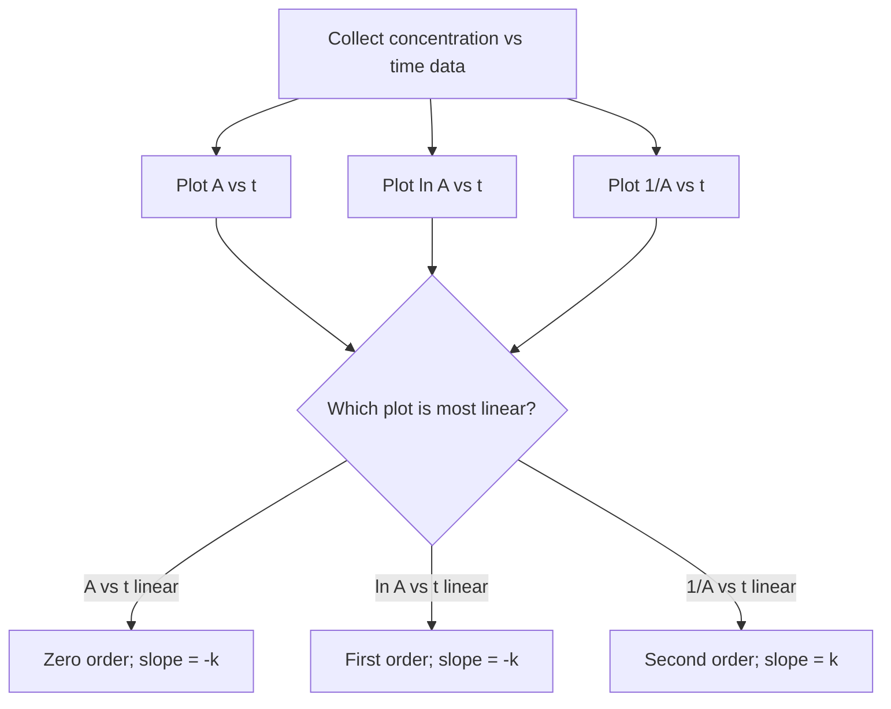

## Reaction Order and Integrated Rate Laws

### Foundational Concept

While the differential rate law (Rate $= k[A]^n$) expresses reaction rate as a function of concentration at a given instant, the **integrated rate law** expresses concentration as a function of **time**, obtained by integrating the differential rate law over time. Integrated rate laws are particularly useful because they allow direct comparison with experimental concentration-vs-time data, enabling both the determination of reaction order and calculation of concentration at any future time.

### Zero-Order Integrated Rate Law

For a zero-order reaction, Rate $= k$ (independent of concentration):

$$-\frac{d[A]}{dt} = k$$

Integrating from $[A]_0$ at $t=0$ to $[A]_t$ at time $t$:

$$[A]_t = [A]_0 - kt$$

**Diagnostic linear plot:** $[A]_t$ vs. $t$ gives a straight line with slope $-k$ and y-intercept $[A]_0$.

### First-Order Integrated Rate Law

For a first-order reaction, Rate $= k[A]$:

$$-\frac{d[A]}{dt} = k[A]$$

Separating variables and integrating:

$$\int_{[A]_0}^{[A]_t} \frac{d[A]}{[A]} = -\int_0^t k\,dt$$

$$\ln[A]_t - \ln[A]_0 = -kt$$

$$\ln[A]_t = -kt + \ln[A]_0$$

This is often also expressed in exponential form:

$$[A]_t = [A]_0 e^{-kt}$$

**Diagnostic linear plot:** $\ln[A]_t$ vs. $t$ gives a straight line with slope $-k$ and y-intercept $\ln[A]_0$.

### Second-Order Integrated Rate Law

For a second-order reaction, Rate $= k[A]^2$:

$$-\frac{d[A]}{dt} = k[A]^2$$

Separating variables and integrating:

$$\int_{[A]_0}^{[A]_t} \frac{d[A]}{[A]^2} = -\int_0^t k\,dt$$

$$\frac{1}{[A]_t} - \frac{1}{[A]_0} = kt$$

$$\frac{1}{[A]_t} = kt + \frac{1}{[A]_0}$$

**Diagnostic linear plot:** $\dfrac{1}{[A]_t}$ vs. $t$ gives a straight line with slope $k$ and y-intercept $\dfrac{1}{[A]_0}$.

### Summary Table of Integrated Rate Laws

| Order | Rate Law | Integrated Form | Linear Plot | Slope |
| --- | --- | --- | --- | --- |
| Zero | Rate $= k$ | $[A]_t = [A]_0 - kt$ | $[A]_t$ vs. $t$ | $-k$ |
| First | Rate $= k[A]$ | $\ln[A]_t = -kt + \ln[A]_0$ | $\ln[A]_t$ vs. $t$ | $-k$ |
| Second | Rate $= k[A]^2$ | $\dfrac{1}{[A]_t} = kt + \dfrac{1}{[A]_0}$ | $\dfrac{1}{[A]_t}$ vs. $t$ | $k$ |

### Using Linear Plots to Determine Reaction Order Graphically

A common experimental approach: plot concentration-vs-time data in all three diagnostic forms ($[A]$ vs. $t$, $\ln[A]$ vs. $t$, $1/[A]$ vs. $t$) and identify which produces a straight line (typically assessed via linear regression $R^2$ value closest to 1). The plot yielding linearity indicates the reaction order, and its slope yields the rate constant $k$.

### Worked Example 1: Determining Order and k from Concentration-Time Data

The decomposition of a substance A gives the following data:

| Time (s) | [A] (M) |
| --- | --- |
| 0 | 0.800 |
| 100 | 0.400 |
| 200 | 0.267 |
| 300 | 0.200 |

Determine the reaction order.

**Test for first order:** compute $\ln[A]$ at each time.

$$\ln(0.800) = -0.223 \quad \ln(0.400) = -0.916 \quad \ln(0.267) = -1.320 \quad \ln(0.200) = -1.609$$

Check slope consistency between consecutive intervals:

$$\frac{-0.916 - (-0.223)}{100 - 0} = -0.00693 \qquad \frac{-1.609 - (-0.916)}{300-100} = -0.00347$$

These slopes are not consistent — first order is not confirmed by this data.

**Test for second order:** compute $1/[A]$ at each time.

$$\frac{1}{0.800} = 1.25 \quad \frac{1}{0.400} = 2.50 \quad \frac{1}{0.267} = 3.75 \quad \frac{1}{0.200} = 5.00$$

Check slope consistency:

$$\frac{2.50 - 1.25}{100 - 0} = 0.0125 \qquad \frac{3.75 - 2.50}{200-100} = 0.0125 \qquad \frac{5.00-3.75}{300-200} = 0.0125$$

The slope is constant at 0.0125 M⁻¹s⁻¹ across all intervals — this confirms **second-order** kinetics, with $k = 0.0125$ M⁻¹s⁻¹.

### Half-Life

**Half-life** ($t_{1/2}$) is the time required for the concentration of a reactant to decrease to half its initial value. The relationship between $t_{1/2}$ and $k$ depends on reaction order.

**Zero order:**

$$t_{1/2} = \frac{[A]_0}{2k}$$

(half-life *depends* on initial concentration — decreases as the reaction proceeds and $[A]_0$ effectively decreases for each successive half-life period)

**First order:**

$$t_{1/2} = \frac{\ln 2}{k} = \frac{0.693}{k}$$

(half-life is **constant**, independent of concentration — a hallmark diagnostic feature of first-order kinetics, and the basis for radioactive decay half-life calculations)

**Second order:**

$$t_{1/2} = \frac{1}{k[A]_0}$$

(half-life *increases* as the reaction proceeds, since each successive half-life takes longer as $[A]$ decreases)

### Worked Example 2: First-Order Half-Life Application

A first-order reaction has $k = 0.0231$ s⁻¹. Calculate the half-life, and determine what fraction of the original reactant remains after 3 half-lives.

$$t_{1/2} = \frac{0.693}{0.0231} = 30.0 \text{ s}$$

After each half-life, the concentration is halved. After 3 half-lives (90.0 s total):

$$\text{Fraction remaining} = \left(\frac{1}{2}\right)^3 = \frac{1}{8} = 0.125 \text{ (12.5\%)}$$

This constant-fractional-decrease-per-half-life behavior is unique to first-order kinetics and is the basis for radiometric dating and pharmacokinetic drug elimination calculations.

### Worked Example 3: Using the First-Order Integrated Rate Law to Predict Future Concentration

A first-order reaction has $k = 5.00 \times 10^{-3}$ s⁻¹ and $[A]_0 = 1.00$ M. Calculate $[A]$ after 200 seconds.

$$\ln[A]_t = -kt + \ln[A]_0 = -(5.00 \times 10^{-3})(200) + \ln(1.00)$$

$$\ln[A]_t = -1.00 + 0 = -1.00$$

$$[A]_t = e^{-1.00} = 0.368 \text{ M}$$

### Worked Example 4: Solving for Time Given Concentration (First Order)

Using the same reaction as Worked Example 3, calculate the time required for $[A]$ to drop to 0.100 M.

$$\ln(0.100) = -(5.00 \times 10^{-3})t + \ln(1.00)$$

$$-2.303 = -(5.00 \times 10^{-3})t$$

$$t = \frac{2.303}{5.00 \times 10^{-3}} = 460.6 \text{ s}$$

### Pseudo-Order Reactions

When a reactant is present in large excess relative to another, its concentration remains approximately constant throughout the reaction, and its contribution to the rate law can be absorbed into an **observed rate constant** ($k_{obs}$), simplifying the apparent kinetics to a lower order — a common technique called the **isolation method** (or pseudo-order method).

**Example:** For Rate $= k[A][B]$, if $[B]$ is held in large excess, $[B] \approx [B]_0$ throughout, so:

$$\text{Rate} = (k[B]_0)[A] = k_{obs}[A]$$

The reaction now behaves as **pseudo-first-order** with respect to $A$, even though the true rate law is second order overall. This technique is widely used experimentally to simplify the determination of rate laws for each reactant independently, one at a time.

### Common Pitfalls

- **Confusing the differential rate law (Rate $= k[A]^n$) with the integrated rate law ($[A]_t$ as a function of $t$)** — these are related but serve different purposes: the differential form relates rate to concentration at an instant, while the integrated form relates concentration to elapsed time.
- **Applying the first-order half-life formula ($t_{1/2} = 0.693/k$) to a reaction of a different order** — half-life is constant only for first-order reactions; using this formula for zero- or second-order kinetics gives an incorrect (non-constant) half-life.
- **Forgetting to check linearity across the FULL data set** — a plot may appear linear over a limited range coincidentally; verifying constant slope across multiple, well-separated intervals (as in Worked Example 1) provides stronger confirmation of reaction order.
- **Sign errors when rearranging the first-order integrated rate law** between logarithmic and exponential forms.
- **Assuming pseudo-order kinetics apply universally** — the isolation method (large excess of one reactant) is a deliberate experimental technique, not a property that holds automatically for any given reaction.
- **Mixing up units of $k$ across different reaction orders** when checking dimensional consistency of a calculated rate constant.

**Related Topics**

- Reaction rates and rate laws
- Reaction mechanisms and the rate-determining step
- Collision theory and activation energy
- The Arrhenius equation and temperature dependence
- Radioactive decay and half-life (nuclear chemistry connection)
- Method of initial rates (experimental determination)
- Catalysis and its effect on reaction rate
- Pseudo-order kinetics and the isolation method