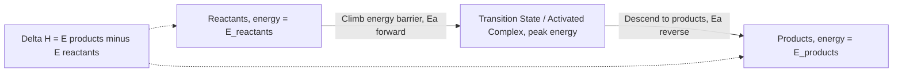
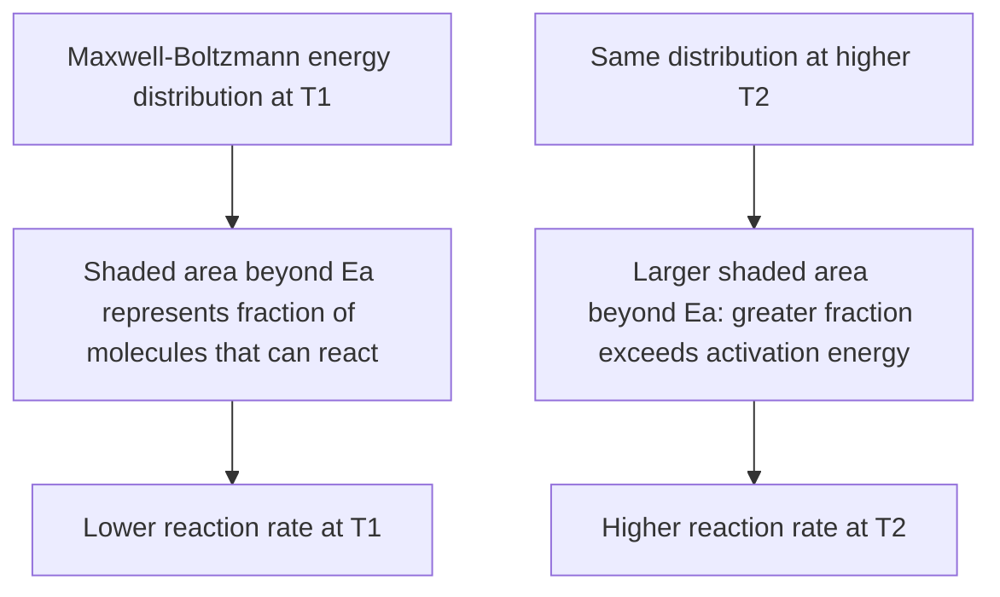
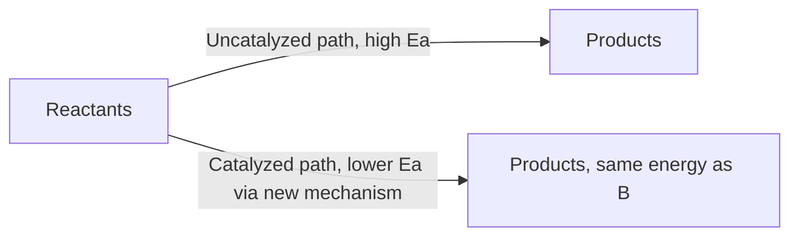

## Collision Theory and Activation Energy

### Foundational Concept

Collision theory provides the molecular-level explanation for why reaction rates depend on concentration, temperature, and molecular structure. It states that for a chemical reaction to occur between two particles, they must **collide** with each other. However, not every collision produces a reaction — collision theory identifies two additional requirements beyond mere contact: sufficient **energy** and proper **orientation**.

### The Three Requirements for an Effective Collision

1. **Collision frequency** — particles must physically collide, which depends on concentration (more particles per unit volume increases collision frequency) and temperature (faster-moving particles collide more often).
2. **Sufficient energy** — the colliding particles must possess kinetic energy equal to or exceeding the **activation energy** ($E_a$), the minimum energy required to break existing bonds and initiate the reaction.
3. **Proper orientation** — the particles must collide with the correct spatial alignment for the reactive atoms/groups to interact effectively; even a high-energy collision fails to produce products if the molecules are oriented incorrectly.

Only collisions satisfying **all three** conditions simultaneously are termed **effective collisions**, which lead to product formation. The vast majority of molecular collisions in a typical reaction mixture do not meet all three criteria and are therefore unreactive ("elastic" collisions, where molecules simply bounce apart unchanged).

### Activation Energy

**Activation energy** ($E_a$) is the minimum kinetic energy that colliding reactant particles must possess for a reaction to proceed. It represents an energy barrier that must be overcome, corresponding to the energy required to reach the **transition state** (also called the activated complex) — a high-energy, unstable, transient molecular arrangement partway between reactants and products.

### The Reaction Energy Profile (Reaction Coordinate Diagram)

A reaction energy diagram plots potential energy against the **reaction coordinate** (progress of the reaction from reactants to products), illustrating the activation energy barrier and the overall energy change of the reaction.

**Key relationships visible on this diagram:**

- $E_{a,forward}$ = energy of transition state − energy of reactants
- $E_{a,reverse}$ = energy of transition state − energy of products
- $\Delta H_{rxn} = E_{a,forward} - E_{a,reverse}$ (the overall enthalpy change equals the difference between forward and reverse activation energies)

For an **exothermic** reaction, products have lower energy than reactants, so $E_{a,forward} < E_{a,reverse}$. For an **endothermic** reaction, the reverse is true: $E_{a,forward} > E_{a,reverse}$.

### Worked Example 1: Relating Ea and ΔH

A reaction has $E_{a,forward} = 75$ kJ/mol and $\Delta H_{rxn} = -30$ kJ/mol. Calculate $E_{a,reverse}$.

$$\Delta H_{rxn} = E_{a,forward} - E_{a,reverse}$$

$$-30 = 75 - E_{a,reverse}$$

$$E_{a,reverse} = 75 - (-30) = 105 \text{ kJ/mol}$$

As expected for an exothermic reaction, the reverse activation energy (105 kJ/mol) is larger than the forward activation energy (75 kJ/mol), consistent with products sitting at lower energy than reactants.

### The Maxwell–Boltzmann Distribution

At any given temperature, molecules in a sample do not all possess the same kinetic energy — their energies follow a statistical distribution known as the **Maxwell–Boltzmann distribution**. Only the fraction of molecules with kinetic energy exceeding $E_a$ can react upon effective collision.

**Key insight:** increasing temperature shifts the entire distribution toward higher energies and broadens it, substantially increasing the *fraction* of molecules with energy exceeding $E_a$ — this is the fundamental molecular-level reason why reaction rate increases sharply with temperature, more dramatically than would be predicted by the increase in collision frequency alone.

### The Fraction of Molecules Exceeding Ea

The fraction of molecular collisions with sufficient energy to react is given by:

$$f = e^{-E_a/RT}$$

where $R$ is the gas constant and $T$ is absolute temperature. This exponential term is central to the Arrhenius equation (covered in detail in its own dedicated topic) and explains why small increases in temperature can produce large increases in reaction rate — the exponential relationship amplifies the effect of temperature changes.

### Worked Example 2: Fraction of Effective Collisions

Calculate the fraction of molecules with sufficient energy to react at 298 K for a reaction with $E_a = 50.0$ kJ/mol.

$$f = e^{-E_a/RT} = e^{-50{,}000/[(8.314)(298)]} = e^{-20.19}$$

$$f \approx 1.71 \times 10^{-9}$$

This very small fraction illustrates why activation energy acts as a substantial kinetic barrier even for reactions that are thermodynamically favorable — only about 1.7 in a billion collisions at room temperature possess sufficient energy for this particular activation barrier.

### The Orientation (Steric) Factor

Even among collisions with sufficient energy, only a fraction have the correct molecular orientation for reaction. This is quantified by the **steric factor** ($p$, sometimes called the orientation factor), incorporated into the full collision theory rate expression:

$$k = pZe^{-E_a/RT}$$

where $Z$ is the collision frequency factor (the theoretical maximum rate if every collision were effective) and $p$ (typically $0 < p \leq 1$) accounts for the fraction of collisions with proper geometric alignment. Reactions between simple, small, symmetric species tend to have $p$ values closer to 1, while reactions involving large, complex molecules with specific reactive sites (particularly in organic and biochemical reactions) often have very small $p$ values, since only a narrow range of orientations permits effective bond reorganization.

### Worked Example 3: Conceptual Application of Orientation

For the reaction between $NOCl$ and $Cl$ atoms, effective collision requires the $Cl$ atom to approach the nitrogen end of the $NOCl$ molecule (where the reactive site is located), not the oxygen or chlorine end. Explain qualitatively why this reaction has a lower observed rate than would be predicted by collision frequency and activation energy alone.

Since only collisions occurring with the correct approach geometry (toward the nitrogen atom) lead to bond reorganization and product formation, the steric factor $p$ for this reaction is significantly less than 1 — many energetically sufficient collisions are still unproductive due to incorrect orientation, reducing the overall observed rate constant $k$ below the theoretical maximum implied by $Z$ and $E_a$ alone.

### Catalysts and Activation Energy

A **catalyst** increases reaction rate by providing an alternative reaction pathway (mechanism) with a **lower activation energy**, without being consumed in the overall reaction and without altering the thermodynamics ($\Delta H$, $\Delta G$, $K$) of the reaction.

Because $E_a$ appears in the exponent of the rate expression ($k \propto e^{-E_a/RT}$), even a modest reduction in activation energy can produce a substantial increase in reaction rate at a given temperature — this exponential sensitivity is the fundamental reason catalysts can be so dramatically effective despite not changing the reaction's thermodynamic favorability.

### Common Pitfalls

- **Confusing activation energy with the overall reaction enthalpy ($\Delta H$)** — $E_a$ is always a positive barrier height (regardless of whether the reaction is exothermic or endothermic), while $\Delta H$ can be positive or negative and represents the net energy difference between products and reactants, not the barrier height.
- **Assuming all molecular collisions lead to reaction** — collision theory explicitly identifies that only a small fraction of total collisions are "effective," satisfying both energy and orientation requirements simultaneously.
- **Believing catalysts change the thermodynamics of a reaction** — catalysts alter only the kinetic pathway (lowering $E_a$), never the equilibrium position, $\Delta G$, $\Delta H$, or $K$ of the reaction.
- **Overlooking the orientation/steric factor** and assuming reaction rate depends only on energy sufficiency — for complex molecules, orientation can be the dominant limiting factor even when energetic requirements are frequently met.
- **Misinterpreting the reaction coordinate diagram** — the x-axis represents reaction progress (an abstract measure of bond-breaking/forming progress), not physical distance or time.
- **Forgetting that $E_a$ for the reverse reaction differs from $E_a$ for the forward reaction** (except in the special case $\Delta H = 0$) — the two are related through $\Delta H$, not equal to each other in general.

**Related Topics**

- The Arrhenius equation and temperature dependence of rate
- Reaction rates and rate laws
- Reaction mechanisms and the rate-determining step
- Catalysis: homogeneous and heterogeneous
- Integrated rate laws and half-life
- Maxwell–Boltzmann distribution (kinetic molecular theory connection)
- Transition state theory
- Enzyme catalysis and biochemical kinetics