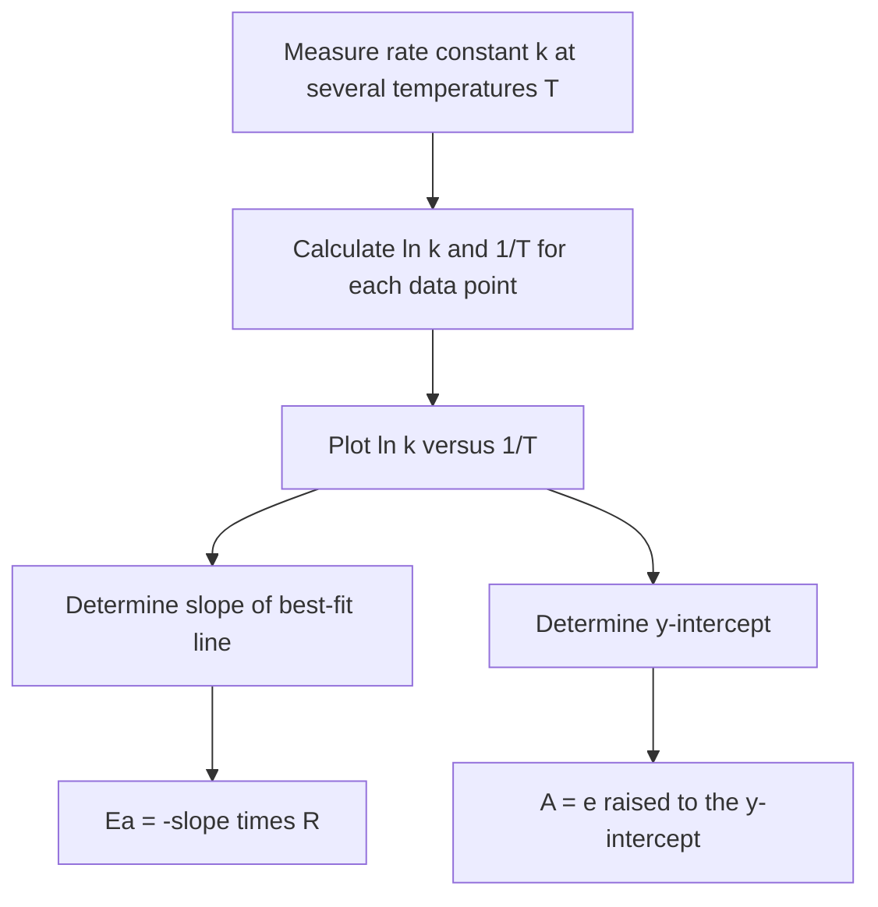

## The Arrhenius Equation

### Foundational Concept

The Arrhenius equation quantitatively describes how the rate constant $k$ of a reaction depends on temperature and activation energy, formalizing the exponential relationship introduced by collision theory. It was proposed by Svante Arrhenius in 1889 based on empirical observations of how reaction rates vary with temperature, and remains one of the most widely applied relationships in chemical kinetics.

### The Arrhenius Equation

$$k = Ae^{-E_a/RT}$$

where:

- $k$ = rate constant at temperature $T$
- $A$ = the **pre-exponential factor** (also called the frequency factor or Arrhenius factor), incorporating both collision frequency and the orientation (steric) factor
- $E_a$ = activation energy (J/mol)
- $R$ = gas constant, $8.314$ J/(mol·K)
- $T$ = absolute temperature (kelvin)

The pre-exponential factor $A$ represents the theoretical rate constant if every collision were effective (i.e., if $E_a = 0$), combining the collision frequency $Z$ and the steric factor $p$ from collision theory ($A \approx pZ$).

### Physical Interpretation

The exponential term $e^{-E_a/RT}$ represents the fraction of molecular collisions possessing sufficient energy to overcome the activation barrier at temperature $T$ (as derived from the Maxwell–Boltzmann distribution). Since this term is always between 0 and 1, $A$ represents the upper theoretical limit of the rate constant, with the exponential factor scaling it down based on how large $E_a$ is relative to the available thermal energy ($RT$).

**Key qualitative relationships:**

- Larger $E_a$ → smaller exponential term → smaller $k$ (slower reaction) at a given temperature.
- Higher $T$ → larger exponential term → larger $k$ (faster reaction).
- The sensitivity of $k$ to temperature is greater for reactions with **larger** $E_a$ — high-activation-energy reactions show more dramatic rate increases per degree of temperature increase than low-activation-energy reactions.

### The Linearized (Logarithmic) Form

Taking the natural logarithm of both sides of the Arrhenius equation transforms it into a linear equation, which is the practical form used for graphical determination of $E_a$ and $A$ from experimental data:

$$\ln k = -\frac{E_a}{R}\left(\frac{1}{T}\right) + \ln A$$

This has the form of a straight line, $y = mx + b$, where:

- $y = \ln k$
- $x = \dfrac{1}{T}$
- slope $= -\dfrac{E_a}{R}$
- y-intercept $= \ln A$

**Diagnostic Arrhenius plot:** plotting $\ln k$ (y-axis) against $1/T$ (x-axis) for rate constants measured at several different temperatures produces a straight line, from which $E_a$ is obtained from the slope and $A$ from the y-intercept.

### Worked Example 1: Determining Ea Graphically from Two Data Points

A reaction has the following rate constants at two temperatures: $k_1 = 3.0 \times 10^{-4}$ s⁻¹ at $T_1 = 300$ K, and $k_2 = 2.4 \times 10^{-3}$ s⁻¹ at $T_2 = 340$ K. Calculate the activation energy.

Rather than plotting a full Arrhenius graph, two data points can be combined algebraically. Subtracting the linearized equation at $T_1$ from that at $T_2$ eliminates $\ln A$ (since it is common to both):

$$\ln k_2 - \ln k_1 = -\frac{E_a}{R}\left(\frac{1}{T_2} - \frac{1}{T_1}\right)$$

$$\ln\left(\frac{k_2}{k_1}\right) = -\frac{E_a}{R}\left(\frac{1}{T_2} - \frac{1}{T_1}\right) = \frac{E_a}{R}\left(\frac{1}{T_1} - \frac{1}{T_2}\right)$$

This rearranged form is commonly called the **two-point Arrhenius equation**:

$$\ln\left(\frac{k_2}{k_1}\right) = \frac{E_a}{R}\left(\frac{1}{T_1} - \frac{1}{T_2}\right)$$

**Solving:**

$$\ln\left(\frac{2.4\times10^{-3}}{3.0\times10^{-4}}\right) = \frac{E_a}{8.314}\left(\frac{1}{300} - \frac{1}{340}\right)$$

$$\ln(8.0) = 2.079$$

$$\frac{1}{300} - \frac{1}{340} = 0.003333 - 0.002941 = 0.0003922 \text{ K}^{-1}$$

$$2.079 = \frac{E_a}{8.314}(0.0003922)$$

$$E_a = \frac{2.079 \times 8.314}{0.0003922} = \frac{17.28}{0.0003922} = 44{,}060 \text{ J/mol} \approx 44.1 \text{ kJ/mol}$$

### Worked Example 2: Predicting a Rate Constant at a New Temperature

Using the activation energy found in Worked Example 1 ($E_a = 44.1$ kJ/mol) and $k_1 = 3.0 \times 10^{-4}$ s⁻¹ at $T_1 = 300$ K, predict the rate constant at $T_3 = 320$ K.

$$\ln\left(\frac{k_3}{k_1}\right) = \frac{E_a}{R}\left(\frac{1}{T_1} - \frac{1}{T_3}\right)$$

$$\frac{1}{300} - \frac{1}{320} = 0.003333 - 0.003125 = 0.0002083 \text{ K}^{-1}$$

$$\ln\left(\frac{k_3}{3.0\times10^{-4}}\right) = \frac{44{,}100}{8.314}(0.0002083) = (5304)(0.0002083) = 1.105$$

$$\frac{k_3}{3.0\times10^{-4}} = e^{1.105} = 3.019$$

$$k_3 = (3.0\times10^{-4})(3.019) = 9.06\times10^{-4} \text{ s}^{-1}$$

### Worked Example 3: Solving for the Pre-Exponential Factor A

Using $E_a = 44.1$ kJ/mol and $k_1 = 3.0 \times 10^{-4}$ s⁻¹ at $T_1 = 300$ K, calculate the pre-exponential factor $A$.

Rearranging the Arrhenius equation:

$$A = k_1 e^{E_a/RT_1} = (3.0\times10^{-4})e^{44{,}100/[(8.314)(300)]}$$

$$\frac{44{,}100}{(8.314)(300)} = \frac{44{,}100}{2494.2} = 17.68$$

$$A = (3.0\times10^{-4})e^{17.68} = (3.0\times10^{-4})(4.75\times10^7)$$

$$A \approx 1.42\times10^4 \text{ s}^{-1}$$

The units of $A$ match the units of $k$ (here, s⁻¹ for a first-order reaction), since the exponential term $e^{-E_a/RT}$ is dimensionless.

### The "Rule of Thumb": Rate Doubling with Temperature

A commonly cited approximate rule states that reaction rate roughly doubles for every 10°C (10 K) increase in temperature near room temperature. This is only a rough empirical approximation, and the actual factor depends strongly on the specific activation energy of the reaction — it is not a universal constant. [This rule of thumb is widely taught as a simplified heuristic, but it holds only approximately and specifically for reactions with activation energies in a moderate range near room temperature; reactions with very high or very low $E_a$ deviate substantially from a factor of 2.]

**Worked Example 4:**

Verify whether a reaction with $E_a = 50.0$ kJ/mol approximately follows the "doubles every 10 K" rule between 300 K and 310 K.

$$\ln\left(\frac{k_2}{k_1}\right) = \frac{E_a}{R}\left(\frac{1}{T_1}-\frac{1}{T_2}\right) = \frac{50{,}000}{8.314}\left(\frac{1}{300}-\frac{1}{310}\right)$$

$$\frac{1}{300}-\frac{1}{310} = 0.003333 - 0.003226 = 0.0001075 \text{ K}^{-1}$$

$$\ln\left(\frac{k_2}{k_1}\right) = (6014)(0.0001075) = 0.6465$$

$$\frac{k_2}{k_1} = e^{0.6465} = 1.909$$

The ratio (1.91) is reasonably close to 2, confirming the rule of thumb holds approximately for this particular activation energy and temperature range — though this agreement should not be assumed for reactions with substantially different $E_a$ values or over much larger temperature intervals.

### Relating the Arrhenius Equation to Collision Theory

The Arrhenius equation is the practical, empirically calibrated counterpart to the theoretical collision-theory expression $k = pZe^{-E_a/RT}$ — the pre-exponential factor $A$ in the Arrhenius equation corresponds to the product $pZ$ from collision theory, combining the maximum possible collision frequency with the fraction of collisions having appropriate orientation. The Arrhenius equation is used far more commonly in practice because $A$, $E_a$ can be determined directly from experimental rate-vs-temperature data without needing to separately model collision frequency and orientation factors from first principles.

### Common Pitfalls

- **Using temperature in °C instead of kelvin** — the Arrhenius equation strictly requires absolute temperature (K); using Celsius produces incorrect results, especially problematic near 0°C where the sign could even flip.
- **Sign errors in the linearized form** — the slope of the $\ln k$ vs. $1/T$ plot is $-E_a/R$ (negative), so $E_a$ itself is obtained as $E_a = -(\text{slope}) \times R$; forgetting the negative sign yields an incorrectly negative activation energy.
- **Confusing the units of $E_a$** — activation energy is typically tabulated in kJ/mol, but the gas constant $R = 8.314$ J/(mol·K) uses joules; unit conversion is required before combining these values.
- **Applying the "rate doubles every 10°C" rule as a strict law** — this is a loose approximation valid only for a limited range of activation energies and temperatures; the true relationship must be calculated via the Arrhenius equation for quantitative accuracy.
- **Misinterpreting $A$ as having a simple physical meaning independent of the specific reaction** — $A$ combines collision frequency and orientation probability, and can vary by many orders of magnitude between different reactions depending on molecular complexity and geometry.
- **Forgetting that $A$ is treated as approximately temperature-independent** in the basic Arrhenius model — this is a standard simplifying assumption; more advanced treatments (modified Arrhenius equation) allow $A$ to have a weak temperature dependence, but this refinement is not needed for most general chemistry applications.

**Related Topics**

- Collision theory and activation energy
- Reaction rates and rate laws
- Integrated rate laws and half-life
- Reaction mechanisms and the rate-determining step
- Catalysis: homogeneous and heterogeneous
- Transition state theory
- Graphical linearization techniques in kinetics
- Temperature dependence of equilibrium constants (van't Hoff equation, thermodynamic parallel)