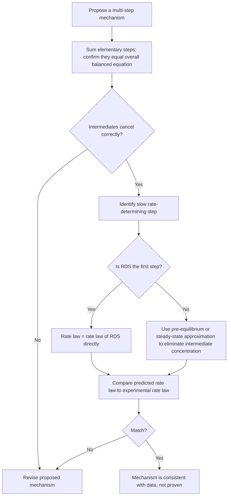

## Reaction Mechanisms and the Rate-Determining Step

### Foundational Concept

A **reaction mechanism** is the sequence of individual molecular-level steps (elementary steps) through which reactants are converted into products. While a balanced overall chemical equation describes the net stoichiometric transformation, it provides no information about the actual pathway or sequence of bond-breaking and bond-forming events — that information is captured only by the mechanism. Reaction mechanisms are proposed based on experimental kinetic data (particularly the rate law) and are considered validated when they correctly predict the experimentally observed rate law, though a consistent mechanism is never proven with absolute certainty — only shown to be compatible with available evidence.

### Elementary Steps and Molecularity

An **elementary step** (or elementary reaction) is a single molecular event — a single collision or single bond rearrangement — that cannot be broken down into simpler steps. The **molecularity** of an elementary step is the number of reactant particles involved in that specific step:

| Molecularity | Name | Rate Law (for that step) |
| --- | --- | --- |
| 1 | Unimolecular | Rate $= k[A]$ |
| 2 | Bimolecular | Rate $= k[A][B]$ or $k[A]^2$ |
| 3 | Termolecular | Rate $= k[A][B][C]$ (rare — simultaneous three-body collisions are statistically improbable) |

**Critical distinction:** for an elementary step (and only for an elementary step), the rate law exponents equal the stoichiometric coefficients of that step exactly — this is the molecular justification for why rate laws cannot generally be inferred from the coefficients of the *overall* balanced equation (which is typically the sum of multiple elementary steps, each with its own distinct rate law).

### Intermediates

A **reaction intermediate** is a species that is produced in one elementary step and completely consumed in a subsequent step — it does not appear in the overall balanced equation, since it is formed and destroyed within the mechanism, but it is a genuine (if often short-lived and difficult to isolate) chemical species during the reaction's progress. Intermediates are distinct from **catalysts**, which are consumed in an early step and regenerated in a later step (net zero consumption over the full mechanism), and distinct from the **transition state**, which is not a true isolable species but an unstable, fleeting energy maximum along the reaction coordinate.

### Elementary Steps Must Sum to the Overall Equation

A valid mechanism must satisfy two conditions:

1. The elementary steps, when added together, must sum to the correct overall balanced equation (with intermediates canceling out, analogous to Hess's Law cancellation).
2. The mechanism must be consistent with the experimentally determined rate law (see rate-determining step, below).

### Worked Example 1: Verifying a Proposed Mechanism Sums Correctly

For the overall reaction $2NO_2(g) + F_2(g) \rightarrow 2NO_2F(g)$, a proposed two-step mechanism is:

$$\text{Step 1: } NO_2 + F_2 \rightarrow NO_2F + F \quad \text{(slow)}$$

$$\text{Step 2: } NO_2 + F \rightarrow NO_2F \quad \text{(fast)}$$

**Verification — add the steps:**

$$NO_2 + F_2 + NO_2 + F \rightarrow NO_2F + F + NO_2F$$

Canceling the intermediate $F$ (appears as a product in Step 1 and a reactant in Step 2):

$$2NO_2 + F_2 \rightarrow 2NO_2F$$

This matches the overall equation exactly, confirming the mechanism is stoichiometrically valid. $F$ (a fluorine atom) is the reaction intermediate — it is generated in Step 1 and fully consumed in Step 2, never appearing in the net equation.

### The Rate-Determining Step

When a mechanism consists of multiple elementary steps with significantly different rates, the overall observed reaction rate is governed almost entirely by the **slowest step**, called the **rate-determining step** (RDS) or rate-limiting step. This is analogous to a multi-lane highway that narrows to a single lane at one point — no matter how fast traffic flows elsewhere, the overall throughput is capped by the bottleneck.

**Key principle:** if the rate-determining step is the *first* step in the mechanism, the experimentally observed rate law can be written directly from that step's molecularity, since no prior step limits the rate of species entering it.

### Worked Example 2: Deriving the Rate Law from a Slow First Step

For the mechanism in Worked Example 1, Step 1 (bimolecular, involving $NO_2$ and $F_2$) is the slow, rate-determining step. Since it is the first step, the rate law is:

$$\text{Rate} = k[NO_2][F_2]$$

This matches the experimentally observed rate law for this well-studied reaction, supporting the validity of the proposed mechanism (though, as with any mechanism, this agreement demonstrates consistency rather than absolute proof).

### Mechanisms with a Slow Step That Is Not First

When the rate-determining step is **not** the first step, it typically involves an intermediate produced by an earlier, faster step. Since intermediates cannot appear in the final experimentally verifiable rate law (their concentrations are not independently measurable or controllable by the experimenter), the intermediate's concentration must be re-expressed in terms of the original reactants — most commonly using either the **pre-equilibrium approximation** or the **steady-state approximation**.

### The Pre-Equilibrium Approximation

This method applies when a **fast, reversible** step precedes a slow rate-determining step. The fast step is assumed to reach equilibrium (since it is much faster than the subsequent slow step consumes its product), allowing the intermediate's concentration to be expressed using the equilibrium constant of that fast step.

**General framework:**

$$\text{Step 1 (fast, reversible): } A + B \rightleftharpoons I \quad K_1 = \frac{[I]}{[A][B]}$$

$$\text{Step 2 (slow, RDS): } I + C \rightarrow \text{Products} \quad \text{Rate} = k_2[I][C]$$

Since Step 1 is at equilibrium: $[I] = K_1[A][B]$. Substituting into the rate law for Step 2:

$$\text{Rate} = k_2K_1[A][B][C] = k_{obs}[A][B][C]$$

where $k_{obs} = k_2K_1$ is the experimentally observed (composite) rate constant.

### Worked Example 3: Applying the Pre-Equilibrium Approximation

For the reaction $2NO(g) + O_2(g) \rightarrow 2NO_2(g)$, the proposed mechanism is:

$$\text{Step 1 (fast, reversible): } NO + NO \rightleftharpoons N_2O_2 \quad K_1$$

$$\text{Step 2 (slow, RDS): } N_2O_2 + O_2 \rightarrow 2NO_2 \quad k_2$$

Derive the predicted rate law.

**Step 1 equilibrium expression:**

$$K_1 = \frac{[N_2O_2]}{[NO]^2} \quad \Rightarrow \quad [N_2O_2] = K_1[NO]^2$$

**Step 2 rate law (in terms of the intermediate):**

$$\text{Rate} = k_2[N_2O_2][O_2]$$

**Substituting to eliminate the intermediate:**

$$\text{Rate} = k_2K_1[NO]^2[O_2] = k_{obs}[NO]^2[O_2]$$

This predicts a rate law that is second order in $NO$ and first order in $O_2$ — matching the experimentally determined rate law introduced in the earlier topic on reaction rates and rate laws, providing mechanistic support for this proposed pathway.

### The Steady-State Approximation (Brief Overview)

An alternative approach, more general than the pre-equilibrium method, assumes that after a brief initial period, the concentration of a reactive intermediate remains approximately constant (its rate of formation equals its rate of consumption) throughout most of the reaction:

$$\frac{d[I]}{dt} \approx 0$$

This approximation is particularly useful when the "fast, reversible first step" assumption of the pre-equilibrium method does not clearly apply, such as when the intermediate is consumed via multiple competing pathways. The full mathematical treatment (solving simultaneous rate equations) is more advanced and is typically reserved for upper-level kinetics courses, but the qualitative principle — that a highly reactive, low-concentration intermediate's concentration stays roughly constant during the bulk of the reaction — is a widely applicable mechanistic concept.

### Diagram: Mechanism Validation Workflow

### Why Mechanisms Are Never "Proven"

A crucial epistemic point in kinetics: agreement between a proposed mechanism's predicted rate law and the experimentally observed rate law demonstrates that the mechanism is **consistent** with the data — it does not prove the mechanism is the unique correct description of the molecular-level events. Multiple different mechanisms can sometimes predict the same rate law, and only additional evidence (such as detection of proposed intermediates via spectroscopy, isotope labeling studies, or stereochemical analysis) can further discriminate between competing mechanistic proposals. [This is a standard epistemological caveat in physical chemistry: kinetic rate-law agreement is necessary but not sufficient evidence for a specific mechanism.]

### Common Pitfalls

- **Assuming the overall rate law can be written directly from the overall balanced equation's coefficients** — this is valid only for single-step (elementary) reactions; multi-step mechanisms require rate-determining step analysis.
- **Forgetting to eliminate intermediates from the final rate law** — a rate law expressed in terms of an intermediate's concentration is not experimentally verifiable, since intermediate concentrations generally cannot be measured or controlled directly by the experimenter.
- **Confusing an intermediate with a catalyst** — an intermediate is produced then consumed (appears mid-mechanism only), while a catalyst is consumed early and regenerated late (appears in an early reactant role and a late product role, net zero change).
- **Applying the pre-equilibrium approximation when the first step is not actually fast and reversible relative to the second step** — this approximation is only valid under that specific condition; if the first step is comparably slow, the approximation breaks down and the mechanism analysis requires more general treatment.
- **Believing a matching rate law definitively proves a mechanism** — kinetic consistency is supporting evidence, not proof; alternative mechanisms with the same predicted rate law may also be consistent with the data.
- **Neglecting to verify that elementary steps sum to the correct overall equation** before proceeding to rate-law analysis — a mechanism must satisfy both the stoichiometric and kinetic conditions to be considered valid.

**Related Topics**

- Reaction rates and rate laws
- Integrated rate laws and half-life
- Collision theory and activation energy
- The Arrhenius equation and temperature dependence
- Catalysis: homogeneous and heterogeneous
- Transition state theory
- Enzyme kinetics (Michaelis–Menten mechanism as an applied example)
- Steady-state and pre-equilibrium approximations (extended treatment)