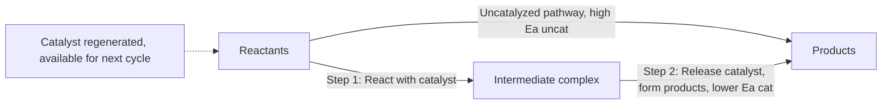
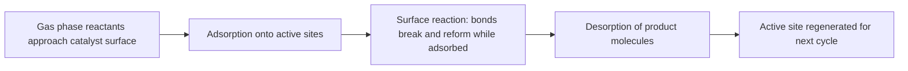

## Catalysis

### Foundational Concept

A **catalyst** is a substance that increases the rate of a chemical reaction without being permanently consumed in the overall process. Catalysts function by providing an alternative reaction pathway (mechanism) with a **lower activation energy** than the uncatalyzed pathway, allowing a larger fraction of molecular collisions to possess sufficient energy to react at a given temperature. Critically, a catalyst does **not** alter the thermodynamics of a reaction — it changes neither $\Delta H$, $\Delta G$, $\Delta S$, nor the equilibrium constant $K$; it affects only the **rate** at which equilibrium is reached, not the equilibrium position itself.

### How Catalysts Work: The Alternative Pathway

A catalyst is consumed in an early mechanistic step and fully regenerated in a later step, resulting in **net zero consumption** over the complete reaction cycle. This is the defining structural distinction between a catalyst and a reaction intermediate (which is produced then consumed, appearing only mid-mechanism, never at the start).

Because $E_{a,catalyzed} < E_{a,uncatalyzed}$, and because rate depends exponentially on $E_a$ through the Arrhenius relationship ($k \propto e^{-E_a/RT}$), even a modest reduction in activation energy can produce a very large increase in reaction rate.

### Reaction Energy Diagram Comparison

On a reaction coordinate diagram, the catalyzed pathway shows a lower activation energy peak (or, for multi-step catalyzed mechanisms, two or more smaller peaks corresponding to the individual catalyzed steps) while the initial (reactant) and final (product) energy levels remain **identical** to the uncatalyzed pathway — visually confirming that $\Delta H_{rxn}$ is unchanged by the presence of a catalyst.

### Worked Example 1: Quantifying the Rate Enhancement from a Catalyst

A reaction has an uncatalyzed activation energy of $E_{a,uncat} = 100$ kJ/mol. A catalyst lowers this to $E_{a,cat} = 75$ kJ/mol. Assuming the pre-exponential factor $A$ is unchanged, calculate the ratio $k_{cat}/k_{uncat}$ at 298 K.

$$\frac{k_{cat}}{k_{uncat}} = \frac{Ae^{-E_{a,cat}/RT}}{Ae^{-E_{a,uncat}/RT}} = e^{-(E_{a,cat}-E_{a,uncat})/RT}$$

$$\frac{k_{cat}}{k_{uncat}} = e^{-(75{,}000-100{,}000)/[(8.314)(298)]} = e^{25{,}000/2473.6} = e^{10.11}$$

$$\frac{k_{cat}}{k_{uncat}} \approx 2.46 \times 10^4$$

A reduction of just 25 kJ/mol in activation energy produces a rate enhancement of nearly 25,000-fold at room temperature — this dramatic sensitivity illustrates why catalysts can be so powerful despite operating only on the kinetic pathway, not the reaction's thermodynamic favorability. [This calculation assumes $A$ remains constant between the catalyzed and uncatalyzed pathways, a simplification; in practice $A$ can also change somewhat since the mechanism itself is different.]

### Homogeneous Catalysis

A **homogeneous catalyst** exists in the **same phase** as the reactants (most commonly, both dissolved in the same liquid solution or both present as gases). Homogeneous catalysis typically proceeds through a well-defined molecular mechanism in which the catalyst directly participates as a reactant in one step and is regenerated as a product in another.

**Example — acid-catalyzed ester hydrolysis:**

$$\text{Ester} + H_2O \xrightarrow{H^+ \text{(catalyst)}} \text{Carboxylic acid} + \text{Alcohol}$$

The $H^+$ ion participates in an early mechanistic step (protonating the carbonyl oxygen, increasing its electrophilicity) and is regenerated in a later step, appearing in neither the reactants nor products of the net balanced equation despite being essential to the reaction pathway.

### Heterogeneous Catalysis

A **heterogeneous catalyst** exists in a **different phase** from the reactants — most commonly a solid catalyst acting on gas-phase or liquid-phase reactants. Heterogeneous catalysis proceeds through a distinct mechanistic sequence involving the catalyst's surface:

1. **Adsorption** — reactant molecules bind to active sites on the catalyst surface (via physisorption or, more relevantly for reactivity, chemisorption, where actual chemical bonds form between reactant and surface).
2. **Surface reaction** — adsorbed reactant molecules, now held in close proximity and often in a strained or activated geometric configuration, react with each other on the catalyst surface, typically with a lowered activation energy compared to gas-phase collision alone.
3. **Desorption** — product molecules detach from the catalyst surface, freeing the active site for further catalytic cycles.

**Example — catalytic converters in automobiles:** platinum, palladium, and rhodium surfaces catalyze the conversion of toxic exhaust gases ($CO$, unburned hydrocarbons, $NO_x$) into less harmful $CO_2$, $H_2O$, and $N_2$, via adsorption of gas-phase pollutants onto the metal surface followed by surface-mediated reaction and desorption of products.

### Enzymes: Biological Catalysts

**Enzymes** are highly specific biological catalysts, almost universally proteins (with some catalytic RNA molecules, called ribozymes, as a notable exception), that catalyze biochemical reactions with remarkable efficiency and selectivity. Enzymes operate through a specialized region called the **active site**, where the substrate (the reactant molecule) binds via a geometrically and chemically complementary fit.

**Lock-and-key model:** an early conceptual model proposing that the enzyme's active site has a rigid shape precisely complementary to the substrate, analogous to a specific key fitting a specific lock.

**Induced-fit model:** a more refined and currently favored model proposing that the active site is somewhat flexible, undergoing a conformational change upon substrate binding to achieve optimal geometric and electronic complementarity — providing a more accurate description of the dynamic binding process observed for most enzymes. [The induced-fit model is the more broadly accepted refinement in modern biochemistry, though the degree of conformational flexibility varies considerably between different enzymes.]

Enzymes achieve activation energy reduction through mechanisms including:

- Precise substrate orientation, maximizing the effective steric (orientation) factor.
- Stabilization of the transition state through specific, complementary non-covalent interactions with active-site residues.
- Providing acidic or basic functional groups (from amino acid side chains) that participate directly in the reaction mechanism, similarly to small-molecule acid/base catalysis.
- In some cases, temporary covalent bond formation between enzyme and substrate, creating a lower-energy alternative pathway.

### Catalyst Poisoning and Selectivity

**Catalyst poisoning** occurs when a substance binds strongly (often irreversibly) to a catalyst's active sites, blocking them from further catalytic activity and reducing or eliminating the catalyst's effectiveness. This is a significant practical concern in industrial catalysis (e.g., sulfur compounds poisoning catalytic converters and many industrial metal catalysts) and is a key reason feedstock purity is closely controlled in large-scale catalytic processes.

**Catalyst selectivity** refers to a catalyst's ability to favor formation of one specific product among multiple thermodynamically possible outcomes, by specifically lowering the activation energy of the pathway leading to the desired product more than pathways leading to competing products. This selectivity is of major industrial and pharmaceutical importance, particularly for reactions with multiple possible products or stereochemical outcomes (e.g., enantioselective catalysis in pharmaceutical synthesis).

### Autocatalysis (Brief Overview)

**Autocatalysis** is a special case in which one of the **products** of a reaction acts as a catalyst for that same reaction, causing the reaction rate to increase as the reaction proceeds (in contrast to typical reactions, where rate decreases over time as reactant concentration falls). This produces a characteristic sigmoidal (S-shaped) concentration-vs-time curve, with an initial slow phase, followed by rapid acceleration as catalytic product accumulates, and finally a plateau as reactants become depleted.

### Comparative Table: Homogeneous vs. Heterogeneous Catalysis

| Feature | Homogeneous | Heterogeneous |
| --- | --- | --- |
| Phase relative to reactants | Same phase | Different phase |
| Typical mechanism | Direct molecular participation in solution/gas | Adsorption–surface reaction–desorption |
| Separation from products | Often difficult (same phase) | Generally easy (simple filtration/separation) |
| Common examples | Acid/base catalysis, many organometallic catalysts | Metal surface catalysts (Pt, Pd, Ni), zeolites |
| Selectivity control | Often highly tunable via ligand design | Governed by surface structure and active site geometry |

### Common Pitfalls

- **Believing catalysts shift the equilibrium position toward products** — catalysts speed up the attainment of equilibrium equally in both the forward and reverse directions, leaving the equilibrium constant $K$ and equilibrium concentrations completely unchanged.
- **Assuming catalysts are consumed in the reaction** — by definition, a catalyst is fully regenerated by the end of the complete catalytic cycle; net consumption would indicate the substance is a reactant, not a true catalyst.
- **Confusing a catalyst with a reaction intermediate** — a catalyst is present at the *start* (consumed in an early step, regenerated later); an intermediate is produced mid-mechanism and does not appear among the initial reactants.
- **Assuming enzyme "lock-and-key" binding is a fully rigid, static process** — the more current and generally accepted induced-fit model recognizes conformational flexibility in most enzyme–substrate interactions.
- **Overlooking that catalysts can be selectively "poisoned"** — treating catalytic activity as a fixed, permanent property rather than one sensitive to feedstock purity and surface contamination in real industrial or laboratory settings.
- **Assuming all catalysis mechanisms are identical** — homogeneous and heterogeneous catalysis proceed through fundamentally different mechanistic pathways (direct molecular participation vs. surface adsorption/desorption cycles) and should not be conflated.

**Related Topics**

- Collision theory and activation energy
- The Arrhenius equation and temperature dependence
- Reaction mechanisms and the rate-determining step
- Enzyme kinetics and the Michaelis–Menten model
- Chemical equilibrium and Le Chatelier's Principle
- Industrial catalytic processes (Haber process, catalytic converters, cracking)
- Adsorption isotherms and surface chemistry
- Green chemistry and catalytic efficiency in sustainable synthesis