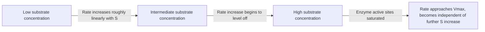
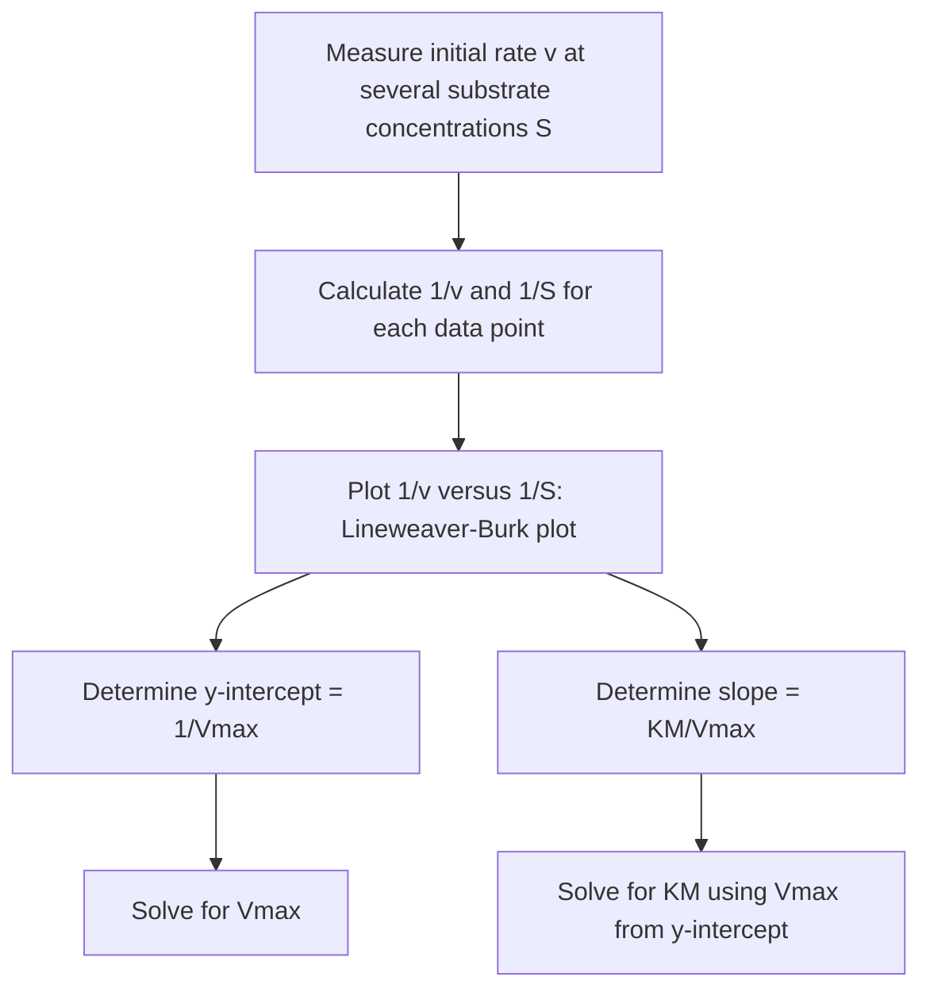

## Introduction to Enzyme Kinetics

### Foundational Concept

Enzyme kinetics is the study of the rates of enzyme-catalyzed reactions and how those rates depend on substrate concentration, enzyme concentration, and other factors such as temperature, pH, and the presence of inhibitors. Enzymes are biological catalysts, and while they follow the same fundamental thermodynamic and kinetic principles as any other catalyst (lowering activation energy without altering equilibrium position), their kinetics display a characteristic saturation behavior not seen in simple uncatalyzed or non-enzymatic catalyzed reactions, arising from the specific, saturable binding interaction between enzyme and substrate.

### The Enzyme–Substrate Complex

Enzyme catalysis proceeds through formation of a specific, reversible non-covalent complex between the enzyme ($E$) and its substrate ($S$), called the **enzyme–substrate complex** ($ES$), at a specialized region of the enzyme called the **active site**. This complex may then proceed to form product ($P$), releasing the free enzyme to catalyze further reaction cycles:

$$E + S \underset{k_{-1}}{\overset{k_1}{\rightleftharpoons}} ES \xrightarrow{k_2} E + P$$

This is a minimal two-step mechanism: a fast, reversible binding step (with forward rate constant $k_1$ and reverse rate constant $k_{-1}$), followed by a slower, often effectively irreversible, catalytic step (rate constant $k_2$, sometimes denoted $k_{cat}$) in which the substrate is chemically converted to product and released.

### Saturation Kinetics: The Defining Feature

Unlike a simple bimolecular reaction (where rate increases proportionally, without bound, as reactant concentration increases), enzyme-catalyzed reaction rate shows **saturation behavior**: as substrate concentration $[S]$ increases, the reaction rate initially increases roughly proportionally (first-order-like behavior at low $[S]$), but eventually **plateaus** at a maximum rate ($V_{max}$) as essentially all enzyme active sites become continuously occupied by substrate, regardless of how much additional substrate is added.

This saturation behavior is the direct kinetic consequence of the enzyme having a **finite number of active sites**: once every enzyme molecule is bound to substrate, adding more substrate cannot increase the rate further, since the reaction rate is now limited by how quickly the $ES \rightarrow E + P$ conversion step ($k_2$) occurs, not by the frequency of new $E + S$ collisions.

### The Michaelis–Menten Equation

The **Michaelis–Menten equation** is the foundational quantitative model describing this saturation kinetics, derived using the steady-state approximation applied to the $ES$ intermediate (assuming $[ES]$ remains approximately constant during the bulk of the reaction, since it is formed and consumed at comparable rates):

$$v = \frac{V_{max}[S]}{K_M + [S]}$$

where:

- $v$ = initial reaction rate (velocity) at a given substrate concentration $[S]$
- $V_{max}$ = the maximum possible reaction rate, achieved at saturating substrate concentration
- $K_M$ = the **Michaelis constant**, defined as the substrate concentration at which the reaction rate equals exactly half of $V_{max}$

### Physical Interpretation of KM

The Michaelis constant $K_M$ is formally defined by the rate constants of the underlying mechanism:

$$K_M = \frac{k_{-1} + k_2}{k_1}$$

**Interpreting $K_M$:** a **small** $K_M$ indicates that the enzyme reaches half-maximal rate at a low substrate concentration — generally interpreted as reflecting **high apparent affinity** between enzyme and substrate (the enzyme becomes saturated easily). A **large** $K_M$ indicates the enzyme requires a high substrate concentration to reach half-maximal rate, generally interpreted as reflecting **lower apparent affinity**. [This affinity interpretation is a useful approximation; $K_M$ is strictly a composite kinetic parameter involving all three rate constants, and equals the true dissociation constant of the $ES$ complex only in the special case where $k_2 \ll k_{-1}$.]

### Worked Example 1: Verifying the Half-Maximal Rate Definition

Confirm algebraically that when $[S] = K_M$, the reaction rate $v$ equals exactly half of $V_{max}$.

$$v = \frac{V_{max}[S]}{K_M + [S]}$$

Substituting $[S] = K_M$:

$$v = \frac{V_{max}(K_M)}{K_M + K_M} = \frac{V_{max}K_M}{2K_M} = \frac{V_{max}}{2}$$

This confirms the defining property of $K_M$ directly from the Michaelis–Menten equation.

### The Michaelis–Menten Curve

Plotting $v$ against $[S]$ produces a characteristic rectangular hyperbola:

- At **low** $[S]$ (specifically, $[S] \ll K_M$), the denominator $K_M + [S] \approx K_M$, so $v \approx \dfrac{V_{max}}{K_M}[S]$ — the rate is approximately **first order** with respect to $[S]$ (directly proportional).
- At **high** $[S]$ (specifically, $[S] \gg K_M$), the denominator $K_M + [S] \approx [S]$, so $v \approx \dfrac{V_{max}[S]}{[S]} = V_{max}$ — the rate becomes approximately **zero order** with respect to $[S]$ (independent of further concentration increases), since the enzyme is essentially saturated.

This transition from first-order to zero-order kinetics as $[S]$ increases is the hallmark behavior distinguishing enzyme (and other saturable catalytic) kinetics from simple elementary-step kinetics.

### Worked Example 2: Calculating Rate at a Given Substrate Concentration

An enzyme has $V_{max} = 5.0 \times 10^{-4}$ M/s and $K_M = 2.0 \times 10^{-3}$ M. Calculate the reaction rate at $[S] = 1.0 \times 10^{-3}$ M.

$$v = \frac{V_{max}[S]}{K_M + [S]} = \frac{(5.0\times10^{-4})(1.0\times10^{-3})}{(2.0\times10^{-3}) + (1.0\times10^{-3})}$$

$$v = \frac{5.0\times10^{-7}}{3.0\times10^{-3}} = 1.67\times10^{-4} \text{ M/s}$$

Since $[S] = 1.0\times10^{-3}$ M is less than $K_M$, the reaction rate (1.67 × 10⁻⁴ M/s) is, as expected, less than half of $V_{max}$ (2.5 × 10⁻⁴ M/s would be the half-maximal rate).

### The Lineweaver–Burk Plot (Linearization)

The Michaelis–Menten equation is a hyperbolic (non-linear) function, which historically made accurate graphical determination of $V_{max}$ and $K_M$ difficult (since $V_{max}$ is only truly approached asymptotically and is never precisely reached experimentally). Taking the reciprocal of both sides linearizes the relationship, producing the **Lineweaver–Burk equation**:

$$\frac{1}{v} = \frac{K_M}{V_{max}}\left(\frac{1}{[S]}\right) + \frac{1}{V_{max}}$$

This has the linear form $y = mx + b$, where:

- $y = 1/v$
- $x = 1/[S]$
- slope $= K_M/V_{max}$
- y-intercept $= 1/V_{max}$
- x-intercept $= -1/K_M$ (found by extrapolation to $y=0$)

### Worked Example 3: Determining Vmax and KM from a Lineweaver–Burk Plot

A Lineweaver–Burk plot of enzyme kinetic data yields a y-intercept of $2000$ M⁻¹·s and a slope of $4.0$ M·s. Determine $V_{max}$ and $K_M$.

**Step 1 — Solve for Vmax from the y-intercept:**

$$\text{y-intercept} = \frac{1}{V_{max}} = 2000 \text{ M}^{-1}\text{s}$$

$$V_{max} = \frac{1}{2000} = 5.0\times10^{-4} \text{ M/s}$$

**Step 2 — Solve for KM from the slope:**

$$\text{slope} = \frac{K_M}{V_{max}} = 4.0 \text{ M·s}$$

$$K_M = (\text{slope})(V_{max}) = (4.0)(5.0\times10^{-4}) = 2.0\times10^{-3} \text{ M}$$

These values match those given in Worked Example 2, confirming internal consistency between the direct Michaelis–Menten form and its linearized Lineweaver–Burk representation.

### Turnover Number (kcat)

The **turnover number** ($k_{cat}$, equivalent to $k_2$ in the minimal mechanism above for simple one-step catalytic conversion) represents the maximum number of substrate molecules converted to product per enzyme active site per unit time, under saturating substrate conditions:

$$k_{cat} = \frac{V_{max}}{[E]_{total}}$$

where $[E]_{total}$ is the total enzyme concentration. The ratio $k_{cat}/K_M$ is often used as a measure of overall catalytic efficiency, particularly useful for comparing different enzymes or different substrates for the same enzyme, since it reflects performance across the full range of (typically sub-saturating, physiologically relevant) substrate concentrations rather than only at saturation.

### Enzyme Inhibition (Brief Overview)

Enzyme activity can be reduced by **inhibitors**, molecules that decrease reaction rate through various mechanisms:

- **Competitive inhibition** — the inhibitor competes with substrate for binding at the active site (structurally resembles the substrate); increases the *apparent* $K_M$ (more substrate is needed to outcompete the inhibitor) but does not change $V_{max}$ (since sufficiently high $[S]$ can still fully saturate the enzyme, outcompeting the inhibitor).
- **Noncompetitive inhibition** — the inhibitor binds at a site distinct from the active site (an allosteric site), reducing enzyme efficiency regardless of substrate concentration; decreases $V_{max}$ but does not change $K_M$ (since substrate binding affinity itself is unaffected).
- **Uncompetitive inhibition** — the inhibitor binds only to the $ES$ complex (not to free enzyme), decreasing both apparent $V_{max}$ and apparent $K_M$.

A full quantitative treatment of inhibition kinetics (modified Michaelis–Menten equations for each inhibition type, and their distinguishing Lineweaver–Burk plot patterns) is developed in dedicated advanced enzyme kinetics coursework.

### Factors Affecting Enzyme Activity

- **Temperature** — enzyme activity generally increases with temperature (following Arrhenius-type behavior) up to an optimum, beyond which activity declines sharply due to **denaturation** (loss of the enzyme's native three-dimensional structure, which is essential for active-site geometry and function).
- **pH** — each enzyme has an optimal pH range (often reflecting the ionization states of catalytically important active-site amino acid residues); activity declines at pH values above or below this optimum, again potentially due to denaturation at extremes.
- **Enzyme and substrate concentration** — as described by the saturation kinetics above.
- **Presence of cofactors or coenzymes** — many enzymes require non-protein helper molecules (metal ions, vitamin-derived organic molecules) for full catalytic activity.

### Common Pitfalls

- **Confusing $K_M$ with a true equilibrium dissociation constant** — $K_M$ is a composite kinetic parameter (involving $k_1$, $k_{-1}$, and $k_2$) and only equals the true $ES$ dissociation constant under the specific condition $k_2 \ll k_{-1}$; treating it as a universal, direct binding-affinity measure requires this caveat.
- **Assuming enzyme kinetics remain first order at all substrate concentrations** — the defining feature of Michaelis–Menten kinetics is the transition from first-order (low $[S]$) to zero-order (high $[S]$, saturating) behavior; applying simple first-order kinetics across the full concentration range is a common conceptual error.
- **Misreading the Lineweaver–Burk x-intercept** — it corresponds to $-1/K_M$ (negative), not $+1/K_M$; sign errors here are common when extrapolating the line to the x-axis.
- **Confusing competitive and noncompetitive inhibition effects on $V_{max}$ and $K_M$** — competitive inhibition changes apparent $K_M$ but not true $V_{max}$; noncompetitive inhibition changes $V_{max}$ but not $K_M$.
- **Assuming higher temperature always increases enzyme activity** — this holds only up to the enzyme's optimal temperature; beyond that point, denaturation causes activity to decline sharply, often irreversibly.
- **Treating $k_{cat}$ and $V_{max}$ as interchangeable without normalizing for enzyme concentration** — $k_{cat}$ is a per-active-site turnover rate, while $V_{max}$ depends on total enzyme concentration present in the specific experimental system.

**Related Topics**

- Catalysis (homogeneous and heterogeneous, general principles)
- Reaction mechanisms and the rate-determining step
- Collision theory and activation energy
- Integrated rate laws and half-life
- Chemical equilibrium and binding equilibria
- Protein structure and denaturation
- Steady-state and pre-equilibrium approximations
- pH and buffer chemistry (acid–base connection to enzyme optimum pH)