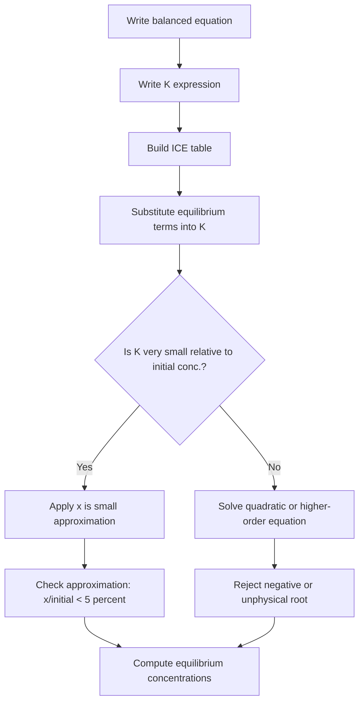
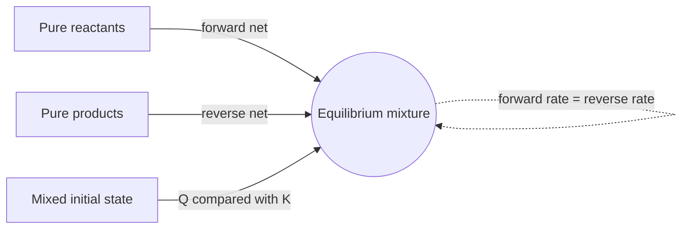

## Dynamic Equilibrium and the Equilibrium Constant

### Overview

Many chemical reactions do not proceed to completion. Instead, they reach a state in which reactants and products coexist at constant concentrations. This state is called **chemical equilibrium**. It is *dynamic* because the forward and reverse reactions continue to occur at equal rates, even though no net macroscopic change is observed. The **equilibrium constant** quantifies the composition of the mixture at equilibrium and therefore the extent to which a reaction proceeds.

**Key Points**

- Equilibrium is reached in a **closed system** (no exchange of matter with the surroundings) at constant temperature.
- At equilibrium, the **rate of the forward reaction equals the rate of the reverse reaction**; the concentrations are constant, not equal.
- The equilibrium constant $K$ depends **only on temperature** (for a given reaction written in a given way).
- $K$ is independent of initial concentrations, the presence of a catalyst, and pressure changes (for a fixed temperature).
- A catalyst speeds up the approach to equilibrium but does **not** change the equilibrium position or $K$.

---

### Reversible and Irreversible Reactions

| Feature | Irreversible (goes to completion) | Reversible (reaches equilibrium) |
| --- | --- | --- |
| Notation | $\rightarrow$ | $\rightleftharpoons$ |
| Final state | Limiting reagent fully consumed | Reactants and products coexist |
| Example | $2\,\text{Mg} + \text{O}_2 \rightarrow 2\,\text{MgO}$ | $\text{N}_2 + 3\,\text{H}_2 \rightleftharpoons 2\,\text{NH}_3$ |

In practice, every reaction is reversible to some degree. Reactions with extremely large $K$ are treated as going to completion.

---

### Dynamic Nature of Equilibrium

#### Rate Picture

Consider a generic elementary reversible reaction:

$$A \rightleftharpoons B$$

- Forward rate: $r_f = k_f[A]$
- Reverse rate: $r_r = k_r[B]$

Initially, only $A$ is present, so $r_f$ is large and $r_r = 0$. As $A$ is consumed, $r_f$ decreases; as $B$ accumulates, $r_r$ increases. Eventually:

$$r_f = r_r \quad\Rightarrow\quad k_f[A]_{eq} = k_r[B]_{eq}$$

$$\frac{[B]_{eq}}{[A]_{eq}} = \frac{k_f}{k_r} = K_c$$

This kinetic derivation shows that $K_c$ is the ratio of the forward and reverse rate constants (strictly valid for elementary steps; the general result follows from thermodynamics).

#### Evidence for Dynamic Equilibrium

- **Isotopic labeling:** If a system at equilibrium containing $\text{H}_2$, $\text{I}_2$ and $\text{HI}$ has some $\text{D}_2$ (deuterium) added, $\text{HD}$ and $\text{DI}$ appear over time although the overall concentrations of the original species remain constant. This shows that bond breaking and forming continue.
- **Saturated solution:** A saturated $\text{NaCl}$ solution in contact with solid $\text{NaCl}$ has constant mass of solid, yet radioactively labeled solid exchanges ions with the solution.

#### Concentration-Time and Rate-Time Behavior

<svg xmlns="http://www.w3.org/2000/svg" viewBox="0 0 640 300" width="640" height="300" font-family="sans-serif" font-size="12">
<text x="320" y="20" text-anchor="middle" font-size="14" font-weight="bold">Approach to Equilibrium: Concentration and Rate vs Time (svg_diagram)</text>

<text x="150" y="45" text-anchor="middle" font-weight="bold">Concentration</text>
<line x1="50" y1="240" x2="260" y2="240" stroke="black" stroke-width="1.5" />
<line x1="50" y1="240" x2="50" y2="55" stroke="black" stroke-width="1.5" />
<text x="155" y="272" text-anchor="middle">time</text>
<text x="18" y="150" text-anchor="middle" transform="rotate(-90 18 150)">[ ]</text>
<path d="M50 70 C 90 130, 130 165, 260 175" fill="none" stroke="#c0392b" stroke-width="2.5" />
<path d="M50 230 C 90 200, 130 185, 260 180" fill="none" stroke="#2874a6" stroke-width="2.5" />
<line x1="150" y1="240" x2="150" y2="55" stroke="gray" stroke-dasharray="4,4" />
<text x="152" y="66" font-size="11" fill="gray">t(eq)</text>
<text x="70" y="90" fill="#c0392b">[A]</text>
<text x="70" y="222" fill="#2874a6">[B]</text>

<text x="490" y="45" text-anchor="middle" font-weight="bold">Reaction Rate</text>
<line x1="390" y1="240" x2="600" y2="240" stroke="black" stroke-width="1.5" />
<line x1="390" y1="240" x2="390" y2="55" stroke="black" stroke-width="1.5" />
<text x="495" y="272" text-anchor="middle">time</text>
<text x="358" y="150" text-anchor="middle" transform="rotate(-90 358 150)">rate</text>
<path d="M390 70 C 430 130, 470 160, 600 170" fill="none" stroke="#c0392b" stroke-width="2.5" />
<path d="M390 235 C 430 205, 470 180, 600 172" fill="none" stroke="#2874a6" stroke-width="2.5" />
<line x1="490" y1="240" x2="490" y2="55" stroke="gray" stroke-dasharray="4,4" />
<text x="492" y="66" font-size="11" fill="gray">t(eq)</text>
<text x="410" y="90" fill="#c0392b">forward</text>
<text x="410" y="228" fill="#2874a6">reverse</text>
</svg>

---

### Conditions for Equilibrium

1. **Closed system:** No reactants or products can escape (e.g., $\text{CaCO}_3(s) \rightleftharpoons \text{CaO}(s) + \text{CO}_2(g)$ reaches equilibrium only in a sealed vessel).
2. **Constant temperature and pressure/volume** (no external perturbation).
3. **Macroscopic properties constant:** concentration, pressure, colour, density, and pH remain unchanged.
4. **Attainable from both directions:** the same equilibrium composition is reached starting from pure reactants, pure products, or any mixture (at the same temperature and overall composition).

---

### The Equilibrium Constant

#### The Law of Mass Action

For the general reaction:

$$aA + bB \rightleftharpoons cC + dD$$

the **equilibrium constant expression** in terms of concentrations is:

$$K_c = \frac{[C]^c\,[D]^d}{[A]^a\,[B]^b}$$

where concentrations are equilibrium values in $\text{mol dm}^{-3}$ (or $\text{mol L}^{-1}$). This was formulated by Guldberg and Waage (1864–1867).

#### Rules for Writing $K_c$

| Rule | Detail |
| --- | --- |
| Products over reactants | Products in the numerator; reactants in the denominator |
| Stoichiometric coefficients become exponents | $[C]^c$ etc. |
| Pure solids and pure liquids are omitted | Their activity is taken as 1 |
| Solvent in dilute solution is omitted | e.g., water in aqueous reactions |
| Gases and aqueous species are included | Use concentrations (or partial pressures for $K_p$) |
| $K$ applies to the equation as written | Changing coefficients changes $K$ |

#### Activities and the Thermodynamic Constant

Strictly, the thermodynamic equilibrium constant uses **activities**, $a_i$, which are dimensionless:

$$K = \prod_i a_i^{\nu_i}$$

For ideal gases $a_i = P_i/P^\circ$ and for dilute ideal solutions $a_i = [i]/c^\circ$, where $P^\circ = 1\ \text{bar}$ and $c^\circ = 1\ \text{mol dm}^{-3}$. Consequently, the rigorous $K$ is dimensionless. In introductory treatments, $K_c$ and $K_p$ are often quoted with units that depend on $\Delta n$.

---

### Equilibrium Constant in Terms of Pressure, $K_p$

For gaseous reactions:

$$K_p = \frac{(P_C)^c\,(P_D)^d}{(P_A)^a\,(P_B)^b}$$

where $P_i$ is the partial pressure of species $i$ at equilibrium.

#### Relationship Between $K_p$ and $K_c$

Assuming ideal gas behavior, $P_i = [i]RT$. Substituting:

$$K_p = K_c\,(RT)^{\Delta n}$$

where

$$\Delta n = (c + d) - (a + b)$$

is the change in moles of **gas** (products minus reactants). The value of $R$ must correspond to the pressure and concentration units used (e.g., $R = 0.08206\ \text{L atm mol}^{-1}\text{K}^{-1}$ for atm and $\text{mol L}^{-1}$).

**Key Points**

- If $\Delta n = 0$, then $K_p = K_c$.
- If $\Delta n > 0$, then $K_p > K_c$ at $T > 1/R$ in consistent units (commonly true).
- $T$ must be in kelvin.

#### Other Forms of the Constant

| Symbol | Expressed in terms of | Typical use |
| --- | --- | --- |
| $K_c$ | Molar concentrations | Solutions, gases |
| $K_p$ | Partial pressures | Gas-phase reactions |
| $K_x$ | Mole fractions | Gas mixtures, total pressure analysis |
| $K_a$, $K_b$ | Acid and base dissociation | Acid–base equilibria |
| $K_{sp}$ | Ion concentrations | Sparingly soluble salts |
| $K_w$ | $[\text{H}^+][\text{OH}^-]$ | Water autoionization |
| $K_f$ | Complex ion formation | Coordination chemistry |

---

### Homogeneous and Heterogeneous Equilibria

#### Homogeneous Equilibrium

All species are in the same phase.

$$\text{N}_2(g) + 3\,\text{H}_2(g) \rightleftharpoons 2\,\text{NH}_3(g)$$

$$K_c = \frac{[\text{NH}_3]^2}{[\text{N}_2][\text{H}_2]^3}, \qquad K_p = \frac{P_{\text{NH}_3}^2}{P_{\text{N}_2}\,P_{\text{H}_2}^3}$$

Here $\Delta n = 2 - 4 = -2$, so $K_p = K_c(RT)^{-2}$.

#### Heterogeneous Equilibrium

Species are in different phases; pure solids and liquids do not appear in $K$.

$$\text{CaCO}_3(s) \rightleftharpoons \text{CaO}(s) + \text{CO}_2(g)$$

$$K_c = [\text{CO}_2], \qquad K_p = P_{\text{CO}_2}$$

At a given temperature, the equilibrium pressure of $\text{CO}_2$ is fixed regardless of how much solid is present (provided some of each solid remains).

$$\text{C}(s) + \text{CO}_2(g) \rightleftharpoons 2\,\text{CO}(g), \qquad K_p = \frac{P_{\text{CO}}^2}{P_{\text{CO}_2}}$$

$$\text{Fe}^{3+}(aq) + \text{SCN}^-(aq) \rightleftharpoons [\text{FeSCN}]^{2+}(aq), \qquad K_c = \frac{[\text{FeSCN}^{2+}]}{[\text{Fe}^{3+}][\text{SCN}^-]}$$

---

### Manipulating Equilibrium Constants

| Operation on the equation | Effect on $K$ |
| --- | --- |
| Reverse the reaction | $K_{rev} = 1/K$ |
| Multiply coefficients by $n$ | $K_{new} = K^n$ |
| Add two reactions | $K_{net} = K_1 \times K_2$ |
| Subtract reaction 2 from reaction 1 | $K_{net} = K_1/K_2$ |

**Example**

Given at a certain temperature:

$$\text{N}_2(g) + \text{O}_2(g) \rightleftharpoons 2\,\text{NO}(g) \qquad K_1 = 4.1\times10^{-31}$$

$$2\,\text{NO}(g) + \text{O}_2(g) \rightleftharpoons 2\,\text{NO}_2(g) \qquad K_2 = 6.0\times10^{13}$$

Find $K$ for $\text{N}_2(g) + 2\,\text{O}_2(g) \rightleftharpoons 2\,\text{NO}_2(g)$.

Adding the equations gives the target reaction, so:

$$K = K_1 \times K_2 = (4.1\times10^{-31})(6.0\times10^{13}) = 2.5\times10^{-17}$$

**Conclusion:** The formation of $\text{NO}_2$ directly from its elements is highly unfavorable at this temperature.

---

### Magnitude of $K$ and Extent of Reaction

| Value of $K$ | Interpretation |
| --- | --- |
| $K \gg 1$ (e.g., $>10^{3}$) | Equilibrium lies far to the right; products favored; reaction essentially complete |
| $K \approx 1$ | Appreciable amounts of both reactants and products |
| $K \ll 1$ (e.g., $<10^{-3}$) | Equilibrium lies far to the left; reactants favored; little reaction |

**Key Points**

- $K$ indicates **how far** a reaction goes, not **how fast**. A reaction with a very large $K$ may be extremely slow (e.g., diamond → graphite at room temperature, or many combustion reactions without ignition).
- The direction of change depends on comparing $Q$ with $K$ (see below).

---

### The Reaction Quotient, $Q$

The **reaction quotient** has the same form as $K$ but uses concentrations (or pressures) at **any** moment, not just at equilibrium:

$$Q_c = \frac{[C]^c_t\,[D]^d_t}{[A]^a_t\,[B]^b_t}$$

| Comparison | Net direction of reaction |
| --- | --- |
| $Q < K$ | Proceeds forward (toward products) |
| $Q = K$ | System is at equilibrium |
| $Q > K$ | Proceeds in reverse (toward reactants) |

#### Relation to Free Energy

$$\Delta G = \Delta G^\circ + RT\ln Q$$

At equilibrium, $\Delta G = 0$ and $Q = K$, giving:

$$\Delta G^\circ = -RT\ln K$$

or equivalently:

$$K = e^{-\Delta G^\circ/RT}$$

so that:

| $\Delta G^\circ$ | $K$ |
| --- | --- |
| Negative | $K > 1$ |
| Zero | $K = 1$ |
| Positive | $K < 1$ |

#### Temperature Dependence: The van 't Hoff Equation

$$\ln\frac{K_2}{K_1} = -\frac{\Delta H^\circ}{R}\left(\frac{1}{T_2} - \frac{1}{T_1}\right)$$

- **Exothermic** ($\Delta H^\circ < 0$): $K$ decreases as $T$ increases.
- **Endothermic** ($\Delta H^\circ > 0$): $K$ increases as $T$ increases.

(This assumes $\Delta H^\circ$ is approximately constant over the temperature range.)

---

### ICE Table Method

The **ICE** (Initial, Change, Equilibrium) approach is the standard procedure for equilibrium calculations.

#### Procedure

1. Write the balanced equation and the $K$ expression.
2. Tabulate initial concentrations (**I**).
3. Define the change (**C**) using a variable $x$ scaled by stoichiometric coefficients.
4. Write equilibrium concentrations (**E**) as $\text{I} + \text{C}$.
5. Substitute into the $K$ expression and solve for $x$.
6. Check that all concentrations are physically meaningful (non-negative) and verify approximations.

---

### Worked Examples

#### Example 1: Writing and Evaluating $K_c$

For the reaction at 700 K:

$$\text{H}_2(g) + \text{I}_2(g) \rightleftharpoons 2\,\text{HI}(g)$$

an equilibrium mixture contains $[\text{H}_2] = 0.0222\ \text{M}$, $[\text{I}_2] = 0.0222\ \text{M}$, $[\text{HI}] = 0.156\ \text{M}$. Calculate $K_c$.

$$K_c = \frac{[\text{HI}]^2}{[\text{H}_2][\text{I}_2]} = \frac{(0.156)^2}{(0.0222)(0.0222)} = \frac{0.02434}{4.928\times10^{-4}} \approx 49.4$$

**Output:** $K_c \approx 49$ (dimensionless here because $\Delta n = 0$).

#### Example 2: Converting $K_c$ to $K_p$

For $\text{N}_2(g) + 3\,\text{H}_2(g) \rightleftharpoons 2\,\text{NH}_3(g)$, $K_c = 0.50$ at 400 °C. Find $K_p$ (pressures in atm).

- $T = 400 + 273.15 = 673.15\ \text{K}$
- $\Delta n = 2 - (1 + 3) = -2$
- $RT = (0.08206)(673.15) = 55.24$

$$K_p = K_c(RT)^{\Delta n} = 0.50\,(55.24)^{-2} = \frac{0.50}{3051} \approx 1.6\times10^{-4}$$

#### Example 3: Determining Direction Using $Q$

For $\text{H}_2(g) + \text{I}_2(g) \rightleftharpoons 2\,\text{HI}(g)$ with $K_c = 49.4$, a mixture has $[\text{H}_2] = 0.010$, $[\text{I}_2] = 0.010$, $[\text{HI}] = 0.10\ \text{M}$.

$$Q_c = \frac{(0.10)^2}{(0.010)(0.010)} = 100$$

Since $Q_c > K_c$, the net reaction proceeds in the **reverse** direction, converting $\text{HI}$ into $\text{H}_2$ and $\text{I}_2$ until $Q_c = 49.4$.

#### Example 4: ICE Table with Initial Reactants Only

$1.00\ \text{mol}$ of $\text{H}_2$ and $1.00\ \text{mol}$ of $\text{I}_2$ are placed in a $1.00\ \text{L}$ flask at 700 K ($K_c = 49.4$). Find equilibrium concentrations.

|  | $[\text{H}_2]$ | $[\text{I}_2]$ | $[\text{HI}]$ |
| --- | --- | --- | --- |
| **I** | 1.00 | 1.00 | 0 |
| **C** | $-x$ | $-x$ | $+2x$ |
| **E** | $1.00 - x$ | $1.00 - x$ | $2x$ |

$$K_c = \frac{(2x)^2}{(1.00 - x)^2} = 49.4$$

Taking the square root of both sides:

$$\frac{2x}{1.00 - x} = 7.03 \quad\Rightarrow\quad 2x = 7.03 - 7.03x \quad\Rightarrow\quad x = \frac{7.03}{9.03} = 0.778$$

$$[\text{H}_2] = [\text{I}_2] = 0.222\ \text{M}, \qquad [\text{HI}] = 1.556\ \text{M}$$

**Conclusion:** About 78% of the reactants are converted to $\text{HI}$, consistent with $K_c > 1$.

#### Example 5: Quadratic Solution

For $\text{N}_2\text{O}_4(g) \rightleftharpoons 2\,\text{NO}_2(g)$, $K_c = 4.6\times10^{-3}$ at 25 °C. If $0.0500\ \text{M}$ $\text{N}_2\text{O}_4$ is initially present, find $[\text{NO}_2]$ at equilibrium.

|  | $[\text{N}_2\text{O}_4]$ | $[\text{NO}_2]$ |
| --- | --- | --- |
| **I** | 0.0500 | 0 |
| **C** | $-x$ | $+2x$ |
| **E** | $0.0500 - x$ | $2x$ |

$$\frac{(2x)^2}{0.0500 - x} = 4.6\times10^{-3} \quad\Rightarrow\quad 4x^2 + 4.6\times10^{-3}x - 2.3\times10^{-4} = 0$$

Using the quadratic formula:

$$x = \frac{-b + \sqrt{b^2 - 4ac}}{2a} = \frac{-4.6\times10^{-3} + \sqrt{(4.6\times10^{-3})^2 + 4(4)(2.3\times10^{-4})}}{8}$$

$$x = \frac{-4.6\times10^{-3} + \sqrt{2.116\times10^{-5} + 3.68\times10^{-3}}}{8} = \frac{-4.6\times10^{-3} + 0.06083}{8} \approx 7.0\times10^{-3}$$

$$[\text{NO}_2] = 2x \approx 1.4\times10^{-2}\ \text{M}, \qquad [\text{N}_2\text{O}_4] \approx 0.043\ \text{M}$$

Here the approximation $0.0500 - x \approx 0.0500$ would give an error of about 14%, exceeding the usual 5% threshold, so the quadratic must be solved exactly.

#### Example 6: Heterogeneous Equilibrium

For $\text{CaCO}_3(s) \rightleftharpoons \text{CaO}(s) + \text{CO}_2(g)$, $K_p = 0.236\ \text{atm}$ at 800 °C (illustrative value). The equilibrium pressure of $\text{CO}_2$ is:

$$P_{\text{CO}_2} = K_p = 0.236\ \text{atm}$$

This holds regardless of the quantity of $\text{CaCO}_3$ or $\text{CaO}$ present, provided both solids remain.

---

### The "x is Small" Approximation

If $K$ is small and the initial concentration $[A]_0$ is large, the change $x$ may be neglected relative to $[A]_0$:

$$[A]_0 - x \approx [A]_0$$

**Validity test (5% rule):**

$$\frac{x}{[A]_0}\times 100\% < 5\%$$

If the test fails, solve the full quadratic (or use successive approximations). Behavior of the approximation depends on the specific values of $K$ and initial concentrations.

---

### Approach to Equilibrium from Either Direction

The same equilibrium composition (same $K$) is reached from any starting point consistent with the same overall atomic composition, temperature, and volume.

---

### Common Misconceptions

| Misconception | Correction |
| --- | --- |
| Concentrations of reactants and products are equal at equilibrium | Only the **ratio** defined by $K$ is fixed; concentrations are constant, not equal |
| Reactions stop at equilibrium | Forward and reverse reactions continue at equal rates |
| A catalyst changes $K$ | A catalyst lowers activation energy of both directions equally and does not change $K$ |
| Large $K$ means a fast reaction | $K$ is thermodynamic; rate is kinetic |
| Adding a pure solid shifts equilibrium | Pure solids do not appear in $K$; their amount is irrelevant (provided present) |
| $K$ changes when concentrations change | Only temperature changes $K$; concentration changes alter $Q$, and the system re-adjusts to the same $K$ |

---

### Summary of Key Relationships

$$K_c = \frac{[C]^c[D]^d}{[A]^a[B]^b}$$

$$K_p = K_c(RT)^{\Delta n}$$

$$\Delta G^\circ = -RT\ln K$$

$$\ln\frac{K_2}{K_1} = -\frac{\Delta H^\circ}{R}\left(\frac{1}{T_2} - \frac{1}{T_1}\right)$$

**Conclusion**

Dynamic equilibrium is a state of balanced opposing rates in a closed system, characterized at a given temperature by a fixed equilibrium constant. Comparing the reaction quotient $Q$ with $K$ predicts the direction of net change, and ICE-table methods convert $K$ into quantitative equilibrium compositions. The thermodynamic link $\Delta G^\circ = -RT\ln K$ connects equilibrium to energetics, while the van 't Hoff equation explains how $K$ varies with temperature.

**Related Topics**

- Le Chatelier's principle and factors affecting equilibrium position
- Reaction quotient and predicting the direction of reaction (extended problems)
- Equilibrium and Gibbs free energy
- Acid–base equilibria: $K_a$, $K_b$, $K_w$, and pH calculations
- Solubility equilibria and $K_{sp}$
- Buffers and the Henderson–Hasselbalch equation
- Industrial equilibria: Haber process, Contact process
- Complex ion equilibria and formation constants
- Gaseous equilibria and partial pressure calculations
- Kinetics vs thermodynamics of reversible reactions