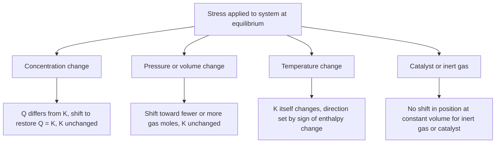
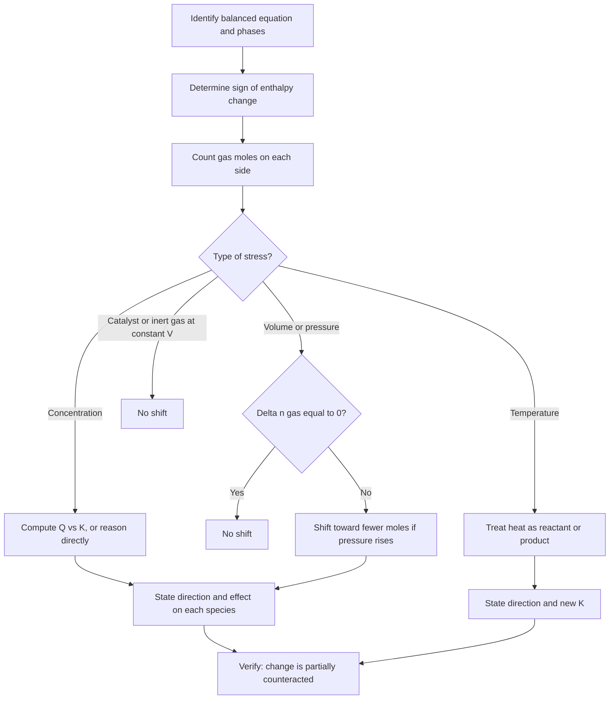

## Le Chatelier's Principle

### Overview

**Le Chatelier's principle** (Henry Louis Le Chatelier, 1884) states that when a system at equilibrium is subjected to a change in concentration, pressure (volume), or temperature, the system adjusts so as to partially counteract the imposed change, establishing a new equilibrium position. It is a qualitative predictive tool: it indicates the *direction* of the shift, while the reaction quotient $Q$ and the equilibrium constant $K$ provide the quantitative justification.

**Key Points**

- The principle applies to systems at **dynamic equilibrium** in which a stress is applied.
- The system **partially** counteracts the stress; it does not fully cancel it.
- Only **temperature** changes the value of $K$. Concentration, pressure, and volume changes shift the equilibrium **position** but leave $K$ unchanged (at constant temperature).
- A **catalyst** and the addition of an **inert gas at constant volume** do not shift the equilibrium position.
- The principle predicts direction, not rate; the speed of re-establishing equilibrium is a kinetic question.

---

### Formal Statement and Thermodynamic Basis

#### Statement

If an external constraint is imposed on a system at equilibrium, the system evolves in the direction that reduces the effect of that constraint.

#### Quantitative Justification via $Q$ and $K$

For the general reaction:

$$aA + bB \rightleftharpoons cC + dD$$

$$Q = \frac{[C]^c[D]^d}{[A]^a[B]^b}$$

Immediately after a stress is applied, $Q \neq K$ (except for temperature changes, where $K$ itself changes):

| Condition | Net shift |
| --- | --- |
| $Q < K$ | Forward (toward products) |
| $Q > K$ | Reverse (toward reactants) |
| $Q = K$ | No shift; at equilibrium |

The system shifts until $Q = K$ is restored.

#### Thermodynamic Link

$$\Delta G = \Delta G^\circ + RT\ln Q = RT\ln\frac{Q}{K}$$

- $Q < K \Rightarrow \Delta G < 0$: forward reaction spontaneous.
- $Q > K \Rightarrow \Delta G > 0$: reverse reaction spontaneous.

---

### Overview of Stresses and Responses

---

### Effect of Concentration Changes

#### Rules

| Stress | Response | Effect on $Q$ |
| --- | --- | --- |
| Add reactant | Shifts toward products (forward) | $Q$ decreases, so $Q < K$ |
| Remove reactant | Shifts toward reactants (reverse) | $Q$ increases, so $Q > K$ |
| Add product | Shifts toward reactants (reverse) | $Q$ increases, so $Q > K$ |
| Remove product | Shifts toward products (forward) | $Q$ decreases, so $Q < K$ |

Adding or removing a **pure solid or pure liquid** does not change $Q$ (it does not appear in the expression) and therefore causes no shift, provided some of it remains.

#### Example: Iron(III) Thiocyanate Equilibrium

$$\text{Fe}^{3+}(aq) + \text{SCN}^-(aq) \rightleftharpoons [\text{FeSCN}]^{2+}(aq)$$

(pale yellow + colourless ⇌ blood-red)

| Action | Observed shift | Colour change |
| --- | --- | --- |
| Add $\text{Fe}(\text{NO}_3)_3$ | Forward | Deeper red |
| Add $\text{KSCN}$ | Forward | Deeper red |
| Add $\text{AgNO}_3$ (precipitates $\text{SCN}^-$ as $\text{AgSCN}$) | Reverse | Red fades |
| Add $\text{NaOH}$ (precipitates $\text{Fe}^{3+}$ as $\text{Fe}(\text{OH})_3$) | Reverse | Red fades |

#### Worked Example: Adding a Reactant

For $\text{H}_2(g) + \text{I}_2(g) \rightleftharpoons 2\,\text{HI}(g)$ with $K_c = 49.4$ at 700 K, an equilibrium mixture has $[\text{H}_2] = [\text{I}_2] = 0.222\ \text{M}$ and $[\text{HI}] = 1.556\ \text{M}$. Suppose additional $\text{H}_2$ is injected instantaneously, raising $[\text{H}_2]$ to $0.500\ \text{M}$ (volume unchanged; other concentrations momentarily unchanged).

$$Q_c = \frac{(1.556)^2}{(0.500)(0.222)} = \frac{2.421}{0.111} \approx 21.8$$

Since $Q_c < K_c$, the reaction shifts **forward**. Let $x$ mol/L of $\text{H}_2$ be consumed:

|  | $[\text{H}_2]$ | $[\text{I}_2]$ | $[\text{HI}]$ |
| --- | --- | --- | --- |
| **Initial (after stress)** | 0.500 | 0.222 | 1.556 |
| **Change** | $-x$ | $-x$ | $+2x$ |
| **New equilibrium** | $0.500 - x$ | $0.222 - x$ | $1.556 + 2x$ |

$$\frac{(1.556 + 2x)^2}{(0.500 - x)(0.222 - x)} = 49.4$$

Expanding:

$$(1.556 + 2x)^2 = 2.421 + 6.224x + 4x^2$$

$$49.4\,(0.111 - 0.722x + x^2) = 5.483 - 35.67x + 49.4x^2$$

$$45.4x^2 - 41.89x + 3.062 = 0$$

$$x = \frac{41.89 - \sqrt{41.89^2 - 4(45.4)(3.062)}}{2(45.4)} = \frac{41.89 - \sqrt{1754.8 - 556.0}}{90.8} = \frac{41.89 - 34.62}{90.8} \approx 0.0801$$

(The larger root, $x \approx 0.84$, would give a negative $[\text{I}_2]$ and is rejected.)

New equilibrium: $[\text{H}_2] \approx 0.420\ \text{M}$, $[\text{I}_2] \approx 0.142\ \text{M}$, $[\text{HI}] \approx 1.716\ \text{M}$.

**Output:** $[\text{HI}]$ increased (1.556 → 1.716 M), $[\text{I}_2]$ decreased, and $[\text{H}_2]$ ended higher than the original 0.222 M but lower than the post-addition 0.500 M, demonstrating **partial** counteraction of the stress. Check: $\frac{(1.716)^2}{(0.420)(0.142)} \approx 49.4$. ✓

---

### Effect of Pressure and Volume Changes

#### Applicability

Pressure changes matter only for equilibria involving **gases** in which the number of moles of gas changes ($\Delta n_{gas} \neq 0$). Solids and liquids are practically incompressible, so their equilibria are essentially insensitive to pressure.

#### Changing Volume (Compression or Expansion)

| Stress | System response |
| --- | --- |
| Decrease volume (increase total pressure) | Shifts toward the side with **fewer moles of gas** |
| Increase volume (decrease total pressure) | Shifts toward the side with **more moles of gas** |
| $\Delta n_{gas} = 0$ | No shift |

#### Quantitative Basis

For $\text{N}_2\text{O}_4(g) \rightleftharpoons 2\,\text{NO}_2(g)$:

$$K_c = \frac{[\text{NO}_2]^2}{[\text{N}_2\text{O}_4]}$$

If the volume is halved instantaneously, all concentrations double:

$$Q_c = \frac{(2[\text{NO}_2])^2}{2[\text{N}_2\text{O}_4]} = 2K_c$$

Since $Q_c > K_c$, the system shifts **reverse**, toward $\text{N}_2\text{O}_4$ (fewer gas moles).

General result for $\Delta n_{gas}$: compressing by a factor $f$ (volume $\rightarrow V/f$) multiplies $Q_c$ by $f^{\Delta n_{gas}}$ relative to $K_c$. If $\Delta n_{gas} > 0$, $Q_c > K_c$ and the shift is reverse; if $\Delta n_{gas} < 0$, $Q_c < K_c$ and the shift is forward.

#### Adding an Inert Gas

| Condition | Effect |
| --- | --- |
| Inert gas added at **constant volume** | Total pressure rises, but partial pressures/concentrations of reacting species are unchanged, so **no shift** |
| Inert gas added at **constant total pressure** (volume expands) | Partial pressures of reacting species drop; equilibrium shifts toward the side with **more gas moles** |

#### Example: Haber Process

$$\text{N}_2(g) + 3\,\text{H}_2(g) \rightleftharpoons 2\,\text{NH}_3(g) \qquad \Delta n_{gas} = -2$$

High pressure favours the forward reaction (4 mol gas → 2 mol gas), increasing the equilibrium yield of $\text{NH}_3$.

#### Worked Example: Compression

$\text{N}_2\text{O}_4(g) \rightleftharpoons 2\,\text{NO}_2(g)$ at equilibrium has $[\text{N}_2\text{O}_4] = 0.0430\ \text{M}$ and $[\text{NO}_2] = 0.0140\ \text{M}$, giving $K_c = \frac{(0.0140)^2}{0.0430} = 4.56\times10^{-3}$. The volume is halved.

Immediately after compression: $[\text{N}_2\text{O}_4] = 0.0860$, $[\text{NO}_2] = 0.0280$.

$$Q_c = \frac{(0.0280)^2}{0.0860} = 9.12\times10^{-3} > K_c$$

The system shifts reverse. Let $x$ = decrease in $[\text{NO}_2]$ per $2$ stoichiometry:

$$\frac{(0.0280 - 2x)^2}{0.0860 + x} = 4.56\times10^{-3}$$

$$4x^2 - 0.112x + 7.84\times10^{-4} = 4.56\times10^{-3}(0.0860 + x)$$

$$4x^2 - 0.1166x + 3.918\times10^{-4} = 0$$

$$x = \frac{0.1166 - \sqrt{0.1166^2 - 4(4)(3.918\times10^{-4})}}{8} = \frac{0.1166 - \sqrt{0.013596 - 0.006269}}{8} = \frac{0.1166 - 0.08560}{8} \approx 3.9\times10^{-3}$$

New equilibrium: $[\text{NO}_2] \approx 0.0202\ \text{M}$ and $[\text{N}_2\text{O}_4] \approx 0.0899\ \text{M}$.

**Conclusion:** The mole fraction of $\text{NO}_2$ decreased after compression, consistent with the shift toward fewer gas moles, though the absolute $[\text{NO}_2]$ is still larger than before compression (partial counteraction).

---

### Effect of Temperature Changes

Temperature is the **only** stress that changes the numerical value of $K$. Treat heat as a reactant (endothermic) or product (exothermic).

#### Rules

| Reaction type | $\Delta H^\circ$ | Temperature increase | Temperature decrease |
| --- | --- | --- | --- |
| Exothermic | $< 0$ | Shifts **reverse**; $K$ **decreases** | Shifts **forward**; $K$ **increases** |
| Endothermic | $> 0$ | Shifts **forward**; $K$ **increases** | Shifts **reverse**; $K$ **decreases** |

#### Quantitative Basis: van 't Hoff Equation

$$\ln\frac{K_2}{K_1} = -\frac{\Delta H^\circ}{R}\left(\frac{1}{T_2} - \frac{1}{T_1}\right)$$

(assuming $\Delta H^\circ$ is approximately constant over the temperature range).

**Example:** For the exothermic reaction $\text{N}_2(g) + 3\,\text{H}_2(g) \rightleftharpoons 2\,\text{NH}_3(g)$ with $\Delta H^\circ = -92.4\ \text{kJ mol}^{-1}$ and $K_p = 6.0\times10^{5}$ at 298 K (illustrative value), estimate $K_p$ at 500 K.

$$\ln\frac{K_2}{K_1} = -\frac{-92400}{8.314}\left(\frac{1}{500} - \frac{1}{298}\right) = 11113.8\,(0.002 - 0.003356) = 11113.8\,(-0.001356) = -15.07$$

$$K_2 = 6.0\times10^{5}\times e^{-15.07} \approx 6.0\times10^{5}\times2.86\times10^{-7} \approx 0.17$$

**Output:** $K$ falls by roughly six orders of magnitude on heating from 298 K to 500 K, confirming that higher temperature disfavours ammonia formation.

#### Example: Cobalt Chloride Equilibrium

$$[\text{Co}(\text{H}_2\text{O})_6]^{2+}(aq) + 4\,\text{Cl}^-(aq) \rightleftharpoons [\text{CoCl}_4]^{2-}(aq) + 6\,\text{H}_2\text{O}(l) \qquad \Delta H > 0$$

(pink ⇌ blue)

| Action | Shift | Colour |
| --- | --- | --- |
| Heat | Forward (endothermic) | Turns blue |
| Cool in ice bath | Reverse | Turns pink |
| Add concentrated HCl (more $\text{Cl}^-$) | Forward | Turns blue |
| Add water (dilute) | Reverse | Turns pink |

#### Example: Nitrogen Dioxide–Dinitrogen Tetroxide

$$\text{N}_2\text{O}_4(g) \rightleftharpoons 2\,\text{NO}_2(g) \qquad \Delta H^\circ = +57.2\ \text{kJ mol}^{-1}$$

(colourless ⇌ brown). Heating darkens the mixture (more $\text{NO}_2$); cooling lightens it.

---

### Effect of a Catalyst

A catalyst provides an alternative pathway with lower activation energy for **both** the forward and reverse reactions equally. Consequently:

- Equilibrium is reached **faster**.
- The equilibrium composition and $K$ are **unchanged**.
- The reaction quotient at equilibrium remains $Q = K$.

<svg xmlns="http://www.w3.org/2000/svg" viewBox="0 0 560 320" width="560" height="320" font-family="sans-serif" font-size="12">
<text x="280" y="22" text-anchor="middle" font-size="14" font-weight="bold">Catalyst Lowers Both Activation Barriers Equally (svg_diagram)</text>
<line x1="60" y1="280" x2="520" y2="280" stroke="black" stroke-width="1.5" />
<line x1="60" y1="280" x2="60" y2="45" stroke="black" stroke-width="1.5" />
<text x="290" y="308" text-anchor="middle">Reaction coordinate</text>
<text x="22" y="165" text-anchor="middle" transform="rotate(-90 22 165)">Potential energy</text>

<path d="M70 200 L150 200 C 190 200, 200 70, 290 70 C 380 70, 390 240, 440 240 L510 240" fill="none" stroke="#c0392b" stroke-width="2.5" />

<path d="M70 200 L150 200 C 190 200, 210 130, 290 130 C 370 130, 390 240, 440 240 L510 240" fill="none" stroke="#2874a6" stroke-width="2.5" stroke-dasharray="7,4" />
<text x="100" y="192" fill="black">Reactants</text>
<text x="450" y="232" fill="black">Products</text>
<text x="290" y="60" text-anchor="middle" fill="#c0392b">Ea (uncatalysed)</text>
<text x="290" y="150" text-anchor="middle" fill="#2874a6">Ea (catalysed)</text>
<text x="80" y="265" fill="gray" font-size="11">Same reactant and product energies, so same K</text>
</svg>

---

### Summary Table of Stresses

| Stress | Shift direction | Changes $K$? | Notes |
| --- | --- | --- | --- |
| Increase $[\text{reactant}]$ | Forward | No | $Q < K$ initially |
| Increase $[\text{product}]$ | Reverse | No | $Q > K$ initially |
| Decrease $[\text{reactant}]$ | Reverse | No | $Q > K$ initially |
| Decrease $[\text{product}]$ | Forward | No | Product removal drives yield |
| Increase pressure (decrease volume) | Toward fewer gas moles | No | No effect if $\Delta n_{gas} = 0$ |
| Decrease pressure (increase volume) | Toward more gas moles | No | No effect if $\Delta n_{gas} = 0$ |
| Add inert gas (constant $V$) | None | No | Partial pressures unchanged |
| Add inert gas (constant $P$) | Toward more gas moles | No | Effective dilution |
| Increase $T$ | Toward endothermic direction | **Yes** | Exo: $K \downarrow$; Endo: $K \uparrow$ |
| Decrease $T$ | Toward exothermic direction | **Yes** | Exo: $K \uparrow$; Endo: $K \downarrow$ |
| Add catalyst | None | No | Only rate of approach changes |

---

### Industrial Applications

#### Haber–Bosch Process

$$\text{N}_2(g) + 3\,\text{H}_2(g) \rightleftharpoons 2\,\text{NH}_3(g) \qquad \Delta H^\circ = -92\ \text{kJ mol}^{-1}$$

| Factor | Thermodynamic preference | Kinetic/economic consideration | Typical compromise |
| --- | --- | --- | --- |
| Pressure | High (fewer moles of gas on product side) | Equipment cost, safety | About 150–250 atm |
| Temperature | Low (exothermic) | Rate too slow at low $T$ | About 400–500 °C |
| Catalyst | No effect on yield | Increases rate | Iron-based catalyst |
| Product removal | Continuous liquefaction of $\text{NH}_3$ shifts equilibrium forward | Recycling unreacted gas | Recycle loop |

#### Contact Process (Sulfuric Acid)

$$2\,\text{SO}_2(g) + \text{O}_2(g) \rightleftharpoons 2\,\text{SO}_3(g) \qquad \Delta H^\circ = -197\ \text{kJ mol}^{-1}$$

Low temperature and high pressure favour $\text{SO}_3$, but a moderate temperature (about 400–450 °C) with a vanadium(V) oxide catalyst is used to obtain an acceptable rate; the equilibrium conversion is already high at about 1–2 atm, so very high pressure is not economically justified.

#### Physiological and Environmental Examples

- **Oxygen transport:** $\text{Hb} + 4\,\text{O}_2 \rightleftharpoons \text{Hb}(\text{O}_2)_4$. At altitude, lower $P_{\text{O}_2}$ shifts the equilibrium toward deoxyhemoglobin; long-term acclimatization increases red blood cell production to compensate.
- **Carbonate buffer in blood:** $\text{CO}_2(g) + \text{H}_2\text{O}(l) \rightleftharpoons \text{H}_2\text{CO}_3(aq) \rightleftharpoons \text{H}^+(aq) + \text{HCO}_3^-(aq)$. Exhaling $\text{CO}_2$ removes a component and shifts the equilibrium leftward, raising pH.
- **Ocean acidification:** Dissolution of atmospheric $\text{CO}_2$ shifts $\text{CO}_2 + \text{H}_2\text{O} \rightleftharpoons \text{H}^+ + \text{HCO}_3^-$ forward and reduces carbonate ion availability, shifting $\text{CaCO}_3(s) \rightleftharpoons \text{Ca}^{2+} + \text{CO}_3^{2-}$ toward dissolution.
- **Carbonated beverages:** $\text{CO}_2(aq) \rightleftharpoons \text{CO}_2(g)$. Opening the bottle lowers the gas-phase pressure, shifting the equilibrium toward $\text{CO}_2(g)$ and producing fizzing.

---

### Systematic Problem-Solving Procedure

---

### Limitations and Common Misconceptions

| Misconception | Clarification |
| --- | --- |
| The system fully cancels the stress | Only **partial** counteraction occurs; the new equilibrium differs from the original |
| Adding more reactant always increases the concentration of every product | Product amounts rise, but the conversion fraction of the *added* reactant may fall |
| Pressure always shifts equilibrium | Only when $\Delta n_{gas} \neq 0$ and the volume or partial pressures actually change |
| Increasing total pressure with an inert gas at constant $V$ shifts equilibrium | No shift; partial pressures of reacting species are unchanged |
| A catalyst increases yield | A catalyst changes rate only, not equilibrium composition |
| Temperature change shifts equilibrium but $K$ is constant | Temperature change **alters $K$**; that is precisely why the position shifts |
| Le Chatelier's principle explains why the shift occurs | It predicts direction; the origin lies in thermodynamics ($\Delta G$, $Q$ vs $K$) and, kinetically, in the relative rates of the forward and reverse reactions |
| The principle applies to all systems | It applies to systems at equilibrium responding to changes in intensive/extensive variables; in complex multi-reaction systems, or when several stresses coincide, the net prediction may be ambiguous and may require calculation with $Q$ and $K$ |

**Key Points**

- For systems with several simultaneous changes (e.g., compression plus heating), evaluate each stress separately and, if the effects conflict, compute the result quantitatively.
- Coupled equilibria (e.g., acid–base plus solubility) can respond in ways that are not obvious from a single-reaction analysis; behavior may vary with the specific system.

---

### Summary

Le Chatelier's principle provides a rapid qualitative method for predicting how equilibrium mixtures respond to changes in concentration, pressure or volume, and temperature. Its predictions are rooted in the comparison of $Q$ with $K$ and in the temperature dependence of $K$ given by the van 't Hoff equation. Concentration and pressure changes move the system along a fixed-$K$ surface; only temperature alters $K$ itself; catalysts affect kinetics alone. In industrial chemistry, the principle guides the trade-off between yield (thermodynamics) and rate (kinetics) in processes such as the Haber–Bosch and Contact processes.

**Related Topics**

- Reaction quotient and predicting direction of reaction (extended problems)
- Equilibrium and Gibbs free energy
- The van 't Hoff equation and temperature dependence of $K$
- Acid–base equilibria and the common-ion effect
- Solubility equilibria ($K_{sp}$) and the common-ion effect
- Buffer solutions and Henderson–Hasselbalch equation
- Industrial equilibria: Haber–Bosch, Contact process, methanol synthesis
- Gaseous equilibria and partial pressure calculations
- Kinetic versus thermodynamic control
- Coupled and simultaneous equilibria