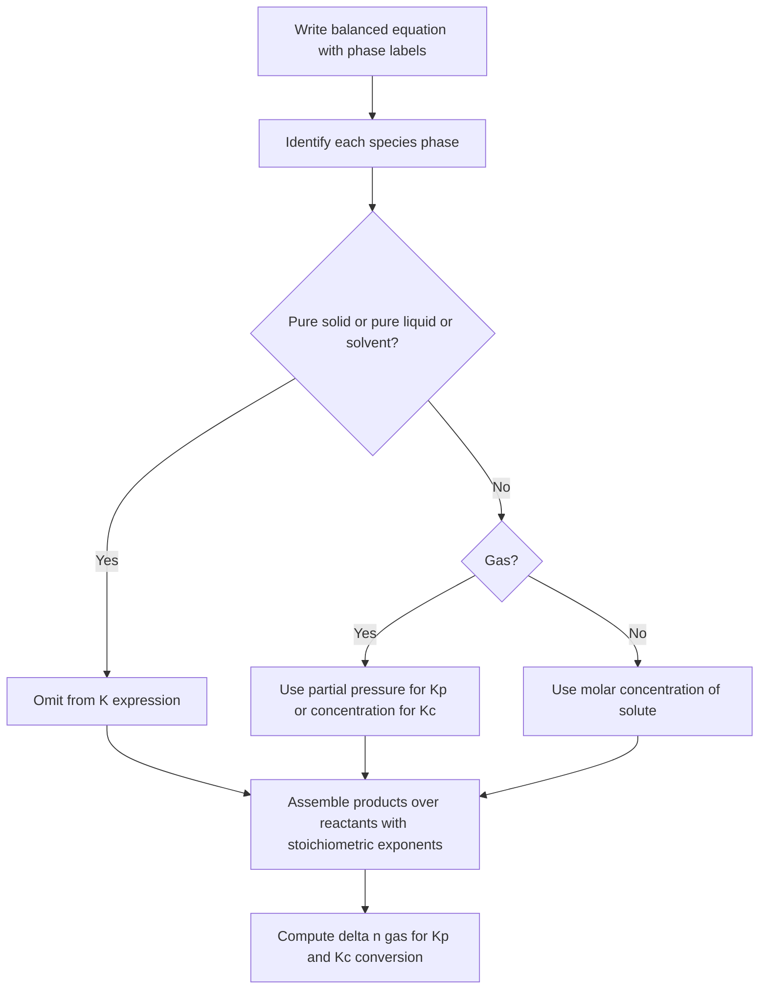

## Heterogeneous Equilibria

### Overview

A **heterogeneous equilibrium** is a chemical equilibrium in which the reacting species are present in **more than one phase** (for example, solid + gas, solid + solution, or liquid + gas). It contrasts with a **homogeneous equilibrium**, where all species share a single phase. The defining feature of heterogeneous equilibria is that **pure solids and pure liquids do not appear in the equilibrium-constant expression**, because their activities are taken as unity. Only gases (via partial pressure or concentration) and dissolved species (via concentration) appear.

**Key Points**

- Pure solids and pure liquids have activity $a = 1$ and are omitted from $K$ and $Q$.
- The **amount** of a pure solid or liquid does not affect the position of equilibrium, provided some of each phase remains present.
- If a required solid or liquid is fully consumed, the system is no longer at that equilibrium, and $Q = K$ cannot be established.
- $K_p$ and $K_c$ are related by $K_p = K_c(RT)^{\Delta n_{gas}}$, where only **gaseous** species are counted in $\Delta n_{gas}$.
- The solvent in a dilute solution (e.g., water) is treated as a pure liquid with $a \approx 1$ and is omitted.
- Le Chatelier's principle applies, but adding or removing a pure solid or liquid causes no shift.

---

### Homogeneous vs Heterogeneous Equilibria

| Feature | Homogeneous | Heterogeneous |
| --- | --- | --- |
| Phases present | One | Two or more |
| Example | $\text{N}_2(g) + 3\,\text{H}_2(g) \rightleftharpoons 2\,\text{NH}_3(g)$ | $\text{CaCO}_3(s) \rightleftharpoons \text{CaO}(s) + \text{CO}_2(g)$ |
| Species in $K$ | All reactants and products | Only gases and solutes |
| Effect of adding pure solid/liquid | Not applicable | No shift |

---

### Why Pure Solids and Liquids Are Omitted

The rigorous thermodynamic equilibrium constant is written in terms of **activities**:

$$K = \prod_i a_i^{\nu_i}$$

For a pure solid or pure liquid in its standard state (at the system pressure, assuming pressure effects are negligible), the activity is:

$$a_{solid} = a_{liquid} = 1$$

Alternatively, the concentration of a pure solid or liquid is fixed by its density and molar mass and does not vary with the amount present:

$$[\text{solid}] = \frac{\rho}{M}$$

For example, for calcium carbonate ($\rho \approx 2.71\ \text{g cm}^{-3}$, $M = 100.09\ \text{g mol}^{-1}$):

$$[\text{CaCO}_3] = \frac{2710\ \text{g L}^{-1}}{100.09\ \text{g mol}^{-1}} \approx 27.1\ \text{mol L}^{-1}$$

This constant value is absorbed into the definition of $K_c$. Consequently:

| Species type | Included in $K$? | Appears as |
| --- | --- | --- |
| Gas | Yes | Partial pressure (in $K_p$) or concentration (in $K_c$) |
| Dissolved solute | Yes | Molar concentration |
| Pure solid | No | Omitted (activity = 1) |
| Pure liquid | No | Omitted (activity = 1) |
| Solvent (dilute solution) | No | Omitted (activity ≈ 1) |
| Liquid mixture component (non-ideal or non-dilute) | Yes | Mole fraction or activity |

---

### Writing Equilibrium Expressions

#### Procedure

#### Worked Expressions

**1. Thermal decomposition of calcium carbonate**

$$\text{CaCO}_3(s) \rightleftharpoons \text{CaO}(s) + \text{CO}_2(g)$$

$$K_c = [\text{CO}_2], \qquad K_p = P_{\text{CO}_2}$$

**2. Reaction of carbon with carbon dioxide (Boudouard equilibrium)**

$$\text{C}(s) + \text{CO}_2(g) \rightleftharpoons 2\,\text{CO}(g)$$

$$K_c = \frac{[\text{CO}]^2}{[\text{CO}_2]}, \qquad K_p = \frac{P_{\text{CO}}^2}{P_{\text{CO}_2}}$$

**3. Water-gas reaction**

$$\text{C}(s) + \text{H}_2\text{O}(g) \rightleftharpoons \text{CO}(g) + \text{H}_2(g)$$

$$K_p = \frac{P_{\text{CO}}\,P_{\text{H}_2}}{P_{\text{H}_2\text{O}}}$$

**4. Reduction of iron(III) oxide by hydrogen**

$$\text{Fe}_2\text{O}_3(s) + 3\,\text{H}_2(g) \rightleftharpoons 2\,\text{Fe}(s) + 3\,\text{H}_2\text{O}(g)$$

$$K_p = \frac{P_{\text{H}_2\text{O}}^3}{P_{\text{H}_2}^3}$$

**5. Ammonium chloride sublimation/decomposition**

$$\text{NH}_4\text{Cl}(s) \rightleftharpoons \text{NH}_3(g) + \text{HCl}(g)$$

$$K_p = P_{\text{NH}_3}\,P_{\text{HCl}}$$

**6. Vaporization of water**

$$\text{H}_2\text{O}(l) \rightleftharpoons \text{H}_2\text{O}(g)$$

$$K_p = P_{\text{H}_2\text{O}} = \text{vapour pressure of water at } T$$

**7. Solubility equilibrium of silver chloride**

$$\text{AgCl}(s) \rightleftharpoons \text{Ag}^+(aq) + \text{Cl}^-(aq)$$

$$K_{sp} = [\text{Ag}^+][\text{Cl}^-]$$

**8. Precipitation from solution: lead(II) iodide**

$$\text{PbI}_2(s) \rightleftharpoons \text{Pb}^{2+}(aq) + 2\,\text{I}^-(aq)$$

$$K_{sp} = [\text{Pb}^{2+}][\text{I}^-]^2$$

**9. Displacement reaction in aqueous solution**

$$\text{Zn}(s) + \text{Cu}^{2+}(aq) \rightleftharpoons \text{Zn}^{2+}(aq) + \text{Cu}(s)$$

$$K_c = \frac{[\text{Zn}^{2+}]}{[\text{Cu}^{2+}]}$$

**10. Ionization of a weak acid (water omitted)**

$$\text{HF}(aq) + \text{H}_2\text{O}(l) \rightleftharpoons \text{H}_3\text{O}^+(aq) + \text{F}^-(aq)$$

$$K_a = \frac{[\text{H}_3\text{O}^+][\text{F}^-]}{[\text{HF}]}$$

---

### Relationship Between $K_p$ and $K_c$

Assuming ideal gas behavior for the gaseous species:

$$K_p = K_c\,(RT)^{\Delta n_{gas}}$$

where

$$\Delta n_{gas} = \sum n_{gaseous\ products} - \sum n_{gaseous\ reactants}$$

**Solids and liquids are not counted in $\Delta n_{gas}$.**

| Reaction | $\Delta n_{gas}$ | Relationship |
| --- | --- | --- |
| $\text{CaCO}_3(s) \rightleftharpoons \text{CaO}(s) + \text{CO}_2(g)$ | $1 - 0 = +1$ | $K_p = K_c\,RT$ |
| $\text{C}(s) + \text{CO}_2(g) \rightleftharpoons 2\,\text{CO}(g)$ | $2 - 1 = +1$ | $K_p = K_c\,RT$ |
| $\text{Fe}_2\text{O}_3(s) + 3\,\text{H}_2(g) \rightleftharpoons 2\,\text{Fe}(s) + 3\,\text{H}_2\text{O}(g)$ | $3 - 3 = 0$ | $K_p = K_c$ |
| $\text{NH}_4\text{Cl}(s) \rightleftharpoons \text{NH}_3(g) + \text{HCl}(g)$ | $2 - 0 = +2$ | $K_p = K_c(RT)^2$ |
| $\text{C}(s) + \text{O}_2(g) \rightleftharpoons \text{CO}_2(g)$ | $1 - 1 = 0$ | $K_p = K_c$ |

---

### Effect of Adding or Removing Solids and Liquids

Because pure solids and liquids do not appear in $Q$ or $K$, changing their quantities does **not** alter $Q$ and therefore does **not** shift the equilibrium, as long as both phases remain present.

**Example**

For $\text{CaCO}_3(s) \rightleftharpoons \text{CaO}(s) + \text{CO}_2(g)$ in a closed vessel at fixed temperature:

- Adding more $\text{CaCO}_3$: no change in $P_{\text{CO}_2}$.
- Adding more $\text{CaO}$: no change in $P_{\text{CO}_2}$.
- Removing $\text{CO}_2$ (e.g., by an absorbent): $Q < K$, so $\text{CaCO}_3$ decomposes further until either $P_{\text{CO}_2} = K_p$ is restored or all $\text{CaCO}_3$ is consumed.
- If all $\text{CaCO}_3$ has been consumed, then $P_{\text{CO}_2} < K_p$ and no equilibrium exists.

**Key Points**

- Equilibrium requires **all** phases named in the equation to be present.
- In a fixed-volume vessel, a minimum amount of solid must be present to generate the equilibrium pressure; if too little solid is loaded, it fully decomposes without reaching $P_{\text{CO}_2} = K_p$.

---

### Worked Examples

#### Example 1: Equilibrium Pressure from $K_p$

For $\text{CaCO}_3(s) \rightleftharpoons \text{CaO}(s) + \text{CO}_2(g)$, the equilibrium pressure of $\text{CO}_2$ at 1073 K is approximately $0.24\ \text{atm}$ [illustrative value; actual values vary with source and temperature]. Find $K_p$ and $K_c$.

$$K_p = P_{\text{CO}_2} = 0.24$$

$$K_c = \frac{K_p}{RT} = \frac{0.24}{(0.08206)(1073)} = \frac{0.24}{88.05} = 2.7\times10^{-3}$$

**Output:** $K_p = 0.24$ (atm, or dimensionless when referenced to a 1 atm standard) and $K_c = 2.7\times10^{-3}\ \text{mol L}^{-1}$.

#### Example 2: Minimum Solid Required to Establish Equilibrium

A $10.0\ \text{L}$ evacuated vessel is held at 1073 K with $K_p = 0.24\ \text{atm}$ for $\text{CaCO}_3(s) \rightleftharpoons \text{CaO}(s) + \text{CO}_2(g)$. What is the minimum mass of $\text{CaCO}_3$ needed to establish equilibrium?

At equilibrium $P_{\text{CO}_2} = 0.24\ \text{atm}$:

$$n_{\text{CO}_2} = \frac{PV}{RT} = \frac{(0.24)(10.0)}{(0.08206)(1073)} = \frac{2.40}{88.05} = 0.0273\ \text{mol}$$

Each mole of $\text{CO}_2$ produced consumes one mole of $\text{CaCO}_3$:

$$m_{\text{CaCO}_3,\,min} = 0.0273\ \text{mol}\times100.09\ \text{g mol}^{-1} \approx 2.73\ \text{g}$$

**Conclusion:** With less than about $2.73\ \text{g}$ of $\text{CaCO}_3$, all the solid decomposes and the pressure remains below $0.24\ \text{atm}$; with more, the pressure is fixed at $0.24\ \text{atm}$ and excess solid persists.

#### Example 3: Boudouard Equilibrium with ICE Table

$\text{C}(s) + \text{CO}_2(g) \rightleftharpoons 2\,\text{CO}(g)$, $K_p = 1.9$ at 1000 K (illustrative value). Initially, $\text{CO}_2$ is present at $1.00\ \text{atm}$ with excess graphite and no $\text{CO}$. Find equilibrium partial pressures.

|  | $P_{\text{CO}_2}$ (atm) | $P_{\text{CO}}$ (atm) |
| --- | --- | --- |
| **I** | 1.00 | 0 |
| **C** | $-x$ | $+2x$ |
| **E** | $1.00 - x$ | $2x$ |

$$K_p = \frac{(2x)^2}{1.00 - x} = 1.9 \quad\Rightarrow\quad 4x^2 + 1.9x - 1.9 = 0$$

$$x = \frac{-1.9 + \sqrt{1.9^2 + 4(4)(1.9)}}{2(4)} = \frac{-1.9 + \sqrt{3.61 + 30.4}}{8} = \frac{-1.9 + 5.832}{8} \approx 0.4915$$

$$P_{\text{CO}} = 2x \approx 0.983\ \text{atm}, \qquad P_{\text{CO}_2} \approx 0.508\ \text{atm}$$

Check: $\dfrac{(0.983)^2}{0.508} = 1.90$. ✓

**Output:** The total pressure is $0.983 + 0.508 = 1.49\ \text{atm}$, and graphite is not part of the $K_p$ expression.

#### Example 4: Ammonium Chloride Decomposition

$\text{NH}_4\text{Cl}(s) \rightleftharpoons \text{NH}_3(g) + \text{HCl}(g)$, $K_p = 1.0\times10^{-2}\ \text{atm}^2$ at a given temperature (illustrative value). Find the equilibrium partial pressures and total pressure starting with pure solid.

Since $\text{NH}_3$ and $\text{HCl}$ are formed in equal amounts, $P_{\text{NH}_3} = P_{\text{HCl}} = P$:

$$K_p = P^2 = 1.0\times10^{-2} \quad\Rightarrow\quad P = 0.10\ \text{atm}$$

$$P_{total} = 2P = 0.20\ \text{atm}$$

#### Example 5: Reaction Quotient with a Solid

For $\text{Fe}_2\text{O}_3(s) + 3\,\text{H}_2(g) \rightleftharpoons 2\,\text{Fe}(s) + 3\,\text{H}_2\text{O}(g)$, suppose $K_p = 0.064$ at a certain temperature (illustrative value). A mixture contains $P_{\text{H}_2} = 0.50\ \text{atm}$ and $P_{\text{H}_2\text{O}} = 0.10\ \text{atm}$ with both solids present. Predict the direction of reaction.

$$Q_p = \frac{P_{\text{H}_2\text{O}}^3}{P_{\text{H}_2}^3} = \left(\frac{0.10}{0.50}\right)^3 = (0.20)^3 = 8.0\times10^{-3}$$

Since $Q_p < K_p$ ($8.0\times10^{-3} < 0.064$), the reaction proceeds **forward**: $\text{Fe}_2\text{O}_3$ is reduced and $\text{H}_2\text{O}$ is produced.

#### Example 6: Solubility Equilibrium Calculation

$\text{PbI}_2(s) \rightleftharpoons \text{Pb}^{2+}(aq) + 2\,\text{I}^-(aq)$, $K_{sp} = 7.1\times10^{-9}$ at 25 °C. Calculate the molar solubility $s$ in pure water.

|  | $[\text{Pb}^{2+}]$ | $[\text{I}^-]$ |
| --- | --- | --- |
| **I** | 0 | 0 |
| **C** | $+s$ | $+2s$ |
| **E** | $s$ | $2s$ |

$$K_{sp} = s\,(2s)^2 = 4s^3 = 7.1\times10^{-9} \quad\Rightarrow\quad s = \sqrt[3]{\frac{7.1\times10^{-9}}{4}} = \sqrt[3]{1.775\times10^{-9}} \approx 1.2\times10^{-3}\ \text{M}$$

**Output:** Molar solubility of $\text{PbI}_2 \approx 1.2\times10^{-3}\ \text{mol L}^{-1}$; $[\text{I}^-] \approx 2.4\times10^{-3}\ \text{M}$.

#### Example 7: Common-Ion Effect on Solubility

Find the solubility of $\text{PbI}_2$ in $0.10\ \text{M}$ $\text{KI}$ solution.

|  | $[\text{Pb}^{2+}]$ | $[\text{I}^-]$ |
| --- | --- | --- |
| **I** | 0 | 0.10 |
| **C** | $+s$ | $+2s$ |
| **E** | $s$ | $0.10 + 2s \approx 0.10$ |

$$s\,(0.10)^2 = 7.1\times10^{-9} \quad\Rightarrow\quad s = 7.1\times10^{-7}\ \text{M}$$

The approximation $0.10 + 2s \approx 0.10$ is valid since $2s = 1.4\times10^{-6} \ll 0.10$. The solubility is about 1700 times lower than in pure water, consistent with Le Chatelier's principle (added $\text{I}^-$ shifts the equilibrium toward the solid).

#### Example 8: Precipitation Prediction

Will a precipitate of $\text{AgCl}$ ($K_{sp} = 1.8\times10^{-10}$) form when $50.0\ \text{mL}$ of $2.0\times10^{-5}\ \text{M}$ $\text{AgNO}_3$ is mixed with $50.0\ \text{mL}$ of $2.0\times10^{-5}\ \text{M}$ $\text{NaCl}$?

After mixing, volumes double, so concentrations halve: $[\text{Ag}^+] = [\text{Cl}^-] = 1.0\times10^{-5}\ \text{M}$.

$$Q_{sp} = [\text{Ag}^+][\text{Cl}^-] = (1.0\times10^{-5})^2 = 1.0\times10^{-10}$$

Since $Q_{sp} < K_{sp}$ ($1.0\times10^{-10} < 1.8\times10^{-10}$), **no precipitate forms**; the solution is unsaturated.

---

### Phase Equilibria as Heterogeneous Equilibria

Physical phase changes are heterogeneous equilibria with simple constants.

| Process | Equation | Equilibrium constant |
| --- | --- | --- |
| Vaporization | $\text{H}_2\text{O}(l) \rightleftharpoons \text{H}_2\text{O}(g)$ | $K_p = P_{\text{H}_2\text{O}}$ (vapour pressure) |
| Sublimation | $\text{I}_2(s) \rightleftharpoons \text{I}_2(g)$ | $K_p = P_{\text{I}_2}$ |
| Dissolution of a gas | $\text{CO}_2(g) \rightleftharpoons \text{CO}_2(aq)$ | $K_H = \dfrac{[\text{CO}_2(aq)]}{P_{\text{CO}_2}}$ (Henry's law) |
| Solubility of a solid | $\text{NaCl}(s) \rightleftharpoons \text{Na}^+(aq) + \text{Cl}^-(aq)$ | $K_{sp} = [\text{Na}^+][\text{Cl}^-]$ (ideal, dilute approximation) |

#### Temperature Dependence of Vapour Pressure

The Clausius–Clapeyron equation is the van 't Hoff equation applied to vaporization:

$$\ln\frac{P_2}{P_1} = -\frac{\Delta H_{vap}}{R}\left(\frac{1}{T_2} - \frac{1}{T_1}\right)$$

**Example:** Water has $\Delta H_{vap} \approx 40.7\ \text{kJ mol}^{-1}$ and $P = 1.00\ \text{atm}$ at 373 K. Estimate the vapour pressure at 350 K.

$$\ln\frac{P_2}{1.00} = -\frac{40700}{8.314}\left(\frac{1}{350} - \frac{1}{373}\right) = -4895.3\,(0.0028571 - 0.0026810) = -4895.3\,(1.761\times10^{-4}) = -0.862$$

$$P_2 = e^{-0.862} \approx 0.42\ \text{atm}$$

(The experimental value at 350 K is close to 0.41 atm, so the approximation of constant $\Delta H_{vap}$ works well here.)

---

### Effect of Stresses on Heterogeneous Equilibria

| Stress | Effect |
| --- | --- |
| Add/remove pure solid or liquid | No shift (provided both remain present) |
| Add/remove gaseous species | Shift according to $Q$ vs $K$ |
| Change volume/pressure | Shift toward side with fewer/more **gas** moles; solids and liquids ignored in the count |
| Increase temperature | Shifts toward endothermic direction; $K$ changes |
| Add catalyst | No shift; faster attainment of equilibrium |
| Add common ion (solubility equilibria) | Shifts toward solid (reduced solubility) |
| Complexation, acid/base addition | Can increase solubility by consuming an ion (e.g., $\text{CaCO}_3 + 2\,\text{H}^+$) |

#### Example: Compression of a Heterogeneous Gas Equilibrium

$$\text{CaCO}_3(s) \rightleftharpoons \text{CaO}(s) + \text{CO}_2(g)$$

If the volume is halved at constant temperature, $P_{\text{CO}_2}$ momentarily doubles, so $Q_p = 2K_p > K_p$. The reaction shifts reverse: some $\text{CO}_2$ recombines with $\text{CaO}$ to form $\text{CaCO}_3$ until $P_{\text{CO}_2}$ returns to $K_p$. The final equilibrium **pressure** is the same as before; only the amounts of solid phases and the moles of gas differ.

**Key Points**

- For a single gaseous species in a heterogeneous equilibrium, the equilibrium pressure depends only on temperature, not on volume.
- Changing the volume changes only the **amount** of gas (and the relative amounts of the solids).

---

### Applications

#### Metallurgy: Ellingham-Type Reasoning and Reduction

$$\text{Fe}_3\text{O}_4(s) + 4\,\text{CO}(g) \rightleftharpoons 3\,\text{Fe}(s) + 4\,\text{CO}_2(g)$$

$$K_p = \frac{P_{\text{CO}_2}^4}{P_{\text{CO}}^4}$$

In blast furnace operation, the ratio $P_{\text{CO}_2}/P_{\text{CO}}$ at equilibrium fixes how much $\text{CO}$ is needed at a given temperature to reduce the oxide; excess $\text{CO}$ must be supplied to maintain $Q_p < K_p$.

#### Lime Production

$$\text{CaCO}_3(s) \rightleftharpoons \text{CaO}(s) + \text{CO}_2(g) \qquad \Delta H^\circ > 0$$

Lime kilns operate at high temperature (endothermic direction favoured) and continuously remove $\text{CO}_2$ (air flow) to keep $Q_p < K_p$ and drive the decomposition to completion.

#### Water Hardness and Scale Formation

$$\text{Ca}^{2+}(aq) + 2\,\text{HCO}_3^-(aq) \rightleftharpoons \text{CaCO}_3(s) + \text{CO}_2(g) + \text{H}_2\text{O}(l)$$

Heating water drives off $\text{CO}_2$, shifting the equilibrium toward solid $\text{CaCO}_3$ (limescale). This same equilibrium underlies stalactite and stalagmite formation in caves.

#### Dissolution of Carbonates in Acid

$$\text{CaCO}_3(s) + 2\,\text{H}^+(aq) \rightleftharpoons \text{Ca}^{2+}(aq) + \text{CO}_2(g) + \text{H}_2\text{O}(l)$$

Escape of $\text{CO}_2(g)$ continually removes a product, driving the reaction to completion (used in antacid action and in the testing of carbonates).

#### Analytical Chemistry: Gravimetric Analysis

Quantitative precipitation (e.g., $\text{Ag}^+ + \text{Cl}^- \rightleftharpoons \text{AgCl}(s)$) relies on heterogeneous equilibria with very small $K_{sp}$ so that the analyte is effectively completely removed from solution.

---

### Graphical Representation

<svg xmlns="http://www.w3.org/2000/svg" viewBox="0 0 600 320" width="600" height="320" font-family="sans-serif" font-size="12">
<text x="300" y="22" text-anchor="middle" font-size="14" font-weight="bold">CO2 Pressure vs Amount of CaCO3 at Fixed T (svg_diagram)</text>
<line x1="70" y1="270" x2="550" y2="270" stroke="black" stroke-width="1.5" />
<line x1="70" y1="270" x2="70" y2="50" stroke="black" stroke-width="1.5" />
<text x="310" y="303" text-anchor="middle">Initial amount of CaCO3(s) loaded</text>
<text x="24" y="160" text-anchor="middle" transform="rotate(-90 24 160)">Equilibrium P(CO2)</text>

<line x1="70" y1="268" x2="230" y2="120" stroke="#2874a6" stroke-width="3" />

<line x1="230" y1="120" x2="540" y2="120" stroke="#c0392b" stroke-width="3" />
<line x1="70" y1="120" x2="230" y2="120" stroke="gray" stroke-dasharray="4,4" />
<line x1="230" y1="270" x2="230" y2="120" stroke="gray" stroke-dasharray="4,4" />
<text x="60" y="124" text-anchor="end" fill="gray">Kp</text>
<text x="230" y="288" text-anchor="middle" fill="gray">minimum solid</text>
<text x="140" y="215" fill="#2874a6">All solid consumed:</text>
<text x="140" y="230" fill="#2874a6">no equilibrium</text>
<text x="390" y="108" fill="#c0392b">Solid remains: P(CO2) = Kp,</text>
<text x="390" y="140" fill="#c0392b">independent of solid amount</text>
</svg>

---

### Common Misconceptions

| Misconception | Correction |
| --- | --- |
| More solid means more product gas at equilibrium | The equilibrium pressure is fixed by $K_p$ and $T$; extra solid only ensures the equilibrium can be maintained |
| $K$ for a heterogeneous reaction includes $[\text{solid}]$ | Solids and pure liquids have activity 1 and are omitted |
| $\Delta n_{gas}$ counts all species | Only **gaseous** species count |
| Water is always omitted | Water is omitted when it is the solvent in dilute solution or a pure liquid; when it is a **gas** (e.g., steam), it is included |
| Equilibrium exists regardless of amounts | All phases in the equation must be present; otherwise $Q = K$ cannot be reached |
| Compression changes the equilibrium pressure of a single-gas heterogeneous system | Final pressure returns to $K_p$; only amounts change |
| $K_{sp}$ alone determines whether a more soluble salt dissolves more | Comparison by $K_{sp}$ is valid only for salts of the same stoichiometry (e.g., 1:1); otherwise compute molar solubility |
| Ions in a $K_{sp}$ expression are the only species in solution | Complexation, ion pairing, and hydrolysis can raise solubility above the simple $K_{sp}$ prediction |

---

### Summary of Key Relationships

$$K = \prod_{\text{gases, solutes}} a_i^{\nu_i} \qquad (a_{solid} = a_{liquid} = 1)$$

$$K_p = K_c\,(RT)^{\Delta n_{gas}}$$

$$Q < K:\ \text{forward}; \qquad Q > K:\ \text{reverse}$$

$$\Delta G^\circ = -RT\ln K$$

**Conclusion**

Heterogeneous equilibria involve species in different phases, and their equilibrium expressions contain only gases and dissolved species because pure solids and liquids have unit activity. As a result, the equilibrium partial pressure or solute concentration is often determined solely by temperature, so long as each required phase remains present. The formalism unifies chemical processes (decomposition of carbonates, metal oxide reduction, precipitation) and physical processes (vaporization, sublimation, gas dissolution), and it underpins applications from metallurgy and lime production to water treatment and gravimetric analysis.

**Related Topics**

- Solubility product $K_{sp}$ and the common-ion effect (detailed treatment)
- Selective precipitation and fractional crystallization
- Effect of pH and complexation on solubility
- Clausius–Clapeyron equation and phase diagrams
- Henry's law and gas solubility
- Ellingham diagrams and metal oxide reduction
- Le Chatelier's principle applied to gas–solid systems
- Electrochemical equilibria and the Nernst equation
- Distribution (partition) equilibria and solvent extraction
- Non-ideal behavior: activity coefficients in concentrated solutions