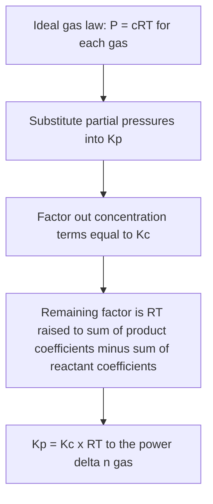
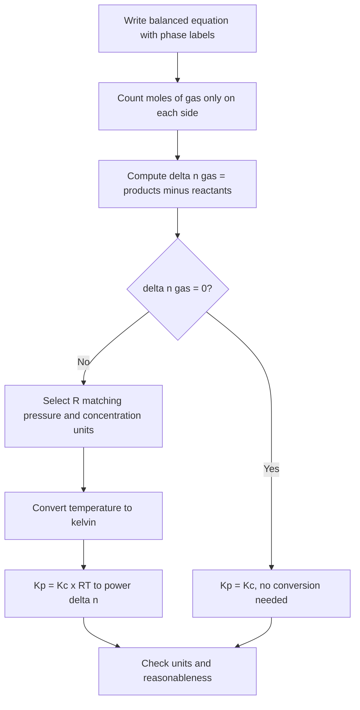

## Relating Kc and Kp

### Overview

For reactions involving gases, the equilibrium constant can be expressed in terms of **molar concentrations** ($K_c$) or **partial pressures** ($K_p$). The two are numerically different in general but are linked by a simple relationship derived from the ideal gas law:

$$K_p = K_c\,(RT)^{\Delta n_{gas}}$$

where $\Delta n_{gas}$ is the change in the number of moles of **gas** in the balanced equation and $T$ is the absolute temperature. This relationship allows conversion between the two forms and clarifies when they are equal.

**Key Points**

- $K_p = K_c$ only when $\Delta n_{gas} = 0$.
- $\Delta n_{gas}$ counts **gaseous species only**; pure solids, pure liquids, and solvents are excluded.
- $T$ must be in **kelvin**.
- The numerical value of $R$ must be consistent with the pressure unit used for $K_p$ and the concentration unit used for $K_c$ (typically $\text{mol L}^{-1}$).
- The relationship assumes **ideal gas behavior**; for real gases at high pressure, fugacities and activities are needed [behavior varies with conditions].
- Both $K_c$ and $K_p$ depend on temperature only (for a given equation written in a given way).

---

### Definitions

For the general gas-phase reaction:

$$aA(g) + bB(g) \rightleftharpoons cC(g) + dD(g)$$

$$K_c = \frac{[C]^c\,[D]^d}{[A]^a\,[B]^b}, \qquad K_p = \frac{(P_C)^c\,(P_D)^d}{(P_A)^a\,(P_B)^b}$$

$$\Delta n_{gas} = (c + d) - (a + b)$$

---

### Derivation

#### Step 1: Ideal Gas Law for Each Component

For an ideal gas $i$ in a mixture occupying volume $V$ at temperature $T$:

$$P_i V = n_i RT \quad\Rightarrow\quad P_i = \frac{n_i}{V}\,RT = [i]\,RT$$

where $[i] = n_i/V$ is the molar concentration.

#### Step 2: Substitute into $K_p$

$$K_p = \frac{([C]RT)^c\,([D]RT)^d}{([A]RT)^a\,([B]RT)^b}$$

#### Step 3: Separate Concentration and $RT$ Factors

$$K_p = \frac{[C]^c[D]^d}{[A]^a[B]^b}\times\frac{(RT)^{c}(RT)^{d}}{(RT)^{a}(RT)^{b}}$$

$$K_p = K_c\,(RT)^{(c+d)-(a+b)}$$

$$\boxed{K_p = K_c\,(RT)^{\Delta n_{gas}}}$$

#### Inverse Relationship

$$K_c = K_p\,(RT)^{-\Delta n_{gas}}$$

---

### Choosing the Correct Value of $R$

The value of $R$ must match the units in which $K_p$ (pressure) and $K_c$ (concentration) are defined.

| Pressure unit | Concentration unit | $R$ value |
| --- | --- | --- |
| atm | $\text{mol L}^{-1}$ | $0.082057\ \text{L atm mol}^{-1}\text{K}^{-1}$ |
| bar | $\text{mol L}^{-1}$ | $0.083145\ \text{L bar mol}^{-1}\text{K}^{-1}$ |
| kPa | $\text{mol L}^{-1}$ | $8.3145\ \text{L kPa mol}^{-1}\text{K}^{-1}$ |
| Pa | $\text{mol m}^{-3}$ | $8.3145\ \text{J mol}^{-1}\text{K}^{-1}$ ($= \text{Pa m}^3\text{mol}^{-1}\text{K}^{-1}$) |
| mmHg (torr) | $\text{mol L}^{-1}$ | $62.364\ \text{L mmHg mol}^{-1}\text{K}^{-1}$ |

**Key Points**

- Using an inconsistent $R$ (for example, $8.314$ with atm) yields incorrect results.
- When $\Delta n_{gas} = 0$, the choice of $R$ is irrelevant because $(RT)^0 = 1$.

---

### Dimensional Considerations and the Thermodynamic Constant

In introductory treatments, $K_c$ and $K_p$ are quoted with or without units, depending on $\Delta n_{gas}$:

| Constant | Units (introductory convention) |
| --- | --- |
| $K_c$ | $(\text{mol L}^{-1})^{\Delta n_{gas}}$ |
| $K_p$ | $(\text{atm})^{\Delta n_{gas}}$ (or bar, kPa) |

Rigorously, the **thermodynamic equilibrium constant** $K^\circ$ is dimensionless, defined with activities relative to standard states:

$$K^\circ = \prod_i a_i^{\nu_i}, \qquad a_i = \frac{P_i}{P^\circ}\ (\text{ideal gas}), \qquad P^\circ = 1\ \text{bar}$$

$$K_p^\circ = K_p\,(P^\circ)^{-\Delta n_{gas}}$$

Similarly, $K_c^\circ$ uses $c^\circ = 1\ \text{mol L}^{-1}$. Consequently, the dimensionless relationship becomes:

$$K_p^\circ = K_c^\circ\left(\frac{c^\circ RT}{P^\circ}\right)^{\Delta n_{gas}}$$

The difference between using 1 atm (101.325 kPa) and 1 bar (100 kPa) as the standard pressure produces a small numerical difference in $K_p^\circ$ when $\Delta n_{gas} \neq 0$. Problems should state the pressure unit and standard state used.

---

### Interpreting $\Delta n_{gas}$

$$\Delta n_{gas} = \sum \nu_{\text{gaseous products}} - \sum \nu_{\text{gaseous reactants}}$$

| Reaction | Gas moles (products − reactants) | $\Delta n_{gas}$ | Relationship |
| --- | --- | --- | --- |
| $\text{H}_2(g) + \text{I}_2(g) \rightleftharpoons 2\,\text{HI}(g)$ | $2 - 2$ | $0$ | $K_p = K_c$ |
| $\text{N}_2(g) + 3\,\text{H}_2(g) \rightleftharpoons 2\,\text{NH}_3(g)$ | $2 - 4$ | $-2$ | $K_p = K_c(RT)^{-2}$ |
| $\text{N}_2\text{O}_4(g) \rightleftharpoons 2\,\text{NO}_2(g)$ | $2 - 1$ | $+1$ | $K_p = K_c\,RT$ |
| $2\,\text{SO}_2(g) + \text{O}_2(g) \rightleftharpoons 2\,\text{SO}_3(g)$ | $2 - 3$ | $-1$ | $K_p = K_c(RT)^{-1}$ |
| $\text{PCl}_5(g) \rightleftharpoons \text{PCl}_3(g) + \text{Cl}_2(g)$ | $2 - 1$ | $+1$ | $K_p = K_c\,RT$ |
| $\text{CaCO}_3(s) \rightleftharpoons \text{CaO}(s) + \text{CO}_2(g)$ | $1 - 0$ | $+1$ | $K_p = K_c\,RT$ |
| $\text{C}(s) + \text{O}_2(g) \rightleftharpoons \text{CO}_2(g)$ | $1 - 1$ | $0$ | $K_p = K_c$ |
| $\text{CH}_4(g) + 2\,\text{O}_2(g) \rightleftharpoons \text{CO}_2(g) + 2\,\text{H}_2\text{O}(l)$ | $1 - 3$ | $-2$ | $K_p = K_c(RT)^{-2}$ |
| $\text{Fe}_2\text{O}_3(s) + 3\,\text{H}_2(g) \rightleftharpoons 2\,\text{Fe}(s) + 3\,\text{H}_2\text{O}(g)$ | $3 - 3$ | $0$ | $K_p = K_c$ |

**Key Points**

- In the methane combustion example, liquid water is excluded from $\Delta n_{gas}$ (and from both $K$ expressions).
- If water were gaseous ($\text{H}_2\text{O}(g)$), then $\Delta n_{gas} = 3 - 3 = 0$.

---

### Effect of Rewriting the Equation

Since $\Delta n_{gas}$ scales with the stoichiometric coefficients, the $K_p$/$K_c$ relationship must be applied to the equation exactly as written.

| Equation | $\Delta n_{gas}$ | Relationship |
| --- | --- | --- |
| $\text{N}_2 + 3\,\text{H}_2 \rightleftharpoons 2\,\text{NH}_3$ | $-2$ | $K_p = K_c(RT)^{-2}$ |
| $\tfrac{1}{2}\text{N}_2 + \tfrac{3}{2}\text{H}_2 \rightleftharpoons \text{NH}_3$ | $-1$ | $K_p' = K_c'(RT)^{-1}$ |
| $2\,\text{NH}_3 \rightleftharpoons \text{N}_2 + 3\,\text{H}_2$ | $+2$ | $K_p'' = K_c''(RT)^{+2}$ |

Since $K_p' = \sqrt{K_p}$ and $K_c' = \sqrt{K_c}$, the relationship remains self-consistent:

$$K_p' = \sqrt{K_c(RT)^{-2}} = \sqrt{K_c}\,(RT)^{-1} = K_c'(RT)^{-1}$$

---

### Worked Examples

#### Example 1: $\Delta n_{gas} = 0$

$$\text{H}_2(g) + \text{I}_2(g) \rightleftharpoons 2\,\text{HI}(g), \qquad K_c = 49.4\ \text{at 700 K}$$

$$\Delta n_{gas} = 2 - 2 = 0 \quad\Rightarrow\quad K_p = K_c(RT)^0 = 49.4$$

**Output:** $K_p = K_c = 49.4$ regardless of the pressure unit.

#### Example 2: $\Delta n_{gas} < 0$ (Ammonia Synthesis)

$$\text{N}_2(g) + 3\,\text{H}_2(g) \rightleftharpoons 2\,\text{NH}_3(g), \qquad K_c = 0.50\ \text{at 673 K (400 °C)}$$

Find $K_p$ in atm.

- $\Delta n_{gas} = 2 - 4 = -2$
- $RT = (0.082057)(673) = 55.22\ \text{L atm mol}^{-1}$

$$K_p = K_c\,(RT)^{-2} = \frac{0.50}{(55.22)^2} = \frac{0.50}{3049.4} = 1.6\times10^{-4}\ \text{atm}^{-2}$$

**Output:** $K_p \approx 1.6\times10^{-4}\ \text{atm}^{-2}$.

#### Example 3: $\Delta n_{gas} > 0$ (Dinitrogen Tetroxide)

$$\text{N}_2\text{O}_4(g) \rightleftharpoons 2\,\text{NO}_2(g), \qquad K_p = 0.113\ \text{atm at 298 K}$$

Find $K_c$.

- $\Delta n_{gas} = +1$
- $RT = (0.082057)(298) = 24.45$

$$K_c = \frac{K_p}{RT} = \frac{0.113}{24.45} = 4.6\times10^{-3}\ \text{mol L}^{-1}$$

**Output:** $K_c \approx 4.6\times10^{-3}\ \text{mol L}^{-1}$, matching the value used in equilibrium calculations for this system.

#### Example 4: Heterogeneous Equilibrium

$$\text{CaCO}_3(s) \rightleftharpoons \text{CaO}(s) + \text{CO}_2(g), \qquad K_p = 1.16\ \text{atm at 1073 K (illustrative value)}$$

Find $K_c$.

- Only $\text{CO}_2(g)$ is gaseous: $\Delta n_{gas} = 1 - 0 = +1$
- $RT = (0.082057)(1073) = 88.05$

$$K_c = \frac{K_p}{RT} = \frac{1.16}{88.05} = 1.32\times10^{-2}\ \text{mol L}^{-1}$$

Check: $K_c = [\text{CO}_2]$ and $[\text{CO}_2] = P/(RT) = 1.16/88.05 = 1.32\times10^{-2}\ \text{M}$. ✓

#### Example 5: Contact Process

$$2\,\text{SO}_2(g) + \text{O}_2(g) \rightleftharpoons 2\,\text{SO}_3(g), \qquad K_c = 4.0\times10^{2}\ \text{L mol}^{-1}\ \text{at 800 K (illustrative value)}$$

- $\Delta n_{gas} = 2 - 3 = -1$
- $RT = (0.082057)(800) = 65.65$

$$K_p = K_c\,(RT)^{-1} = \frac{4.0\times10^{2}}{65.65} = 6.1\ \text{atm}^{-1}$$

#### Example 5b: Equal Compositions, Different Constants

Consider $\text{PCl}_5(g) \rightleftharpoons \text{PCl}_3(g) + \text{Cl}_2(g)$ at 500 K with equilibrium partial pressures $P_{\text{PCl}_5} = 0.200\ \text{atm}$, $P_{\text{PCl}_3} = P_{\text{Cl}_2} = 0.100\ \text{atm}$.

$$K_p = \frac{(0.100)(0.100)}{0.200} = 0.0500\ \text{atm}$$

$$RT = (0.082057)(500) = 41.03$$

$$K_c = \frac{K_p}{RT} = \frac{0.0500}{41.03} = 1.22\times10^{-3}\ \text{mol L}^{-1}$$

Verification via concentrations: $[\text{PCl}_5] = 0.200/41.03 = 4.87\times10^{-3}$ M, $[\text{PCl}_3] = [\text{Cl}_2] = 0.100/41.03 = 2.44\times10^{-3}$ M:

$$K_c = \frac{(2.44\times10^{-3})^2}{4.87\times10^{-3}} = 1.22\times10^{-3}\ \text{M} \checkmark$$

#### Example 6: Using Different Pressure Units

For $\text{N}_2\text{O}_4(g) \rightleftharpoons 2\,\text{NO}_2(g)$ at 298 K with $K_c = 4.6\times10^{-3}\ \text{M}$, find $K_p$ in kPa and in bar.

**In kPa** ($R = 8.3145\ \text{L kPa mol}^{-1}\text{K}^{-1}$):

$$RT = (8.3145)(298) = 2477.7$$

$$K_p = (4.6\times10^{-3})(2477.7) = 11.4\ \text{kPa}$$

**In bar** ($R = 0.083145\ \text{L bar mol}^{-1}\text{K}^{-1}$):

$$RT = (0.083145)(298) = 24.78$$

$$K_p = (4.6\times10^{-3})(24.78) = 0.114\ \text{bar}$$

**Conclusion:** The same equilibrium yields different numerical $K_p$ values depending on the pressure unit whenever $\Delta n_{gas} \neq 0$ ($11.4\ \text{kPa} = 0.114\ \text{bar} = 0.113\ \text{atm}$ within rounding).

#### Example 7: Full Equilibrium Problem Combining $K_p$ and $K_c$

$\text{PCl}_5(g) \rightleftharpoons \text{PCl}_3(g) + \text{Cl}_2(g)$, $K_p = 0.0500\ \text{atm}$ at 500 K. $0.100\ \text{mol}$ of $\text{PCl}_5$ is placed in a $4.10\ \text{L}$ vessel at 500 K. Find the equilibrium composition.

**Step 1: Convert to $K_c$**

$$K_c = \frac{0.0500}{41.03} = 1.22\times10^{-3}\ \text{M}$$

**Step 2: Initial concentration**

$$[\text{PCl}_5]_0 = \frac{0.100}{4.10} = 0.0244\ \text{M}$$

**Step 3: ICE table**

|  | $[\text{PCl}_5]$ | $[\text{PCl}_3]$ | $[\text{Cl}_2]$ |
| --- | --- | --- | --- |
| **I** | 0.0244 | 0 | 0 |
| **C** | $-x$ | $+x$ | $+x$ |
| **E** | $0.0244 - x$ | $x$ | $x$ |

$$\frac{x^2}{0.0244 - x} = 1.22\times10^{-3} \quad\Rightarrow\quad x^2 + 1.22\times10^{-3}x - 2.98\times10^{-5} = 0$$

$$x = \frac{-1.22\times10^{-3} + \sqrt{(1.22\times10^{-3})^2 + 4(2.98\times10^{-5})}}{2} = \frac{-1.22\times10^{-3} + \sqrt{1.49\times10^{-6} + 1.192\times10^{-4}}}{2}$$

$$x = \frac{-1.22\times10^{-3} + 0.010985}{2} \approx 4.9\times10^{-3}\ \text{M}$$

**Step 4: Equilibrium concentrations and partial pressures**

$$[\text{PCl}_5] = 0.0244 - 0.0049 = 0.0195\ \text{M}, \qquad [\text{PCl}_3] = [\text{Cl}_2] = 0.0049\ \text{M}$$

$$P_i = [i]RT: \quad P_{\text{PCl}_5} = 0.800\ \text{atm}, \quad P_{\text{PCl}_3} = P_{\text{Cl}_2} = 0.201\ \text{atm}$$

Check with $K_p$: $\dfrac{(0.201)^2}{0.800} = 0.0505\ \text{atm}$ ✓ (within rounding).

**Output:** About $20\%$ of the $\text{PCl}_5$ has dissociated; total pressure $= 0.800 + 0.201 + 0.201 = 1.20\ \text{atm}$.

---

### Relating $K_p$ to $K_x$ and Total Pressure

Using Dalton's law, $P_i = x_i P_{total}$, where $x_i$ is the mole fraction:

$$K_p = K_x\,(P_{total})^{\Delta n_{gas}}, \qquad K_x = \frac{x_C^c\,x_D^d}{x_A^a\,x_B^b}$$

Combining with the earlier result:

$$K_c\,(RT)^{\Delta n_{gas}} = K_x\,(P_{total})^{\Delta n_{gas}}$$

| Constant | Depends on $T$? | Depends on total pressure? |
| --- | --- | --- |
| $K_p$ | Yes | No |
| $K_c$ | Yes | No |
| $K_x$ | Yes | Yes, when $\Delta n_{gas} \neq 0$ |

**Key Points**

- $K_x$ is not a true constant at fixed $T$ unless $\Delta n_{gas} = 0$; it varies with total pressure.
- $K_p$ and $K_c$ depend only on temperature (ideal gas assumption).
- This is the quantitative basis for the pressure effect in Le Chatelier's principle.

**Example**

For $\text{N}_2(g) + 3\,\text{H}_2(g) \rightleftharpoons 2\,\text{NH}_3(g)$ at fixed $T$:

$$K_x = K_p\,P_{total}^{2}$$

Raising $P_{total}$ increases $K_x = \dfrac{x_{\text{NH}_3}^2}{x_{\text{N}_2}\,x_{\text{H}_2}^3}$, which means a larger mole fraction of $\text{NH}_3$ at equilibrium.

---

### Temperature Dependence

Both constants change with temperature, but not identically when $\Delta n_{gas} \neq 0$.

Taking the natural logarithm of $K_p = K_c(RT)^{\Delta n_{gas}}$:

$$\ln K_p = \ln K_c + \Delta n_{gas}\ln(RT)$$

Differentiating with respect to $T$ and using the van 't Hoff equation for $K_p$ ($\dfrac{d\ln K_p}{dT} = \dfrac{\Delta H^\circ}{RT^2}$):

$$\frac{d\ln K_c}{dT} = \frac{\Delta H^\circ - \Delta n_{gas}RT}{RT^2} = \frac{\Delta U^\circ}{RT^2}$$

since $\Delta U^\circ = \Delta H^\circ - \Delta n_{gas}RT$ for ideal gases.

| Constant | Temperature dependence governed by |
| --- | --- |
| $K_p$ | $\Delta H^\circ$ |
| $K_c$ | $\Delta U^\circ$ (change in internal energy) |

Thus, the two constants have the same qualitative trend for most reactions, since $\Delta n_{gas}RT$ is typically small relative to $\Delta H^\circ$, but they are not numerically identical.

---

### Relationship to Gibbs Free Energy

The standard free energy change relates to the thermodynamic constant based on **partial pressures relative to the standard pressure**:

$$\Delta G^\circ = -RT\ln K_p^\circ$$

Using $K_c$ in this equation requires conversion:

$$\Delta G^\circ = -RT\ln\left[K_c^\circ\left(\frac{c^\circ RT}{P^\circ}\right)^{\Delta n_{gas}}\right]$$

**Example:** For $\text{N}_2\text{O}_4(g) \rightleftharpoons 2\,\text{NO}_2(g)$ at 298 K with $K_p = 0.113$ (referenced to 1 atm), the standard free energy change is:

$$\Delta G^\circ = -(8.314)(298)\ln(0.113) = -2477.6\times(-2.180) = +5.40\ \text{kJ mol}^{-1}$$

(A value referenced to 1 bar would differ slightly because $K_p^\circ$ changes numerically with the standard pressure choice.)

---

### Problem-Solving Strategy

#### Checklist

1. Write the balanced equation **as given** in the problem.
2. Identify gaseous species and compute $\Delta n_{gas}$.
3. Convert $T$ to kelvin.
4. Choose $R$ consistent with the pressure unit.
5. Apply $K_p = K_c(RT)^{\Delta n_{gas}}$ or its inverse.
6. Sanity check: if $\Delta n_{gas} > 0$ and $RT > 1$ (in the chosen units), then $K_p > K_c$ numerically; if $\Delta n_{gas} < 0$, then $K_p < K_c$.

---

### Graphical Summary

<svg xmlns="http://www.w3.org/2000/svg" viewBox="0 0 620 330" width="620" height="330" font-family="sans-serif" font-size="12">
<text x="310" y="22" text-anchor="middle" font-size="14" font-weight="bold">Kp/Kc Ratio vs Delta n(gas) at Fixed T (svg_diagram)</text>
<line x1="70" y1="270" x2="580" y2="270" stroke="black" stroke-width="1.5" />
<line x1="70" y1="270" x2="70" y2="50" stroke="black" stroke-width="1.5" />
<text x="325" y="305" text-anchor="middle">delta n (gas)</text>
<text x="24" y="160" text-anchor="middle" transform="rotate(-90 24 160)">Kp / Kc = (RT)^(delta n)</text>

<text x="110" y="288" text-anchor="middle">-2</text>
<text x="210" y="288" text-anchor="middle">-1</text>
<text x="310" y="288" text-anchor="middle">0</text>
<text x="410" y="288" text-anchor="middle">+1</text>
<text x="510" y="288" text-anchor="middle">+2</text>

<rect x="95" y="262" width="30" height="8" fill="#2874a6" />
<rect x="195" y="250" width="30" height="20" fill="#2874a6" />
<rect x="295" y="210" width="30" height="60" fill="#7f8c8d" />
<rect x="395" y="130" width="30" height="140" fill="#c0392b" />
<rect x="495" y="60" width="30" height="210" fill="#c0392b" />
<line x1="70" y1="210" x2="580" y2="210" stroke="gray" stroke-dasharray="4,4" />
<text x="76" y="205" fill="gray" font-size="11">ratio = 1</text>
<text x="325" y="52" text-anchor="middle" fill="gray" font-size="11">Schematic for RT greater than 1 in the chosen units</text>
</svg>

---

### Common Errors and Misconceptions

| Error | Correction |
| --- | --- |
| Counting solids and liquids in $\Delta n_{gas}$ | Only gaseous species count |
| Using $\Delta n = \text{reactants} - \text{products}$ | The sign convention is products minus reactants |
| Using $T$ in °C | Use kelvin |
| Using $R = 8.314$ with atm | Use $0.082057\ \text{L atm mol}^{-1}\text{K}^{-1}$ when pressure is in atm and volume in litres |
| Assuming $K_p = K_c$ generally | True only when $\Delta n_{gas} = 0$ |
| Forgetting to adjust when the equation is multiplied or reversed | $\Delta n_{gas}$ and $K$ both change; recompute from the equation as written |
| Applying the relation to non-ideal gas mixtures without correction | At high pressures use fugacities; $K_p = K_c(RT)^{\Delta n}$ is an ideal-gas result |
| Applying $K_p = K_c(RT)^{\Delta n}$ to solution-phase equilibria | $K_p$ is defined only for gases; solutions use $K_c$ (activities) |
| Treating $K_x$ as constant at variable total pressure | $K_x = K_p\,P_{total}^{-\Delta n_{gas}}$ varies with $P_{total}$ when $\Delta n_{gas} \neq 0$ |

---

### Summary of Key Relationships

$$P_i = [i]\,RT$$

$$K_p = K_c\,(RT)^{\Delta n_{gas}}, \qquad \Delta n_{gas} = \sum\nu_{g,\text{prod}} - \sum\nu_{g,\text{react}}$$

$$K_p = K_x\,(P_{total})^{\Delta n_{gas}}$$

$$\frac{d\ln K_p}{dT} = \frac{\Delta H^\circ}{RT^2}, \qquad \frac{d\ln K_c}{dT} = \frac{\Delta U^\circ}{RT^2}$$

$$\Delta G^\circ = -RT\ln K_p^\circ$$

**Conclusion**

$K_c$ and $K_p$ describe the same equilibrium in different concentration scales and are connected by the ideal-gas relation $K_p = K_c(RT)^{\Delta n_{gas}}$. The two are numerically identical when the number of gas moles is unchanged by the reaction, and otherwise differ by a factor that depends on temperature, $\Delta n_{gas}$, and the unit system. Correct use of the relationship requires counting only gaseous species, applying products-minus-reactants sign convention, using kelvin temperatures, and matching the gas constant to the pressure unit. The relationship extends naturally to mole-fraction constants and to the thermodynamic link with $\Delta G^\circ$.

**Related Topics**

- Reaction quotient $Q_p$ and $Q_c$ and predicting reaction direction
- Equilibrium calculations using ICE tables with partial pressures
- Mole-fraction equilibrium constant $K_x$ and total-pressure effects
- Fugacity, activity, and non-ideal gas equilibria
- van 't Hoff equation and temperature dependence of $K$
- Le Chatelier's principle: pressure and volume effects
- Heterogeneous equilibria and omission of solids and liquids
- Gibbs free energy and the standard equilibrium constant
- Degree of dissociation and vapour density calculations
- Industrial gas-phase equilibria (Haber–Bosch, Contact process)