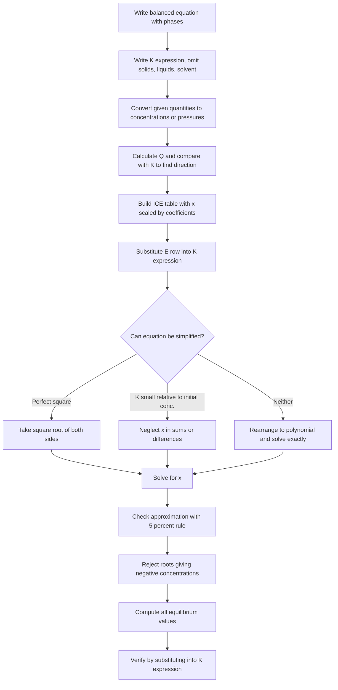
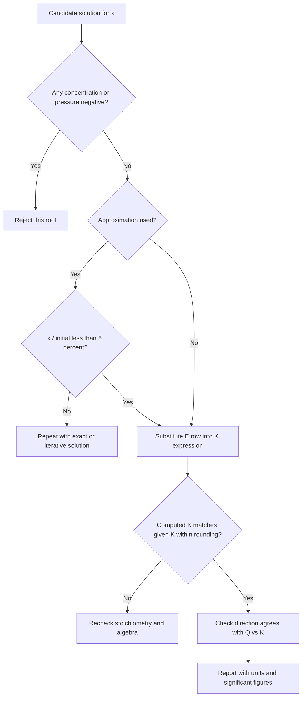

## Equilibrium Calculations Using ICE Tables

### Overview

An **ICE table** (Initial, Change, Equilibrium) is a systematic bookkeeping method for calculating unknown equilibrium concentrations or partial pressures from initial conditions and an equilibrium constant, or for determining $K$ from a partial set of equilibrium data. The method converts a chemical problem into an algebraic one: the stoichiometry fixes the *ratios* of the changes, a single unknown $x$ captures the *extent* of reaction, and the equilibrium-constant expression supplies the equation to solve.

**Key Points**

- The **changes** in the "C" row are always proportional to the stoichiometric coefficients (reactants decrease, products increase, when the reaction proceeds forward).
- The sign of $x$ is fixed by comparing $Q$ with $K$: $Q < K$ means the reaction proceeds forward; $Q > K$ means it proceeds in reverse.
- Only species that appear in the $K$ expression (gases and solutes) get columns; pure solids, pure liquids, and the solvent are omitted.
- All entries in a single table must be in the **same units and same basis**: concentrations for $K_c$, partial pressures for $K_p$.
- Every candidate solution must be checked: no concentration or pressure may be negative, and substituting back should reproduce $K$.
- Approximations (such as "$x$ is small") must be **verified** (commonly the 5% rule), not assumed.

---

### The ICE Framework

| Row | Meaning | Content |
| --- | --- | --- |
| **I** (Initial) | State at the moment of mixing, before any net reaction | Given concentrations or pressures (may be zero for some species) |
| **C** (Change) | Net change needed to reach equilibrium | Stoichiometric multiples of $x$: $-ax$, $-bx$, $+cx$, $+dx$ |
| **E** (Equilibrium) | Composition when $Q = K$ | $\text{I} + \text{C}$ for every species |

For the general reaction:

$$aA + bB \rightleftharpoons cC + dD$$

|  | $[A]$ | $[B]$ | $[C]$ | $[D]$ |
| --- | --- | --- | --- | --- |
| **I** | $[A]_0$ | $[B]_0$ | $[C]_0$ | $[D]_0$ |
| **C** | $-ax$ | $-bx$ | $+cx$ | $+dx$ |
| **E** | $[A]_0 - ax$ | $[B]_0 - bx$ | $[C]_0 + cx$ | $[D]_0 + dx$ |

Here $x$ is the **extent of reaction per unit volume** (in $\text{mol L}^{-1}$ for concentration tables). If the reaction proceeds in reverse, $x$ is negative in this convention (or the signs in the C row are simply swapped).

---

### General Procedure

#### Step-by-Step Detail

1. **Balanced equation and $K$ expression.** Include phase labels; decide which species enter $K$.
2. **Convert to consistent units.** Moles and volume → molarity for $K_c$; partial pressures for $K_p$. If a mole amount and a container volume are given, compute $[\text{X}]_0 = n/V$.
3. **Determine direction.** Evaluate $Q$ from the initial state. If no products are present initially, $Q = 0 < K$ and the reaction proceeds forward.
4. **Define $x$** so that the sign convention matches the direction found.
5. **Write the E row** and substitute into $K$.
6. **Solve for $x$** by the most appropriate method.
7. **Validate** (non-negativity, approximation check, back-substitution).
8. **Report** the requested quantities with correct significant figures and units.

---

### Solving Strategies

#### Strategy 1: Perfect Square

If the $K$ expression is a ratio of squares (e.g., $\dfrac{(2x)^2}{(c - x)^2}$), take the square root of both sides:

$$\sqrt{K} = \frac{2x}{c - x}$$

This avoids a quadratic.

#### Strategy 2: The "$x$ is Small" Approximation

When $K$ is small (typically $K \lesssim 10^{-3}$ relative to initial concentrations) and the reaction starts with reactant only, the amount reacted is tiny:

$$[A]_0 - x \approx [A]_0$$

**Validity test (5% rule):**

$$\frac{x}{[A]_0}\times100\% < 5\%$$

If the test fails, solve exactly. A useful rule of thumb: the approximation is usually valid when $[A]_0/K > 400$ (for one-variable equilibria of the form $x^2/([A]_0 - x) = K$ [rule of thumb; verify case by case]).

#### Strategy 3: Exact Solution via the Quadratic Formula

For $\alpha x^2 + \beta x + \gamma = 0$:

$$x = \frac{-\beta\pm\sqrt{\beta^2 - 4\alpha\gamma}}{2\alpha}$$

Reject the root that produces a negative concentration or exceeds the amount available.

#### Strategy 4: Successive Approximations (Iteration)

1. Neglect $x$ in the sum/difference to obtain $x_1$.
2. Substitute $x_1$ into the corrected denominator to obtain $x_2$.
3. Repeat until $x$ converges (typically 2–3 iterations for small $K$).

#### Strategy 5: Higher-Order Equations and Numerical Methods

For cubic or higher polynomials (e.g., $K = 4x^3/\ldots$ or coupled equilibria), use graphical estimation, Newton–Raphson, or a calculator/solver. Two limiting cases often bracket the answer: reaction extent near zero and near complete conversion.

| Situation | Recommended method |
| --- | --- |
| Ratio of perfect squares | Square root |
| $K$ small, one reactant | Approximation + 5% check |
| $K$ moderate | Quadratic formula |
| $K$ very large | Assume complete reaction first, then back-calculate a small reverse change |
| Cubic or higher | Iteration or numerical solver |

---

### Worked Examples: Finding Equilibrium Concentrations

#### Example 1: Perfect-Square Method

$\text{H}_2(g) + \text{I}_2(g) \rightleftharpoons 2\,\text{HI}(g)$, $K_c = 49.4$ at 700 K. $1.00\ \text{mol}$ each of $\text{H}_2$ and $\text{I}_2$ in a $1.00\ \text{L}$ flask. Find equilibrium concentrations.

|  | $[\text{H}_2]$ | $[\text{I}_2]$ | $[\text{HI}]$ |
| --- | --- | --- | --- |
| **I** | 1.00 | 1.00 | 0 |
| **C** | $-x$ | $-x$ | $+2x$ |
| **E** | $1.00 - x$ | $1.00 - x$ | $2x$ |

$$K_c = \frac{(2x)^2}{(1.00 - x)^2} = 49.4 \quad\Rightarrow\quad \frac{2x}{1.00 - x} = 7.03$$

$$2x = 7.03 - 7.03x \quad\Rightarrow\quad x = \frac{7.03}{9.03} = 0.778$$

$$[\text{H}_2] = [\text{I}_2] = 0.222\ \text{M}, \qquad [\text{HI}] = 1.556\ \text{M}$$

**Output:** Check: $\dfrac{(1.556)^2}{(0.222)^2} = 49.1$ ✓ (rounding).

#### Example 2: Quadratic Formula (Dissociation of $\text{N}_2\text{O}_4$)

$\text{N}_2\text{O}_4(g) \rightleftharpoons 2\,\text{NO}_2(g)$, $K_c = 4.6\times10^{-3}$ at 298 K. Initial $[\text{N}_2\text{O}_4] = 0.0500\ \text{M}$, no $\text{NO}_2$.

|  | $[\text{N}_2\text{O}_4]$ | $[\text{NO}_2]$ |
| --- | --- | --- |
| **I** | 0.0500 | 0 |
| **C** | $-x$ | $+2x$ |
| **E** | $0.0500 - x$ | $2x$ |

$$\frac{(2x)^2}{0.0500 - x} = 4.6\times10^{-3} \quad\Rightarrow\quad 4x^2 + 4.6\times10^{-3}x - 2.3\times10^{-4} = 0$$

$$x = \frac{-4.6\times10^{-3} + \sqrt{(4.6\times10^{-3})^2 + 16(2.3\times10^{-4})}}{8} = \frac{-4.6\times10^{-3} + \sqrt{2.12\times10^{-5} + 3.68\times10^{-3}}}{8}$$

$$x = \frac{-4.6\times10^{-3} + 0.06083}{8} = 7.0\times10^{-3}\ \text{M}$$

$$[\text{NO}_2] = 2x = 1.4\times10^{-2}\ \text{M}, \qquad [\text{N}_2\text{O}_4] = 0.0430\ \text{M}$$

**Approximation check:** $x/0.0500 = 14\% > 5\%$; the approximation would have been invalid, so the exact solution is required.

#### Example 3: Small-$K$ Approximation

$\text{N}_2(g) + \text{O}_2(g) \rightleftharpoons 2\,\text{NO}(g)$, $K_c = 1.0\times10^{-5}$ at about 2000 K (illustrative value). Initial $[\text{N}_2] = 0.80\ \text{M}$, $[\text{O}_2] = 0.20\ \text{M}$, $[\text{NO}] = 0$.

|  | $[\text{N}_2]$ | $[\text{O}_2]$ | $[\text{NO}]$ |
| --- | --- | --- | --- |
| **I** | 0.80 | 0.20 | 0 |
| **C** | $-x$ | $-x$ | $+2x$ |
| **E** | $0.80 - x$ | $0.20 - x$ | $2x$ |

$$\frac{(2x)^2}{(0.80 - x)(0.20 - x)} = 1.0\times10^{-5}$$

Assume $x \ll 0.20$:

$$\frac{4x^2}{(0.80)(0.20)} = 1.0\times10^{-5} \quad\Rightarrow\quad x^2 = 4.0\times10^{-7} \quad\Rightarrow\quad x = 6.3\times10^{-4}\ \text{M}$$

**Check:** $x/0.20 = 0.32\% < 5\%$ ✓.

$$[\text{NO}] = 2x = 1.3\times10^{-3}\ \text{M}, \qquad [\text{N}_2] \approx 0.80\ \text{M}, \qquad [\text{O}_2] \approx 0.20\ \text{M}$$

#### Example 4: Reaction Proceeding in Reverse ($Q > K$)

$\text{N}_2(g) + 3\,\text{H}_2(g) \rightleftharpoons 2\,\text{NH}_3(g)$, $K_c = 0.50$ at 673 K. Initial: $[\text{N}_2] = 0.10\ \text{M}$, $[\text{H}_2] = 0.10\ \text{M}$, $[\text{NH}_3] = 0.50\ \text{M}$.

**Direction:**

$$Q_c = \frac{(0.50)^2}{(0.10)(0.10)^3} = \frac{0.25}{1.0\times10^{-4}} = 2500 \gg K_c$$

The reaction proceeds in **reverse**. Define $x$ as the amount of $\text{N}_2$ formed:

|  | $[\text{N}_2]$ | $[\text{H}_2]$ | $[\text{NH}_3]$ |
| --- | --- | --- | --- |
| **I** | 0.10 | 0.10 | 0.50 |
| **C** | $+x$ | $+3x$ | $-2x$ |
| **E** | $0.10 + x$ | $0.10 + 3x$ | $0.50 - 2x$ |

$$\frac{(0.50 - 2x)^2}{(0.10 + x)(0.10 + 3x)^3} = 0.50$$

This is a quintic-type equation and is solved numerically. Trial values:

| $x$ (M) | $(0.50 - 2x)^2$ | $(0.10 + x)(0.10 + 3x)^3$ | Ratio (compare 0.50) |
| --- | --- | --- | --- |
| 0.10 | 0.0900 | $(0.20)(0.40)^3 = 0.01280$ | 7.03 |
| 0.15 | 0.0400 | $(0.25)(0.55)^3 = 0.04159$ | 0.962 |
| 0.16 | 0.0324 | $(0.26)(0.58)^3 = 0.05073$ | 0.639 |
| 0.17 | 0.0256 | $(0.27)(0.61)^3 = 0.06129$ | 0.418 |
| 0.166 | 0.0285 | $(0.266)(0.598)^3 = 0.05688$ | 0.501 |

$$x \approx 0.166\ \text{M}$$

$$[\text{N}_2] \approx 0.266\ \text{M}, \qquad [\text{H}_2] \approx 0.598\ \text{M}, \qquad [\text{NH}_3] \approx 0.168\ \text{M}$$

**Output:** Check: $\dfrac{(0.168)^2}{(0.266)(0.598)^3} = \dfrac{0.02822}{0.05688} = 0.496 \approx K_c$ ✓. The ammonia partially decomposed, consistent with $Q > K$.

#### Example 5: Using Moles and Volume

$\text{PCl}_5(g) \rightleftharpoons \text{PCl}_3(g) + \text{Cl}_2(g)$, $K_c = 1.22\times10^{-3}$ at 500 K. $0.200\ \text{mol}$ $\text{PCl}_5$ is placed in a $5.00\ \text{L}$ vessel. Find equilibrium concentrations and the percent dissociation.

$$[\text{PCl}_5]_0 = \frac{0.200}{5.00} = 0.0400\ \text{M}$$

|  | $[\text{PCl}_5]$ | $[\text{PCl}_3]$ | $[\text{Cl}_2]$ |
| --- | --- | --- | --- |
| **I** | 0.0400 | 0 | 0 |
| **C** | $-x$ | $+x$ | $+x$ |
| **E** | $0.0400 - x$ | $x$ | $x$ |

$$\frac{x^2}{0.0400 - x} = 1.22\times10^{-3} \quad\Rightarrow\quad x^2 + 1.22\times10^{-3}x - 4.88\times10^{-5} = 0$$

$$x = \frac{-1.22\times10^{-3} + \sqrt{1.49\times10^{-6} + 1.952\times10^{-4}}}{2} = \frac{-1.22\times10^{-3} + 0.014036}{2} = 6.4\times10^{-3}\ \text{M}$$

$$[\text{PCl}_3] = [\text{Cl}_2] = 6.4\times10^{-3}\ \text{M}, \qquad [\text{PCl}_5] = 3.36\times10^{-2}\ \text{M}$$

$$\text{Percent dissociation} = \frac{x}{[\text{PCl}_5]_0}\times100\% = \frac{6.4\times10^{-3}}{0.0400}\times100\% = 16\%$$

#### Example 6: Partial Pressure ICE Table ($K_p$)

$\text{N}_2\text{O}_4(g) \rightleftharpoons 2\,\text{NO}_2(g)$, $K_p = 0.113\ \text{atm}$ at 298 K. Initial $P_{\text{N}_2\text{O}_4} = 1.00\ \text{atm}$, $P_{\text{NO}_2} = 0$.

|  | $P_{\text{N}_2\text{O}_4}$ (atm) | $P_{\text{NO}_2}$ (atm) |
| --- | --- | --- |
| **I** | 1.00 | 0 |
| **C** | $-x$ | $+2x$ |
| **E** | $1.00 - x$ | $2x$ |

$$\frac{(2x)^2}{1.00 - x} = 0.113 \quad\Rightarrow\quad 4x^2 + 0.113x - 0.113 = 0$$

$$x = \frac{-0.113 + \sqrt{0.01277 + 1.808}}{8} = \frac{-0.113 + 1.3494}{8} = 0.1546\ \text{atm}$$

$$P_{\text{NO}_2} = 0.309\ \text{atm}, \qquad P_{\text{N}_2\text{O}_4} = 0.845\ \text{atm}, \qquad P_{total} = 1.154\ \text{atm}$$

**Output:** Check: $\dfrac{(0.309)^2}{0.845} = 0.113$ ✓.

#### Example 7: Heterogeneous Equilibrium (Solid Omitted)

$\text{C}(s) + \text{CO}_2(g) \rightleftharpoons 2\,\text{CO}(g)$, $K_p = 1.9$ at 1000 K (illustrative value). Initial $P_{\text{CO}_2} = 1.00\ \text{atm}$, $P_{\text{CO}} = 0$, excess graphite.

|  | $P_{\text{CO}_2}$ | $P_{\text{CO}}$ |
| --- | --- | --- |
| **I** | 1.00 | 0 |
| **C** | $-x$ | $+2x$ |
| **E** | $1.00 - x$ | $2x$ |

$$\frac{(2x)^2}{1.00 - x} = 1.9 \quad\Rightarrow\quad 4x^2 + 1.9x - 1.9 = 0 \quad\Rightarrow\quad x = \frac{-1.9 + \sqrt{3.61 + 30.4}}{8} = 0.4915$$

$$P_{\text{CO}} = 0.983\ \text{atm}, \qquad P_{\text{CO}_2} = 0.508\ \text{atm}$$

Graphite does not appear in the table because its activity is 1.

#### Example 8: Very Large $K$ (Assume Complete Reaction First)

$\text{H}_2(g) + \text{Cl}_2(g) \rightleftharpoons 2\,\text{HCl}(g)$ with an extremely large $K_c$ (order $10^{30}$ or greater; illustrative). Initial $[\text{H}_2] = 0.30\ \text{M}$, $[\text{Cl}_2] = 0.10\ \text{M}$.

1. **Complete reaction (stoichiometric):** $\text{Cl}_2$ is limiting; after full consumption, $[\text{H}_2] = 0.20\ \text{M}$, $[\text{Cl}_2] = 0$, $[\text{HCl}] = 0.20\ \text{M}$.
2. **Small back-reaction:**

|  | $[\text{H}_2]$ | $[\text{Cl}_2]$ | $[\text{HCl}]$ |
| --- | --- | --- | --- |
| **I** | 0.20 | 0 | 0.20 |
| **C** | $+x$ | $+x$ | $-2x$ |
| **E** | $0.20 + x$ | $x$ | $0.20 - 2x$ |

$$\frac{(0.20 - 2x)^2}{(0.20 + x)(x)} = K_c \approx \frac{(0.20)^2}{(0.20)x} = \frac{0.20}{x}$$

$$x = \frac{0.20}{K_c} \approx 2\times10^{-31}\ \text{M}\ [\text{illustrative}]$$

The concentration of unreacted $\text{Cl}_2$ is negligible, which is the practical meaning of a reaction that "goes to completion."

**Key Points**

- For $K \gg 1$, first push the reaction to completion stoichiometrically, then allow a tiny reverse change $x$ from the new starting point.
- This converts a hard high-order problem into a trivial approximate one.

---

### Worked Examples: Finding $K$ from Experimental Data

#### Example 9: All Equilibrium Values Known (No Unknown $x$)

At equilibrium, $[\text{N}_2] = 0.30\ \text{M}$, $[\text{H}_2] = 0.10\ \text{M}$, $[\text{NH}_3] = 0.02\ \text{M}$.

$$K_c = \frac{(0.02)^2}{(0.30)(0.10)^3} = \frac{4.0\times10^{-4}}{3.0\times10^{-4}} = 1.3$$

#### Example 10: One Equilibrium Concentration Given

$\text{N}_2(g) + 3\,\text{H}_2(g) \rightleftharpoons 2\,\text{NH}_3(g)$. Initially $[\text{N}_2] = 1.00\ \text{M}$ and $[\text{H}_2] = 3.00\ \text{M}$ in a rigid vessel. At equilibrium, $[\text{NH}_3] = 0.40\ \text{M}$. Find $K_c$.

|  | $[\text{N}_2]$ | $[\text{H}_2]$ | $[\text{NH}_3]$ |
| --- | --- | --- | --- |
| **I** | 1.00 | 3.00 | 0 |
| **C** | $-x$ | $-3x$ | $+2x$ |
| **E** | $1.00 - x$ | $3.00 - 3x$ | $2x = 0.40$ |

From $2x = 0.40$: $x = 0.20$.

$$[\text{N}_2] = 0.80\ \text{M}, \qquad [\text{H}_2] = 2.40\ \text{M}, \qquad [\text{NH}_3] = 0.40\ \text{M}$$

$$K_c = \frac{(0.40)^2}{(0.80)(2.40)^3} = \frac{0.160}{0.80\times13.824} = \frac{0.160}{11.06} = 1.45\times10^{-2}$$

**Output:** $K_c \approx 1.4\times10^{-2}$.

#### Example 11: Total Pressure Given

$\text{N}_2\text{O}_4(g) \rightleftharpoons 2\,\text{NO}_2(g)$. A flask initially contains $\text{N}_2\text{O}_4$ at $1.00\ \text{atm}$. At equilibrium the total pressure is $1.30\ \text{atm}$. Find $K_p$.

|  | $P_{\text{N}_2\text{O}_4}$ | $P_{\text{NO}_2}$ |
| --- | --- | --- |
| **I** | 1.00 | 0 |
| **C** | $-x$ | $+2x$ |
| **E** | $1.00 - x$ | $2x$ |

$$P_{total} = (1.00 - x) + 2x = 1.00 + x = 1.30 \quad\Rightarrow\quad x = 0.30\ \text{atm}$$

$$P_{\text{N}_2\text{O}_4} = 0.70\ \text{atm}, \qquad P_{\text{NO}_2} = 0.60\ \text{atm}$$

$$K_p = \frac{(0.60)^2}{0.70} = 0.51\ \text{atm}$$

**Conclusion:** When total pressure is provided, $P_{total} = P_{initial} + \Delta n_{gas}\,x$ gives $x$ directly without needing $K$.

#### Example 12: Percent Dissociation Given

$\text{PCl}_5$ is $40\%$ dissociated at equilibrium when $0.100\ \text{M}$ $\text{PCl}_5$ is heated in a fixed volume.

$$x = 0.40\times0.100 = 0.040\ \text{M}$$

$$[\text{PCl}_5] = 0.060\ \text{M}, \qquad [\text{PCl}_3] = [\text{Cl}_2] = 0.040\ \text{M}$$

$$K_c = \frac{(0.040)^2}{0.060} = 2.7\times10^{-2}\ \text{M}$$

---

### Special Situations

#### Adding a Stress After Equilibrium (Le Chatelier Recalculation)

A stress (adding reactant, changing volume) creates a **new initial state**. The new I row equals the old E row adjusted instantaneously for the change; $K$ remains unchanged (unless temperature changed).

**Example:** For $\text{H}_2 + \text{I}_2 \rightleftharpoons 2\,\text{HI}$, $K_c = 49.4$, equilibrium is $[\text{H}_2] = [\text{I}_2] = 0.222\ \text{M}$, $[\text{HI}] = 1.556\ \text{M}$. An extra $0.300\ \text{M}$ of $\text{H}_2$ is added instantaneously.

|  | $[\text{H}_2]$ | $[\text{I}_2]$ | $[\text{HI}]$ |
| --- | --- | --- | --- |
| **I** (new) | 0.522 | 0.222 | 1.556 |
| **C** | $-x$ | $-x$ | $+2x$ |
| **E** | $0.522 - x$ | $0.222 - x$ | $1.556 + 2x$ |

$$\frac{(1.556 + 2x)^2}{(0.522 - x)(0.222 - x)} = 49.4$$

Expanding: $2.421 + 6.224x + 4x^2 = 49.4\,(0.11588 - 0.744x + x^2) = 5.724 - 36.75x + 49.4x^2$

$$45.4x^2 - 42.97x + 3.303 = 0$$

$$x = \frac{42.97 - \sqrt{1846.4 - 599.8}}{90.8} = \frac{42.97 - 35.31}{90.8} \approx 0.0844\ \text{M}$$

New equilibrium: $[\text{H}_2] = 0.438\ \text{M}$, $[\text{I}_2] = 0.138\ \text{M}$, $[\text{HI}] = 1.725\ \text{M}$. Check: $\dfrac{(1.725)^2}{(0.438)(0.138)} = 49.2$ ✓.

#### Volume Change

If the volume is changed, first recompute all initial concentrations at the new volume (moles are conserved at the moment of change), then build a new ICE table.

**Example:** Equilibrium in $\text{N}_2\text{O}_4 \rightleftharpoons 2\,\text{NO}_2$ has $[\text{N}_2\text{O}_4] = 0.0430$ and $[\text{NO}_2] = 0.0140\ \text{M}$ in volume $V$. Volume is halved:

|  | $[\text{N}_2\text{O}_4]$ | $[\text{NO}_2]$ |
| --- | --- | --- |
| **I** (new) | 0.0860 | 0.0280 |
| **C** | $+x$ | $-2x$ |
| **E** | $0.0860 + x$ | $0.0280 - 2x$ |

$$\frac{(0.0280 - 2x)^2}{0.0860 + x} = 4.6\times10^{-3}$$

Solving gives $x \approx 3.9\times10^{-3}$ (so $[\text{NO}_2] \approx 0.0202\ \text{M}$ and $[\text{N}_2\text{O}_4] \approx 0.0899\ \text{M}$).

#### Common-Ion Effect in Weak-Acid Equilibria

$\text{CH}_3\text{COOH}(aq) \rightleftharpoons \text{H}^+(aq) + \text{CH}_3\text{COO}^-(aq)$, $K_a = 1.8\times10^{-5}$. Solution: $0.10\ \text{M}$ acetic acid and $0.10\ \text{M}$ sodium acetate.

|  | $[\text{CH}_3\text{COOH}]$ | $[\text{H}^+]$ | $[\text{CH}_3\text{COO}^-]$ |
| --- | --- | --- | --- |
| **I** | 0.10 | $\approx 0$ | 0.10 |
| **C** | $-x$ | $+x$ | $+x$ |
| **E** | $0.10 - x$ | $x$ | $0.10 + x$ |

$$\frac{x(0.10 + x)}{0.10 - x} \approx \frac{x(0.10)}{0.10} = x = 1.8\times10^{-5}\ \text{M}$$

$$\text{pH} = -\log(1.8\times10^{-5}) = 4.74$$

The approximation is valid ($x/0.10 = 0.018\%$). (Water autoionization contributes negligibly here and is ignored.)

#### Successive Approximation Example

$\text{HF}(aq) \rightleftharpoons \text{H}^+(aq) + \text{F}^-(aq)$, $K_a = 6.8\times10^{-4}$, initial $[\text{HF}] = 0.020\ \text{M}$.

$$\frac{x^2}{0.020 - x} = 6.8\times10^{-4}$$

- Iteration 0 (neglect $x$): $x_1 = \sqrt{(6.8\times10^{-4})(0.020)} = 3.69\times10^{-3}$ (18%, too large).
- Iteration 1: $x_2 = \sqrt{(6.8\times10^{-4})(0.020 - 3.69\times10^{-3})} = \sqrt{1.109\times10^{-5}} = 3.33\times10^{-3}$.
- Iteration 2: $x_3 = \sqrt{(6.8\times10^{-4})(0.020 - 3.33\times10^{-3})} = \sqrt{1.134\times10^{-5}} = 3.37\times10^{-3}$.
- Iteration 3: $x_4 = \sqrt{(6.8\times10^{-4})(0.020 - 3.37\times10^{-3})} = 3.36\times10^{-3}$ (converged).

Exact quadratic check: $x^2 + 6.8\times10^{-4}x - 1.36\times10^{-5} = 0 \Rightarrow x = 3.36\times10^{-3}\ \text{M}$ ✓.

---

### Multi-Step and Coupled Equilibria

When two equilibria share species, use **one** ICE table per equilibrium or a combined table with two extents ($x$ and $y$), and solve the simultaneous equations.

**Example: Diprotic Acid**

$\text{H}_2\text{A} \rightleftharpoons \text{H}^+ + \text{HA}^-$ ($K_{a1}$), $\text{HA}^- \rightleftharpoons \text{H}^+ + \text{A}^{2-}$ ($K_{a2}$).

|  | $[\text{H}_2\text{A}]$ | $[\text{H}^+]$ | $[\text{HA}^-]$ | $[\text{A}^{2-}]$ |
| --- | --- | --- | --- | --- |
| **I** | $c_0$ | 0 | 0 | 0 |
| **C** | $-x$ | $+x + y$ | $+x - y$ | $+y$ |
| **E** | $c_0 - x$ | $x + y$ | $x - y$ | $y$ |

$$K_{a1} = \frac{(x + y)(x - y)}{c_0 - x}, \qquad K_{a2} = \frac{(x + y)\,y}{x - y}$$

If $K_{a1} \gg K_{a2}$, then $y \ll x$ and the system reduces to two sequential single-variable problems (first treat $K_{a1}$ alone; then $[\text{A}^{2-}] \approx K_{a2}$ when $[\text{H}^+] \approx [\text{HA}^-]$).

---

### Choosing the Right Approach

| Given information | Unknown | Approach |
| --- | --- | --- |
| Initial amounts, $K$ | Equilibrium composition | ICE + solve for $x$ |
| Initial amounts, one equilibrium quantity | $K$ | ICE to get $x$ from the known value, then compute $K$ |
| Equilibrium composition | $K$ | Direct substitution |
| Percent dissociation or conversion | $K$ | Compute $x$ from fraction, then substitute |
| Total pressure at equilibrium | $K_p$ | Express $P_{total}$ in terms of $x$, solve $x$, then compute $K_p$ |
| $K$ very large | Composition | Complete reaction first, then small back-reaction |
| Mixture with $Q \neq K$ | Direction and composition | Compute $Q$, decide sign of $x$, build ICE |

---

### Error Analysis and Validation Checklist

1. **Stoichiometry:** every coefficient in the C row equals the balanced coefficient.
2. **Signs:** consistent with the direction predicted by $Q$ vs $K$.
3. **Physical bounds:** no negative concentrations; $x$ cannot exceed the amount of any limiting reactant.
4. **Approximation validity:** verify the 5% criterion (or the equivalent for the case).
5. **Back-substitution:** reinsert equilibrium values into $K$.
6. **Consistency of type:** $K_c$ with concentrations, $K_p$ with pressures.
7. **Significant figures:** limited by the data; intermediate rounding should be delayed.

---

### Graphical Representation of Approach to Equilibrium

<svg xmlns="http://www.w3.org/2000/svg" viewBox="0 0 640 330" width="640" height="330" font-family="sans-serif" font-size="12">
<text x="320" y="22" text-anchor="middle" font-size="14" font-weight="bold">Q Approaches K as the Extent x Grows (svg_diagram)</text>
<line x1="70" y1="280" x2="600" y2="280" stroke="black" stroke-width="1.5" />
<line x1="70" y1="280" x2="70" y2="50" stroke="black" stroke-width="1.5" />
<text x="335" y="315" text-anchor="middle">Extent of reaction x</text>
<text x="26" y="165" text-anchor="middle" transform="rotate(-90 26 165)">Reaction quotient Q</text>

<line x1="70" y1="120" x2="600" y2="120" stroke="#c0392b" stroke-width="2" stroke-dasharray="7,4" />
<text x="575" y="112" fill="#c0392b">K</text>

<path d="M80 270 C 180 260, 260 200, 330 120" fill="none" stroke="#2874a6" stroke-width="3" />
<circle cx="330" cy="120" r="5" fill="#2874a6" />
<text x="120" y="252" fill="#2874a6">Start Q below K: forward (x positive)</text>

<path d="M600 60 C 520 62, 430 80, 400 120" fill="none" stroke="#27ae60" stroke-width="3" />
<circle cx="400" cy="120" r="5" fill="#27ae60" />
<text x="330" y="52" fill="#27ae60">Start Q above K: reverse (x negative)</text>
<text x="340" y="140" fill="gray" font-size="11">Equilibrium reached when Q = K</text>
</svg>

---

### Common Errors and Misconceptions

| Error | Correction |
| --- | --- |
| Ignoring stoichiometric coefficients in the C row | Changes are $-ax$, $-bx$, $+cx$, $+dx$, not all $\pm x$ |
| Forgetting to square or cube $[\text{X}]$ when the coefficient is 2 or 3 | The coefficient appears as an exponent in $K$ and multiplies $x$ in the E row |
| Including pure solids, liquids, or solvent in the table | Omit them (activity = 1) |
| Mixing $K_c$ with pressures or $K_p$ with concentrations | Use the matching quantity or convert with $K_p = K_c(RT)^{\Delta n_{gas}}$ |
| Assuming $x$ is small without checking | Always apply the 5% test |
| Keeping a negative root | Reject any root giving negative concentration |
| Using moles instead of concentrations when $\Delta n_{gas} \neq 0$ | Concentrations require dividing by volume; moles alone are fine only if $\Delta n_{gas} = 0$ (volume cancels) |
| Recomputing $K$ after adding a reactant | $K$ is unchanged; only $Q$ changes |
| Starting the ICE table from the old equilibrium concentrations after a volume change | Recompute concentrations at the new volume first |
| Treating $x$ as the equilibrium concentration | $x$ is the **change**; equilibrium value is $\text{I} \pm$ stoichiometric multiple of $x$ |
| Forgetting the direction when products are initially present | Compute $Q$ first; a reaction with $Q > K$ runs in reverse |

**Key Points**

- The 5% rule is a convention; for high-precision work use the exact solution.
- Approximation behavior depends on the ratio $[A]_0/K$; when it is below roughly 100, the exact quadratic is generally safer [rule of thumb].
- The method assumes ideal behavior (activities equal to concentrations or pressures); in concentrated ionic solutions or high-pressure gas mixtures, activity or fugacity corrections may be necessary.

---

### Summary of Key Relationships

$$K_c = \frac{[C]^c[D]^d}{[A]^a[B]^b}, \qquad Q_c \text{ (same form, arbitrary state)}$$

$$Q < K:\ \text{forward}, \quad Q > K:\ \text{reverse}$$

$$\text{E row} = \text{I row} + \text{C row}, \qquad \text{C row} = \pm\nu_i\,x$$

$$\text{5\% rule: } \frac{x}{[A]_0}\times100\% < 5\%$$

$$x = \frac{-\beta\pm\sqrt{\beta^2 - 4\alpha\gamma}}{2\alpha}$$

$$P_{total} = P_{total,0} + \Delta n_{gas}\,x \quad\text{(constant } T,\ V\text{, partial-pressure table)}$$

**Conclusion**

ICE tables organize equilibrium problems into a repeatable workflow: define the stoichiometric change with one unknown extent $x$, express every equilibrium quantity in terms of $x$, and substitute into the equilibrium-constant expression. The choice among perfect-square, approximation, quadratic, iterative, or complete-reaction-first strategies depends on the magnitude of $K$ relative to the initial concentrations. Rigorous validation (non-negativity, 5% check, back-substitution, and consistency with the $Q$ versus $K$ direction) ensures reliable results. The same framework extends naturally to gas-phase ($K_p$), acid–base ($K_a$, $K_b$), solubility ($K_{sp}$), and coupled multi-equilibrium systems.

**Related Topics**

- Reaction quotient and predicting the direction of reaction
- Weak acid and weak base equilibria and pH calculations
- Buffer solutions and the Henderson–Hasselbalch equation
- Solubility equilibria ($K_{sp}$) and the common-ion effect
- Polyprotic acid equilibria and speciation diagrams
- Complex-ion formation and stepwise formation constants
- Le Chatelier's principle: quantitative treatment of stresses
- Numerical solution of equilibrium equations (Newton–Raphson, solvers)
- Gibbs energy minimization and equilibrium composition
- Activity coefficients and non-ideal equilibrium calculations