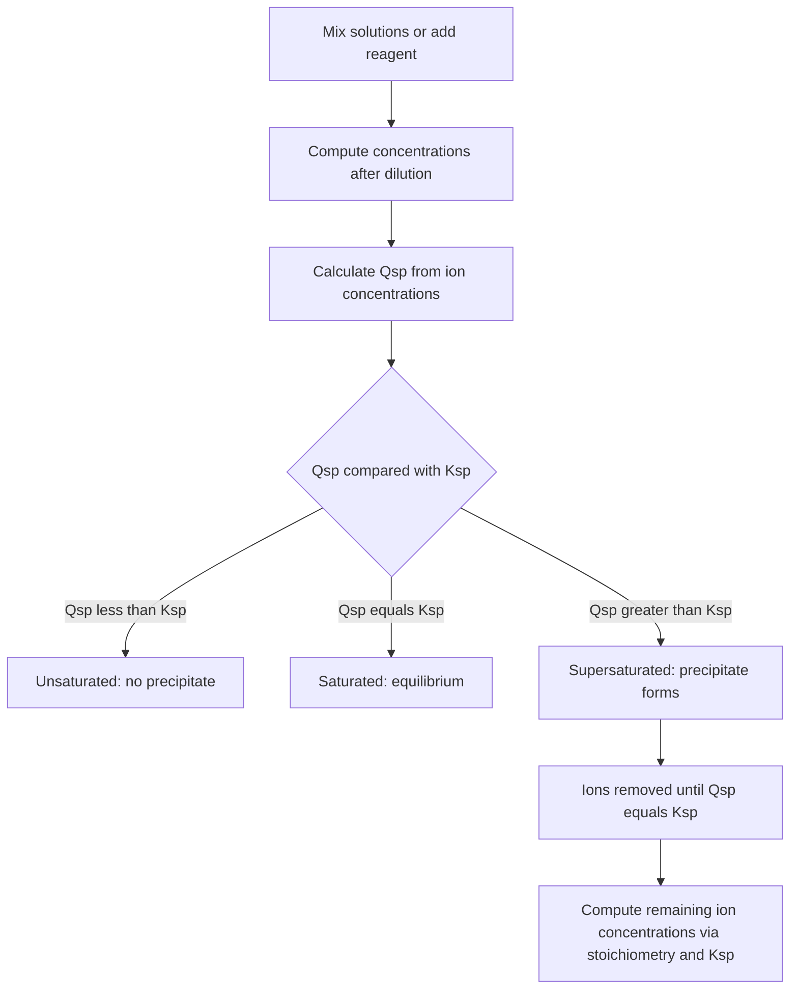
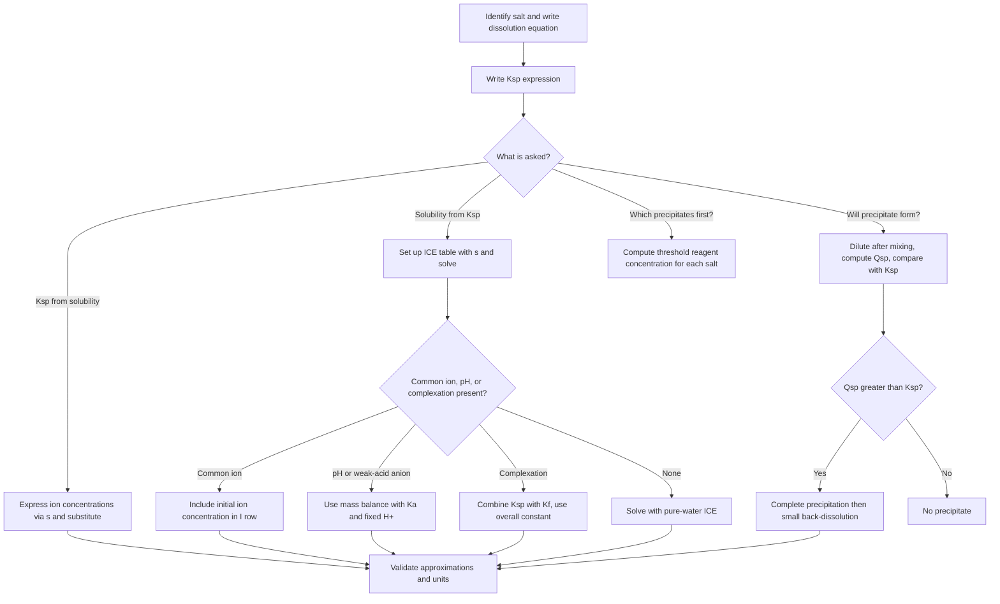

## Solubility Product and Precipitation Equilibria

### Overview

When a sparingly soluble ionic solid is in contact with water, a small amount dissolves and the system reaches a **heterogeneous equilibrium** between the undissolved solid and its dissolved ions. The equilibrium constant for this dissolution process is the **solubility product constant**, $K_{sp}$. Comparing the **ion product** $Q_{sp}$ with $K_{sp}$ predicts whether a solution is unsaturated, saturated, or supersaturated, and therefore whether a precipitate will form or dissolve. These ideas underpin qualitative analysis, gravimetric analysis, water treatment, geochemistry (mineral formation), and biomineralization.

**Key Points**

- $K_{sp}$ is written from the dissolution equation with the **solid omitted** (activity = 1); it contains only dissolved ions, each raised to its stoichiometric coefficient.
- $K_{sp}$ depends only on **temperature** (and, rigorously, on the ionic medium through activity coefficients).
- **Molar solubility** ($s$) and $K_{sp}$ are related through the stoichiometry of the salt; directly comparing $K_{sp}$ values ranks solubility only for salts of the **same formula type** (e.g., 1:1 with 1:1).
- $Q_{sp} < K_{sp}$: unsaturated (solid dissolves if present); $Q_{sp} = K_{sp}$: saturated (equilibrium); $Q_{sp} > K_{sp}$: supersaturated (precipitation is thermodynamically favoured).
- The **common-ion effect** decreases solubility; **pH changes, complexation, and ionic strength** can increase it.
- Predicted precipitation may be delayed by kinetic factors (nucleation barriers), so supersaturated solutions can persist temporarily [behavior varies with conditions].

---

### Dissolution Equilibria and the $K_{sp}$ Expression

For a general sparingly soluble salt $\text{M}_m\text{X}_n$:

$$\text{M}_m\text{X}_n(s) \rightleftharpoons m\,\text{M}^{n+}(aq) + n\,\text{X}^{m-}(aq)$$

$$K_{sp} = [\text{M}^{n+}]^m\,[\text{X}^{m-}]^n$$

| Salt | Dissolution equation | $K_{sp}$ expression |
| --- | --- | --- |
| $\text{AgCl}$ | $\text{AgCl}(s) \rightleftharpoons \text{Ag}^+ + \text{Cl}^-$ | $[\text{Ag}^+][\text{Cl}^-]$ |
| $\text{BaSO}_4$ | $\text{BaSO}_4(s) \rightleftharpoons \text{Ba}^{2+} + \text{SO}_4^{2-}$ | $[\text{Ba}^{2+}][\text{SO}_4^{2-}]$ |
| $\text{PbI}_2$ | $\text{PbI}_2(s) \rightleftharpoons \text{Pb}^{2+} + 2\,\text{I}^-$ | $[\text{Pb}^{2+}][\text{I}^-]^2$ |
| $\text{Ca}_3(\text{PO}_4)_2$ | $\text{Ca}_3(\text{PO}_4)_2(s) \rightleftharpoons 3\,\text{Ca}^{2+} + 2\,\text{PO}_4^{3-}$ | $[\text{Ca}^{2+}]^3[\text{PO}_4^{3-}]^2$ |
| $\text{Fe}(\text{OH})_3$ | $\text{Fe}(\text{OH})_3(s) \rightleftharpoons \text{Fe}^{3+} + 3\,\text{OH}^-$ | $[\text{Fe}^{3+}][\text{OH}^-]^3$ |
| $\text{Ag}_2\text{CrO}_4$ | $\text{Ag}_2\text{CrO}_4(s) \rightleftharpoons 2\,\text{Ag}^+ + \text{CrO}_4^{2-}$ | $[\text{Ag}^+]^2[\text{CrO}_4^{2-}]$ |

The solid does not appear because its activity is 1; consequently, at a given temperature the saturated solution has fixed ion concentrations, independent of the amount of excess solid (provided some solid remains).

#### Representative $K_{sp}$ Values at 25 °C (Approximate)

| Salt | $K_{sp}$ | Salt | $K_{sp}$ |
| --- | --- | --- | --- |
| $\text{AgCl}$ | $1.8\times10^{-10}$ | $\text{Mg}(\text{OH})_2$ | $5.6\times10^{-12}$ |
| $\text{AgBr}$ | $5.4\times10^{-13}$ | $\text{Fe}(\text{OH})_3$ | $\approx 10^{-38}$ to $10^{-39}$ |
| $\text{AgI}$ | $8.5\times10^{-17}$ | $\text{Ca}(\text{OH})_2$ | $5.0\times10^{-6}$ |
| $\text{BaSO}_4$ | $1.1\times10^{-10}$ | $\text{CaCO}_3$ (calcite) | $\approx 3.4\times10^{-9}$ |
| $\text{CaF}_2$ | $\approx 3.5\times10^{-11}$ | $\text{PbI}_2$ | $7.1\times10^{-9}$ |
| $\text{PbSO}_4$ | $\approx 1.6\times10^{-8}$ | $\text{Ag}_2\text{CrO}_4$ | $1.1\times10^{-12}$ |

Tabulated values vary between sources and with temperature and ionic strength; they should be treated as approximate.

---

### Molar Solubility and $K_{sp}$

**Molar solubility** $s$ (mol L$^{-1}$) is the amount of solid that dissolves per litre of solution to reach saturation. For $\text{M}_m\text{X}_n$ dissolving in pure water, with $[\text{M}^{n+}] = ms$ and $[\text{X}^{m-}] = ns$:

$$K_{sp} = (ms)^m(ns)^n = m^m n^n\,s^{\,m+n}$$

$$s = \left(\frac{K_{sp}}{m^m n^n}\right)^{1/(m+n)}$$

| Formula type | Example | $K_{sp}$ in terms of $s$ | $s$ in terms of $K_{sp}$ |
| --- | --- | --- | --- |
| 1:1 (AB) | $\text{AgCl}$, $\text{BaSO}_4$ | $s^2$ | $\sqrt{K_{sp}}$ |
| 1:2 or 2:1 ($\text{AB}_2$, $\text{A}_2\text{B}$) | $\text{PbI}_2$, $\text{Ag}_2\text{CrO}_4$ | $4s^3$ | $\sqrt[3]{K_{sp}/4}$ |
| 1:3 or 3:1 ($\text{AB}_3$) | $\text{Fe}(\text{OH})_3$ | $27s^4$ | $\sqrt[4]{K_{sp}/27}$ |
| 2:3 or 3:2 ($\text{A}_2\text{B}_3$, $\text{A}_3\text{B}_2$) | $\text{Ca}_3(\text{PO}_4)_2$ | $108s^5$ | $\sqrt[5]{K_{sp}/108}$ |

**Key Points**

- Solubility can be expressed as molar solubility (mol L$^{-1}$), or in $\text{g L}^{-1}$ (multiply by molar mass), or $\text{g}/100\ \text{mL}$.
- Comparing $K_{sp}$ values ranks solubility **only** when the salts have the same stoichiometric type. For instance, $\text{AgCl}$ ($K_{sp} = 1.8\times10^{-10}$, $s = 1.3\times10^{-5}$ M) is less soluble than $\text{PbI}_2$ ($K_{sp} = 7.1\times10^{-9}$, $s = 1.2\times10^{-3}$ M) and also less soluble than $\text{Ag}_2\text{CrO}_4$ ($K_{sp} = 1.1\times10^{-12}$ but $s = 6.5\times10^{-5}$ M): a smaller $K_{sp}$ does not guarantee lower molar solubility across formula types.

---

### The Ion Product $Q_{sp}$ and Precipitation Criteria

$Q_{sp}$ has the same form as $K_{sp}$ but uses **actual (instantaneous) concentrations**:

$$Q_{sp} = [\text{M}^{n+}]^m_t\,[\text{X}^{m-}]^n_t$$

| Comparison | Solution state | Outcome |
| --- | --- | --- |
| $Q_{sp} < K_{sp}$ | Unsaturated | No precipitate; any solid present dissolves |
| $Q_{sp} = K_{sp}$ | Saturated | Equilibrium |
| $Q_{sp} > K_{sp}$ | Supersaturated | Precipitation proceeds until $Q_{sp} = K_{sp}$ |

The thermodynamic link is:

$$\Delta G = RT\ln\frac{Q_{sp}}{K_{sp}}, \qquad \Delta G^\circ = -RT\ln K_{sp}$$

$\Delta G^\circ$ for dissolution is positive for sparingly soluble salts (large positive values correspond to very small $K_{sp}$).

---

### Worked Examples: $K_{sp}$ and Solubility

#### Example 1: $K_{sp}$ from Molar Solubility (1:1 Salt)

The solubility of $\text{BaSO}_4$ in water is $1.05\times10^{-5}\ \text{mol L}^{-1}$ at 25 °C. Find $K_{sp}$.

|  | $[\text{Ba}^{2+}]$ | $[\text{SO}_4^{2-}]$ |
| --- | --- | --- |
| **I** | 0 | 0 |
| **C** | $+s$ | $+s$ |
| **E** | $s$ | $s$ |

$$K_{sp} = s^2 = (1.05\times10^{-5})^2 = 1.1\times10^{-10}$$

#### Example 2: $K_{sp}$ from Solubility in $\text{g L}^{-1}$

$\text{CaF}_2$ ($M = 78.07\ \text{g mol}^{-1}$) dissolves to the extent of $0.0168\ \text{g L}^{-1}$ [illustrative value]. Find $K_{sp}$.

$$s = \frac{0.0168}{78.07} = 2.15\times10^{-4}\ \text{mol L}^{-1}$$

$$[\text{Ca}^{2+}] = s = 2.15\times10^{-4}, \qquad [\text{F}^-] = 2s = 4.30\times10^{-4}$$

$$K_{sp} = s\,(2s)^2 = 4s^3 = 4(2.15\times10^{-4})^3 = 4(9.94\times10^{-12}) = 4.0\times10^{-11}$$

#### Example 3: Solubility from $K_{sp}$ (2:1 Salt)

$\text{Ag}_2\text{CrO}_4$, $K_{sp} = 1.1\times10^{-12}$. Find the molar solubility and $[\text{Ag}^+]$.

|  | $[\text{Ag}^+]$ | $[\text{CrO}_4^{2-}]$ |
| --- | --- | --- |
| **I** | 0 | 0 |
| **C** | $+2s$ | $+s$ |
| **E** | $2s$ | $s$ |

$$K_{sp} = (2s)^2\,s = 4s^3 = 1.1\times10^{-12} \quad\Rightarrow\quad s = \sqrt[3]{2.75\times10^{-13}} = 6.5\times10^{-5}\ \text{M}$$

$$[\text{Ag}^+] = 2s = 1.3\times10^{-4}\ \text{M}, \qquad [\text{CrO}_4^{2-}] = 6.5\times10^{-5}\ \text{M}$$

#### Example 4: Solubility of a Hydroxide and pH

$\text{Mg}(\text{OH})_2$, $K_{sp} = 5.6\times10^{-12}$. Find the pH of a saturated solution.

$$K_{sp} = s\,(2s)^2 = 4s^3 \quad\Rightarrow\quad s = \sqrt[3]{1.4\times10^{-12}} = 1.12\times10^{-4}\ \text{M}$$

$$[\text{OH}^-] = 2s = 2.24\times10^{-4}\ \text{M}$$

$$\text{pOH} = -\log(2.24\times10^{-4}) = 3.65 \quad\Rightarrow\quad \text{pH} = 14.00 - 3.65 = 10.35$$

(This assumes $\text{pK}_w = 14.00$ at 25 °C and negligible contribution from water autoionization.)

#### Example 5: Higher-Stoichiometry Salt

$\text{Fe}(\text{OH})_3$, $K_{sp} = 1.0\times10^{-38}$ (illustrative). Find $s$ in pure water ignoring $\text{OH}^-$ from water.

$$K_{sp} = s\,(3s)^3 = 27s^4 \quad\Rightarrow\quad s = \sqrt[4]{\frac{1.0\times10^{-38}}{27}} = \sqrt[4]{3.7\times10^{-40}} = 4.4\times10^{-10}\ \text{M}$$

**Caution:** $[\text{OH}^-] = 3s = 1.3\times10^{-9}\ \text{M}$ is far below $10^{-7}\ \text{M}$ from water autoionization. Including water's $[\text{OH}^-] = 1.0\times10^{-7}\ \text{M}$ gives a far more realistic result:

$$s = \frac{K_{sp}}{[\text{OH}^-]^3} = \frac{1.0\times10^{-38}}{(1.0\times10^{-7})^3} = 1.0\times10^{-17}\ \text{M}$$

**Conclusion:** For extremely insoluble hydroxides, the ionization of water dominates $[\text{OH}^-]$, and the simple $4s^3$-type formula fails.

---

### The Common-Ion Effect

Adding a soluble salt that shares an ion with the sparingly soluble solid shifts the dissolution equilibrium toward the solid (Le Chatelier's principle), **decreasing** solubility.

#### Example 6: $\text{AgCl}$ in $\text{NaCl}$ Solution

Find the solubility of $\text{AgCl}$ ($K_{sp} = 1.8\times10^{-10}$) in $0.10\ \text{M}$ $\text{NaCl}$ and compare it with pure water.

|  | $[\text{Ag}^+]$ | $[\text{Cl}^-]$ |
| --- | --- | --- |
| **I** | 0 | 0.10 |
| **C** | $+s$ | $+s$ |
| **E** | $s$ | $0.10 + s$ |

$$s\,(0.10 + s) = 1.8\times10^{-10} \quad\Rightarrow\quad s \approx \frac{1.8\times10^{-10}}{0.10} = 1.8\times10^{-9}\ \text{M}$$

Check: $s \ll 0.10$ ✓.

In pure water: $s = \sqrt{1.8\times10^{-10}} = 1.3\times10^{-5}\ \text{M}$.

**Output:** Solubility drops by a factor of about $7\times10^{3}$ in the presence of $0.10\ \text{M}$ $\text{Cl}^-$.

#### Example 7: $\text{PbI}_2$ in $\text{Pb}(\text{NO}_3)_2$

Find the solubility of $\text{PbI}_2$ ($K_{sp} = 7.1\times10^{-9}$) in $0.050\ \text{M}$ $\text{Pb}(\text{NO}_3)_2$.

|  | $[\text{Pb}^{2+}]$ | $[\text{I}^-]$ |
| --- | --- | --- |
| **I** | 0.050 | 0 |
| **C** | $+s$ | $+2s$ |
| **E** | $0.050 + s$ | $2s$ |

$$(0.050)(2s)^2 = 7.1\times10^{-9} \quad\Rightarrow\quad 4s^2 = 1.42\times10^{-7} \quad\Rightarrow\quad s = 1.9\times10^{-4}\ \text{M}$$

The approximation $0.050 + s \approx 0.050$ holds ($s/0.050 = 0.4\%$). Compared with $1.2\times10^{-3}\ \text{M}$ in pure water, solubility falls by about a factor of six.

**Key Points**

- The common-ion effect is an application of $Q_{sp}$ vs $K_{sp}$: adding the common ion raises $Q_{sp}$ above $K_{sp}$, driving precipitation until a new equilibrium is reached.
- At very high concentrations of the common ion, solubility may increase again through **complex-ion formation** (e.g., $\text{AgCl} + \text{Cl}^- \rightleftharpoons [\text{AgCl}_2]^-$) or through ionic-strength effects.

---

### Predicting Precipitation

#### Procedure

1. Calculate concentrations of each ion **after mixing** (account for dilution: $c_2 = c_1V_1/(V_1 + V_2)$).
2. Write $Q_{sp}$ from the $K_{sp}$ expression.
3. Compare $Q_{sp}$ with $K_{sp}$.
4. If $Q_{sp} > K_{sp}$, determine the final composition by an ICE-type calculation with the precipitation stoichiometry.

#### Example 8: Mixing Solutions

Will $\text{PbI}_2$ precipitate when $100.0\ \text{mL}$ of $0.010\ \text{M}$ $\text{Pb}(\text{NO}_3)_2$ is mixed with $100.0\ \text{mL}$ of $0.010\ \text{M}$ $\text{KI}$? ($K_{sp} = 7.1\times10^{-9}$)

After mixing (volume doubles): $[\text{Pb}^{2+}] = 0.0050\ \text{M}$, $[\text{I}^-] = 0.0050\ \text{M}$.

$$Q_{sp} = [\text{Pb}^{2+}][\text{I}^-]^2 = (0.0050)(0.0050)^2 = 1.25\times10^{-7}$$

Since $Q_{sp} = 1.25\times10^{-7} > K_{sp} = 7.1\times10^{-9}$, a precipitate **forms**.

#### Example 9: Composition After Precipitation

Continuing Example 8, find the equilibrium $[\text{Pb}^{2+}]$ and $[\text{I}^-]$ after precipitation.

**Step 1 – Stoichiometric precipitation (complete):**

$\text{Pb}^{2+} + 2\,\text{I}^- \rightarrow \text{PbI}_2(s)$. Available $\text{I}^-$: $0.0050\ \text{M}$ requires $0.0025\ \text{M}$ $\text{Pb}^{2+}$; $\text{I}^-$ is limiting.

After complete reaction: $[\text{Pb}^{2+}] = 0.0050 - 0.0025 = 0.0025\ \text{M}$, $[\text{I}^-] = 0$.

**Step 2 – Small back-dissolution:** let $y$ M of $\text{PbI}_2$ redissolve.

|  | $[\text{Pb}^{2+}]$ | $[\text{I}^-]$ |
| --- | --- | --- |
| **I** | 0.0025 | 0 |
| **C** | $+y$ | $+2y$ |
| **E** | $0.0025 + y$ | $2y$ |

$$(0.0025)(2y)^2 = 7.1\times10^{-9} \quad\Rightarrow\quad 4y^2 = 2.84\times10^{-6} \quad\Rightarrow\quad y = 8.4\times10^{-4}$$

**Check:** $y/0.0025 = 34\%$, which is not negligible, so solve the cubic more carefully: $(0.0025 + y)(2y)^2 = 7.1\times10^{-9}$.

Trial: $y = 6.5\times10^{-4}$: $(0.00315)(1.3\times10^{-3})^2 = (0.00315)(1.69\times10^{-6}) = 5.32\times10^{-9}$ (slightly low).

Trial: $y = 7.2\times10^{-4}$: $(0.00322)(1.44\times10^{-3})^2 = (0.00322)(2.07\times10^{-6}) = 6.68\times10^{-9}$.

Trial: $y = 7.4\times10^{-4}$: $(0.00324)(1.48\times10^{-3})^2 = (0.00324)(2.19\times10^{-6}) = 7.10\times10^{-9}$ ✓.

$$[\text{Pb}^{2+}] = 0.0025 + 0.00074 = 3.2\times10^{-3}\ \text{M}, \qquad [\text{I}^-] = 2y = 1.5\times10^{-3}\ \text{M}$$

**Output:** Most iodide is precipitated but not all; about $70\%$ of the initial $\text{I}^-$ is removed from solution.

#### Example 10: Threshold Concentration for Precipitation

What concentration of $\text{Cl}^-$ must be exceeded to begin precipitating $\text{AgCl}$ from a solution containing $1.0\times10^{-3}\ \text{M}$ $\text{Ag}^+$?

$$[\text{Cl}^-]_{min} = \frac{K_{sp}}{[\text{Ag}^+]} = \frac{1.8\times10^{-10}}{1.0\times10^{-3}} = 1.8\times10^{-7}\ \text{M}$$

#### Example 11: Threshold pH for Hydroxide Precipitation

At what pH does $\text{Mg}(\text{OH})_2$ begin to precipitate from $0.020\ \text{M}$ $\text{Mg}^{2+}$? ($K_{sp} = 5.6\times10^{-12}$)

$$[\text{OH}^-]_{min} = \sqrt{\frac{K_{sp}}{[\text{Mg}^{2+}]}} = \sqrt{\frac{5.6\times10^{-12}}{0.020}} = \sqrt{2.8\times10^{-10}} = 1.7\times10^{-5}\ \text{M}$$

$$\text{pOH} = 4.78 \quad\Rightarrow\quad \text{pH} = 9.22$$

**Conclusion:** Above about pH 9.2, magnesium hydroxide precipitates from this solution.

---

### Fractional (Selective) Precipitation

When a precipitating reagent is added gradually to a solution of several ions that form insoluble salts with different $K_{sp}$ values, the salt requiring the **lowest reagent concentration** precipitates first.

#### Example 12: $\text{Cl}^-$ and $\text{CrO}_4^{2-}$ with $\text{Ag}^+$

A solution contains $0.10\ \text{M}$ $\text{Cl}^-$ and $0.010\ \text{M}$ $\text{CrO}_4^{2-}$. Solid $\text{AgNO}_3$ is added slowly (no volume change). Which precipitates first, and what is $[\text{Cl}^-]$ when the second begins to precipitate?

**Threshold $[\text{Ag}^+]$ for $\text{AgCl}$:**

$$[\text{Ag}^+] = \frac{1.8\times10^{-10}}{0.10} = 1.8\times10^{-9}\ \text{M}$$

**Threshold $[\text{Ag}^+]$ for $\text{Ag}_2\text{CrO}_4$:**

$$[\text{Ag}^+] = \sqrt{\frac{1.1\times10^{-12}}{0.010}} = \sqrt{1.1\times10^{-10}} = 1.0\times10^{-5}\ \text{M}$$

$\text{AgCl}$ precipitates first (needs far less $\text{Ag}^+$). When $\text{Ag}_2\text{CrO}_4$ just begins to precipitate ($[\text{Ag}^+] = 1.0\times10^{-5}\ \text{M}$):

$$[\text{Cl}^-] = \frac{1.8\times10^{-10}}{1.0\times10^{-5}} = 1.8\times10^{-5}\ \text{M}$$

$$\text{Fraction of Cl}^-\text{ remaining} = \frac{1.8\times10^{-5}}{0.10} = 1.8\times10^{-4}\ (0.018\%)$$

**Output:** $\text{Cl}^-$ is more than $99.98\%$ removed before chromate begins to precipitate, so the two ions can be separated effectively. This principle underlies the **Mohr method** for chloride titration, using chromate as an indicator (red $\text{Ag}_2\text{CrO}_4$ appears only after $\text{Cl}^-$ is essentially consumed).

#### Example 13: Sulfide Separation of Metal Ions

For sulfide precipitation, $[\text{S}^{2-}]$ is controlled by pH through the $\text{H}_2\text{S}$ equilibria:

$$\text{H}_2\text{S} \rightleftharpoons 2\,\text{H}^+ + \text{S}^{2-}, \qquad K_{overall} = K_{a1}K_{a2}$$

$$[\text{S}^{2-}] = \frac{K_{a1}K_{a2}[\text{H}_2\text{S}]}{[\text{H}^+]^2}$$

In acidic solution, $[\text{S}^{2-}]$ is tiny and only the least soluble sulfides (e.g., $\text{CuS}$, $\text{HgS}$) precipitate; raising the pH increases $[\text{S}^{2-}]$ and allows more soluble sulfides (e.g., $\text{ZnS}$, $\text{FeS}$) to precipitate. This was the basis of classical qualitative-analysis schemes. (Because of the toxicity and odor of $\text{H}_2\text{S}$, modern practice often uses thioacetamide or instrumental methods.)

---

### Effect of pH on Solubility

If the anion of the salt is the conjugate base of a weak acid, its concentration is reduced by protonation, and solubility **increases** in acidic solution.

#### Dissolution with Protonation

$$\text{CaCO}_3(s) \rightleftharpoons \text{Ca}^{2+}(aq) + \text{CO}_3^{2-}(aq)$$

$$\text{CO}_3^{2-}(aq) + \text{H}^+(aq) \rightleftharpoons \text{HCO}_3^-(aq)$$

$$\text{HCO}_3^-(aq) + \text{H}^+(aq) \rightleftharpoons \text{H}_2\text{CO}_3(aq) \rightleftharpoons \text{CO}_2(g) + \text{H}_2\text{O}(l)$$

Removal of $\text{CO}_3^{2-}$ pulls the dissolution equilibrium forward. The net reaction in acid is:

$$\text{CaCO}_3(s) + 2\,\text{H}^+(aq) \rightarrow \text{Ca}^{2+}(aq) + \text{CO}_2(g) + \text{H}_2\text{O}(l)$$

#### Quantitative Treatment: Salt of a Weak Acid

For $\text{MA}(s) \rightleftharpoons \text{M}^+ + \text{A}^-$ with $\text{HA} \rightleftharpoons \text{H}^+ + \text{A}^-$ ($K_a$) in a buffered solution of fixed $[\text{H}^+]$:

$$s = [\text{M}^+] = [\text{A}^-] + [\text{HA}] = [\text{A}^-]\left(1 + \frac{[\text{H}^+]}{K_a}\right)$$

$$K_{sp} = [\text{M}^+][\text{A}^-] = s\cdot\frac{s}{1 + [\text{H}^+]/K_a}$$

$$s = \sqrt{K_{sp}\left(1 + \frac{[\text{H}^+]}{K_a}\right)}$$

#### Example 14: Solubility of a Fluoride in Acid

$\text{CaF}_2$: $K_{sp} = 3.5\times10^{-11}$, and for $\text{HF}$, $K_a = 6.8\times10^{-4}$. Find the solubility in a solution buffered at pH 3.00 ($[\text{H}^+] = 1.0\times10^{-3}\ \text{M}$).

$$\text{CaF}_2(s) \rightleftharpoons \text{Ca}^{2+} + 2\,\text{F}^-$$

Mass balance: $[\text{F}^-] + [\text{HF}] = 2[\text{Ca}^{2+}] = 2s$.

$$[\text{HF}] = \frac{[\text{H}^+][\text{F}^-]}{K_a} = \frac{(1.0\times10^{-3})}{6.8\times10^{-4}}[\text{F}^-] = 1.47\,[\text{F}^-]$$

$$[\text{F}^-](1 + 1.47) = 2s \quad\Rightarrow\quad [\text{F}^-] = \frac{2s}{2.47} = 0.810\,s$$

$$K_{sp} = s\,(0.810\,s)^2 = 0.656\,s^3 = 3.5\times10^{-11} \quad\Rightarrow\quad s = \sqrt[3]{5.34\times10^{-11}} = 3.8\times10^{-4}\ \text{M}$$

Compared with pure water ($s = \sqrt[3]{K_{sp}/4} = 2.1\times10^{-4}\ \text{M}$), solubility rises by about a factor of $1.8$.

**Key Points**

- Salts of strongly acidic anions ($\text{Cl}^-$, $\text{Br}^-$, $\text{I}^-$, $\text{SO}_4^{2-}$ in moderately acidic solution) show little pH dependence.
- Hydroxides dissolve in acid by neutralization of $\text{OH}^-$: $\text{Mg}(\text{OH})_2 + 2\,\text{H}^+ \rightarrow \text{Mg}^{2+} + 2\,\text{H}_2\text{O}$.
- Solubility of a hydroxide **decreases** as pH increases (common-ion effect from $\text{OH}^-$), except for amphoteric hydroxides (see below).

---

### Complex-Ion Formation and Amphoterism

Ligands that bind the cation lower its free concentration, shifting dissolution forward and raising solubility.

#### Example: Silver Chloride in Ammonia

$$\text{AgCl}(s) \rightleftharpoons \text{Ag}^+ + \text{Cl}^- \qquad K_{sp} = 1.8\times10^{-10}$$

$$\text{Ag}^+ + 2\,\text{NH}_3 \rightleftharpoons [\text{Ag}(\text{NH}_3)_2]^+ \qquad K_f = 1.7\times10^{7}$$

$$\text{AgCl}(s) + 2\,\text{NH}_3 \rightleftharpoons [\text{Ag}(\text{NH}_3)_2]^+ + \text{Cl}^- \qquad K = K_{sp}K_f = 3.1\times10^{-3}$$

#### Example 15: Solubility of $\text{AgCl}$ in $1.0\ \text{M}$ $\text{NH}_3$

|  | $[\text{NH}_3]$ | $[\text{Ag}(\text{NH}_3)_2^+]$ | $[\text{Cl}^-]$ |
| --- | --- | --- | --- |
| **I** | 1.0 | 0 | 0 |
| **C** | $-2s$ | $+s$ | $+s$ |
| **E** | $1.0 - 2s$ | $s$ | $s$ |

$$\frac{s^2}{(1.0 - 2s)^2} = 3.1\times10^{-3} \quad\Rightarrow\quad \frac{s}{1.0 - 2s} = 0.0557$$

$$s = 0.0557 - 0.1114s \quad\Rightarrow\quad s = \frac{0.0557}{1.1114} = 0.050\ \text{M}$$

**Output:** $\text{AgCl}$ dissolves to the extent of about $0.050\ \text{M}$ in $1.0\ \text{M}$ ammonia, roughly $3\,800$ times its solubility in pure water ($1.3\times10^{-5}\ \text{M}$).

#### Amphoteric Hydroxides

Hydroxides such as $\text{Al}(\text{OH})_3$, $\text{Zn}(\text{OH})_2$, and $\text{Pb}(\text{OH})_2$ dissolve in both strong acid and excess base:

$$\text{Al}(\text{OH})_3(s) + 3\,\text{H}^+ \rightarrow \text{Al}^{3+} + 3\,\text{H}_2\text{O}$$

$$\text{Al}(\text{OH})_3(s) + \text{OH}^- \rightleftharpoons [\text{Al}(\text{OH})_4]^-$$

Their solubility-versus-pH curves show a **minimum** at intermediate pH and rise on either side.

<svg xmlns="http://www.w3.org/2000/svg" viewBox="0 0 620 330" width="620" height="330" font-family="sans-serif" font-size="12">
<text x="310" y="22" text-anchor="middle" font-size="14" font-weight="bold">Solubility vs pH: Simple Hydroxide and Amphoteric Hydroxide (svg_diagram)</text>
<line x1="70" y1="280" x2="580" y2="280" stroke="black" stroke-width="1.5" />
<line x1="70" y1="280" x2="70" y2="50" stroke="black" stroke-width="1.5" />
<text x="325" y="315" text-anchor="middle">pH</text>
<text x="26" y="165" text-anchor="middle" transform="rotate(-90 26 165)">log (solubility), schematic</text>

<path d="M80 70 C 200 130, 320 210, 570 260" fill="none" stroke="#2874a6" stroke-width="3" />
<text x="120" y="125" fill="#2874a6">Simple hydroxide, e.g. Mg(OH)2</text>

<path d="M80 60 C 150 150, 220 250, 320 262 C 420 262, 500 170, 570 65" fill="none" stroke="#c0392b" stroke-width="3" />
<text x="330" y="245" fill="#c0392b">Amphoteric, e.g. Al(OH)3</text>
<text x="330" y="258" fill="#c0392b" font-size="11">(minimum at intermediate pH)</text>
</svg>

---

### Effects of Ionic Strength: Activities and Diverse-Ion Effect

The thermodynamic solubility product is defined with activities:

$$K_{sp}^\circ = a_{\text{M}}^m\,a_{\text{X}}^n = \gamma_{\text{M}}^m\gamma_{\text{X}}^n[\text{M}]^m[\text{X}]^n$$

In solutions of appreciable ionic strength, activity coefficients $\gamma < 1$ and the **concentration** product needed to reach $K_{sp}^\circ$ increases; solubility therefore **rises** in the presence of non-common "inert" electrolytes (the **salt effect** or **diverse-ion effect**).

The Debye–Hückel limiting law (valid only for very dilute solutions, roughly $I < 0.01\ \text{M}$) estimates:

$$\log\gamma_i = -A\,z_i^2\sqrt{I}, \qquad I = \tfrac{1}{2}\sum_i c_iz_i^2$$

with $A \approx 0.509$ for water at 25 °C. Extended forms (Davies equation) are used at higher ionic strength.

**Key Points**

- In textbook problems, activity coefficients are usually set to 1 (ideal behaviour); the resulting $K_{sp}$-based predictions become less accurate as ionic strength rises.
- Salts with multiply charged ions are more strongly affected.
- The salt effect is typically much smaller than the common-ion effect.

---

### Other Practical Complications

| Complication | Effect on measured solubility |
| --- | --- |
| Ion pairing (e.g., $\text{CaSO}_4^0$ in solution) | Increases total dissolved calcium and sulfate relative to free-ion prediction |
| Hydrolysis of cations ($\text{Fe}^{3+}$, $\text{Al}^{3+}$, $\text{Pb}^{2+}$) | Consumes $\text{OH}^-$ or forms hydroxo-complexes; increases solubility at moderate pH |
| Hydrolysis of anions ($\text{S}^{2-}$, $\text{CO}_3^{2-}$, $\text{PO}_4^{3-}$) | Reduces free anion concentration; increases solubility |
| Polymorphism (calcite vs aragonite) | Different $K_{sp}$ values for different crystal forms |
| Particle size (Ostwald–Ripening, Kelvin effect) | Very small crystals are slightly more soluble; large crystals grow at their expense |
| Dissolved $\text{CO}_2$ (open vs closed system) | Alters carbonate speciation and $\text{CaCO}_3$ dissolution |
| Temperature | $K_{sp}$ typically increases with temperature for endothermic dissolution; exceptions exist (e.g., $\text{Ca}(\text{OH})_2$, $\text{CaSO}_4$ over some ranges) |

---

### Temperature Dependence

The van 't Hoff equation gives:

$$\ln\frac{K_{sp,2}}{K_{sp,1}} = -\frac{\Delta H^\circ_{diss}}{R}\left(\frac{1}{T_2} - \frac{1}{T_1}\right)$$

- **Endothermic dissolution** ($\Delta H^\circ_{diss} > 0$): solubility and $K_{sp}$ increase with temperature (most salts).
- **Exothermic dissolution** ($\Delta H^\circ_{diss} < 0$): solubility decreases with temperature (e.g., $\text{Ca}(\text{OH})_2$, $\text{Li}_2\text{CO}_3$).

#### Example 16: Estimating $K_{sp}$ at Another Temperature

Assume $\text{AgCl}$ dissolves with $\Delta H^\circ = +65.7\ \text{kJ mol}^{-1}$ and $K_{sp} = 1.8\times10^{-10}$ at 298 K. Estimate $K_{sp}$ at 323 K [approximation assuming constant $\Delta H^\circ$].

$$\ln\frac{K_2}{K_1} = -\frac{65700}{8.314}\left(\frac{1}{323} - \frac{1}{298}\right) = -7902\,(0.0030960 - 0.0033557) = -7902\,(-2.597\times10^{-4}) = 2.052$$

$$K_2 = 1.8\times10^{-10}\times e^{2.052} = 1.8\times10^{-10}\times7.78 = 1.4\times10^{-9}$$

**Output:** $K_{sp}$ increases by roughly a factor of eight between 25 °C and 50 °C in this estimate.

---

### Applications

#### Gravimetric Analysis

An analyte is quantitatively precipitated as an insoluble compound of known composition, filtered, dried, and weighed.

**Example:** Sulfate is determined by adding excess $\text{BaCl}_2$:

$$\text{Ba}^{2+}(aq) + \text{SO}_4^{2-}(aq) \rightarrow \text{BaSO}_4(s)$$

A $0.5000\ \text{g}$ sample yields $0.4520\ \text{g}$ $\text{BaSO}_4$ ($M = 233.39\ \text{g mol}^{-1}$). Mass % of $\text{SO}_4^{2-}$ ($M = 96.06\ \text{g mol}^{-1}$):

$$n_{\text{BaSO}_4} = \frac{0.4520}{233.39} = 1.937\times10^{-3}\ \text{mol}$$

$$m_{\text{SO}_4^{2-}} = (1.937\times10^{-3})(96.06) = 0.1861\ \text{g} \quad\Rightarrow\quad \%\text{SO}_4^{2-} = \frac{0.1861}{0.5000}\times100 = 37.2\%$$

Good gravimetric precipitates have very small $K_{sp}$, well-defined stoichiometry, and easily filterable crystals (achieved by slow precipitation from hot, dilute solution with a slight excess of reagent—supported by the common-ion effect).

#### Precipitation Titrations

**Mohr method:** $\text{Cl}^-$ titrated with $\text{Ag}^+$ using $\text{CrO}_4^{2-}$ as indicator (see Example 12). **Volhard method:** back-titration with $\text{SCN}^-$ using $\text{Fe}^{3+}$ indicator.

#### Water Treatment and Environmental Chemistry

- **Hardness removal (lime–soda softening):** $\text{Ca}^{2+}$ precipitated as $\text{CaCO}_3$, $\text{Mg}^{2+}$ as $\text{Mg}(\text{OH})_2$.
- **Phosphate removal:** precipitation with $\text{Fe}^{3+}$, $\text{Al}^{3+}$, or $\text{Ca}^{2+}$ as insoluble phosphates.
- **Heavy metal removal:** precipitation as hydroxides or sulfides at controlled pH.
- **Scale formation:** $\text{CaCO}_3$ and $\text{CaSO}_4$ deposit in boilers and pipes when $Q_{sp} > K_{sp}$ (temperature rise lowers $\text{CO}_2$ solubility and drives carbonate precipitation).

#### Geochemistry and Biomineralization

- **Karst and cave formation:** $\text{CaCO}_3$ dissolves in $\text{CO}_2$-rich water and re-precipitates as $\text{CO}_2$ escapes (stalactites and stalagmites).
- **Ocean acidification:** Increased dissolved $\text{CO}_2$ lowers carbonate ion concentration, reducing the saturation state $\Omega = Q_{sp}/K_{sp}$ for $\text{CaCO}_3$; organisms that build shells may be stressed when $\Omega < 1$.
- **Bone and teeth:** Hydroxyapatite $\text{Ca}_5(\text{PO}_4)_3\text{OH}$ and fluorapatite equilibria; fluoride incorporation lowers solubility in acid (basis of fluoride's caries-protective effect).
- **Kidney stones:** $\text{CaC}_2\text{O}_4$ and $\text{Ca}_3(\text{PO}_4)_2$ precipitate when urinary $Q_{sp}$ exceeds $K_{sp}$.

#### Medical Imaging

$\text{BaSO}_4$ is used as an X-ray contrast agent because its extremely low solubility keeps the toxic $\text{Ba}^{2+}$ concentration negligible ($s \approx 10^{-5}\ \text{M}$), whereas soluble barium salts are poisonous.

---

### Systematic Problem-Solving Strategy

---

### Common Errors and Misconceptions

| Error | Correction |
| --- | --- |
| Including the solid in $K_{sp}$ | Pure solids are omitted |
| Ranking solubility by $K_{sp}$ across different stoichiometries | Compute molar solubility for each salt, or compare only like formula types |
| Forgetting dilution on mixing | Recalculate concentrations with the total volume before computing $Q_{sp}$ |
| Using $s$ for both ions in a 1:2 salt | $[\text{M}] = s$, $[\text{X}] = 2s$; the stoichiometric coefficients matter |
| Neglecting the common ion | Include the initial concentration of the shared ion in the I row |
| Assuming the solubility formula works for very insoluble hydroxides in pure water | Water's own $[\text{OH}^-] = 10^{-7}\ \text{M}$ (and $[\text{H}^+]$) may dominate; treat pH explicitly |
| Assuming precipitation is complete when $Q_{sp} > K_{sp}$ | The amount precipitated depends on the excess; a residual equilibrium concentration remains |
| Ignoring complexation at high ligand concentration | Solubility can *increase* dramatically (e.g., $\text{AgCl}$ in ammonia, $\text{Al}(\text{OH})_3$ in excess base) |
| Treating $K_{sp}$ as independent of ionic strength | Activities modify the effective concentration product; salt effect increases solubility |
| Assuming precipitation occurs instantly when $Q_{sp} > K_{sp}$ | Nucleation barriers can delay precipitation in supersaturated solutions |
| Confusing dissolving with dissociating strongly | $K_{sp}$ concerns the equilibrium between solid and ions; strong electrolytes that dissolve completely have no meaningful $K_{sp}$ in ordinary problems |

---

### Summary of Key Relationships

$$K_{sp} = [\text{M}^{n+}]^m[\text{X}^{m-}]^n, \qquad K_{sp} = m^m n^n\,s^{\,m+n}$$

$$Q_{sp} < K_{sp}:\ \text{unsaturated}; \quad Q_{sp} = K_{sp}:\ \text{saturated}; \quad Q_{sp} > K_{sp}:\ \text{precipitation}$$

$$[\text{X}]_{threshold} = \left(\frac{K_{sp}}{[\text{M}]^m}\right)^{1/n}$$

$$\Delta G^\circ = -RT\ln K_{sp}, \qquad \ln\frac{K_{sp,2}}{K_{sp,1}} = -\frac{\Delta H^\circ}{R}\left(\frac{1}{T_2} - \frac{1}{T_1}\right)$$

$$K_{overall} = K_{sp}\times K_f \quad\text{(dissolution with complexation)}$$

$$s = \sqrt{K_{sp}\left(1 + \frac{[\text{H}^+]}{K_a}\right)} \quad\text{(1:1 salt of a weak acid at fixed pH)}$$

**Conclusion**

The solubility product describes the equilibrium between a sparingly soluble ionic solid and its dissolved ions, and comparing the ion product $Q_{sp}$ with $K_{sp}$ provides a quantitative criterion for precipitation and dissolution. Solubility is not a fixed property of a salt: it is lowered by common ions and raised by acidification (for basic anions), complex formation, amphoterism, higher ionic strength, and (usually) higher temperature. Fractional precipitation exploits differences in $K_{sp}$ to separate ions, while gravimetric analysis, water treatment, geochemistry, and biomineralization all rest on the same equilibrium principles. Accurate calculations require correct stoichiometry, dilution accounting, and consideration of competing equilibria.

**Related Topics**

- Complex-ion equilibria and formation constants ($K_f$)
- Amphoteric hydroxides and speciation diagrams
- Common-ion effect in acid–base equilibria and buffers
- Activity coefficients, ionic strength, and the Debye–Hückel theory
- Qualitative analysis schemes and selective precipitation
- Precipitation titrations (Mohr, Volhard, Fajans methods)
- Carbonate system, alkalinity, and ocean acidification
- Nucleation, crystal growth, and Ostwald ripening
- Thermodynamics of dissolution: enthalpy and entropy of solution
- Electrochemical determination of $K_{sp}$ (concentration cells)