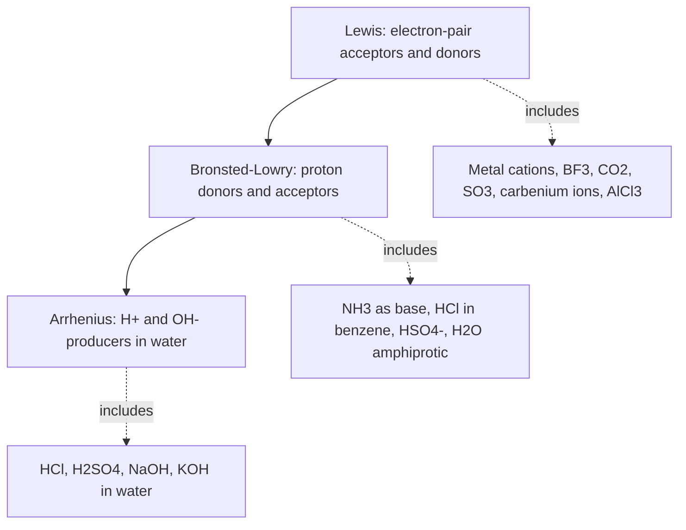
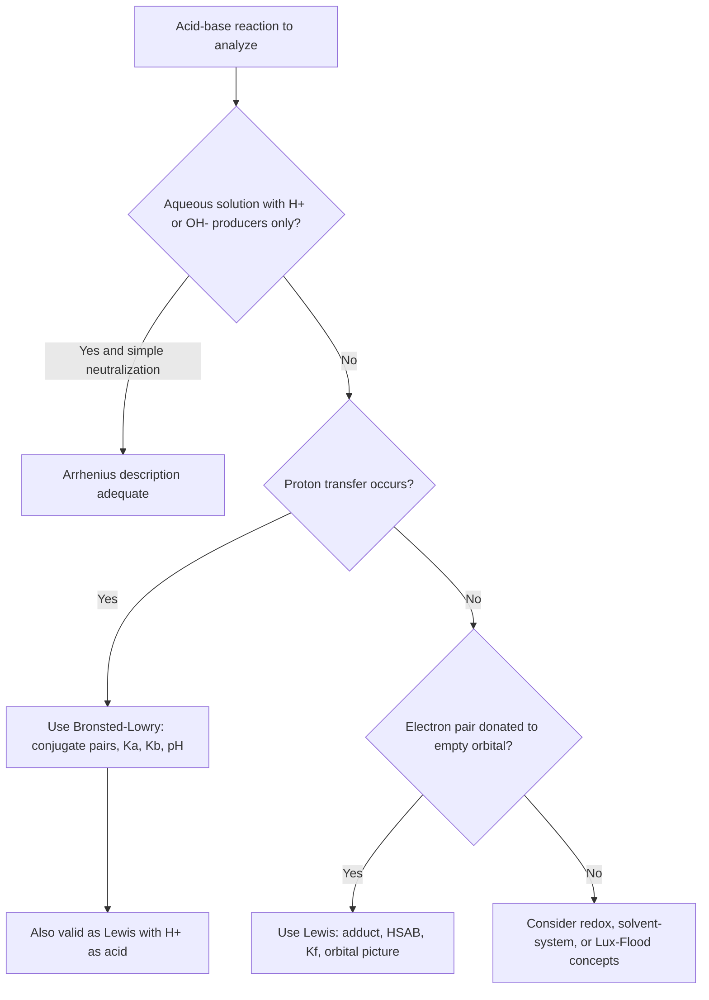

## Arrhenius, Brønsted–Lowry, and Lewis Acid–Base Theories

### Overview

The concepts of "acid" and "base" have been progressively generalized through three major theoretical frameworks. Each successive definition is **broader** than the last and includes the previous one as a special case:

| Theory | Year | Proposer(s) | Defines acids and bases by | Scope |
| --- | --- | --- | --- | --- |
| **Arrhenius** | 1884–1887 | Svante Arrhenius | Ions produced in **water** ($\text{H}^+$, $\text{OH}^-$) | Aqueous solutions only |
| **Brønsted–Lowry** | 1923 | Johannes Brønsted, Thomas Lowry | **Proton** ($\text{H}^+$) transfer | Any solvent, or none (gas phase) |
| **Lewis** | 1923 (developed 1930s) | Gilbert N. Lewis | **Electron-pair** acceptance/donation | All coordinate covalent (dative) bond formation |

**Key Points**

- Every Arrhenius acid or base is also a Brønsted–Lowry acid or base; every Brønsted–Lowry acid or base is also a Lewis acid or base (the proton is a Lewis acid, and a proton-accepting base necessarily donates an electron pair).
- The converse is not true: many Lewis acids (e.g., $\text{BF}_3$, $\text{Al}^{3+}$) contain no protons, and many Brønsted–Lowry reactions occur without water or hydroxide.
- The three theories are **complementary models**; the appropriate one depends on the chemical context (aqueous acid–base titration, proton-transfer equilibria, coordination chemistry, catalysis).
- Conceptual differences: Arrhenius and Brønsted–Lowry describe *species properties* tied to $\text{H}^+$; Lewis describes *bonding behaviour* in terms of electron pairs.

---

### Arrhenius Theory

#### Definitions

- **Arrhenius acid:** a substance that **increases the concentration of hydrogen ions** ($\text{H}^+$, more accurately hydronium, $\text{H}_3\text{O}^+$) when dissolved in water.
- **Arrhenius base:** a substance that **increases the concentration of hydroxide ions** ($\text{OH}^-$) when dissolved in water.

#### Examples

$$\text{HCl}(g) + \text{H}_2\text{O}(l) \rightarrow \text{H}_3\text{O}^+(aq) + \text{Cl}^-(aq)$$

$$\text{CH}_3\text{COOH}(aq) + \text{H}_2\text{O}(l) \rightleftharpoons \text{H}_3\text{O}^+(aq) + \text{CH}_3\text{COO}^-(aq)$$

$$\text{NaOH}(s) \xrightarrow{\text{H}_2\text{O}} \text{Na}^+(aq) + \text{OH}^-(aq)$$

$$\text{Ca}(\text{OH})_2(s) \xrightarrow{\text{H}_2\text{O}} \text{Ca}^{2+}(aq) + 2\,\text{OH}^-(aq)$$

#### Neutralization

In the Arrhenius picture, neutralization is the combination of $\text{H}^+$ and $\text{OH}^-$ to form water:

$$\text{H}^+(aq) + \text{OH}^-(aq) \rightarrow \text{H}_2\text{O}(l) \qquad \Delta H^\circ \approx -57\ \text{kJ mol}^{-1}$$

The enthalpy of neutralization for strong acid + strong base is approximately constant ($\approx -57\ \text{kJ mol}^{-1}$ at 25 °C), because the net ionic reaction is the same regardless of the spectator ions.

**Example**

$$\text{HCl}(aq) + \text{NaOH}(aq) \rightarrow \text{NaCl}(aq) + \text{H}_2\text{O}(l)$$

Net ionic: $\text{H}^+ + \text{OH}^- \rightarrow \text{H}_2\text{O}$ (with $\text{Na}^+$ and $\text{Cl}^-$ as spectator ions).

#### Strength in the Arrhenius Framework

| Type | Behaviour in water | Examples |
| --- | --- | --- |
| Strong acid | Essentially complete ionization | $\text{HCl}$, $\text{HBr}$, $\text{HI}$, $\text{HNO}_3$, $\text{HClO}_4$, $\text{H}_2\text{SO}_4$ (first ionization) |
| Weak acid | Partial ionization, $K_a$ small | $\text{CH}_3\text{COOH}$, $\text{HF}$, $\text{HCN}$, $\text{H}_2\text{CO}_3$ |
| Strong base | Essentially complete dissociation | $\text{NaOH}$, $\text{KOH}$, $\text{Ba}(\text{OH})_2$, $\text{Ca}(\text{OH})_2$ (limited solubility) |
| Weak base | Partial reaction with water, $K_b$ small | $\text{NH}_3$, amines |

#### Limitations of the Arrhenius Theory

1. **Restricted to aqueous solution.** Acid–base behaviour in non-aqueous solvents (liquid ammonia, glacial acetic acid) or in the gas phase cannot be described.
2. **Cannot explain basicity of species with no $\text{OH}^-$.** $\text{NH}_3$ and $\text{Na}_2\text{CO}_3$ behave as bases, yet neither contains hydroxide. (Arrhenius rationalized $\text{NH}_3$ as forming "$\text{NH}_4\text{OH}$", but this species is not detected in significant amounts.)
3. **Does not account for the role of the solvent.** The free "$\text{H}^+$" does not exist in water; the proton is bound as $\text{H}_3\text{O}^+$ (and higher hydrates such as $\text{H}_9\text{O}_4^+$).
4. **Excludes acid–base reactions without salt/water formation**, e.g., gas-phase $\text{NH}_3(g) + \text{HCl}(g) \rightarrow \text{NH}_4\text{Cl}(s)$.
5. **Does not cover acidic oxides and basic oxides directly** (e.g., $\text{CO}_2$, $\text{SO}_3$, $\text{CaO}$), although they can be treated after reaction with water.

---

### Brønsted–Lowry Theory

#### Definitions

- **Brønsted–Lowry acid:** a species that **donates a proton** ($\text{H}^+$).
- **Brønsted–Lowry base:** a species that **accepts a proton**.

Acid–base reactions are therefore **proton-transfer reactions**:

$$\text{HA} + \text{B} \rightleftharpoons \text{A}^- + \text{HB}^+$$

$$\underbrace{\text{HA}}_{\text{acid}_1} + \underbrace{\text{B}}_{\text{base}_2} \rightleftharpoons \underbrace{\text{A}^-}_{\text{base}_1} + \underbrace{\text{BH}^+}_{\text{acid}_2}$$

#### Conjugate Acid–Base Pairs

Two species that differ by exactly one proton form a **conjugate acid–base pair**:

$$\text{acid} \rightleftharpoons \text{conjugate base} + \text{H}^+$$

| Acid | Conjugate base |
| --- | --- |
| $\text{HCl}$ | $\text{Cl}^-$ |
| $\text{H}_2\text{O}$ | $\text{OH}^-$ |
| $\text{H}_3\text{O}^+$ | $\text{H}_2\text{O}$ |
| $\text{NH}_4^+$ | $\text{NH}_3$ |
| $\text{CH}_3\text{COOH}$ | $\text{CH}_3\text{COO}^-$ |
| $\text{H}_2\text{CO}_3$ | $\text{HCO}_3^-$ |
| $\text{HCO}_3^-$ | $\text{CO}_3^{2-}$ |
| $\text{H}_2\text{PO}_4^-$ | $\text{HPO}_4^{2-}$ |

**Rules for identifying conjugates**

- Conjugate base = acid $-\ \text{H}^+$ (charge decreases by one).
- Conjugate acid = base $+\ \text{H}^+$ (charge increases by one).

#### Example Reactions

**1. Ionization of a weak acid in water**

$$\text{CH}_3\text{COOH}(aq) + \text{H}_2\text{O}(l) \rightleftharpoons \text{CH}_3\text{COO}^-(aq) + \text{H}_3\text{O}^+(aq)$$

| Species | Role |
| --- | --- |
| $\text{CH}_3\text{COOH}$ | Acid |
| $\text{H}_2\text{O}$ | Base |
| $\text{CH}_3\text{COO}^-$ | Conjugate base of $\text{CH}_3\text{COOH}$ |
| $\text{H}_3\text{O}^+$ | Conjugate acid of $\text{H}_2\text{O}$ |

**2. Weak base in water**

$$\text{NH}_3(aq) + \text{H}_2\text{O}(l) \rightleftharpoons \text{NH}_4^+(aq) + \text{OH}^-(aq)$$

Here water acts as the **acid**, and $\text{NH}_3$ as the base—showing that the same solvent can play opposite roles.

**3. Gas-phase reaction (outside Arrhenius scope)**

$$\text{NH}_3(g) + \text{HCl}(g) \rightarrow \text{NH}_4^+\text{Cl}^-(s)$$

**4. Non-aqueous solvent**

$$\text{HCl} + \text{NH}_3 \rightarrow \text{NH}_4^+ + \text{Cl}^- \quad(\text{in benzene or as gases})$$

**5. Hydrolysis of a salt**

$$\text{CH}_3\text{COO}^-(aq) + \text{H}_2\text{O}(l) \rightleftharpoons \text{CH}_3\text{COOH}(aq) + \text{OH}^-(aq)$$

Acetate ion acts as a Brønsted–Lowry base, explaining the basic character of sodium acetate solutions, which the Arrhenius theory handles only indirectly.

#### Amphoteric and Amphiprotic Species

An **amphiprotic** species can both donate and accept a proton:

$$\text{H}_2\text{O} + \text{H}_2\text{O} \rightleftharpoons \text{H}_3\text{O}^+ + \text{OH}^- \qquad(\text{autoprotolysis})$$

$$\text{HCO}_3^- + \text{H}_2\text{O} \rightleftharpoons \text{CO}_3^{2-} + \text{H}_3\text{O}^+ \qquad(\text{acts as acid})$$

$$\text{HCO}_3^- + \text{H}_2\text{O} \rightleftharpoons \text{H}_2\text{CO}_3 + \text{OH}^- \qquad(\text{acts as base})$$

Other examples: $\text{HSO}_4^-$, $\text{H}_2\text{PO}_4^-$, $\text{HPO}_4^{2-}$, amino acids (zwitterions), $\text{NH}_3$ (very weak acid), alcohols.

**Note:** *amphoteric* is the broader term for species that react as both acid and base (including Lewis behaviour, e.g., $\text{Al}(\text{OH})_3$); *amphiprotic* specifically refers to proton donation and acceptance.

#### Strength and Conjugate Pairs

The stronger the acid, the weaker its conjugate base, and vice versa. For a conjugate pair in water at 25 °C:

$$K_a \times K_b = K_w = 1.0\times10^{-14}, \qquad \text{p}K_a + \text{p}K_b = 14.00$$

| Acid | Approx. $K_a$ | Conjugate base | Base strength |
| --- | --- | --- | --- |
| $\text{HClO}_4$ | very large | $\text{ClO}_4^-$ | Negligible |
| $\text{HCl}$ | very large | $\text{Cl}^-$ | Negligible |
| $\text{HF}$ | $6.8\times10^{-4}$ | $\text{F}^-$ | Weak ($K_b = 1.5\times10^{-11}$) |
| $\text{CH}_3\text{COOH}$ | $1.8\times10^{-5}$ | $\text{CH}_3\text{COO}^-$ | Weak ($K_b = 5.6\times10^{-10}$) |
| $\text{NH}_4^+$ | $5.6\times10^{-10}$ | $\text{NH}_3$ | Weak ($K_b = 1.8\times10^{-5}$) |
| $\text{H}_2\text{O}$ | $1.0\times10^{-14}$ (as $K_w$) | $\text{OH}^-$ | Strong in water |

#### Direction of Proton Transfer

Proton transfer is favoured toward the **weaker acid and weaker base**:

$$\text{stronger acid} + \text{stronger base} \rightleftharpoons \text{weaker base} + \text{weaker acid}$$

The equilibrium constant for $\text{HA} + \text{B}^- \rightleftharpoons \text{A}^- + \text{HB}$ is:

$$K = \frac{K_a(\text{HA})}{K_a(\text{HB})} = 10^{\,\text{p}K_a(\text{HB}) - \text{p}K_a(\text{HA})}$$

**Example:** Does the reaction $\text{CH}_3\text{COOH} + \text{F}^- \rightleftharpoons \text{CH}_3\text{COO}^- + \text{HF}$ favour products?

$$K = \frac{K_a(\text{CH}_3\text{COOH})}{K_a(\text{HF})} = \frac{1.8\times10^{-5}}{6.8\times10^{-4}} = 0.026$$

Since $K < 1$, the reactants are favoured (HF is a stronger acid than acetic acid).

#### The Leveling Effect

In a given solvent, no acid stronger than the **solvated proton** (the conjugate acid of the solvent) can exist, and no base stronger than the **lyate ion** (the conjugate base of the solvent) can persist. In water:

- $\text{HCl}$, $\text{HNO}_3$, $\text{HClO}_4$ all react essentially completely with water to give $\text{H}_3\text{O}^+$, so they appear equally strong.
- $\text{O}^{2-}$ and $\text{NH}_2^-$ react completely with water to give $\text{OH}^-$.

To distinguish among strong acids, weaker-basic solvents (e.g., glacial acetic acid) are used.

#### Water Autoionization and the pH Scale

$$2\,\text{H}_2\text{O}(l) \rightleftharpoons \text{H}_3\text{O}^+(aq) + \text{OH}^-(aq), \qquad K_w = [\text{H}_3\text{O}^+][\text{OH}^-] = 1.0\times10^{-14}\ (25\ °\text{C})$$

$$\text{pH} = -\log[\text{H}_3\text{O}^+], \qquad \text{pOH} = -\log[\text{OH}^-], \qquad \text{pH} + \text{pOH} = 14.00\ (25\ °\text{C})$$

$K_w$ increases with temperature (autoionization is endothermic), so neutral pH is 7.00 only at 25 °C (about 6.14 at 100 °C).

#### Worked Examples

**Example 1: Identify conjugate pairs**

For $\text{H}_2\text{PO}_4^-(aq) + \text{NH}_3(aq) \rightleftharpoons \text{HPO}_4^{2-}(aq) + \text{NH}_4^+(aq)$:

| Acid | Base | Conjugate base of acid | Conjugate acid of base |
| --- | --- | --- | --- |
| $\text{H}_2\text{PO}_4^-$ | $\text{NH}_3$ | $\text{HPO}_4^{2-}$ | $\text{NH}_4^+$ |

**Example 2: Predict the products and direction**

$$\text{HCN}(aq) + \text{CO}_3^{2-}(aq) \rightleftharpoons \text{CN}^-(aq) + \text{HCO}_3^-(aq)$$

$K_a(\text{HCN}) = 6.2\times10^{-10}$; $K_a(\text{HCO}_3^-) = 4.7\times10^{-11}$ (this is the acid whose conjugate base is $\text{CO}_3^{2-}$).

$$K = \frac{6.2\times10^{-10}}{4.7\times10^{-11}} = 13.2 > 1$$

The reaction proceeds forward (HCN is a stronger acid than $\text{HCO}_3^-$).

**Example 3: Base strength of a conjugate base**

Find $K_b$ of $\text{F}^-$ given $K_a(\text{HF}) = 6.8\times10^{-4}$.

$$K_b = \frac{K_w}{K_a} = \frac{1.0\times10^{-14}}{6.8\times10^{-4}} = 1.5\times10^{-11}$$

**Example 4: pH of a strong acid**

$0.010\ \text{M}$ $\text{HCl}$: $[\text{H}_3\text{O}^+] = 0.010\ \text{M}$, $\text{pH} = 2.00$.

**Example 5: pH of a weak acid (brief)**

$0.10\ \text{M}$ $\text{CH}_3\text{COOH}$, $K_a = 1.8\times10^{-5}$:

$$x = [\text{H}_3\text{O}^+] \approx \sqrt{K_a c} = \sqrt{(1.8\times10^{-5})(0.10)} = 1.34\times10^{-3}\ \text{M}, \qquad \text{pH} = 2.87$$

(Check: $x/0.10 = 1.3\% < 5\%$ ✓.)

#### Limitations of the Brønsted–Lowry Theory

1. **Requires a proton.** Acid–base behaviour in reactions with no proton transfer (e.g., $\text{BF}_3 + \text{NH}_3$, $\text{CO}_2 + \text{OH}^-$ formally can be treated but $\text{SO}_3 + \text{CaO}$ cannot) is outside the definition.
2. **Does not classify Lewis acids** such as $\text{AlCl}_3$, $\text{BF}_3$, metal ions (e.g., $\text{Fe}^{3+}$, $\text{Cu}^{2+}$) that behave as acids without donating protons.
3. **Does not address acid–base reactions in aprotic solvents** that involve other transferable species (e.g., $\text{Cl}^-$ transfer in the solvent-system concept, $\text{SOCl}_2$ or $\text{BrF}_3$ solvents).
4. **Strength depends on the solvent**; the theory describes proton donation tendency but not the underlying electronic structure.

---

### Lewis Theory

#### Definitions

- **Lewis acid:** an **electron-pair acceptor** (has an empty or low-lying vacant orbital).
- **Lewis base:** an **electron-pair donor** (has a lone pair or accessible $\pi$ electrons).

A Lewis acid–base reaction forms a **coordinate covalent (dative) bond** between the acid and the base, producing an **adduct** (Lewis acid–base complex):

$$\text{A} + :\text{B} \rightarrow \text{A}\!\leftarrow\!\text{B} \quad(\text{or A–B})$$

**Example**

$$\text{BF}_3 + :\text{NH}_3 \rightarrow \text{F}_3\text{B}\!\leftarrow\!\text{NH}_3$$

Boron in $\text{BF}_3$ has an incomplete octet (six valence electrons and an empty $p$ orbital); nitrogen donates its lone pair, completing boron's octet.

<svg xmlns="http://www.w3.org/2000/svg" viewBox="0 0 640 260" width="640" height="260" font-family="sans-serif" font-size="13">
<text x="320" y="22" text-anchor="middle" font-size="14" font-weight="bold">Lewis Acid-Base Adduct Formation: BF3 + NH3 (svg_diagram)</text>

<text x="70" y="120" font-size="20" font-weight="bold">B</text>
<line x1="88" y1="112" x2="130" y2="85" stroke="black" stroke-width="2" />
<line x1="88" y1="118" x2="130" y2="150" stroke="black" stroke-width="2" />
<line x1="60" y1="108" x2="25" y2="85" stroke="black" stroke-width="2" />
<text x="132" y="82">F</text>
<text x="132" y="160">F</text>
<text x="10" y="82">F</text>
<text x="50" y="190" fill="#c0392b">Lewis acid (empty p orbital)</text>

<text x="200" y="125" font-size="22">+</text>

<text x="270" y="120" font-size="20" font-weight="bold">N</text>
<circle cx="276" cy="95" r="3" fill="#2874a6" />
<circle cx="284" cy="95" r="3" fill="#2874a6" />
<line x1="285" y1="128" x2="310" y2="155" stroke="black" stroke-width="2" />
<line x1="272" y1="128" x2="265" y2="160" stroke="black" stroke-width="2" />
<line x1="290" y1="118" x2="325" y2="105" stroke="black" stroke-width="2" />
<text x="312" y="170">H</text>
<text x="255" y="176">H</text>
<text x="328" y="105">H</text>
<text x="240" y="205" fill="#2874a6">Lewis base (lone pair)</text>

<line x1="385" y1="120" x2="450" y2="120" stroke="black" stroke-width="2" />
<polygon points="450,114 462,120 450,126" fill="black" />

<text x="490" y="105" font-size="20" font-weight="bold">B</text>
<text x="512" y="105" font-size="18" fill="gray">←</text>
<text x="535" y="105" font-size="20" font-weight="bold">N</text>
<text x="470" y="150" font-size="12">F3B←NH3 adduct</text>
<text x="470" y="168" font-size="11" fill="gray">dative (coordinate) bond</text>
</svg>

#### Classes of Lewis Acids

| Class | Examples | Origin of acidity |
| --- | --- | --- |
| Species with incomplete octet | $\text{BF}_3$, $\text{BCl}_3$, $\text{AlCl}_3$, $\text{AlH}_3$ | Empty $p$ orbital on central atom |
| Metal cations | $\text{Fe}^{3+}$, $\text{Cu}^{2+}$, $\text{Al}^{3+}$, $\text{Ag}^+$, $\text{Zn}^{2+}$ | Vacant $s$, $p$, or $d$ orbitals |
| Molecules with polarized multiple bonds | $\text{CO}_2$, $\text{SO}_2$, $\text{SO}_3$ | Electrophilic central atom; $\pi^*$ acceptor |
| Central atoms able to expand the octet | $\text{SiF}_4$, $\text{SnCl}_4$, $\text{PF}_5$, $\text{TiCl}_4$ | Available $d$ orbitals or hypervalent bonding |
| Carbocations and electrophiles | $\text{R}_3\text{C}^+$, $\text{NO}_2^+$, $\text{H}^+$ | Empty orbital |
| Halogens and $\text{I}_2$ (charge-transfer acceptors) | $\text{I}_2$ (with donors such as $\text{I}^-$, giving $\text{I}_3^-$) | Low-lying $\sigma^*$ orbital |

#### Classes of Lewis Bases

| Class | Examples | Donor site |
| --- | --- | --- |
| Neutral molecules with lone pairs | $\text{NH}_3$, $\text{H}_2\text{O}$, amines, ethers, phosphines ($\text{PR}_3$) | Lone pair on N, O, P |
| Anions | $\text{OH}^-$, $\text{F}^-$, $\text{Cl}^-$, $\text{CN}^-$, $\text{H}^-$, $\text{CH}_3^-$ | Lone pair |
| $\pi$-electron donors | Alkenes, arenes, $\text{CO}$ (both) | $\pi$ electrons |
| Chelating ligands | $\text{EDTA}^{4-}$, ethylenediamine, acetylacetonate | Multiple lone pairs |

#### Example Reactions

**1. Complex-ion formation (metal cation + ligands)**

$$\text{Cu}^{2+}(aq) + 4\,\text{NH}_3(aq) \rightleftharpoons [\text{Cu}(\text{NH}_3)_4]^{2+}(aq)$$

Cu$^{2+}$ is the Lewis acid; $\text{NH}_3$ is the Lewis base.

**2. Hydration of a metal ion**

$$\text{Al}^{3+} + 6\,\text{H}_2\text{O} \rightarrow [\text{Al}(\text{H}_2\text{O})_6]^{3+}$$

The acidity of hydrated metal ions arises from polarization of coordinated water, which then acts as a Brønsted acid:

$$[\text{Al}(\text{H}_2\text{O})_6]^{3+} + \text{H}_2\text{O} \rightleftharpoons [\text{Al}(\text{H}_2\text{O})_5(\text{OH})]^{2+} + \text{H}_3\text{O}^+$$

**3. Acidic oxide + water (carbon dioxide as Lewis acid)**

$$\text{CO}_2 + :\!\text{OH}^- \rightarrow \text{HCO}_3^-$$

The hydroxide lone pair attacks the electrophilic carbon; the carbon–oxygen $\pi$ electrons shift onto oxygen.

**4. Basic oxide + acidic oxide**

$$\text{CaO}(s) + \text{SO}_3(g) \rightarrow \text{CaSO}_4(s)$$

Oxide ion ($\text{O}^{2-}$, from $\text{CaO}$) donates an electron pair to sulfur of $\text{SO}_3$, forming $\text{SO}_4^{2-}$.

**5. Friedel–Crafts catalyst**

$$\text{RCl} + \text{AlCl}_3 \rightleftharpoons \text{R}^+ + \text{AlCl}_4^-$$

$\text{AlCl}_3$ accepts a chloride lone pair, generating the carbocation electrophile.

**6. Proton as Lewis acid**

$$\text{H}^+ + :\text{NH}_3 \rightarrow \text{NH}_4^+$$

$$\text{H}^+ + :\text{OH}^- \rightarrow \text{H}_2\text{O}$$

Thus, Brønsted–Lowry proton transfer is a special case of Lewis acid–base chemistry with $\text{H}^+$ as the Lewis acid.

**7. Displacement reactions**

$$\text{F}_3\text{B}\!\leftarrow\!\text{OEt}_2 + \text{NH}_3 \rightarrow \text{F}_3\text{B}\!\leftarrow\!\text{NH}_3 + \text{OEt}_2$$

The stronger Lewis base ($\text{NH}_3$) displaces the weaker one (diethyl ether) from the boron center.

#### Relative Strength and the HSAB Principle

Lewis acid and base strengths depend on the partner, so there is no single universal strength scale. The **Hard–Soft Acid–Base (HSAB)** principle (Pearson, 1963) provides a qualitative guide:

- **Hard** acids/bases: small, highly charged, weakly polarizable (e.g., $\text{H}^+$, $\text{Li}^+$, $\text{Al}^{3+}$, $\text{F}^-$, $\text{OH}^-$, $\text{H}_2\text{O}$).
- **Soft** acids/bases: large, low charge, highly polarizable (e.g., $\text{Ag}^+$, $\text{Hg}^{2+}$, $\text{Pt}^{2+}$, $\text{I}^-$, $\text{R}_2\text{S}$, $\text{CO}$).

**Rule:** Hard acids prefer to bind hard bases; soft acids prefer soft bases (thermodynamically more stable adducts).

| Hard acids | Borderline | Soft acids |
| --- | --- | --- |
| $\text{H}^+$, $\text{Na}^+$, $\text{Mg}^{2+}$, $\text{Al}^{3+}$, $\text{Fe}^{3+}$, $\text{BF}_3$ | $\text{Fe}^{2+}$, $\text{Cu}^{2+}$, $\text{Zn}^{2+}$, $\text{Pb}^{2+}$ | $\text{Cu}^+$, $\text{Ag}^+$, $\text{Au}^+$, $\text{Hg}^{2+}$, $\text{Pd}^{2+}$ |

| Hard bases | Borderline | Soft bases |
| --- | --- | --- |
| $\text{F}^-$, $\text{OH}^-$, $\text{H}_2\text{O}$, $\text{NH}_3$, $\text{CO}_3^{2-}$, $\text{SO}_4^{2-}$ | $\text{Br}^-$, $\text{N}_3^-$, pyridine | $\text{I}^-$, $\text{S}^{2-}$, $\text{R}_2\text{S}$, $\text{CN}^-$, $\text{CO}$, $\text{PR}_3$ |

**Application:** $\text{Ag}^+$ (soft) precipitates as $\text{AgI}$ ($K_{sp} \approx 10^{-17}$) far more readily than as $\text{AgF}$ (soluble), whereas $\text{Al}^{3+}$ (hard) forms stable fluorides and oxides but not stable iodides in water. [Qualitative guideline; exceptions exist.]

#### Frontier-Orbital Interpretation

A Lewis acid–base interaction is the overlap of the **HOMO of the base** (occupied orbital carrying the donated pair) with the **LUMO of the acid** (vacant orbital receiving the pair):

$$\text{HOMO(base)} \rightarrow \text{LUMO(acid)}$$

This gives a bonding combination (lower in energy) that is filled by the two donated electrons, stabilizing the adduct. Smaller HOMO–LUMO gaps typically lead to stronger interactions.

#### Quantifying Lewis Acidity and Basicity (Overview)

| Scale | Measures |
| --- | --- |
| Gutmann donor number (DN) | Lewis basicity of a solvent, via enthalpy of adduct formation with $\text{SbCl}_5$ |
| Gutmann acceptor number (AN) | Lewis acidity via $^{31}\text{P}$ NMR shift of $\text{Et}_3\text{PO}$ |
| Fluoride ion affinity (FIA) | Gas-phase enthalpy for $\text{LA} + \text{F}^- \rightarrow [\text{LA}\text{F}]^-$ |
| Gutmann–Beckett method | Experimental determination of AN |
| Equilibrium constants | For specific adduct formation, e.g., $K_f$ for complexes |

#### Worked Examples

**Example 6: Identify the Lewis acid and base**

$$\text{AlCl}_3 + \text{Cl}^- \rightarrow [\text{AlCl}_4]^-$$

- Lewis acid: $\text{AlCl}_3$ (Al has an empty $3p$ orbital).
- Lewis base: $\text{Cl}^-$ (donates a lone pair).
- Product: tetrahedral $[\text{AlCl}_4]^-$ (adduct).

**Example 7: Identify roles in a complex-ion equilibrium**

$$\text{Ag}^+(aq) + 2\,\text{NH}_3(aq) \rightleftharpoons [\text{Ag}(\text{NH}_3)_2]^+(aq), \qquad K_f = 1.7\times10^7$$

- Lewis acid: $\text{Ag}^+$; Lewis base: $\text{NH}_3$.
- Large $K_f$ indicates a strongly favoured adduct.

**Example 8: Show that $\text{CO}_2$ acts as a Lewis acid**

In $\text{CO}_2 + \text{OH}^- \rightarrow \text{HCO}_3^-$, the oxygen lone pair of hydroxide attacks the electrophilic carbon, with the $\text{C}{=}\text{O}$ $\pi$ bond electrons moving onto oxygen (forming the $\text{O}^-$ of bicarbonate). Carbon accepts an electron pair (Lewis acid); hydroxide donates one (Lewis base).

**Example 9: Classify a reaction under all three theories**

$$\text{HCl}(aq) + \text{NaOH}(aq) \rightarrow \text{NaCl}(aq) + \text{H}_2\text{O}(l)$$

| Theory | Acid | Base |
| --- | --- | --- |
| Arrhenius | $\text{HCl}$ (produces $\text{H}^+$) | $\text{NaOH}$ (produces $\text{OH}^-$) |
| Brønsted–Lowry | $\text{H}_3\text{O}^+$ (formed from $\text{HCl}$) | $\text{OH}^-$ |
| Lewis | $\text{H}^+$ (accepts pair) | $\text{OH}^-$ (donates pair) |

**Example 10: A reaction that fits only the Lewis definition**

$$\text{BF}_3(g) + \text{NH}_3(g) \rightarrow \text{F}_3\text{BNH}_3(s)$$

- Arrhenius: not applicable (gas phase, no $\text{H}^+$/$\text{OH}^-$).
- Brønsted–Lowry: not applicable (no proton is transferred).
- Lewis: $\text{BF}_3$ acid, $\text{NH}_3$ base.

**Example 11: Equilibrium constant for a Lewis adduct**

For $\text{Cu}^{2+}(aq) + 4\,\text{NH}_3(aq) \rightleftharpoons [\text{Cu}(\text{NH}_3)_4]^{2+}(aq)$ with $K_f = 1.1\times10^{13}$, estimate $[\text{Cu}^{2+}]$ when $0.010\ \text{M}$ $\text{Cu}^{2+}$ is mixed with an excess of $\text{NH}_3$ that leaves $[\text{NH}_3] = 0.50\ \text{M}$ at equilibrium.

$$[\text{Cu}(\text{NH}_3)_4^{2+}] \approx 0.010\ \text{M}$$

$$[\text{Cu}^{2+}] = \frac{[\text{Cu}(\text{NH}_3)_4^{2+}]}{K_f[\text{NH}_3]^4} = \frac{0.010}{(1.1\times10^{13})(0.50)^4} = \frac{0.010}{6.9\times10^{11}} = 1.5\times10^{-14}\ \text{M}$$

Essentially all copper is complexed, illustrating a strong Lewis acid–base interaction.

#### Limitations and Criticisms of the Lewis Theory

1. **No single strength scale.** Relative acid or base strength depends on the reference partner (unlike the pH scale for Brønsted–Lowry acids in water); HSAB is qualitative.
2. **Very broad definition.** It includes essentially all coordinate-bond formation, so it blurs the distinction between "acid–base" and general "electrophile–nucleophile" or "ligand–metal" chemistry (they are nearly synonymous descriptions).
3. **Does not use the traditional properties of acids** (sour taste, indicator colour change, reaction with metals to release hydrogen, neutralization) as criteria; many Lewis acids show none of these characteristics.
4. **Some reactions are ambiguous** in classification (e.g., redox-coupled processes, or when the donor/acceptor roles of a bond-forming step are not clearly separated).

---

### Comparison of the Three Theories

| Feature | Arrhenius | Brønsted–Lowry | Lewis |
| --- | --- | --- | --- |
| Acid definition | Produces $\text{H}^+$ in water | Proton donor | Electron-pair acceptor |
| Base definition | Produces $\text{OH}^-$ in water | Proton acceptor | Electron-pair donor |
| Solvent requirement | Water only | Any solvent or none | None |
| Central species | $\text{H}^+$, $\text{OH}^-$ | Proton ($\text{H}^+$) | Electron pair |
| Key concept | Neutralization to $\text{H}_2\text{O}$ | Conjugate acid–base pairs | Coordinate covalent bond, adduct |
| Explains $\text{NH}_3$ as a base? | Only indirectly | Yes | Yes |
| Explains $\text{BF}_3$ as an acid? | No | No | Yes |
| Explains metal-ion acidity/complexes? | No | Partly (via hydrolysis) | Yes |
| Products of reaction | Salt + water | Conjugate acid + conjugate base | Adduct |
| Quantitative scale | $\text{pH}$, $K_a$, $K_b$ (aqueous) | $K_a$, $K_b$, $\text{p}K_a$ | Qualitative (HSAB), specific $K_f$ or affinities |

#### Classification of Selected Species

| Species | Arrhenius | Brønsted–Lowry | Lewis |
| --- | --- | --- | --- |
| $\text{HCl}$ | Acid | Acid | Acid (via $\text{H}^+$) |
| $\text{NaOH}$ | Base | Base ($\text{OH}^-$) | Base ($\text{OH}^-$) |
| $\text{NH}_3$ | Not classified directly (Arrhenius: "$\text{NH}_4\text{OH}$") | Base | Base |
| $\text{H}_2\text{O}$ | Neither (neutral) | Amphiprotic | Amphoteric (donor via O lone pair) |
| $\text{BF}_3$ | Not applicable | Not applicable | Acid |
| $\text{Al}^{3+}$ | Not applicable | Acid (hydrolysis of hydrate) | Acid |
| $\text{CO}_2$ | Acidic oxide (forms $\text{H}_2\text{CO}_3$) | Acid (via reaction with water) | Acid (electrophilic C) |
| $\text{CN}^-$ | Base (hydrolysis) | Base | Base (soft) |
| $\text{Cl}^-$ | Neutral | Very weak base | Weak/soft Lewis base |
| $\text{H}^-$ (hydride) | Not applicable | Base | Base |

#### Nested Relationship

- **Arrhenius** ⊂ **Brønsted–Lowry** ⊂ **Lewis**.
- All proton transfers are Lewis acid–base reactions where $\text{H}^+$ is the acid. However, the reverse is false: not every Lewis acid is a Brønsted–Lowry acid.

---

### Additional Related Definitions (Brief)

| Concept | Definition | Example |
| --- | --- | --- |
| **Solvent-system (Franklin) theory** | Acid: increases the cation characteristic of the solvent autoionization; base: increases the anion | In liquid $\text{NH}_3$: $2\,\text{NH}_3 \rightleftharpoons \text{NH}_4^+ + \text{NH}_2^-$, so $\text{NH}_4\text{Cl}$ is an acid and $\text{KNH}_2$ is a base |
| **Lux–Flood theory** | Acid: oxide-ion acceptor; base: oxide-ion donor (used for molten oxides, glasses, metallurgy) | $\text{CaO}$ (base) $+ \text{SiO}_2$ (acid) $\rightarrow \text{CaSiO}_3$ |
| **Usanovich theory** | Acid: species that gives up cations or accepts anions or electrons; base: the reverse (very general, includes redox) | Rarely used; largely of historical interest |
| **Superacids** | Acids stronger than 100% $\text{H}_2\text{SO}_4$ ($H_0 < -12$) | Magic acid ($\text{HSO}_3\text{F} + \text{SbF}_5$) |

---

### Selecting the Appropriate Theory

**Practical guidance**

| Context | Preferred framework |
| --- | --- |
| Titrations, pH calculations, buffers | Brønsted–Lowry (with $K_a$, $K_b$) |
| Introductory description of strong acids/bases in water | Arrhenius |
| Coordination chemistry, catalysis (AlCl$_3$, BF$_3$), organic mechanisms (electrophiles/nucleophiles) | Lewis |
| Non-aqueous solvents, gas-phase proton affinity | Brønsted–Lowry (or solvent-system) |
| Molten oxides, slags, glass chemistry | Lux–Flood |

---

### Common Errors and Misconceptions

| Misconception | Correction |
| --- | --- |
| A Brønsted–Lowry acid must contain $\text{H}$ and be neutral | It may be a cation ($\text{NH}_4^+$, $\text{H}_3\text{O}^+$) or an anion ($\text{HSO}_4^-$, $\text{H}_2\text{PO}_4^-$) |
| A Brønsted–Lowry base must contain $\text{OH}^-$ | It only needs a lone pair to accept a proton ($\text{NH}_3$, $\text{CO}_3^{2-}$, $\text{CH}_3\text{COO}^-$) |
| $\text{H}^+$ exists as a free ion in water | It is hydrated ($\text{H}_3\text{O}^+$ and larger clusters); $\text{H}^+$ is shorthand |
| "Conjugate base of a strong acid is strong" | It is very weak ($\text{Cl}^-$, $\text{NO}_3^-$, $\text{ClO}_4^-$) |
| Water is only a solvent | Water is amphiprotic and participates as acid or base |
| Lewis acid = proton donor | Lewis acids accept electron pairs; a Brønsted acid delivers $\text{H}^+$, which is itself the Lewis acid |
| Lewis bases and Brønsted bases are identical | Every Brønsted base is a Lewis base, but Lewis bases like $\text{I}^-$, $\text{PR}_3$, $\text{CO}$ may be poor proton acceptors yet excellent donors to soft acids |
| $\text{NH}_4\text{OH}$ is the actual species in ammonia solution | Aqueous ammonia is mostly $\text{NH}_3(aq)$ with a small fraction of $\text{NH}_4^+$ and $\text{OH}^-$ |
| Neutral pH is always 7 | Only at 25 °C; $K_w$ and neutrality pH vary with temperature |
| The larger the $K_{f}$ or "affinity", the stronger the Lewis acid in all contexts | Lewis strength is partner-dependent (HSAB) |
| $\text{p}K_a + \text{p}K_b = 14$ for any acid and base | Only for a **conjugate** acid–base pair in water at 25 °C |

---

### Summary of Key Relationships

$$\text{HA} + \text{B} \rightleftharpoons \text{A}^- + \text{BH}^+ \quad(\text{Brønsted–Lowry proton transfer})$$

$$K_a K_b = K_w = 1.0\times10^{-14}, \qquad \text{p}K_a + \text{p}K_b = 14.00\ (25\ °\text{C})$$

$$K_{eq} = 10^{\,\text{p}K_a(\text{product acid}) - \text{p}K_a(\text{reactant acid})}$$

$$\text{A} + :\text{B} \rightarrow \text{A}\!\leftarrow\!\text{B} \quad(\text{Lewis adduct formation})$$

$$\text{pH} = -\log[\text{H}_3\text{O}^+], \qquad \text{pH} + \text{pOH} = 14.00\ (25\ °\text{C})$$

**Conclusion**

The Arrhenius, Brønsted–Lowry, and Lewis theories form a hierarchy of increasingly general descriptions of acid–base behaviour. Arrhenius theory rationalizes aqueous neutralization but is limited to $\text{H}^+$ and $\text{OH}^-$ producers in water. Brønsted–Lowry theory generalizes to proton transfer in any medium, introducing conjugate pairs, relative strength through $K_a$ and $K_b$, amphiprotic species, and the leveling effect. Lewis theory abstracts acid–base chemistry to electron-pair donation and acceptance, encompassing coordination compounds, electrophilic catalysts, acidic oxides, and organic reaction mechanisms, with the HSAB principle offering qualitative guidance about adduct stability. Selecting the appropriate framework depends on whether the chemistry is best described by ions in water, proton transfer equilibria, or electron-pair bonding.

**Related Topics**

- Conjugate acid–base pairs and relative strengths ($K_a$, $K_b$, $\text{p}K_a$)
- Autoionization of water, $K_w$, and the pH scale
- Strong and weak acids and bases: equilibrium calculations
- Amphoteric and amphiprotic behaviour; acidic, basic, and amphoteric oxides
- Molecular structure and acid strength (electronegativity, bond strength, induction, resonance)
- Hard–Soft Acid–Base (HSAB) principle and complex-ion stability
- Coordination chemistry and ligand-field concepts
- Buffer solutions and the Henderson–Hasselbalch equation
- Acid–base titrations and indicators
- Non-aqueous solvents, superacids, and the acidity function $H_0$