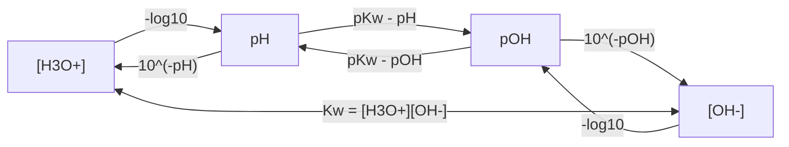

## pH, pOH, and the Autoionization of Water


### Overview

Pure water is not composed solely of $H_2O$ molecules. A tiny fraction of molecules undergo **autoionization** (also called autoprotolysis or self-ionization), transferring a proton between two water molecules. This equilibrium underlies the entire pH scale and defines what "acidic," "neutral," and "basic" mean quantitatively.

**Key Points**

- Water is amphiprotic: it can act as both a Brønsted–Lowry acid and base.
- The ion-product constant $K_w$ links $[H_3O^+]$ and $[OH^-]$ in every aqueous solution.
- $pH$ and $pOH$ are logarithmic scales that compress the enormous range of ion concentrations into manageable numbers.
- Neutrality is defined by $[H_3O^+] = [OH^-]$, not by $pH = 7$ (these coincide only near $25\,^\circ C$).

---

### Autoionization of Water

#### The Equilibrium

$$2\,H_2O(l) \rightleftharpoons H_3O^+(aq) + OH^-(aq)$$

The hydronium ion $H_3O^+$ is commonly abbreviated $H^+(aq)$, giving the simplified form:

$$H_2O(l) \rightleftharpoons H^+(aq) + OH^-(aq)$$

Both notations are used interchangeably in most textbooks. In reality, the proton is solvated by multiple water molecules (e.g., Zundel $H_5O_2^+$ and Eigen $H_9O_4^+$ structures), but $H_3O^+$ is the standard representation.

#### Ion-Product Constant of Water

The equilibrium expression is:

$$K = \frac{[H_3O^+][OH^-]}{[H_2O]^2}$$

Because liquid water is a pure solvent at essentially constant concentration (its activity is taken as 1), it is absorbed into the constant:

$$K_w = [H_3O^+][OH^-]$$

At $25\,^\circ C$:

$$K_w = 1.0 \times 10^{-14}$$

In pure water at $25\,^\circ C$, $[H_3O^+] = [OH^-] = 1.0 \times 10^{-7}\ M$.

**Key Points**

- $K_w$ is an equilibrium constant, so it depends **only on temperature**.
- The relationship $K_w = [H_3O^+][OH^-]$ holds in *any* dilute aqueous solution, not just pure water.
- Adding acid raises $[H_3O^+]$ and, by Le Châtelier's principle, lowers $[OH^-]$ so the product stays constant (and vice versa for bases).
- Strictly, $K_w$ is defined with activities; using concentrations is an approximation valid for dilute solutions.

#### Temperature Dependence

Autoionization is **endothermic** ($\Delta H^\circ \approx +55.8\ kJ/mol$ for $H_2O \rightleftharpoons H^+ + OH^-$). Raising temperature shifts the equilibrium right, increasing $K_w$.

| Temperature (°C) | $K_w$ | $pK_w$ | pH of pure water |
| --- | --- | --- | --- |
| 0 | $1.14 \times 10^{-15}$ | 14.94 | 7.47 |
| 10 | $2.93 \times 10^{-15}$ | 14.53 | 7.27 |
| 20 | $6.81 \times 10^{-15}$ | 14.17 | 7.08 |
| 25 | $1.01 \times 10^{-14}$ | 14.00 | 7.00 |
| 37 | $2.4 \times 10^{-14}$ | 13.62 | 6.81 |
| 40 | $2.92 \times 10^{-14}$ | 13.53 | 6.77 |
| 50 | $5.48 \times 10^{-14}$ | 13.26 | 6.63 |
| 100 | $5.13 \times 10^{-13}$ | 12.29 | 6.14 |

*Values are approximate and vary slightly between literature sources.*

**Key Points**

- Pure water at $100\,^\circ C$ has $pH \approx 6.14$ but is still **neutral**, since $[H_3O^+] = [OH^-]$.
- "Neutral = pH 7" is only valid near $25\,^\circ C$.
- At body temperature ($37\,^\circ C$), neutral $pH \approx 6.81$; blood at $pH \approx 7.4$ is therefore slightly basic relative to true neutrality.

#### Degree of Autoionization

At $25\,^\circ C$, $[H_3O^+] = 1.0 \times 10^{-7}\ M$ while $[H_2O] \approx 55.5\ M$ (from $1000\ g/L \div 18.015\ g/mol$).

$$\text{Fraction ionized} = \frac{1.0 \times 10^{-7}}{55.5} \approx 1.8 \times 10^{-9}$$

Roughly 1 in every 555 million water molecules is ionized at any instant.

#### Mechanism (svg_diagram)

<svg xmlns="http://www.w3.org/2000/svg" viewBox="0 0 640 220" width="640" height="220" font-family="Arial, sans-serif">
<title>Autoionization of Water (svg_diagram)</title>
<text x="320" y="24" text-anchor="middle" font-size="16" font-weight="bold">Autoionization of Water (svg_diagram)</text>

<circle cx="90" cy="110" r="30" fill="#e74c3c" opacity="0.85" />
<text x="90" y="116" text-anchor="middle" font-size="16" fill="#fff">O</text>
<circle cx="50" cy="150" r="14" fill="#ecf0f1" stroke="#7f8c8d" />
<text x="50" y="155" text-anchor="middle" font-size="12">H</text>
<circle cx="130" cy="150" r="14" fill="#ecf0f1" stroke="#7f8c8d" />
<text x="130" y="155" text-anchor="middle" font-size="12">H</text>

<circle cx="230" cy="110" r="30" fill="#e74c3c" opacity="0.85" />
<text x="230" y="116" text-anchor="middle" font-size="16" fill="#fff">O</text>
<circle cx="190" cy="150" r="14" fill="#ecf0f1" stroke="#7f8c8d" />
<text x="190" y="155" text-anchor="middle" font-size="12">H</text>
<circle cx="270" cy="150" r="14" fill="#ecf0f1" stroke="#7f8c8d" />
<text x="270" y="155" text-anchor="middle" font-size="12">H</text>

<path d="M 140 150 Q 165 200 205 155" fill="none" stroke="#2980b9" stroke-width="2" marker-end="url(#arr)" />
<text x="170" y="212" text-anchor="middle" font-size="11" fill="#2980b9">H⁺ transfer</text>

<text x="330" y="115" text-anchor="middle" font-size="28">⇌</text>

<circle cx="440" cy="110" r="30" fill="#e74c3c" opacity="0.85" />
<text x="440" y="116" text-anchor="middle" font-size="16" fill="#fff">O</text>
<circle cx="400" cy="150" r="14" fill="#ecf0f1" stroke="#7f8c8d" />
<text x="400" y="155" text-anchor="middle" font-size="12">H</text>
<circle cx="480" cy="150" r="14" fill="#ecf0f1" stroke="#7f8c8d" />
<text x="480" y="155" text-anchor="middle" font-size="12">H</text>
<circle cx="440" cy="70" r="14" fill="#ecf0f1" stroke="#7f8c8d" />
<text x="440" y="75" text-anchor="middle" font-size="12">H</text>
<text x="440" y="195" text-anchor="middle" font-size="13">H₃O⁺</text>
<circle cx="560" cy="110" r="30" fill="#e74c3c" opacity="0.85" />
<text x="560" y="116" text-anchor="middle" font-size="16" fill="#fff">O</text>
<circle cx="600" cy="150" r="14" fill="#ecf0f1" stroke="#7f8c8d" />
<text x="600" y="155" text-anchor="middle" font-size="12">H</text>
<text x="560" y="195" text-anchor="middle" font-size="13">OH⁻</text>
</svg>

---

### The pH Scale

#### Definition

$$pH = -\log_{10}[H_3O^+]$$

Strictly, pH is defined in terms of hydrogen-ion **activity**:

$$pH = -\log_{10}\, a_{H^+}$$

For dilute solutions (typically $< 0.1\ M$ total ionic strength), concentration is a good approximation of activity.

Inverse relationship:

$$[H_3O^+] = 10^{-pH}$$

#### Classification at $25\,^\circ C$

| Condition | $[H_3O^+]$ vs $[OH^-]$ | pH | pOH |
| --- | --- | --- | --- |
| Acidic | $[H_3O^+] > [OH^-]$ | $< 7$ | $> 7$ |
| Neutral | $[H_3O^+] = [OH^-]$ | $= 7$ | $= 7$ |
| Basic | $[H_3O^+] < [OH^-]$ | $> 7$ | $< 7$ |

#### Logarithmic Nature

Each unit change in pH corresponds to a **tenfold** change in $[H_3O^+]$.

- $pH\ 3$ vs $pH\ 5$: $[H_3O^+]$ differs by a factor of $10^2 = 100$.
- $pH\ 2$ vs $pH\ 9$: $[H_3O^+]$ differs by a factor of $10^7$.

#### Significant Figures

The number of digits **after the decimal point** in a pH value equals the number of significant figures in the concentration.

- $[H_3O^+] = 3.2 \times 10^{-4}\ M$ (2 sig figs) → $pH = 3.49$ (2 decimal places)
- $pH = 8.30$ → $[H_3O^+] = 5.0 \times 10^{-9}\ M$ (2 sig figs)

#### Typical pH Values (approximate, $25\,^\circ C$)

| Substance | Approximate pH |
| --- | --- |
| 1 M HCl | 0 |
| Gastric fluid | 1.5–3.5 |
| Lemon juice | ~2 |
| Vinegar | ~2.5–3 |
| Black coffee | ~5 |
| Pure water | 7.0 |
| Human blood | 7.35–7.45 |
| Seawater | ~8.1 |
| Baking soda solution | ~8.3 |
| Household ammonia | ~11–12 |
| 1 M NaOH | 14 |

*Values vary with composition, concentration, and source.*

#### Extending Beyond 0–14

The 0–14 range is a convenience, not a limit. Concentrated strong acids can have negative pH (e.g., $[H^+] = 5\ M$ nominally gives $pH = -0.70$), and concentrated bases can exceed 14. In such non-dilute solutions, activity coefficients deviate strongly from unity, and the Hammett acidity function $H_0$ is often used instead.

---

### The pOH Scale

#### Definition

$$pOH = -\log_{10}[OH^-]$$


$$[OH^-] = 10^{-pOH}$$

#### The pK_w Relationship

Take the negative logarithm of $K_w = [H_3O^+][OH^-]$:

$$pK_w = pH + pOH$$

At $25\,^\circ C$, $pK_w = 14.00$:

$$pH + pOH = 14.00$$

**Key Points**

- $pH + pOH = 14.00$ holds only at $25\,^\circ C$; at other temperatures use the corresponding $pK_w$.
- Knowing either pH or pOH gives the other immediately.
- pOH is most convenient when working with strong bases and weak-base equilibria.

---

### Calculation Procedures

#### Summary of Interconversions

$$[H_3O^+] \xrightarrow{-\log} pH \xrightarrow{14 - pH} pOH \xrightarrow{10^{-pOH}} [OH^-]$$



#### Strong Acids

Strong acids ionize completely, so $[H_3O^+] = C_{acid} \times n$, where $n$ is the number of acidic protons fully released.

**Example 1: Strong monoprotic acid**

Calculate the pH of $0.025\ M$ HCl at $25\,^\circ C$.

$$[H_3O^+] = 0.025\ M$$


$$pH = -\log(0.025) = 1.602$$


$$pOH = 14.00 - 1.60 = 12.40$$


$$[OH^-] = 10^{-12.40} = 4.0 \times 10^{-13}\ M$$

**Output**: $pH = 1.60$, $pOH = 12.40$

#### Strong Bases

Strong bases dissociate completely: $[OH^-] = C_{base} \times m$, where $m$ is the number of hydroxide ions released per formula unit.

**Example 2: Strong base with two hydroxides**

Calculate the pH of $0.0050\ M$ $Ba(OH)_2$ at $25\,^\circ C$.

$$[OH^-] = 2 \times 0.0050 = 0.010\ M$$


$$pOH = -\log(0.010) = 2.00$$


$$pH = 14.00 - 2.00 = 12.00$$

**Output**: $pH = 12.00$

#### Very Dilute Strong Acids and Bases (Water Contribution)

When the acid or base concentration approaches $10^{-7}\ M$, the autoionization of water can no longer be neglected.

**Example 3: Dilute HCl**

Calculate the pH of $1.0 \times 10^{-8}\ M$ HCl at $25\,^\circ C$.

The naive answer, $pH = 8.00$, is impossible: an acid cannot produce a basic solution.

Let $x = [H_3O^+]$. Charge balance (with $Cl^-$ from complete dissociation):

$$[H_3O^+] = [Cl^-] + [OH^-] = C + \frac{K_w}{[H_3O^+]}$$


$$x = C + \frac{K_w}{x}$$


$$x^2 - Cx - K_w = 0$$


$$x = \frac{C + \sqrt{C^2 + 4K_w}}{2}$$

With $C = 1.0 \times 10^{-8}$ and $K_w = 1.0 \times 10^{-14}$:

$$x = \frac{1.0 \times 10^{-8} + \sqrt{(1.0 \times 10^{-8})^2 + 4.0 \times 10^{-14}}}{2}$$


$$x = \frac{1.0 \times 10^{-8} + \sqrt{1.0 \times 10^{-16} + 4.0 \times 10^{-14}}}{2} \approx \frac{1.0 \times 10^{-8} + 2.005 \times 10^{-7}}{2}$$


$$x \approx 1.05 \times 10^{-7}\ M \Rightarrow pH \approx 6.98$$

**Output**: $pH \approx 6.98$ (slightly acidic, as expected)

**Key Points**

- Neglect water autoionization only when the acid/base concentration is greater than roughly $10^{-6}\ M$.
- Below that, solve the full charge-balance quadratic.

#### Weak Acids

For $HA + H_2O \rightleftharpoons H_3O^+ + A^-$ with $K_a = \dfrac{[H_3O^+][A^-]}{[HA]}$:

$$K_a = \frac{x^2}{C - x}$$

If $x \ll C$ (typically valid when $x/C < 5\%$):

$$x \approx \sqrt{K_a C}$$

**Example 4: Weak acid**

Calculate the pH of $0.100\ M$ acetic acid ($K_a = 1.8 \times 10^{-5}$).

$$x \approx \sqrt{(1.8 \times 10^{-5})(0.100)} = \sqrt{1.8 \times 10^{-6}} = 1.34 \times 10^{-3}\ M$$

Check the approximation: $\dfrac{1.34 \times 10^{-3}}{0.100} = 1.3\% < 5\%$ ✓

$$pH = -\log(1.34 \times 10^{-3}) = 2.87$$

**Output**: $pH = 2.87$

When the 5% test fails, solve the quadratic exactly:

$$x = \frac{-K_a + \sqrt{K_a^2 + 4K_aC}}{2}$$

#### Weak Bases

For $B + H_2O \rightleftharpoons BH^+ + OH^-$ with $K_b = \dfrac{[BH^+][OH^-]}{[B]}$:

$$[OH^-] \approx \sqrt{K_b C}$$

Conjugate pairs satisfy:

$$K_a \times K_b = K_w \qquad pK_a + pK_b = pK_w$$

**Example 5: Weak base**

Calculate the pH of $0.20\ M$ $NH_3$ ($K_b = 1.8 \times 10^{-5}$).

$$[OH^-] \approx \sqrt{(1.8 \times 10^{-5})(0.20)} = 1.9 \times 10^{-3}\ M$$


$$pOH = -\log(1.9 \times 10^{-3}) = 2.72$$


$$pH = 14.00 - 2.72 = 11.28$$

**Output**: $pH = 11.28$

#### Mixing Solutions of Strong Acid and Strong Base

Compute moles of $H^+$ and $OH^-$, neutralize, then divide the excess by total volume.

**Example 6: Neutralization**

Mix $50.0\ mL$ of $0.100\ M$ HCl with $30.0\ mL$ of $0.100\ M$ NaOH.

$$n_{H^+} = 0.0500\ L \times 0.100\ M = 5.00 \times 10^{-3}\ mol$$


$$n_{OH^-} = 0.0300\ L \times 0.100\ M = 3.00 \times 10^{-3}\ mol$$


$$n_{excess\ H^+} = 2.00 \times 10^{-3}\ mol$$


$$[H^+] = \frac{2.00 \times 10^{-3}}{0.0800\ L} = 0.0250\ M$$


$$pH = 1.60$$

**Output**: $pH = 1.60$

#### Non-25 °C Calculations

**Example 7: Neutral pH at $50\,^\circ C$**

Given $K_w = 5.48 \times 10^{-14}$ at $50\,^\circ C$ (neutral: $[H_3O^+] = [OH^-]$):

$$[H_3O^+] = \sqrt{K_w} = \sqrt{5.48 \times 10^{-14}} = 2.34 \times 10^{-7}\ M$$


$$pH = 6.63, \quad pOH = 6.63$$

A solution with $pH = 7.00$ at $50\,^\circ C$ is actually **basic**, because $pOH = 13.26 - 7.00 = 6.26 < pH$.

---

### Worked Calculation in Code

The following Python script implements the calculations above. Numerical results may differ in the last digit depending on floating-point behavior and library versions.

```python
import math

def ph_from_h(h):
    return -math.log10(h)

def poh_from_oh(oh):
    return -math.log10(oh)

def strong_acid_ph(conc, n_protons=1, kw=1.0e-14):
    """pH of a strong acid, including the water contribution via charge balance."""
    c = conc * n_protons
    x = (c + math.sqrt(c**2 + 4 * kw)) / 2
    return -math.log10(x)

def strong_base_ph(conc, n_hydroxides=1, kw=1.0e-14):
    c = conc * n_hydroxides
    oh = (c + math.sqrt(c**2 + 4 * kw)) / 2
    return -math.log10(kw / oh)

def weak_acid_ph(ka, conc):
    """Exact solution of Ka = x^2/(C - x)."""
    x = (-ka + math.sqrt(ka**2 + 4 * ka * conc)) / 2
    return -math.log10(x)

def weak_base_ph(kb, conc, kw=1.0e-14):
    x = (-kb + math.sqrt(kb**2 + 4 * kb * conc)) / 2  # [OH-]
    return -math.log10(kw / x)

print(f"0.025 M HCl:          pH = {strong_acid_ph(0.025):.2f}")
print(f"1.0e-8 M HCl:         pH = {strong_acid_ph(1.0e-8):.2f}")
print(f"0.0050 M Ba(OH)2:     pH = {strong_base_ph(0.0050, 2):.2f}")
print(f"0.100 M acetic acid:  pH = {weak_acid_ph(1.8e-5, 0.100):.2f}")
print(f"0.20 M NH3:           pH = {weak_base_ph(1.8e-5, 0.20):.2f}")
```

**Output**



```
0.025 M HCl:          pH = 1.60
1.0e-8 M HCl:         pH = 6.98
0.0050 M Ba(OH)2:     pH = 12.00
0.100 M acetic acid:  pH = 2.87
0.20 M NH3:           pH = 11.28
```

---

### Autoionization in Other Contexts

#### Amphiprotic Behavior and the Leveling Effect

Water acts as an acid toward strong bases and a base toward strong acids. In water, no acid stronger than $H_3O^+$ and no base stronger than $OH^-$ can exist in appreciable concentration; stronger species react completely with the solvent. This is the **leveling effect**, and it explains why $HCl$, $HBr$, $HI$, and $HClO_4$ all appear equally strong in water.

#### pK_a of Water and $H_3O^+$

Two conventions appear in the literature and are a common source of confusion:

- With $[H_2O] = 55.5\ M$ included: $pK_a(H_2O) = 15.74$ and $pK_a(H_3O^+) = -1.74$.
- Using the simple relation $K_w = 10^{-14}$: sometimes stated as $pK_a(H_2O) = 14.00$.

The 15.74 value is the thermodynamically consistent one for comparing water with other acids on the same scale; 14.00 is the conventional $pK_w$.

#### Other Autoionizing Solvents

| Solvent | Autoionization | Approx. $pK$ (at ~25 °C) |
| --- | --- | --- |
| Water | $2H_2O \rightleftharpoons H_3O^+ + OH^-$ | 14.0 |
| Methanol | $2CH_3OH \rightleftharpoons CH_3OH_2^+ + CH_3O^-$ | ~16.7 |
| Ethanol | $2C_2H_5OH \rightleftharpoons C_2H_5OH_2^+ + C_2H_5O^-$ | ~19.1 |
| Liquid ammonia (~$-50\,^\circ C$) | $2NH_3 \rightleftharpoons NH_4^+ + NH_2^-$ | ~30 |
| Acetic acid | $2CH_3COOH \rightleftharpoons CH_3COOH_2^+ + CH_3COO^-$ | ~14.5 |

*Values are approximate and depend on temperature and source.*

---

### Measurement of pH

#### Glass Electrode

A glass-membrane electrode develops a potential that depends on the activity of $H^+$ across the membrane, described by the Nernst equation:

$$E = E^\circ - \frac{2.303\,RT}{F}\, pH$$

At $25\,^\circ C$, the slope is approximately $-59.16\ mV$ per pH unit.

**Best practices**

- Calibrate with at least two (preferably three) standard buffers bracketing the expected sample pH (e.g., 4.01, 7.00, 10.01).
- Use temperature compensation, since both the electrode slope and the sample's pH vary with temperature.
- Avoid the alkaline (sodium) error in strongly basic solutions and the acid error in very acidic ones.
- Keep the electrode hydrated and rinse between samples.

#### Indicators

Acid–base indicators are weak acids/bases whose conjugate forms differ in color. The visible transition typically spans about $pK_{In} \pm 1$.

| Indicator | Transition range (pH) | Color change (acid → base) |
| --- | --- | --- |
| Methyl orange | 3.1–4.4 | Red → yellow |
| Bromothymol blue | 6.0–7.6 | Yellow → blue |
| Phenolphthalein | 8.2–10.0 | Colorless → pink |
| Thymol blue | 1.2–2.8 / 8.0–9.6 | Red → yellow / yellow → blue |

---

### Common Pitfalls

**Key Points**

- Assuming $pH + pOH = 14$ at all temperatures.
- Equating "neutral" with $pH = 7$ instead of $[H_3O^+] = [OH^-]$.
- Ignoring water's contribution in solutions more dilute than about $10^{-6}\ M$.
- Forgetting stoichiometric factors: $Ba(OH)_2$ gives 2 $OH^-$; $H_2SO_4$'s first proton is strong, but the second is not (with $K_{a2} \approx 1.2 \times 10^{-2}$).
- Reporting pH with the wrong number of decimal places relative to the significant figures of the concentration.
- Applying the small-$x$ approximation without checking the 5% criterion.
- Treating a 10× dilution of a **weak** acid as a one-unit pH change (it is not; the change is about 0.5 units because the degree of ionization increases on dilution).
- Confusing concentration with activity at high ionic strength.

---

### Conclusion

The autoionization of water establishes the fundamental equilibrium $K_w = [H_3O^+][OH^-]$, which couples acidity and basicity in all aqueous systems. The $pH$ and $pOH$ scales are logarithmic expressions of this coupling, related by $pH + pOH = pK_w$. Correct problem solving requires attention to temperature (through $K_w$), stoichiometry, the validity of approximations, and, for very dilute solutions, the contribution of water itself.

---

### Related Topics

- Strong and weak acids and bases: $K_a$, $K_b$, and percent ionization
- Polyprotic acids and stepwise equilibria
- Buffer solutions and the Henderson–Hasselbalch equation
- Acid–base titration curves and equivalence points
- Salt hydrolysis and pH of salt solutions
- Activity coefficients and the Debye–Hückel theory
- Hammett acidity function for concentrated acids
- Amphoteric species and pH of ampholytes
- Non-aqueous acid–base chemistry and solvent leveling
- Potentiometric pH measurement and electrode calibration