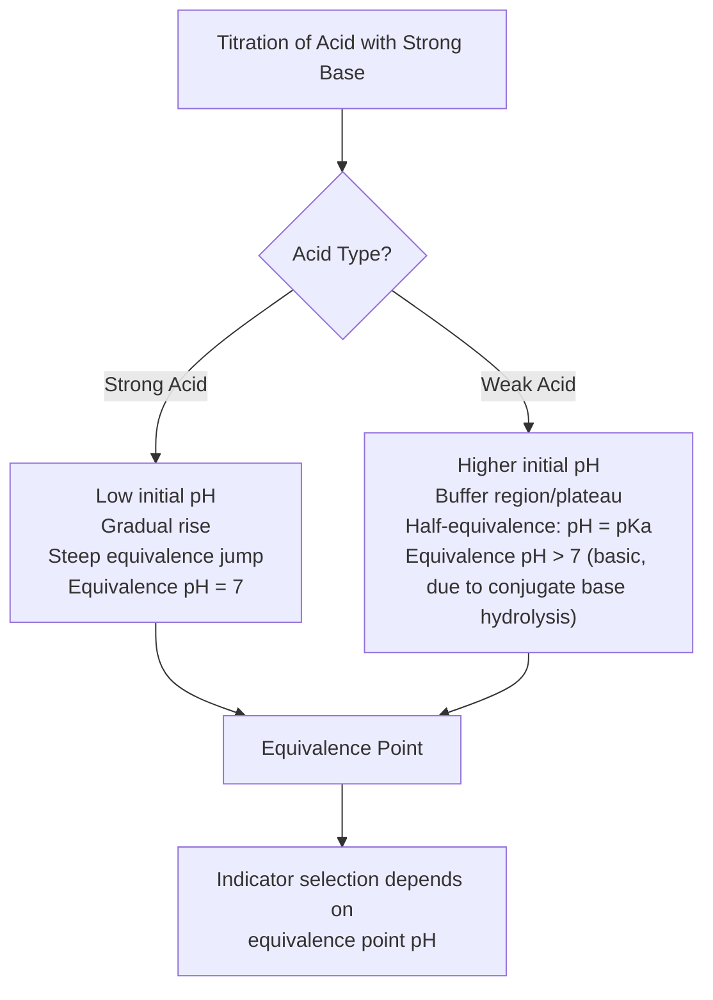

## Strong and Weak Acids and Bases

### Definitions and Foundational Theories

#### Arrhenius Theory

An **Arrhenius acid** is a substance that increases the concentration of H⁺ (or H₃O⁺) ions in aqueous solution. An **Arrhenius base** increases the concentration of OH⁻ ions in aqueous solution. This theory is limited to aqueous systems and cannot explain the basicity of substances lacking OH⁻ groups (e.g., NH₃).

#### Brønsted-Lowry Theory

A **Brønsted-Lowry acid** is a proton (H⁺) donor. A **Brønsted-Lowry base** is a proton acceptor. This framework introduces the concept of **conjugate acid-base pairs**: when an acid HA donates a proton, it forms its conjugate base A⁻; when a base B accepts a proton, it forms its conjugate acid BH⁺.

$$HA + B \rightleftharpoons A^- + BH^+$$

This theory extends beyond aqueous solutions and is the standard framework used for classifying acid/base strength.

#### Lewis Theory

A **Lewis acid** is an electron-pair acceptor; a **Lewis base** is an electron-pair donor. This is the broadest classification, encompassing species without transferable protons (e.g., BF₃ as a Lewis acid).

### Strong Acids and Bases

#### Characteristics

A **strong acid** or **strong base** undergoes complete (100%) ionization/dissociation in aqueous solution. The equilibrium lies essentially entirely to the right, so a single-headed arrow is used to represent the reaction:

$$HA \rightarrow H^+ + A^-$$

Because dissociation is complete, the equilibrium constant ($K_a$) is not typically tabulated for strong acids—it is treated as very large (often reported as $K_a \gg 1$ or effectively infinite in dilute solution).

#### Common Strong Acids

| Acid | Formula | Notes |
| --- | --- | --- |
| Hydrochloric acid | HCl | Monoprotic |
| Hydrobromic acid | HBr | Monoprotic |
| Hydroiodic acid | HI | Monoprotic |
| Nitric acid | HNO₃ | Monoprotic |
| Sulfuric acid | H₂SO₄ | Diprotic (first ionization is strong; second is weak, $K_{a2} \approx 1.2 \times 10^{-2}$) |
| Perchloric acid | HClO₄ | Monoprotic |
| Chloric acid | HClO₃ | Monoprotic |

#### Common Strong Bases

Strong bases are typically the hydroxides of Group 1 (alkali) metals and heavier Group 2 (alkaline earth) metals:

- LiOH, NaOH, KOH, RbOH, CsOH
- Ca(OH)₂, Sr(OH)₂, Ba(OH)₂ (limited by solubility, but what dissolves fully dissociates)

**Key Points**

- Strong acid/base strength refers to the *degree of ionization*, not concentration. A dilute solution of a strong acid is still classified as "strong" because whatever amount dissolves, ionizes completely.
- Concentration (molarity) and strength (extent of ionization) are independent properties.

#### pH Calculation for Strong Acids/Bases

Because dissociation is complete, $[H^+]$ equals the initial acid concentration (for monoprotic acids), and $[OH^-]$ equals the initial base concentration (for monohydroxide bases).

$$[H^+] = C_{acid} \quad \Rightarrow \quad pH = -\log[H^+]$$

$$[OH^-] = C_{base} \quad \Rightarrow \quad pOH = -\log[OH^-], \quad pH = 14 - pOH \text{ (at 25°C)}$$

**Example**

Calculate the pH of 0.010 M HCl.

Since HCl is a strong acid, $[H^+] = 0.010$ M.

$$pH = -\log(0.010) = 2.00$$

**Example**

Calculate the pH of 0.0025 M Ca(OH)₂.

Ca(OH)₂ releases 2 mol OH⁻ per mole of compound:

$$[OH^-] = 2 \times 0.0025 = 0.0050 \text{ M}$$

$$pOH = -\log(0.0050) = 2.30$$

$$pH = 14.00 - 2.30 = 11.70$$

### Weak Acids and Bases

#### Characteristics

A **weak acid** or **weak base** only partially ionizes in aqueous solution, establishing a true equilibrium between the undissociated species and its ions. This is represented with a double-headed equilibrium arrow:

$$HA \rightleftharpoons H^+ + A^-$$

The extent of ionization is quantified by the **acid dissociation constant ($K_a$)** or **base dissociation constant ($K_b$)**.

$$K_a = \frac{[H^+][A^-]}{[HA]}$$

$$K_b = \frac{[BH^+][OH^-]}{[B]}$$

Smaller $K_a$/$K_b$ values indicate weaker acids/bases (less ionization at equilibrium).

#### Common Weak Acids

| Acid | Formula | $K_a$ (approx., 25°C) |
| --- | --- | --- |
| Acetic acid | CH₃COOH | $1.8 \times 10^{-5}$ |
| Formic acid | HCOOH | $1.8 \times 10^{-4}$ |
| Hydrofluoric acid | HF | $6.6 \times 10^{-4}$ |
| Carbonic acid (1st) | H₂CO₃ | $4.3 \times 10^{-7}$ |
| Hypochlorous acid | HOCl | $3.0 \times 10^{-8}$ |
| Hydrocyanic acid | HCN | $6.2 \times 10^{-10}$ |

#### Common Weak Bases

| Base | Formula | $K_b$ (approx., 25°C) |
| --- | --- | --- |
| Ammonia | NH₃ | $1.8 \times 10^{-5}$ |
| Methylamine | CH₃NH₂ | $4.4 \times 10^{-4}$ |
| Pyridine | C₅H₅N | $1.7 \times 10^{-9}$ |
| Aniline | C₆H₅NH₂ | $4.3 \times 10^{-10}$ |

#### Percent Ionization

Percent ionization measures the fraction of weak acid/base molecules that dissociate, and—unlike $K_a$—it depends on concentration:

$$\% \text{ ionization} = \frac{[H^+]_{eq}}{[HA]_0} \times 100\%$$

As a weak acid solution becomes more dilute, percent ionization increases, even though $K_a$ remains constant (a consequence of Le Chatelier's principle applied to the equilibrium shifting toward more dissociated species as total concentration decreases).

#### pH Calculation for Weak Acids (ICE Table Method)

**Example**

Calculate the pH of 0.10 M acetic acid ($K_a = 1.8 \times 10^{-5}$).

|  | CH₃COOH | H⁺ | CH₃COO⁻ |
| --- | --- | --- | --- |
| Initial | 0.10 | 0 | 0 |
| Change | $-x$ | $+x$ | $+x$ |
| Equilibrium | $0.10-x$ | $x$ | $x$ |

$$K_a = \frac{x^2}{0.10 - x} \approx \frac{x^2}{0.10} = 1.8 \times 10^{-5}$$

(The approximation $0.10 - x \approx 0.10$ is valid when $K_a$ is small relative to the initial concentration, typically when $C_0/K_a > 500$; this should be verified after solving.)

$$x^2 = 1.8 \times 10^{-6} \quad \Rightarrow \quad x = 1.34 \times 10^{-3} \text{ M}$$

$$pH = -\log(1.34 \times 10^{-3}) = 2.87$$

Verification of approximation: $x/C_0 = 1.34\times10^{-3}/0.10 = 1.3\%$, well within the 5% validity threshold.

### Conjugate Acid-Base Pair Strength Relationship

There is an inverse relationship between the strength of an acid/base and its conjugate:

- **Strong acid → negligibly basic conjugate base.** The conjugate base of a strong acid (e.g., Cl⁻ from HCl) is so weak it does not measurably react with water.
- **Weak acid → weak conjugate base.** The conjugate base of a weak acid (e.g., CH₃COO⁻ from CH₃COOH) is a measurably weak base that can hydrolyze water.

This relationship is quantified for a conjugate pair at 25°C by:

$$K_a \times K_b = K_w = 1.0 \times 10^{-14}$$

**Example**

Given $K_a$(CH₃COOH) $= 1.8 \times 10^{-5}$, find $K_b$ of its conjugate base, acetate (CH₃COO⁻).

$$K_b = \frac{K_w}{K_a} = \frac{1.0 \times 10^{-14}}{1.8 \times 10^{-5}} = 5.6 \times 10^{-10}$$

### Polyprotic Acids

Polyprotic acids donate more than one proton, with each successive ionization step having a progressively smaller dissociation constant ($K_{a1} > K_{a2} > K_{a3}$), because it becomes increasingly difficult to remove a positively-charged proton from an increasingly negatively-charged species.

$$H_3PO_4 \rightleftharpoons H^+ + H_2PO_4^- \quad K_{a1} = 7.5 \times 10^{-3}$$

$$H_2PO_4^- \rightleftharpoons H^+ + HPO_4^{2-} \quad K_{a2} = 6.2 \times 10^{-8}$$

$$HPO_4^{2-} \rightleftharpoons H^+ + PO_4^{3-} \quad K_{a3} = 4.2 \times 10^{-13}$$

In most calculations, only the first ionization step is treated as significant for determining pH, since $K_{a1} \gg K_{a2} \gg K_{a3}$.

### Factors Affecting Acid/Base Strength

#### Bond Polarity and Bond Strength (Binary Acids, HX)

For binary acids within the same period, acid strength increases with increasing electronegativity of X (greater bond polarity facilitates H⁺ release). Within the same group, acid strength increases down the group as bond length increases and H–X bond strength decreases, making the proton easier to remove (this factor dominates over electronegativity for halogen acids): HF < HCl < HBr < HI.

#### Stability of the Conjugate Base

Any factor that stabilizes the negative charge on the conjugate base A⁻ shifts equilibrium toward increased ionization, increasing acid strength:

- **Electronegativity**: More electronegative atoms bearing the negative charge stabilize it better.
- **Resonance delocalization**: Acids whose conjugate bases can delocalize charge via resonance (e.g., carboxylic acids, where the negative charge is shared between two oxygens) are stronger than those without resonance stabilization (e.g., alcohols).
- **Inductive effects**: Electron-withdrawing groups (e.g., halogens) near the acidic proton stabilize the conjugate base inductively, increasing acidity (e.g., trichloroacetic acid is far stronger than acetic acid).
- **Oxidation state/oxygen count (oxoacids)**: For oxoacids of the form $HOXO_n$, acid strength increases with the number of additional oxygen atoms bonded to the central atom X, since these oxygens withdraw electron density inductively and stabilize the resulting anion: HClO < HClO₂ < HClO₃ < HClO₄.

### Structural Comparison Diagram

<svg viewBox="0 0 700 420" xmlns="http://www.w3.org/2000/svg" font-family="Arial, sans-serif">
<text x="350" y="30" text-anchor="middle" font-size="18" font-weight="bold" fill="#1a1a1a">Strong vs. Weak Acid Ionization (svg_diagram)</text>
<!-- Strong acid box -->
<rect x="40" y="60" width="280" height="150" rx="8" fill="#fdecea" stroke="#c0392b" stroke-width="2"/>
<text x="180" y="85" text-anchor="middle" font-size="14" font-weight="bold" fill="#c0392b">Strong Acid (HCl)</text>
<text x="180" y="115" text-anchor="middle" font-size="13" fill="#1a1a1a">HCl → H⁺ + Cl⁻</text>
<text x="180" y="140" text-anchor="middle" font-size="12" fill="#333">Complete dissociation</text>
<text x="180" y="160" text-anchor="middle" font-size="12" fill="#333">[HCl] ≈ 0 at equilibrium</text>
<text x="180" y="185" text-anchor="middle" font-size="12" font-style="italic" fill="#555">Single-headed arrow</text>
<!-- Weak acid box -->
<rect x="380" y="60" width="280" height="150" rx="8" fill="#eaf2fd" stroke="#2874a6" stroke-width="2"/>
<text x="520" y="85" text-anchor="middle" font-size="14" font-weight="bold" fill="#2874a6">Weak Acid (CH₃COOH)</text>
<text x="520" y="115" text-anchor="middle" font-size="13" fill="#1a1a1a">CH₃COOH ⇌ H⁺ + CH₃COO⁻</text>
<text x="520" y="140" text-anchor="middle" font-size="12" fill="#333">Partial dissociation</text>
<text x="520" y="160" text-anchor="middle" font-size="12" fill="#333">Equilibrium mixture persists</text>
<text x="520" y="185" text-anchor="middle" font-size="12" font-style="italic" fill="#555">Double-headed arrow, governed by Ka</text>
<!-- Particle representation strong -->
<circle cx="90" cy="250" r="8" fill="#c0392b"/>
<circle cx="120" cy="250" r="8" fill="#27ae60"/>
<circle cx="150" cy="250" r="8" fill="#c0392b"/>
<circle cx="180" cy="250" r="8" fill="#27ae60"/>
<circle cx="210" cy="250" r="8" fill="#c0392b"/>
<circle cx="240" cy="250" r="8" fill="#27ae60"/>
<circle cx="270" cy="250" r="8" fill="#c0392b"/>
<circle cx="300" cy="250" r="8" fill="#27ae60"/>
<text x="180" y="280" text-anchor="middle" font-size="11" fill="#333">All molecules ionized (100%)</text>
<!-- Particle representation weak -->
<rect x="480" y="242" width="16" height="16" fill="#7f8c8d"/>
<circle cx="430" cy="250" r="8" fill="#2874a6"/>
<circle cx="455" cy="250" r="8" fill="#f39c12"/>
<rect x="520" y="242" width="16" height="16" fill="#7f8c8d"/>
<rect x="560" y="242" width="16" height="16" fill="#7f8c8d"/>
<circle cx="610" cy="250" r="8" fill="#2874a6"/>
<circle cx="635" cy="250" r="8" fill="#f39c12"/>
<rect x="440" y="242" width="16" height="16" fill="#7f8c8d" opacity="0"/>
<text x="520" y="280" text-anchor="middle" font-size="11" fill="#333">Mostly undissociated (gray), few ions</text>
<!-- Legend -->
<circle cx="60" cy="330" r="6" fill="#c0392b"/>
<text x="75" y="334" font-size="11" fill="#333">Cation (H⁺)</text>
<circle cx="180" cy="330" r="6" fill="#27ae60"/>
<text x="195" y="334" font-size="11" fill="#333">Anion</text>
<rect x="290" y="324" width="12" height="12" fill="#7f8c8d"/>
<text x="310" y="334" font-size="11" fill="#333">Undissociated molecule</text>

<text x="350" y="390" text-anchor="middle" font-size="12" fill="#555">Ka(strong) ≫ 1 Ka(weak) < 1 (varies by acid)</text>

</svg>

### Titration Curve Behavior (Distinguishing Feature)

Strong and weak acids/bases produce distinctly different titration curve shapes when titrated with a strong base/acid, which is a key experimental method for distinguishing them.

**Key Points**

- **Weak acid titration curves** show a **buffer region** where pH changes slowly as the conjugate base accumulates—absent in strong acid titrations.
- At the **half-equivalence point** of a weak acid titration, $pH = pK_a$ (from the Henderson-Hasselbalch equation), providing an experimental method to determine $K_a$.
- The **equivalence point pH** for a strong acid/strong base titration is 7 (neutral); for a weak acid/strong base titration, it is greater than 7 because the resulting conjugate base hydrolyzes water.

### Henderson-Hasselbalch Equation (Buffer Systems)

Weak acids and their conjugate bases form the basis of **buffer solutions**, described by:

$$pH = pK_a + \log\left(\frac{[A^-]}{[HA]}\right)$$

This equation is derived from the $K_a$ expression and is valid when $[A^-]$ and $[HA]$ are both present in significant, comparable quantities (typically within a factor of 10 of each other, i.e., buffer capacity range $pH = pK_a \pm 1$).

**Example**

A buffer contains 0.30 M CH₃COOH and 0.20 M CH₃COONa. Find the pH ($K_a = 1.8 \times 10^{-5}$, $pK_a = 4.74$).

$$pH = 4.74 + \log\left(\frac{0.20}{0.30}\right) = 4.74 + (-0.18) = 4.56$$

### Common Pitfalls and Misconceptions

- **Strength ≠ concentration.** A "strong" acid at very low concentration can have a higher pH (less acidic) than a "weak" acid at high concentration. Strength refers strictly to the fraction of molecules ionized.
- **Sulfuric acid is not uniformly strong.** Only the first proton dissociates completely; the second ionization ($HSO_4^- \rightleftharpoons H^+ + SO_4^{2-}$) behaves as a weak acid equilibrium ($K_{a2} \approx 1.2 \times 10^{-2}$) and must be accounted for separately in precise calculations.
- **The 5% approximation rule** [Inference — this is a standard pedagogical heuristic, not a rigorous physical law]: the simplifying assumption $C_0 - x \approx C_0$ in ICE table calculations should only be applied when the resulting $x$ is less than 5% of $C_0$; otherwise, the quadratic formula must be used to solve the $K_a$ expression exactly.
- **Neutral salts of strong acid/strong base pairs** (e.g., NaCl) do not affect solution pH, since neither Na⁺ nor Cl⁻ undergoes significant hydrolysis.

### Real-World and Laboratory Relevance

- **Buffer systems** derived from weak acid/base equilibria are essential in biological systems (e.g., the bicarbonate buffer system maintaining blood pH near 7.4) and in laboratory/industrial pH control.
- **Indicator selection** in titrations depends on matching the indicator's color-change pH range to the equivalence point pH, which differs for strong vs. weak acid/base titrations.
- **Safety handling**: strong acids/bases require greater handling caution due to their complete ionization producing high concentrations of reactive H⁺/OH⁻ even at moderate molarity, though concentrated weak acids can also pose significant hazards (behavior in specific industrial or lab safety protocols may vary by institution) [Unverified — specific safety protocol thresholds vary by institution and are outside standard chemistry curricula].

**Related Topics**

- pH, pOH, and the ion product of water ($K_w$)
- Buffer solutions and buffer capacity
- Acid-base titration curves and indicator selection
- Hydrolysis of salts (acidic, basic, and neutral salts)
- Polyprotic acid equilibria and speciation diagrams
- Lewis acid-base theory and its applications in organic/inorganic chemistry
- Common-ion effect
- Henderson-Hasselbalch equation and buffer design