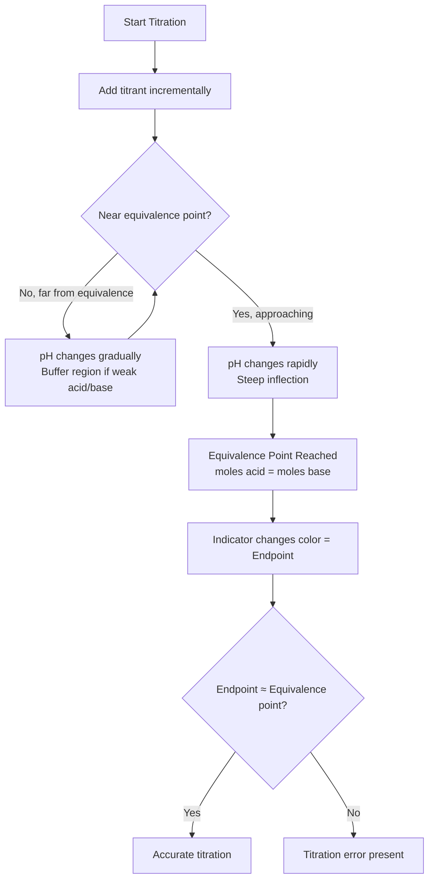
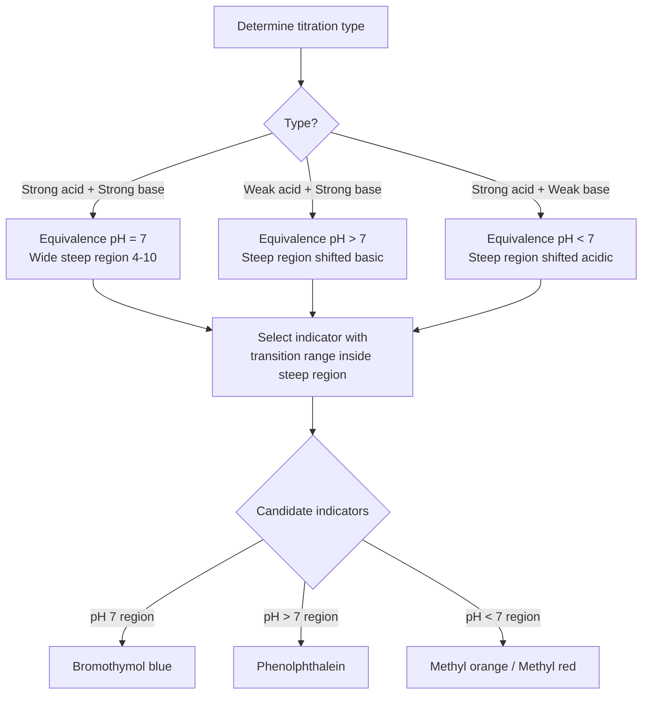

## Acid Base Titrations and Indicators

### Overview and Purpose

**Acid-base titration** is a volumetric analytical technique used to determine the unknown concentration of an acid or base by reacting it with a solution of known concentration (the **titrant**) until the reaction reaches **stoichiometric completion**. The technique relies on a neutralization reaction and precise measurement of the volume of titrant delivered via a **burette**.

**Key Points**

- The solution of unknown concentration is the **analyte**; the solution of known, precisely determined concentration is the **standard solution** or **titrant**.
- The point at which moles of acid exactly equal moles of base (stoichiometrically) is the **equivalence point**.
- The point at which a visual signal (indicator color change) occurs is the **endpoint**—ideally as close as possible to the equivalence point, though a small **titration error** is inherent to the method.

### Core Terminology

| Term | Definition |
| --- | --- |
| Titrant | Solution of known concentration added from the burette |
| Analyte | Solution of unknown concentration being analyzed |
| Standardization | Process of determining the exact concentration of a titrant using a primary standard |
| Primary standard | A highly pure, stable, non-hygroscopic compound of known molar mass used to standardize titrants (e.g., potassium hydrogen phthalate, KHP) |
| Equivalence point | Point at which stoichiometrically equivalent quantities of acid and base have reacted |
| Endpoint | Point at which the indicator visibly changes color |
| Titration error | Difference between endpoint and equivalence point volumes |

### Types of Acid-Base Titrations

#### Strong Acid–Strong Base

Example: HCl titrated with NaOH.

$$HCl + NaOH \rightarrow NaCl + H_2O$$

The resulting salt (NaCl) does not hydrolyze, so the equivalence point pH is exactly **7.00** at 25°C.

#### Weak Acid–Strong Base

Example: CH₃COOH titrated with NaOH.

$$CH_3COOH + NaOH \rightarrow CH_3COONa + H_2O$$

The conjugate base (CH₃COO⁻) hydrolyzes water, making the equivalence point pH **greater than 7** (basic).

#### Strong Acid–Weak Base

Example: HCl titrated with NH₃.

$$HCl + NH_3 \rightarrow NH_4Cl$$

The conjugate acid (NH₄⁺) hydrolyzes water, making the equivalence point pH **less than 7** (acidic).

#### Weak Acid–Weak Base

Both product ions hydrolyze; the equivalence point pH depends on the relative magnitudes of $K_a$ and $K_b$ of the conjugate species. These titrations produce a very gradual, poorly defined equivalence point and are **generally avoided in practical quantitative titrations** because no sharp inflection exists for reliable endpoint detection.

### Titration Curve Anatomy

A titration curve plots pH (y-axis) against volume of titrant added (x-axis). It is divided into distinct regions:

1. **Initial pH**: pH of the analyte before any titrant is added.
2. **Gradual rise/buffer region** (weak acid/base only): For weak acid–strong base titrations, this region between the start and near the equivalence point shows a slowly changing pH because the solution acts as a buffer (mixture of weak acid and its conjugate base).
3. **Half-equivalence point**: The volume at which exactly half the analyte has reacted. Here, $[HA] = [A^-]$, so via the Henderson-Hasselbalch equation:

   $$pH = pK_a$$

   This is a standard method for experimentally determining $pK_a$ from a titration curve.
4. **Equivalence point**: The steepest region of the curve (point of inflection), where the rate of pH change per unit volume is maximal.
5. **Post-equivalence region**: pH changes governed by excess titrant.

### Titration Curve Diagrams (Comparative)

<svg xmlns="http://www.w3.org/2000/svg" viewBox="0 0 720 480" font-family="Arial, sans-serif">
<text x="360" y="28" text-anchor="middle" font-size="17" font-weight="bold" fill="#1a1a1a">Titration Curve Shapes by Acid/Base Type (svg_diagram)</text>

<g transform="translate(40,50)">
<text x="150" y="0" text-anchor="middle" font-size="13" font-weight="bold" fill="#c0392b">Strong Acid + Strong Base</text>
<line x1="20" y1="180" x2="300" y2="180" stroke="#333" stroke-width="1.5" />
<line x1="20" y1="20" x2="20" y2="180" stroke="#333" stroke-width="1.5" />
<text x="160" y="205" text-anchor="middle" font-size="11" fill="#333">Volume NaOH added</text>
<text x="-10" y="100" text-anchor="middle" font-size="11" fill="#333" transform="rotate(-90,-10,100)">pH</text>
<path d="M 20,160 Q 100,150 150,90 Q 180,40 300,25" stroke="#c0392b" stroke-width="2.5" fill="none" />
<line x1="150" y1="20" x2="150" y2="180" stroke="#888" stroke-width="1" stroke-dasharray="4,3" />
<text x="150" y="195" text-anchor="middle" font-size="10" fill="#555">Veq</text>
<circle cx="150" cy="90" r="4" fill="#c0392b" />
<text x="150" y="75" text-anchor="middle" font-size="10" fill="#555">pH = 7</text>
</g>

<g transform="translate(400,50)">
<text x="150" y="0" text-anchor="middle" font-size="13" font-weight="bold" fill="#2874a6">Weak Acid + Strong Base</text>
<line x1="20" y1="180" x2="300" y2="180" stroke="#333" stroke-width="1.5" />
<line x1="20" y1="20" x2="20" y2="180" stroke="#333" stroke-width="1.5" />
<text x="160" y="205" text-anchor="middle" font-size="11" fill="#333">Volume NaOH added</text>
<text x="-10" y="100" text-anchor="middle" font-size="11" fill="#333" transform="rotate(-90,-10,100)">pH</text>
<path d="M 20,140 Q 60,120 100,105 Q 140,95 150,75 Q 165,45 190,30 Q 230,20 300,15" stroke="#2874a6" stroke-width="2.5" fill="none" />
<line x1="150" y1="20" x2="150" y2="180" stroke="#888" stroke-width="1" stroke-dasharray="4,3" />
<text x="150" y="195" text-anchor="middle" font-size="10" fill="#555">Veq</text>
<circle cx="75" cy="112" r="4" fill="#2874a6" />
<text x="75" y="130" text-anchor="middle" font-size="9" fill="#555">pH=pKa</text>
<circle cx="150" cy="75" r="4" fill="#2874a6" />
<text x="180" y="70" text-anchor="middle" font-size="10" fill="#555">pH &gt; 7</text>
</g>

<text x="40" y="290" font-size="12" fill="#333">Strong-strong: symmetric S-curve, sharp inflection, equivalence pH = 7</text>

<text x="40" y="315" font-size="12" fill="#333">Weak-strong: initial buffer region (gradual slope), less steep inflection, equivalence pH &gt; 7</text>

<text x="40" y="340" font-size="12" fill="#333">Half-equivalence point on weak acid curve: pH = pKa (Henderson-Hasselbalch)</text>

<text x="40" y="370" font-size="12" fill="#333" font-style="italic">Weak-weak titrations (not shown) lack a sharp inflection and are unsuitable for indicator endpoint detection.</text>

</svg>

### Acid-Base Indicators

#### Mechanism

An **acid-base indicator** is typically a weak organic acid (HIn) or weak organic base whose protonated and deprotonated forms have distinctly different colors:

$$HIn \rightleftharpoons H^+ + In^-$$

$$\text{(color A)} \qquad \qquad \text{(color B)}$$

The indicator's own equilibrium is governed by its **indicator constant** ($K_{In}$), analogous to $K_a$:

$$K_{In} = \frac{[H^+][In^-]}{[HIn]}$$

#### Color Change Range

The human eye typically perceives a distinct color change when the ratio $[In^-]/[HIn]$ shifts from approximately 1:10 to 10:1. Applying this to the $K_{In}$ expression yields the general rule for the indicator's usable **transition range**:

$$pH_{transition} \approx pK_{In} \pm 1$$

#### Common Indicators

| Indicator | pH Transition Range | Acid Color | Base Color |
| --- | --- | --- | --- |
| Methyl violet | 0.0 – 1.6 | Yellow | Blue-violet |
| Thymol blue (acid range) | 1.2 – 2.8 | Red | Yellow |
| Methyl orange | 3.1 – 4.4 | Red | Yellow |
| Bromocresol green | 3.8 – 5.4 | Yellow | Blue |
| Methyl red | 4.4 – 6.2 | Red | Yellow |
| Litmus | 4.5 – 8.3 | Red | Blue |
| Bromothymol blue | 6.0 – 7.6 | Yellow | Blue |
| Phenol red | 6.8 – 8.4 | Yellow | Red |
| Phenolphthalein | 8.3 – 10.0 | Colorless | Pink |
| Thymolphthalein | 9.3 – 10.5 | Colorless | Blue |
| Alizarin yellow | 10.1 – 12.0 | Yellow | Orange-red |

**Key Points**

- Indicators do not change color at a single discrete pH; they change gradually across their transition range.
- The choice of indicator does not need to match the equivalence point pH exactly—it must have a transition range that falls within the **steep vertical region** of the titration curve, where a very small volume of titrant produces a large pH change.

### Indicator Selection Strategy

**Example**

Select an appropriate indicator for the titration of 0.10 M CH₃COOH with 0.10 M NaOH, given the equivalence point pH is calculated to be approximately 8.7.

Phenolphthalein (transition range 8.3–10.0) is appropriate, since its range brackets the calculated equivalence point pH and falls within the steep portion of the curve. Methyl orange (range 3.1–4.4) would be unsuitable, as it would change color far too early—well before the equivalence point—introducing significant titration error.

### Calculations in Titration

#### Basic Stoichiometric Relationship (Monoprotic Acids/Bases)

$$M_{acid} \times V_{acid} = M_{base} \times V_{base}$$

#### Generalized Relationship (Accounting for Stoichiometric Ratio)

$$n_{acid} \times M_{acid} \times V_{acid} = n_{base} \times M_{base} \times V_{base}$$

where $n$ represents the number of acidic/basic equivalents per formula unit (e.g., $n=2$ for H₂SO₄ or Ca(OH)₂).

**Example**

25.00 mL of an HCl solution of unknown concentration is titrated with 0.1024 M NaOH, requiring 22.46 mL to reach the phenolphthalein endpoint. Calculate the HCl concentration.

$$M_{HCl} \times V_{HCl} = M_{NaOH} \times V_{NaOH}$$

$$M_{HCl} \times 25.00 \text{ mL} = 0.1024 \text{ M} \times 22.46 \text{ mL}$$

$$M_{HCl} = \frac{0.1024 \times 22.46}{25.00} = 0.09199 \text{ M}$$

**Example**

15.00 mL of H₂SO₄ requires 31.20 mL of 0.0850 M NaOH to reach the equivalence point. Calculate the H₂SO₄ concentration.

$$2 \times M_{H_2SO_4} \times V_{H_2SO_4} = 1 \times M_{NaOH} \times V_{NaOH}$$

$$M_{H_2SO_4} = \frac{0.0850 \times 31.20}{2 \times 15.00} = 0.08840 \text{ M}$$

### Buffer Region and Buffer Capacity in Titrations

The flattened region on a weak acid–strong base titration curve prior to the equivalence point arises because the solution resists pH change—this is the defining characteristic of a **buffer**. The **buffer capacity** is maximal precisely at the half-equivalence point (where $[HA] = [A^-]$) and diminishes as the solution approaches the equivalence point, where the buffering species (HA) is nearly depleted, causing the sharp pH spike.

### Polyprotic Acid Titrations

Titrating a polyprotic acid (e.g., H₃PO₄) with a strong base produces **multiple equivalence points**, one for each ionizable proton, provided the successive $K_a$ values differ sufficiently (typically by a factor of $10^3$ or more) to produce distinguishable inflections.

$$H_3PO_4 \xrightarrow{OH^-} H_2PO_4^- \xrightarrow{OH^-} HPO_4^{2-} \xrightarrow{OH^-} PO_4^{3-}$$

Each equivalence point requires a different indicator (or, more precisely, pH monitoring via a pH meter) since each occurs at a different pH.

### Alternative Detection Methods

#### pH Meter (Potentiometric Titration)

A calibrated glass electrode pH meter provides continuous, precise pH readings throughout the titration, allowing the full titration curve to be plotted and the equivalence point identified mathematically (e.g., via the first or second derivative of the curve, where the maximum slope or the zero-crossing of the second derivative marks the equivalence point). This method is more precise than visual indicators and is essential for titrations lacking a sharp color-change indicator (e.g., very dilute solutions, weak-weak titrations, or colored/turbid analytes).

#### Conductometric Titration

Monitors changes in solution conductivity, useful when color indicators are impractical (e.g., colored solutions) [Inference — a standard alternative technique noted in analytical chemistry references, applicability may vary depending on the specific ionic species involved].

### Sources of Titration Error

- **Parallax error** in reading burette volumes.
- **Overshooting the endpoint** due to adding titrant too quickly.
- **Indicator selection mismatch**, where the transition range does not align with the steep region of the curve.
- **CO₂ absorption** by basic titrants (e.g., NaOH solutions absorbing atmospheric CO₂, forming Na₂CO₃ and altering effective concentration over time) — standardization should be performed close to the time of use.
- **Improper burette rinsing/calibration**, introducing systematic volume errors.

**Related Topics**

- pH, pOH, and the ion product of water ($K_w$)
- Henderson-Hasselbalch equation and buffer solutions
- Polyprotic acid equilibria and stepwise dissociation
- Standardization and primary standards in analytical chemistry
- Potentiometric and conductometric titration techniques
- Gran plot and derivative methods for equivalence point determination
- Salt hydrolysis and its effect on equivalence point pH