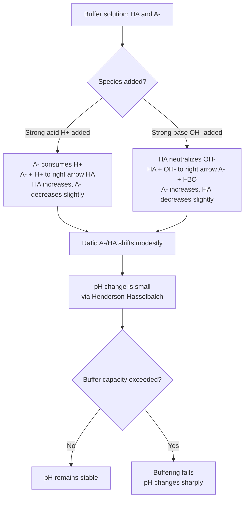

## Buffers and Buffer Capacity

### Definition and Purpose

A **buffer solution** is a solution that resists significant changes in pH upon the addition of small to moderate amounts of a strong acid, strong base, or upon dilution. Buffers are composed of a **weak acid and its conjugate base** (an acidic buffer) or a **weak base and its conjugate acid** (a basic buffer), present together in comparable, significant concentrations.

**Key Points**

- A pure weak acid alone does *not* function as an effective buffer—it must be paired with a significant concentration of its conjugate base (commonly supplied as a soluble salt).
- Buffering action arises because the solution contains both a species capable of neutralizing added base (the weak acid, HA) and a species capable of neutralizing added acid (the conjugate base, A⁻).

### Composition of Buffer Systems

#### Acidic Buffers

Formed from a weak acid and a salt of its conjugate base.

$$CH_3COOH \text{ (weak acid)} + CH_3COONa \text{ (conjugate base salt)}$$

#### Basic Buffers

Formed from a weak base and a salt of its conjugate acid.

$$NH_3 \text{ (weak base)} + NH_4Cl \text{ (conjugate acid salt)}$$

### Buffer Action Mechanism

When a small amount of strong acid (H⁺) is added to a buffer, the conjugate base component consumes it:

$$A^- + H^+ \rightarrow HA$$

When a small amount of strong base (OH⁻) is added, the weak acid component neutralizes it:

$$HA + OH^- \rightarrow A^- + H_2O$$

In both cases, the strong acid/base is converted into a weak acid/base equivalent (or water), which produces only a minor, moderated shift in the $[A^-]/[HA]$ ratio rather than a drastic pH change.



### Henderson-Hasselbalch Equation

The governing equation for calculating buffer pH is derived from the $K_a$ expression of the weak acid component:

$$K_a = \frac{[H^+][A^-]}{[HA]}$$

Taking the negative logarithm of both sides and rearranging:

$$pH = pK_a + \log\left(\frac{[A^-]}{[HA]}\right)$$

For basic buffers, the analogous form uses $pK_b$ and the ratio of conjugate acid to base, or it can be converted to the $pK_a$ of the conjugate acid using $pK_a + pK_b = pK_w = 14.00$ (at 25°C).

**Key Points**

- When $[A^-] = [HA]$, the log term equals zero, and $pH = pK_a$ exactly. This is the point of **maximum buffer capacity**.
- The Henderson-Hasselbalch equation is an approximation valid only when the initial concentrations of HA and A⁻ are large relative to $x$ (the amount that ionizes), i.e., when the simple ratio of *initial* concentrations can substitute for *equilibrium* concentrations without significant error.

**Example**

Calculate the pH of a buffer prepared from 0.25 M NH₃ and 0.15 M NH₄Cl. ($K_b$ for NH₃ $= 1.8 \times 10^{-5}$)

First, find $pK_a$ of the conjugate acid NH₄⁺:

$$K_a = \frac{K_w}{K_b} = \frac{1.0 \times 10^{-14}}{1.8 \times 10^{-5}} = 5.6 \times 10^{-10}$$


$$pK_a = -\log(5.6 \times 10^{-10}) = 9.25$$

Applying Henderson-Hasselbalch (using [base]/[conjugate acid] since NH₃ is the base form):

$$pH = 9.25 + \log\left(\frac{0.25}{0.15}\right) = 9.25 + 0.22 = 9.47$$

### Buffer Preparation Methods

#### Method 1: Mixing a Weak Acid with Its Salt

Directly combining calculated amounts of the weak acid and the conjugate base salt in solution.

#### Method 2: Partial Neutralization

Adding a calculated, insufficient (sub-stoichiometric) amount of strong base to a weak acid (or strong acid to a weak base), converting only a fraction of the weak acid into its conjugate base in situ.

**Example**

Determine the volume of 1.00 M NaOH needed to add to 500 mL of 0.20 M CH₃COOH to prepare a buffer with pH = 5.00. ($K_a = 1.8 \times 10^{-5}$, $pK_a = 4.74$)

$$5.00 = 4.74 + \log\left(\frac{[A^-]}{[HA]}\right)$$


$$\log\left(\frac{[A^-]}{[HA]}\right) = 0.26 \quad \Rightarrow \quad \frac{[A^-]}{[HA]} = 10^{0.26} = 1.82$$

Total moles CH₃COOH initially $= 0.500 \text{ L} \times 0.20 \text{ M} = 0.100$ mol.

Let $x$ = moles of NaOH added = moles of CH₃COO⁻ formed.

$$\frac{x}{0.100 - x} = 1.82 \quad \Rightarrow \quad x = 1.82(0.100 - x) \quad \Rightarrow \quad 2.82x = 0.182 \quad \Rightarrow \quad x = 0.0645 \text{ mol}$$


$$V_{NaOH} = \frac{0.0645 \text{ mol}}{1.00 \text{ M}} = 64.5 \text{ mL}$$

### Buffer Capacity

#### Definition

**Buffer capacity** ($\beta$) is a quantitative measure of a buffer's resistance to pH change—specifically, the amount of strong acid or strong base (in moles) required to change the pH of one liter of buffer solution by one unit. It is formally defined as:

$$\beta = \frac{dC_b}{d(pH)} = -\frac{dC_a}{d(pH)}$$

where $C_b$/$C_a$ represent moles of strong base/acid added per liter.

#### Factors Governing Buffer Capacity

1. **Absolute concentration of buffer components**: Higher concentrations of HA and A⁻ (at a fixed ratio) provide greater buffer capacity, since more moles of neutralizing species are available before depletion.
2. **Ratio of $[A^-]/[HA]$**: Buffer capacity is maximized when $[A^-] = [HA]$ (i.e., at $pH = pK_a$) and decreases as the ratio deviates from 1:1 in either direction.
3. **Proximity to $pK_a$**: A buffer is only considered effective within the range $pH = pK_a \pm 1$, corresponding to a $[A^-]/[HA]$ ratio between approximately 1:10 and 10:1. Outside this range, one component is present in insufficient quantity to absorb further additions effectively.

**Key Points**

- Buffer capacity is distinct from pH: two buffers can have identical pH (same $[A^-]/[HA]$ ratio) but vastly different capacities if their absolute concentrations differ (e.g., 1.0 M/1.0 M vs. 0.01 M/0.01 M acetate buffer, both at pH = $pK_a$, but the former withstands far more added acid/base).
- Dilution alone does not change a buffer's pH significantly (since the *ratio* $[A^-]/[HA]$ is largely preserved upon dilution), but it substantially decreases buffer capacity, since less absolute quantity of buffering species is present.

### Buffer Capacity Curve

<svg xmlns="http://www.w3.org/2000/svg" viewBox="0 0 680 420" font-family="Arial, sans-serif">
<text x="340" y="28" text-anchor="middle" font-size="17" font-weight="bold" fill="#1a1a1a">Buffer Capacity vs. pH (svg_diagram)</text>
<g transform="translate(60,60)">
<line x1="0" y1="280" x2="550" y2="280" stroke="#333" stroke-width="1.5" />
<line x1="0" y1="20" x2="0" y2="280" stroke="#333" stroke-width="1.5" />
<text x="275" y="310" text-anchor="middle" font-size="12" fill="#333">pH</text>
<text x="-30" y="150" text-anchor="middle" font-size="12" fill="#333" transform="rotate(-90,-30,150)">Buffer Capacity (β)</text>



```

<line x1="275" y1="20" x2="275" y2="280" stroke="#888" stroke-width="1" stroke-dasharray="4,3" />
<text x="275" y="300" text-anchor="middle" font-size="11" fill="#555">pKa</text>


<line x1="150" y1="260" x2="150" y2="280" stroke="#27ae60" stroke-width="1.5" />
<line x1="400" y1="260" x2="400" y2="280" stroke="#27ae60" stroke-width="1.5" />
<text x="150" y="300" text-anchor="middle" font-size="10" fill="#27ae60">pKa - 1</text>
<text x="400" y="300" text-anchor="middle" font-size="10" fill="#27ae60">pKa + 1</text>


<path d="M 30,270 C 120,270 180,60 275,50 C 370,60 430,270 520,270" stroke="#2874a6" stroke-width="2.5" fill="none" />


<rect x="150" y="20" width="250" height="260" fill="#2874a6" opacity="0.08" />
<text x="275" y="100" text-anchor="middle" font-size="11" fill="#2874a6" font-weight="bold">Effective buffering region</text>

<circle cx="275" cy="50" r="4" fill="#c0392b" />
<text x="275" y="40" text-anchor="middle" font-size="10" fill="#c0392b">Max capacity ([A-]=[HA])</text>
```

</g>
</svg>

### Quantitative Buffer Capacity After Strong Acid/Base Addition

**Example**

A buffer contains 0.20 mol CH₃COOH and 0.20 mol CH₃COONa in 1.00 L of solution ($pK_a = 4.74$). Calculate the pH after adding 0.05 mol of HCl (assume no volume change).

Initial: $pH = pK_a = 4.74$ (since ratio = 1).

Added HCl reacts with CH₃COO⁻:

$$CH_3COO^- + H^+ \rightarrow CH_3COOH$$

New moles: $CH_3COOH = 0.20 + 0.05 = 0.25$ mol; $CH_3COO^- = 0.20 - 0.05 = 0.15$ mol.

$$pH = 4.74 + \log\left(\frac{0.15}{0.25}\right) = 4.74 - 0.22 = 4.52$$

The pH shifted by only 0.22 units despite adding a substantial quantity of strong acid—demonstrating buffering action. Contrast this with adding the same 0.05 mol HCl to 1.00 L of pure water (unbuffered), which would produce $pH = -\log(0.05) = 1.30$, a change of nearly 6 pH units.

### Physiological and Real-World Buffer Systems

#### Bicarbonate Buffer System (Blood)

The primary buffer maintaining human blood pH near 7.4 is the carbonic acid/bicarbonate system:

$$H_2CO_3 \rightleftharpoons H^+ + HCO_3^-$$

This system is notable because it is an **open system**—$CO_2$ (which equilibrates with $H_2CO_3$) can be expelled via respiration, and $HCO_3^-$ is regulated renally, allowing physiological buffering capacity far exceeding what the Henderson-Hasselbalch equation alone would predict for a closed system [Inference — physiological buffering involves additional regulatory mechanisms beyond simple closed-system equilibrium chemistry, and specific capacity figures depend on the biological literature source].

#### Phosphate Buffer System

Relevant intracellularly and in some laboratory/biochemical applications:

$$H_2PO_4^- \rightleftharpoons H^+ + HPO_4^{2-} \quad (pK_{a2} \approx 7.2)$$

#### Laboratory and Industrial Buffers

Common laboratory buffers (e.g., Tris buffer, phosphate-buffered saline (PBS), citrate buffer) are selected based on the $pK_a$ of the buffering species matching the desired working pH range, which is essential in biochemistry, molecular biology, and pharmaceutical formulation to maintain stable reaction conditions.

### Common Pitfalls and Misconceptions

- **A buffer is not "pH-proof."** Buffer capacity is finite; once one component (HA or A⁻) is fully consumed, further additions of strong acid/base cause the pH to change sharply, just as in an unbuffered solution.
- **Buffer pH is (approximately) independent of dilution**, but buffer *capacity* is not—diluting a buffer 10-fold roughly preserves its pH (assuming the ratio is maintained and concentrations remain high enough for the approximation to hold) but reduces its capacity to resist further additions proportionally.
- **Choosing a buffer system**: The weak acid selected should have a $pK_a$ as close as possible to the desired target pH, not merely "a weak acid," to maximize buffer effectiveness at that pH.

**Related Topics**

- Henderson-Hasselbalch equation derivation and applications
- Acid-base titration curves and the buffer region
- Common-ion effect in weak acid/base equilibria
- Physiological pH regulation (bicarbonate and phosphate systems)
- Polyprotic acid buffer systems
- Buffer preparation techniques in analytical and biochemical laboratories