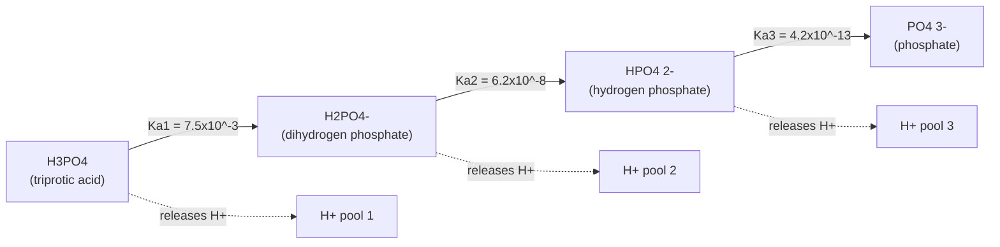
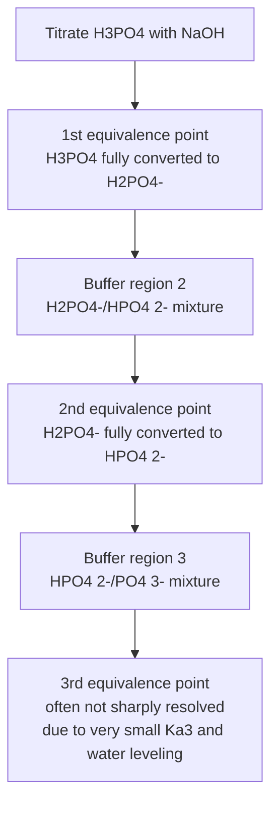

## Polyprotic Acids

### Definition and Classification

A **polyprotic acid** is an acid capable of donating more than one proton (H⁺) per molecule. Polyprotic acids are classified by the number of ionizable protons:

| Classification | Protons Donated | Examples |
| --- | --- | --- |
| Monoprotic | 1 | HCl, HNO₃, CH₃COOH |
| Diprotic | 2 | H₂SO₄, H₂CO₃, H₂S |
| Triprotic | 3 | H₃PO₄, H₃AsO₄, citric acid |

**Key Points**

- Polyprotic acids ionize in **sequential, stepwise stages**, not simultaneously—each proton is lost in a distinct equilibrium step.
- Each ionization step has its own equilibrium constant, denoted $K_{a1}, K_{a2}, K_{a3}$, etc.

### Stepwise Ionization Equilibria

For a generic diprotic acid $H_2A$:

$$H_2A \rightleftharpoons H^+ + HA^- \qquad K_{a1} = \frac{[H^+][HA^-]}{[H_2A]}$$


$$HA^- \rightleftharpoons H^+ + A^{2-} \qquad K_{a2} = \frac{[H^+][A^{2-}]}{[HA^-]}$$

For a triprotic acid such as H₃PO₄:

$$H_3PO_4 \rightleftharpoons H^+ + H_2PO_4^- \qquad K_{a1} = 7.5 \times 10^{-3}$$


$$H_2PO_4^- \rightleftharpoons H^+ + HPO_4^{2-} \qquad K_{a2} = 6.2 \times 10^{-8}$$


$$HPO_4^{2-} \rightleftharpoons H^+ + PO_4^{3-} \qquad K_{a3} = 4.2 \times 10^{-13}$$



### The Trend: $K_{a1} > K_{a2} > K_{a3}$

Each successive ionization constant is dramatically smaller than the previous one, typically by a factor of $10^4$ to $10^6$. Several reasons explain this trend:

1. **Electrostatic effect**: Removing a proton from an already negatively charged species (e.g., $HA^-$ or $A^{2-}$) requires overcoming increasing electrostatic attraction between the departing (positive) proton and the growing negative charge on the conjugate base. This is the dominant factor.
2. **Statistical/probability factor**: In the first ionization, there may be multiple equivalent protons available to leave (contributing a minor statistical enhancement to $K_{a1}$ relative to subsequent steps), though this effect is much smaller than the electrostatic effect [Inference — statistical factors are a recognized minor contributor in physical chemistry treatments but are secondary to charge effects for most polyprotic acids].
3. **Decreasing acidity of the parent species**: As negative charge accumulates on the anion, the species becomes progressively less willing to further stabilize a departing positive proton.

**Key Points**

- A general rule of thumb: each successive $K_a$ is roughly $10^4$–$10^6$ times smaller than the one before it, though exact ratios vary by acid.
- Because of this large gap, **the first ionization step typically dominates the [H⁺] concentration and pH of the solution**, and subsequent steps contribute negligibly to $[H^+]$ in most practical calculations.

### Simplification Strategy for pH Calculations

#### General Approach

For most polyprotic acids (where $K_{a1} \gg K_{a2}$), the standard simplification treats the acid as if it were **monoprotic**, using only $K_{a1}$ to determine $[H^+]$ and pH. The contribution of the second and third ionizations to total $[H^+]$ is considered negligible.

**Example**

Calculate the pH of 0.100 M H₂CO₃ ($K_{a1} = 4.3 \times 10^{-7}$, $K_{a2} = 4.8 \times 10^{-11}$).

Using only the first ionization (ICE table):

$$K_{a1} = \frac{x^2}{0.100 - x} \approx \frac{x^2}{0.100} = 4.3 \times 10^{-7}$$


$$x^2 = 4.3 \times 10^{-8} \quad \Rightarrow \quad x = 2.07 \times 10^{-4} \text{ M}$$


$$pH = -\log(2.07 \times 10^{-4}) = 3.68$$

Verification that the second ionization is negligible: since $K_{a2} \ll K_{a1}$ (by a factor of nearly $10^4$), the additional $[H^+]$ contributed by the second step is orders of magnitude smaller than that from the first, confirming the approximation is valid.

#### Determining $[A^{2-}]$ for a Diprotic Acid

A useful simplification: for a diprotic acid where $K_{a1} \gg K_{a2}$, the concentration of the fully deprotonated species $[A^{2-}]$ is approximately equal to $K_{a2}$ itself, **regardless of the initial acid concentration** [Inference — this is a standard approximation derived under the condition that $[HA^-] \approx [H^+]$ from the first ionization step, valid specifically when $K_{a1} \gg K_{a2}$ and the second ionization does not significantly perturb concentrations from the first equilibrium].

Derivation: From the second equilibrium,

$$K_{a2} = \frac{[H^+][A^{2-}]}{[HA^-]}$$

Since the first ionization establishes $[H^+] \approx [HA^-]$ (both formed in 1:1 ratio from step 1, assuming step 2's contribution is small), these terms cancel:

$$K_{a2} \approx [A^{2-}]$$

### Diprotic Acid Full Treatment: H₂SO₄ (Exception Case)

Sulfuric acid is a notable exception because its **first ionization is a strong acid** (complete dissociation), while the **second ionization behaves as a weak acid** equilibrium:

$$H_2SO_4 \rightarrow H^+ + HSO_4^- \quad \text{(complete, strong)}$$


$$HSO_4^- \rightleftharpoons H^+ + SO_4^{2-} \quad K_{a2} = 1.2 \times 10^{-2} \text{ (weak)}$$

Because $K_{a2}$ is relatively large (not negligible compared to typical concentrations), the **second ionization must be explicitly accounted for** in precise pH calculations for H₂SO₄—unlike most other diprotic acids.

**Example**

Calculate the pH of 0.10 M H₂SO₄.

Step 1 (complete): $[H^+]_1 = 0.10$ M, $[HSO_4^-] = 0.10$ M.

Step 2 (equilibrium, ICE table):

|  | HSO₄⁻ | H⁺ | SO₄²⁻ |
| --- | --- | --- | --- |
| Initial | 0.10 | 0.10 | 0 |
| Change | $-x$ | $+x$ | $+x$ |
| Equilibrium | $0.10-x$ | $0.10+x$ | $x$ |

$$K_{a2} = \frac{(0.10+x)(x)}{0.10-x} = 1.2 \times 10^{-2}$$

This requires solving the full quadratic (the approximation $0.10-x \approx 0.10$ is not safely valid here since $K_{a2}$ is not small relative to 0.10):

$$x^2 + 0.10x = 1.2\times10^{-2}(0.10 - x)$$


$$x^2 + 0.112x - 1.2\times10^{-3} = 0$$

Using the quadratic formula:

$$x = \frac{-0.112 + \sqrt{(0.112)^2 + 4(1.2\times10^{-3})}}{2} = \frac{-0.112 + \sqrt{0.01254 + 0.0048}}{2} = \frac{-0.112+0.1343}{2} \approx 0.0112$$


$$[H^+]_{total} = 0.10 + 0.0112 = 0.1112 \text{ M}$$


$$pH = -\log(0.1112) = 0.954$$

Note this differs from simply treating H₂SO₄ as contributing 2 mol H⁺ per mole completely (which would incorrectly give $[H^+] = 0.20$ M); the second ionization is partial, not complete.

### Distribution (Speciation) Diagrams

At any given pH, a polyprotic acid system exists as a mixture of all its protonated/deprotonated forms, with relative proportions (mole fractions, $\alpha$) determined by pH relative to each $pK_a$. For phosphoric acid (H₃PO₄, $pK_{a1}=2.12$, $pK_{a2}=7.21$, $pK_{a3}=12.38$):

<svg xmlns="http://www.w3.org/2000/svg" viewBox="0 0 700 420" font-family="Arial, sans-serif">
<text x="350" y="26" text-anchor="middle" font-size="16" font-weight="bold" fill="#1a1a1a">Phosphoric Acid Speciation Diagram (svg_diagram)</text>
<g transform="translate(50,50)">
<line x1="0" y1="300" x2="600" y2="300" stroke="#333" stroke-width="1.5" />
<line x1="0" y1="10" x2="0" y2="300" stroke="#333" stroke-width="1.5" />
<text x="300" y="330" text-anchor="middle" font-size="12" fill="#333">pH</text>
<text x="-30" y="150" text-anchor="middle" font-size="12" fill="#333" transform="rotate(-90,-30,150)">Mole Fraction (α)</text>



```

<text x="0" y="315" text-anchor="middle" font-size="10" fill="#555">0</text>
<text x="120" y="315" text-anchor="middle" font-size="10" fill="#555">4</text>
<text x="240" y="315" text-anchor="middle" font-size="10" fill="#555">8</text>
<text x="360" y="315" text-anchor="middle" font-size="10" fill="#555">12</text>
<text x="480" y="315" text-anchor="middle" font-size="10" fill="#555">16</text>


<line x1="63" y1="10" x2="63" y2="300" stroke="#888" stroke-dasharray="3,3" />
<text x="63" y="8" text-anchor="middle" font-size="9" fill="#555">pKa1</text>
<line x1="216" y1="10" x2="216" y2="300" stroke="#888" stroke-dasharray="3,3" />
<text x="216" y="8" text-anchor="middle" font-size="9" fill="#555">pKa2</text>
<line x1="371" y1="10" x2="371" y2="300" stroke="#888" stroke-dasharray="3,3" />
<text x="371" y="8" text-anchor="middle" font-size="9" fill="#555">pKa3</text>


<path d="M 0,20 L 30,25 L 63,150 L 100,270 L 150,295 L 600,298" stroke="#c0392b" stroke-width="2.5" fill="none" />
<path d="M 0,298 L 30,290 L 63,150 L 140,20 L 200,20 L 216,150 L 260,270 L 320,295 L 600,298" stroke="#2874a6" stroke-width="2.5" fill="none" />
<path d="M 0,298 L 150,298 L 216,150 L 280,20 L 340,20 L 371,150 L 420,270 L 480,295 L 600,298" stroke="#27ae60" stroke-width="2.5" fill="none" />
<path d="M 0,298 L 320,298 L 371,150 L 430,20 L 600,15" stroke="#8e44ad" stroke-width="2.5" fill="none" />

<text x="20" y="15" font-size="10" fill="#c0392b">H3PO4</text>
<text x="160" y="15" font-size="10" fill="#2874a6">H2PO4-</text>
<text x="290" y="15" font-size="10" fill="#27ae60">HPO4 2-</text>
<text x="440" y="12" font-size="10" fill="#8e44ad">PO4 3-</text>
```

</g>
</svg>

**Key Points**

- At any given pH, one dominant species typically prevails except very close to a $pK_a$ crossover point, where two adjacent species coexist in comparable concentration (the point where $pH = pK_{an}$ marks equal concentrations of that step's acid and conjugate base forms).
- Speciation diagrams are essential for understanding buffer regions in polyprotic systems and for predicting which species predominates under physiological or environmental pH conditions (e.g., phosphate speciation in blood at pH 7.4 is dominated by a mixture of $H_2PO_4^-$ and $HPO_4^{2-}$, since pH 7.4 lies near $pK_{a2} = 7.21$).

### Titration of Polyprotic Acids

Titrating a polyprotic acid with a strong base produces **multiple equivalence points**—one per ionizable proton—provided successive $K_a$ values are sufficiently separated (typically by $\geq 10^3$) to produce distinct, resolvable inflection points on the titration curve.



**Key Points**

- The **third equivalence point of H₃PO₄ is often poorly defined** or not observed in practice, because $K_{a3}$ is extremely small (comparable to the autoionization contribution of water), making the third proton too weakly acidic to titrate sharply with a strong base in dilute aqueous solution [Inference — a well-documented practical observation in analytical chemistry, though the precise resolvability depends on concentration and instrument sensitivity].
- Each equivalence point requires a volume of titrant equal to the previous increment (equal-volume spacing), assuming each ionization step reacts with one equivalent of base.

### Conjugate Base Behavior (Amphoteric Intermediates)

Intermediate species of polyprotic acids (e.g., $HCO_3^-$, $H_2PO_4^-$, $HPO_4^{2-}$) are **amphoteric**—they can act as either an acid (donating a further proton) or a base (accepting a proton to revert to the previous protonation state):

$$HCO_3^- \rightleftharpoons H^+ + CO_3^{2-} \quad \text{(acting as acid, governed by } K_{a2}\text{)}$$


$$HCO_3^- + H^+ \rightleftharpoons H_2CO_3 \quad \text{(acting as base, governed by } K_{a1}\text{)}$$

#### pH Estimation for Amphoteric Intermediates

For a solution containing only the intermediate species (e.g., pure NaHCO₃ dissolved in water), a simplified approximation for pH is:

$$pH \approx \frac{pK_{a1} + pK_{a2}}{2}$$

[Inference — this is a widely used approximation valid under specific conditions (concentration sufficiently high relative to $K_{a1}$ and $K_{a2}$); it derives from a more complete proton-balance treatment and is not universally exact for all concentrations.]

**Example**

Estimate the pH of a 0.10 M NaHCO₃ solution ($K_{a1}$ of H₂CO₃ $= 4.3\times10^{-7}$, $pK_{a1}=6.37$; $K_{a2} = 4.8\times10^{-11}$, $pK_{a2}=10.32$).

$$pH \approx \frac{6.37 + 10.32}{2} = 8.35$$

### Common Pitfalls and Misconceptions

- **Do not sum all $K_a$ values or multiply concentrations by the total number of protons** when calculating $[H^+]$—only the first ionization step is normally solved rigorously; contributions from later steps are negligible except in special cases like H₂SO₄.
- **H₂SO₄ is not "twice as strong" in the sense of doubling $[H^+]$ directly**—only the first proton is fully strong; the second requires equilibrium treatment, as demonstrated above.
- **Amphoteric intermediate species should not be treated with a simple weak-acid-only or weak-base-only ICE table**—their pH must be derived from the interplay of both adjacent equilibria (or the approximation formula above), since they participate in two competing equilibria simultaneously.
- **Naming convention care**: $H_2PO_4^-$ is "dihydrogen phosphate," while $HPO_4^{2-}$ is "hydrogen phosphate" (or "monohydrogen phosphate")—these are frequently confused.

**Related Topics**

- Strong and weak acids/bases fundamentals
- Acid-base titration curves and indicators
- Buffers and buffer capacity
- Amphoteric species and the proton condition/balance approach
- Speciation and distribution diagrams in analytical chemistry
- Phosphate and carbonate buffer systems in biological contexts