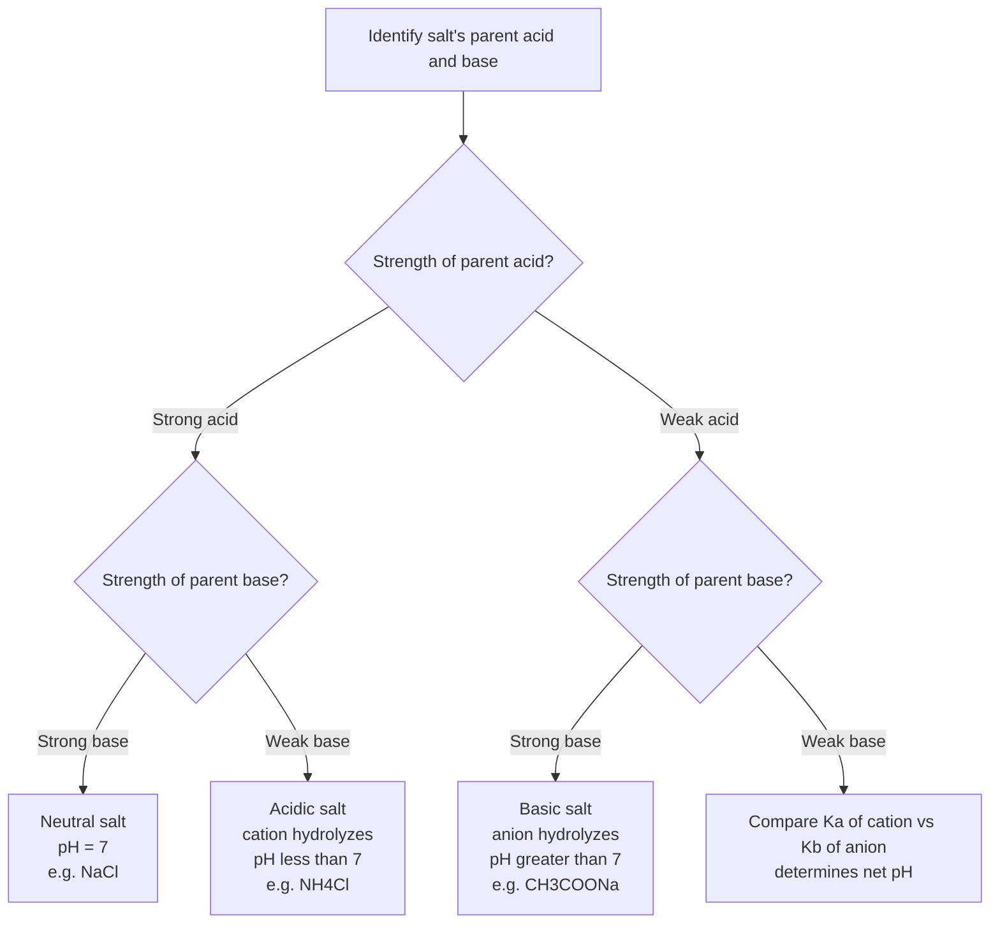

## Hydrolysis of Salts

### Definition and Overview

**Salt hydrolysis** is the reaction of the cation and/or anion of a dissolved salt with water, producing either H⁺ or OH⁻ ions and thereby shifting the pH of the solution away from neutral (7.00 at 25°C). Whether a salt's aqueous solution is acidic, basic, or neutral depends on the relative strength of the acid and base from which the salt is conceptually derived (its "parent" acid and base).

**Key Points**

- Not all salts hydrolyze. A salt hydrolyzes only if it contains an ion that is a conjugate acid or conjugate base of a *weak* acid or base.
- Ions derived from strong acids or strong bases are considered **spectator ions** with respect to pH—they do not undergo significant hydrolysis.

### Classification Framework

Salts are classified into four categories based on their parent acid/base strength combination:

| Salt Type | Parent Acid | Parent Base | Resulting pH | Example |
| --- | --- | --- | --- | --- |
| Neutral | Strong | Strong | pH = 7 | NaCl, KNO₃ |
| Basic | Weak | Strong | pH > 7 | CH₃COONa, NaF |
| Acidic | Strong | Weak | pH < 7 | NH₄Cl, NH₄NO₃ |
| Acidic or Basic | Weak | Weak | Depends on relative $K_a$/$K_b$ | NH₄CH₃COO, NH₄CN |

### Category 1: Neutral Salts (Strong Acid + Strong Base)

Salts formed from a strong acid and a strong base dissociate completely into ions that are the conjugate bases/acids of strong acids/bases—these conjugates are **too weak to hydrolyze water measurably**.

**Example**: NaCl (from HCl + NaOH)

$$NaCl \rightarrow Na^+ + Cl^-$$

Neither $Na^+$ (conjugate acid of the strong base NaOH) nor $Cl^-$ (conjugate base of the strong acid HCl) reacts appreciably with water. The solution pH remains 7.00.

**Common neutral salts**: NaCl, KCl, NaNO₃, KBr, Ca(NO₃)₂

### Category 2: Basic Salts (Weak Acid + Strong Base)

The anion is the conjugate base of a weak acid and hydrolyzes water to produce OH⁻, making the solution basic.

**Example**: CH₃COONa (sodium acetate, from CH₃COOH + NaOH)

$$CH_3COO^- + H_2O \rightleftharpoons CH_3COOH + OH^-$$

The governing equilibrium constant for this hydrolysis reaction is $K_b$ of the anion, calculated from:

$$K_b = \frac{K_w}{K_a}$$

where $K_a$ is the dissociation constant of the parent weak acid.

**Example (Calculation)**

Calculate the pH of 0.15 M CH₃COONa. ($K_a$ of CH₃COOH $= 1.8 \times 10^{-5}$)

$$K_b = \frac{1.0 \times 10^{-14}}{1.8 \times 10^{-5}} = 5.6 \times 10^{-10}$$

ICE table for the hydrolysis reaction:

|  | CH₃COO⁻ | CH₃COOH | OH⁻ |
| --- | --- | --- | --- |
| Initial | 0.15 | 0 | 0 |
| Change | $-x$ | $+x$ | $+x$ |
| Equilibrium | $0.15-x$ | $x$ | $x$ |

$$K_b = \frac{x^2}{0.15 - x} \approx \frac{x^2}{0.15} = 5.6 \times 10^{-10}$$

$$x^2 = 8.4 \times 10^{-11} \quad \Rightarrow \quad x = 9.17 \times 10^{-6} \text{ M} = [OH^-]$$

$$pOH = -\log(9.17\times10^{-6}) = 5.04 \quad \Rightarrow \quad pH = 14.00 - 5.04 = 8.96$$

**Common basic salts**: CH₃COONa, NaF, NaCN, KNO₂, Na₂CO₃, Na₃PO₄

**Key Points**

- Salts of **polyprotic weak acids** (e.g., Na₂CO₃, Na₃PO₄) tend to be significantly more basic than salts of monoprotic weak acids at the same concentration, because the relevant $K_b$ (from the smallest $K_a$ step, e.g., $K_{a2}$ of $H_2CO_3$ for $CO_3^{2-}$) is often much larger due to the very small corresponding $K_a$.

### Category 3: Acidic Salts (Strong Acid + Weak Base)

The cation is the conjugate acid of a weak base and hydrolyzes water to produce H⁺, making the solution acidic.

**Example**: NH₄Cl (ammonium chloride, from HCl + NH₃)

$$NH_4^+ + H_2O \rightleftharpoons NH_3 + H_3O^+$$

The governing equilibrium constant is $K_a$ of the cation:

$$K_a = \frac{K_w}{K_b}$$

where $K_b$ is the dissociation constant of the parent weak base.

**Example (Calculation)**

Calculate the pH of 0.20 M NH₄Cl. ($K_b$ of NH₃ $= 1.8 \times 10^{-5}$)

$$K_a = \frac{1.0\times10^{-14}}{1.8\times10^{-5}} = 5.6\times10^{-10}$$

ICE table:

$$K_a = \frac{x^2}{0.20-x} \approx \frac{x^2}{0.20} = 5.6\times10^{-10}$$

$$x^2 = 1.12\times10^{-10} \quad \Rightarrow \quad x = 1.06\times10^{-5} \text{ M} = [H^+]$$

$$pH = -\log(1.06\times10^{-5}) = 4.97$$

**Common acidic salts**: NH₄Cl, NH₄NO₃, (NH₄)₂SO₄, and salts of small, highly charged metal cations (see hydrated metal cation hydrolysis below).

#### Hydrated Metal Cation Hydrolysis

Small, highly charged transition metal or post-transition metal cations (e.g., $Al^{3+}$, $Fe^{3+}$, $Cr^{3+}$, $Zn^{2+}$, $Cu^{2+}$) also produce acidic solutions, not through a simple Brønsted proton transfer from the bare cation, but because the **hydrated cation** (e.g., $[Al(H_2O)_6]^{3+}$) acts as a Brønsted acid, with the high charge density of the metal ion polarizing and weakening the O–H bonds of coordinated water molecules:

$$[Al(H_2O)_6]^{3+} \rightleftharpoons [Al(H_2O)_5(OH)]^{2+} + H^+$$

This effect increases with increasing cationic charge and decreasing ionic radius (i.e., increasing charge density), which is why $Al^{3+}$ and $Fe^{3+}$ solutions are noticeably acidic while alkali metal cations (Na⁺, K⁺) are not.

### Category 4: Salts of Weak Acid + Weak Base

Both the cation and anion hydrolyze; the resulting pH depends on the **relative magnitudes** of $K_a$ (of the cation) and $K_b$ (of the anion).

$$\text{If } K_a(\text{cation}) > K_b(\text{anion}) \Rightarrow \text{solution is acidic (pH} < 7)$$

$$\text{If } K_a(\text{cation}) < K_b(\text{anion}) \Rightarrow \text{solution is basic (pH} > 7)$$

$$\text{If } K_a(\text{cation}) \approx K_b(\text{anion}) \Rightarrow \text{solution is approximately neutral}$$

**Example**: NH₄CH₃COO (ammonium acetate)

Compare $K_a$(NH₄⁺) $= 5.6\times10^{-10}$ with $K_b$(CH₃COO⁻) $= 5.6\times10^{-10}$.

Since these values are essentially equal (a notable coincidence for this particular salt, as $K_a$ of CH₃COOH and $K_b$ of NH₃ are nearly identical), the solution is **approximately neutral** (pH ≈ 7).

For salts of weak acid–weak base pairs where the values are not equal, a simplified approximate formula (analogous to the amphoteric intermediate case) is often used:

$$pH \approx \frac{1}{2}\left(pK_w + pK_a - pK_b\right)$$

[Inference — this approximation is derived under specific conditions (concentration sufficiently large relative to the equilibrium constants, and further hydrolysis/ionization steps neglected); exact treatment requires a full proton-balance/charge-balance approach for rigorous accuracy.]

**Common weak-weak salts**: NH₄CH₃COO, NH₄CN, NH₄F, (NH₄)₂CO₃

### Ionic (Spectator) Behavior Summary Diagram

<svg xmlns="http://www.w3.org/2000/svg" viewBox="0 0 700 380" font-family="Arial, sans-serif">
<text x="350" y="28" text-anchor="middle" font-size="17" font-weight="bold" fill="#1a1a1a">Salt Hydrolysis Decision Map (svg_diagram)</text>

<rect x="40" y="60" width="290" height="130" rx="8" fill="#eafaf1" stroke="#27ae60" stroke-width="2" />
<text x="185" y="85" text-anchor="middle" font-size="13" font-weight="bold" fill="#1e8449">Strong Acid + Strong Base</text>
<text x="185" y="110" text-anchor="middle" font-size="12" fill="#333">Cation and anion: spectators</text>
<text x="185" y="130" text-anchor="middle" font-size="12" fill="#333">No hydrolysis occurs</text>
<text x="185" y="155" text-anchor="middle" font-size="13" font-weight="bold" fill="#1e8449">pH = 7 (Neutral)</text>
<text x="185" y="175" text-anchor="middle" font-size="11" fill="#555">e.g. NaCl, KNO3</text>
<rect x="370" y="60" width="290" height="130" rx="8" fill="#eaf2fd" stroke="#2874a6" stroke-width="2" />
<text x="515" y="85" text-anchor="middle" font-size="13" font-weight="bold" fill="#1a5276">Weak Acid + Strong Base</text>
<text x="515" y="110" text-anchor="middle" font-size="12" fill="#333">Anion hydrolyzes (acts as base)</text>
<text x="515" y="130" text-anchor="middle" font-size="12" fill="#333">A- + H2O ⇌ HA + OH-</text>
<text x="515" y="155" text-anchor="middle" font-size="13" font-weight="bold" fill="#1a5276">pH &gt; 7 (Basic)</text>
<text x="515" y="175" text-anchor="middle" font-size="11" fill="#555">e.g. CH3COONa, NaF</text>
<rect x="40" y="210" width="290" height="130" rx="8" fill="#fdecea" stroke="#c0392b" stroke-width="2" />
<text x="185" y="235" text-anchor="middle" font-size="13" font-weight="bold" fill="#943126">Strong Acid + Weak Base</text>
<text x="185" y="260" text-anchor="middle" font-size="12" fill="#333">Cation hydrolyzes (acts as acid)</text>
<text x="185" y="280" text-anchor="middle" font-size="12" fill="#333">BH+ + H2O ⇌ B + H3O+</text>
<text x="185" y="305" text-anchor="middle" font-size="13" font-weight="bold" fill="#943126">pH &lt; 7 (Acidic)</text>
<text x="185" y="325" text-anchor="middle" font-size="11" fill="#555">e.g. NH4Cl, AlCl3</text>
<rect x="370" y="210" width="290" height="130" rx="8" fill="#fef5e7" stroke="#b9770e" stroke-width="2" />
<text x="515" y="235" text-anchor="middle" font-size="13" font-weight="bold" fill="#7e5109">Weak Acid + Weak Base</text>
<text x="515" y="260" text-anchor="middle" font-size="12" fill="#333">Both ions hydrolyze</text>
<text x="515" y="280" text-anchor="middle" font-size="12" fill="#333">Compare Ka(cation) vs Kb(anion)</text>
<text x="515" y="305" text-anchor="middle" font-size="13" font-weight="bold" fill="#7e5109">pH depends on ratio</text>
<text x="515" y="325" text-anchor="middle" font-size="11" fill="#555">e.g. NH4CH3COO, NH4CN</text>
</svg>

### Polyprotic Anion Hydrolysis (Amphoteric Case)

Salts containing an intermediate anion of a polyprotic acid (e.g., $NaHCO_3$, $Na_2HPO_4$, $NaH_2PO_4$) involve **amphoteric ions** capable of both hydrolyzing (acting as a base, accepting H⁺) and further ionizing (acting as an acid, donating H⁺):

$$HCO_3^- + H_2O \rightleftharpoons H_2CO_3 + OH^- \quad \text{(base behavior, governed by } K_{b2}=K_w/K_{a1}\text{)}$$

$$HCO_3^- \rightleftharpoons H^+ + CO_3^{2-} \quad \text{(acid behavior, governed by } K_{a2}\text{)}$$

The net pH depends on which tendency dominates, approximated by:

$$pH \approx \frac{pK_{a1}+pK_{a2}}{2}$$

For $NaHCO_3$: since $pK_{a1}$(6.37) and $pK_{a2}$(10.32) of carbonic acid straddle 7, and the average (8.35) is greater than 7, sodium bicarbonate solutions are **basic**—consistent with $HCO_3^-$'s base behavior ($K_{b2}$ using $K_{a1}$) generally outweighing its acid behavior ($K_{a2}$) in this case, since $K_{a1} \gg K_{a2}$.

### Common Pitfalls and Misconceptions

- **"Salt" does not automatically mean "neutral."** This is one of the most common student misconceptions—many salts produce distinctly acidic or basic solutions.
- **Do not confuse the salt's own solubility/dissociation with hydrolysis.** A salt fully dissociates into its ions upon dissolving (this is separate from solubility considerations); hydrolysis refers specifically to the subsequent reaction of those ions with water.
- **Identifying the correct parent acid/base is essential.** For a salt like $NH_4CH_3COO$, both ions must be evaluated—assuming only one ion hydrolyzes when both are capable of hydrolysis leads to an incorrect pH prediction.
- **Metal cation hydrolysis is easily overlooked.** Salts such as $AlCl_3$ or $FeCl_3$ are acidic even though $Cl^-$ is a spectator ion—the acidity originates entirely from the hydrated metal cation, not from an obvious "weak base" parent in the traditional Brønsted sense.

### Real-World Relevance

- **Soil chemistry**: Fertilizer salts (e.g., $(NH_4)_2SO_4$) can acidify soil over time due to ammonium cation hydrolysis, relevant to agricultural pH management.
- **Buffering in natural water systems**: Bicarbonate/carbonate hydrolysis equilibria play a central role in the pH buffering of natural water bodies and ocean chemistry.
- **Water treatment**: Alum ($KAl(SO_4)_2 \cdot 12H_2O$) is used in water purification partly due to the acidic hydrolysis of $Al^{3+}$, which assists in coagulation/flocculation processes [Inference — a standard application cited in environmental/water treatment chemistry references; specific process details may vary by treatment facility].

**Related Topics**

- Strong and weak acids/bases fundamentals
- Conjugate acid-base pair relationships ($K_a \times K_b = K_w$)
- Buffers and buffer capacity
- Polyprotic acid equilibria and amphoteric species
- Acid-base titration curves (equivalence point pH prediction)
- Lewis acid-base theory applied to metal cation hydrolysis