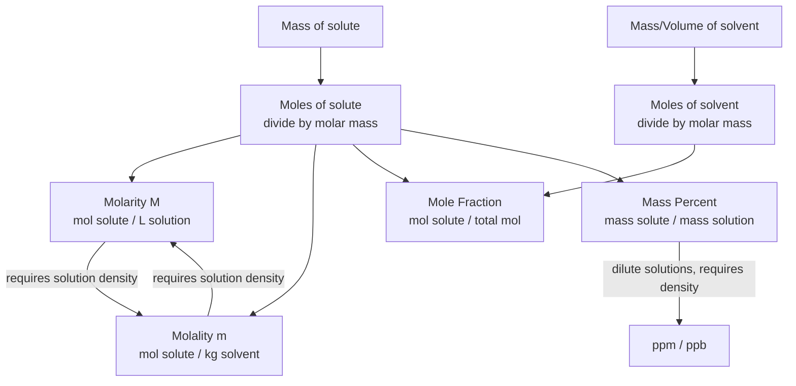

## Units of Concentration

### Overview

**Concentration** quantifies the amount of solute present in a given quantity of solvent or solution. Different units are used depending on the application—some emphasize amount (moles), some emphasize mass, and some are specifically designed to be temperature-independent for colligative property calculations. Selecting the appropriate unit depends on the context: stoichiometric calculations, colligative properties, or trace-level analysis.

### Molarity (M)

#### Definition

**Molarity** is the number of moles of solute per liter of *solution* (not solvent).

$$M = \frac{\text{mol solute}}{\text{L solution}}$$

**Key Points**

- Molarity is **temperature-dependent**, because the volume of a solution expands or contracts with temperature, while the number of moles of solute remains fixed. This makes molarity unsuitable for applications requiring high precision across varying temperatures.
- Molarity is the most commonly used unit in general and analytical chemistry, particularly for titrations and reaction stoichiometry.

**Example**

Calculate the molarity of a solution prepared by dissolving 5.85 g of NaCl (molar mass 58.44 g/mol) in enough water to make 250.0 mL of solution.

$$\text{mol NaCl} = \frac{5.85 \text{ g}}{58.44 \text{ g/mol}} = 0.1001 \text{ mol}$$

$$M = \frac{0.1001 \text{ mol}}{0.2500 \text{ L}} = 0.4004 \text{ M}$$

### Molality (m)

#### Definition

**Molality** is the number of moles of solute per kilogram of *solvent* (not solution).

$$m = \frac{\text{mol solute}}{\text{kg solvent}}$$

**Key Points**

- Molality is **temperature-independent**, since it is based on mass (which does not change with temperature) rather than volume. This makes it the preferred unit for colligative property calculations (boiling point elevation, freezing point depression), where temperature changes are inherently part of the measurement.
- Molality and molarity are numerically similar (though not identical) for dilute aqueous solutions near room temperature, since the density of water is close to 1 kg/L, but they diverge for concentrated solutions or non-aqueous solvents.

**Example**

Calculate the molality of a solution prepared by dissolving 10.0 g of glucose (C₆H₁₂O₆, molar mass 180.16 g/mol) in 500.0 g of water.

$$\text{mol glucose} = \frac{10.0 \text{ g}}{180.16 \text{ g/mol}} = 0.0555 \text{ mol}$$

$$m = \frac{0.0555 \text{ mol}}{0.5000 \text{ kg}} = 0.111 \text{ mol/kg}$$

### Mole Fraction ($\chi$)

#### Definition

**Mole fraction** is the ratio of moles of one component to the total moles of all components in the mixture (solute + solvent).

$$\chi_A = \frac{n_A}{n_A + n_B + \dots} = \frac{n_A}{n_{total}}$$

**Key Points**

- Mole fractions of all components in a mixture must sum to exactly 1: $\chi_A + \chi_B + \dots = 1$.
- Mole fraction is dimensionless and temperature-independent.
- Essential for **Raoult's Law** and vapor pressure calculations, and used in the ideal gas law for partial pressures (Dalton's Law).

**Example**

A solution contains 2.00 mol of ethanol and 8.00 mol of water. Calculate the mole fraction of each component.

$$n_{total} = 2.00 + 8.00 = 10.00 \text{ mol}$$

$$\chi_{ethanol} = \frac{2.00}{10.00} = 0.200$$

$$\chi_{water} = \frac{8.00}{10.00} = 0.800$$

Verification: $0.200 + 0.800 = 1.000$ ✓

### Mass Percent (% w/w)

#### Definition

**Mass percent** (or weight percent) expresses the mass of solute as a percentage of the total mass of the solution.

$$\% \text{ mass} = \frac{\text{mass solute}}{\text{mass solution}} \times 100\%$$

**Example**

A solution is prepared by dissolving 15.0 g of NaCl in 135.0 g of water. Calculate the mass percent of NaCl.

$$\text{mass of solution} = 15.0 \text{ g} + 135.0 \text{ g} = 150.0 \text{ g}$$

$$\% \text{ mass} = \frac{15.0}{150.0} \times 100\% = 10.0\%$$

### Volume Percent (% v/v)

Used primarily for liquid-in-liquid solutions, expressing the volume of solute as a percentage of the total solution volume.

$$\% \text{ volume} = \frac{\text{volume solute}}{\text{volume solution}} \times 100\%$$

**Key Points**

- Volumes of liquids are not strictly additive upon mixing (due to intermolecular interactions altering packing efficiency), so % v/v is typically defined using the volumes of the pure components *before* mixing, and total solution volume should be measured directly rather than assumed to equal the sum of component volumes [Inference — this is a standard caveat noted in analytical chemistry references regarding non-ideal mixing volumes].
- Common in beverage alcohol content labeling (e.g., "40% v/v" for spirits).

### Mass/Volume Percent (% w/v)

A hybrid unit expressing mass of solute (grams) per 100 mL of solution—common in clinical, pharmaceutical, and biological contexts.

$$\% (w/v) = \frac{\text{mass solute (g)}}{\text{volume solution (mL)}} \times 100\%$$

**Example**: A "0.9% saline" solution (physiological saline) contains 0.9 g NaCl per 100 mL of solution.

### Parts Per Million (ppm) and Parts Per Billion (ppb)

#### Definition

Used for extremely dilute solutions, such as trace contaminants in water or environmental samples.

$$ppm = \frac{\text{mass solute}}{\text{mass solution}} \times 10^6$$

$$ppb = \frac{\text{mass solute}}{\text{mass solution}} \times 10^9$$

**Key Points**

- For dilute **aqueous** solutions specifically, a widely used practical approximation applies: since the density of dilute aqueous solution is very close to 1.00 g/mL, **1 ppm ≈ 1 mg solute per liter of solution** (mg/L), and 1 ppb ≈ 1 μg/L. This approximation should not be applied to non-aqueous or concentrated solutions.
- ppm and ppb are frequently used in environmental chemistry (e.g., drinking water contaminant limits) and trace analysis.

**Example**

A water sample contains 2.5 mg of lead per liter of solution. Express this in ppm.

Using the aqueous approximation (density ≈ 1.00 g/mL, so 1 L ≈ 1000 g):

$$ppm = \frac{2.5 \text{ mg}}{1000 \text{ g}} \times \frac{1 \text{ g}}{1000 \text{ mg}} \times 10^6 = 2.5 \text{ ppm}$$

(Equivalently, using the mg/L shortcut directly: 2.5 mg/L = 2.5 ppm.)

### Normality (N)

#### Definition

**Normality** expresses concentration in terms of **gram equivalent weights** of solute per liter of solution, accounting for the reactive capacity of the species (e.g., number of protons donated in an acid-base reaction, or electrons transferred in a redox reaction).

$$N = \frac{\text{equivalents of solute}}{\text{L solution}} = M \times n$$

where $n$ is the number of equivalents per mole (e.g., $n=2$ for H₂SO₄ in an acid-base context, since it can donate 2 protons).

**Key Points**

- Normality is **context-dependent**—the same solution can have different normality values depending on the reaction type (e.g., H₂SO₄ has $N = 2M$ for full acid-base neutralization but a different equivalence factor in certain redox reactions where it may not donate both protons in the same step).
- Normality use has declined in modern chemistry in favor of molarity combined with explicit stoichiometric coefficients, due to its ambiguity across reaction contexts, though it remains in use in some clinical, industrial, and specific analytical (e.g., titration) contexts.

**Example**

Calculate the normality of a 0.10 M H₂SO₄ solution for acid-base neutralization purposes.

$$N = 0.10 \text{ M} \times 2 = 0.20 \text{ N}$$

### Conversion Relationships Between Units

**Key Points**

- Converting between **molarity and molality requires the solution's density**, since molarity is volume-based and molality is mass-based.
- Converting between **mole fraction and molality/molarity requires the molar mass of the solvent**, since mole fraction involves total moles of all species while molality/molarity involve only solute moles relative to solvent mass/solution volume.

**Example (Molarity to Molality Conversion)**

Convert 2.00 M NaOH solution (density = 1.08 g/mL) to molality.

Basis: 1.00 L of solution.

$$\text{mass of solution} = 1000 \text{ mL} \times 1.08 \text{ g/mL} = 1080 \text{ g}$$

$$\text{mol NaOH} = 2.00 \text{ mol}$$

$$\text{mass NaOH} = 2.00 \text{ mol} \times 40.00 \text{ g/mol} = 80.0 \text{ g}$$

$$\text{mass of solvent (water)} = 1080 \text{ g} - 80.0 \text{ g} = 1000 \text{ g} = 1.000 \text{ kg}$$

$$m = \frac{2.00 \text{ mol}}{1.000 \text{ kg}} = 2.00 \text{ mol/kg}$$

### Comparative Summary Table

| Unit | Formula | Denominator Basis | Temperature-Dependent? | Typical Use |
| --- | --- | --- | --- | --- |
| Molarity (M) | mol solute / L solution | Volume | Yes | General stoichiometry, titrations |
| Molality (m) | mol solute / kg solvent | Mass | No | Colligative properties |
| Mole Fraction ($\chi$) | mol solute / total mol | Amount | No | Raoult's Law, vapor pressure |
| Mass Percent (% w/w) | mass solute / mass solution × 100 | Mass | No | General labeling, industrial |
| Volume Percent (% v/v) | vol solute / vol solution × 100 | Volume | Yes (slightly) | Liquid-liquid mixtures |
| ppm / ppb | mass solute / mass solution × 10⁶ / 10⁹ | Mass | No | Trace/environmental analysis |
| Normality (N) | equivalents / L solution | Volume | Yes | Acid-base and redox titrations |

### Common Pitfalls and Misconceptions

- **Molarity uses solution volume, not solvent volume.** A common error is calculating molarity using only the volume of solvent added before dissolution, rather than the final total solution volume after mixing and any volume change upon dissolution.
- **Molality is not the same as molarity for concentrated solutions.** They are only approximately equal for very dilute aqueous solutions where solution density ≈ 1 g/mL; this approximation breaks down significantly at higher concentrations or with dense/non-aqueous solvents.
- **Confusing ppm (mass-based) with volume-based trace units** (occasionally denoted ppmv for gas mixtures)—context determines whether ppm refers to mass/mass or volume/volume, particularly in gas-phase chemistry versus aqueous solution chemistry.
- **Normality is reaction-dependent, not solution-dependent alone.** The same molar solution can have different normality values depending on the specific reaction (acid-base vs. redox) being considered.

**Related Topics**

- Colligative properties (boiling point elevation, freezing point depression, osmotic pressure)
- Raoult's Law and vapor pressure of solutions
- Dilution calculations ($M_1V_1 = M_2V_2$)
- Solution preparation and volumetric technique
- Density and its role in unit conversions
- Equivalent weight and normality in redox titrations